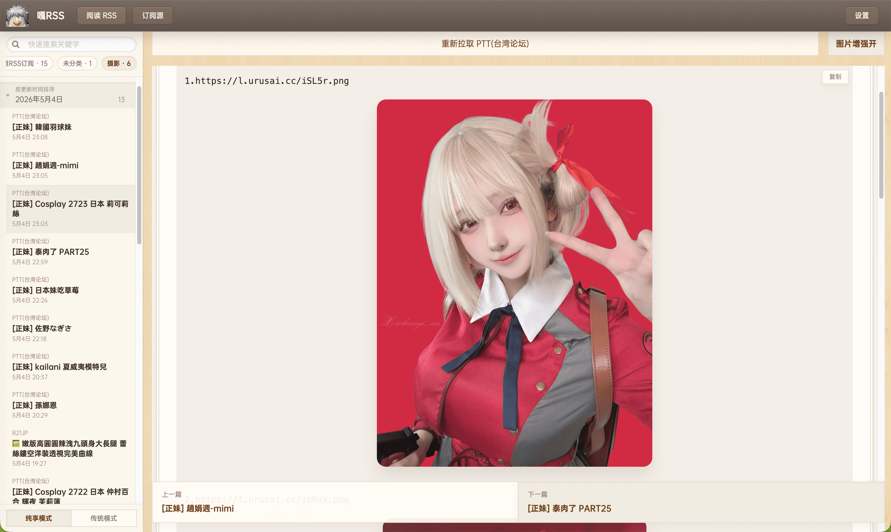

# Github Actions Rss (garss, 嘎RSS! 已收集{{rss_num}}个RSS源, 生成时间: {{ga_rss_datetime}})

信息茧房是指人们关注的信息领域会习惯性地被自己的兴趣所引导，从而将自己的生活桎梏于像蚕茧一般的「茧房」中的现象。

## 《嘎!RSS》🐣为打破信息茧房而生


这个名为**嘎!RSS**的项目会利用免费的Github Actions服务, 提供一个内容全面的信息流, 让现代人的知识体系更广泛, 减弱信息茧房对现代人的影响, 让**非茧房信息流**造福人类~
[《嘎!RSS》永久开源页面: https://github.com/zhaoolee/garss](https://github.com/zhaoolee/garss)


## 锤子便签风格的GARSS阅读器

- 启动

```
cd garss-studio
cp .env.example .env
docker compose -f docker-compose.dev.yml up --build
```



- 常用页面

```
阅读页：http://127.0.0.1:25173/reader?pw=banana
订阅源：http://127.0.0.1:25173/sources?pw=banana
设置页：http://127.0.0.1:25173/settings?pw=banana
API 文档：http://127.0.0.1:25173/api/docs
```


## 推荐使用什么软件订阅RSS？
我推荐一款免费的浏览器扩展程序Feedbro ，使用教程[Chrome插件英雄榜第96期《Feedbro》在Chrome中订阅RSS信息流](https://www.v2fy.com/p/096-feedbro-2021-02-27/)

## 主要功能
1. 收集RSS, 打造无广告内容优质的 **头版头条** 超赞新闻页
2. 利用Github Actions, 搜集全部RSS的头版头条新闻标题和超链接, 并自动更新到首页,当天最新发布的文章会出现🌈 标志

邮件内容区开始>
<h2>新蒸熟{{new_num}}个小蛋糕🍰(文章) 生产时间 {{ga_rss_datetime}} 保质期24小时</h2>

{{news}}

<邮件内容区结束

## 已收集RSS列表

| 编号 | 名称 | 描述 | RSS  |  最新内容 |
| --- | --- | --- | --- |  --- |
| <h2 id="软件工具">软件工具</h2> |  |   |  |
| <div id="S001" style="text-align: center;"><br><span>S001</span></div> |  不死鸟 | 不死鸟:专注分享优质资源 | {{latest_content}} |  [订阅地址](https://iao.su/feed) | 
| <div id="S002" style="text-align: center;"><br><span>S002</span></div> | 精品MAC应用分享 | 精品MAC应用分享，每天分享大量mac软件，为您提供优质的mac软件,免费软件下载服务 |  {{latest_content}} | [订阅地址](https://xclient.info/feed) | 
| <div id="S003" style="text-align: center;"><br><span>S003</span></div> | 老殁 | 免费推荐优秀软件 |  {{latest_content}} | [订阅地址](https://www.mpyit.com/feed) |
| <div id="S004" style="text-align: center;"><br><span>S004</span></div> | 鹏少资源网 | 专注于精品软件收录分享 |   {{latest_content}} | [订阅地址](https://www.jokerps.com/feed) |
| <div id="S005" style="text-align: center;"><br><span>S005</span></div> | 小众软件 | 分享免费、小巧、实用、有趣、绿色的软件 | {{latest_content}} | [订阅地址](https://www.appinn.com/feed/) | 
| <div id="S006" style="text-align: center;"><br><span>S006</span></div> | 懒得勤快的博客 | 懒得勤快，互联网分享精神，勤于发现，乐于分享 |  {{latest_content}} | [订阅地址](https://masuit.com/rss) |
| <div id="S007" style="text-align: center;"><br><span>S007</span></div> | 反斗限免 | 反斗软件旗下软件限免资讯网站 |  {{latest_content}} | [订阅地址](https://free.apprcn.com/feed/) | 
| S008 | 异次元软件世界  | 极具人气和特色的软件网站！专注于推荐优秀软件、APP应用和互联网资源，每篇图文评测都极其用心，并提供大量软件资源下载。 | {{latest_content}}  |  [订阅地址](http://rsshub:1200/iplay/home) |  
| RH028 | Amazon Kindle Software Updates | Kindle E-Reader Software Updates | {{latest_content}} | [订阅地址](http://rsshub:1200/amazon/kindle/software-updates) |
| RH029 | App Store 限免/促销 | 每日精品限免和促销应用 | {{latest_content}} | [订阅地址](http://rsshub:1200/appstore/xianmian) |
| RH030 | Android Security Bulletins | Android Security Bulletins | {{latest_content}} | [订阅地址](http://rsshub:1200/android/security-bulletin) |
| RH031 | OpenAI - ChatGPT Release Notes | ChatGPT Release Notes | {{latest_content}} | [订阅地址](http://rsshub:1200/openai/chatgpt/release-notes) |
| <h2 id="活着的个人独立博客">活着的个人独立博客</h2> |  |   |  |
| <div id="B001" style="text-align: center;"><br><span>B001</span></div> |  阮一峰的网络日志 | 一个科技博客，讲解的知识通俗易懂 |  {{latest_content}} | [订阅地址](http://www.ruanyifeng.com/blog/atom.xml) |
| <div id="B002" style="text-align: center;"><br><span>B002</span></div> | 当我在扯淡 | 王垠的博客，观点奇妙有趣 |  {{latest_content}} | [订阅地址](https://yinwang1.wordpress.com/feed/) |
| <div id="B003" style="text-align: center;"><br><span>B003</span></div> | 黑果小兵的部落阁 | Hackintosh安装镜像、教程及经验分享|  {{latest_content}} | [订阅地址](https://blog.daliansky.net/atom.xml) |
| <div id="B004" style="text-align: center;"><br><span>B004</span></div> | 张鑫旭的博客 | 张鑫旭-鑫空间-鑫生活 | {{latest_content}} | [订阅地址](https://www.zhangxinxu.com/wordpress/feed/) | 
| <div id="B005" style="text-align: center;"><br><span>B005</span></div> | 方圆小站 | zhaoolee的杂谈博客  | {{latest_content}} | [订阅地址](https://fangyuanxiaozhan.com/feed/) |
| <div id="B006" style="text-align: center;"><br><span>B006</span></div> | V2方圆 | 防加班办公工具技能宝典  | {{latest_content}} | [订阅地址](https://v2fy.com/feed/) |
| <div id="B007" style="text-align: center;"><br><span>B007</span></div> | 老左笔记 | 记录云主机商活动和建站运维教程  | {{latest_content}} | [订阅地址](https://www.laozuo.org/feed) |
| <div id="B008" style="text-align: center;"><br><span>B008</span></div> | FLiNG Trainer | 修改器大神风灵月影 | {{latest_content}} | [订阅地址](https://flingtrainer.com/feed/) |
| <div id="B009" style="text-align: center;"><br><span>B009</span></div> | 奔跑中的奶酪 | 有智，有趣，有爱 | {{latest_content}} | [订阅地址](https://www.runningcheese.com/feed) |
| <div id="B010" style="text-align: center;"><br><span>B010</span></div> | 唐巧的博客 | 记录下自己学习的点滴 | {{latest_content}} | [订阅地址](https://blog.devtang.com/atom.xml) |
| <div id="B011" style="text-align: center;"><br><span>B011</span></div> | I'M TUALATRIX | Hello! This is TualatriX's blog | {{latest_content}} | [订阅地址](https://imtx.me/feed/latest/) |
| <div id="B012" style="text-align: center;"><br><span>B012</span></div> | 云风的 BLOG | 思绪来得快去得也快，偶尔会在这里停留 | {{latest_content}} | [订阅地址](https://blog.codingnow.com/atom.xml) |
| <div id="B013" style="text-align: center;"><br><span>B013</span></div> | 透明创业实验 | timqian的博客  | {{latest_content}} | [订阅地址](https://blog.t9t.io/atom.xml) |
| <div id="B014" style="text-align: center;"><br><span>B014</span></div> | 扯氮集 | 多歧为贵 不取苟同 | {{latest_content}} | [订阅地址](http://weiwuhui.com/feed) |
| <div id="B015" style="text-align: center;"><br><span>B015</span></div> | wenzi | 蚊子在前端开发工作中的总结  | {{latest_content}} | [订阅地址](https://www.xiabingbao.com/atom.xml) |
| <div id="B016" style="text-align: center;"><br><span>B016</span></div> | DIYgod | 人气网红,前端萌新,有猫,开源  | {{latest_content}}  |  [订阅地址](https://diygod.me/atom.xml) | 
| <div id="B017" style="text-align: center;"><br><span>B017</span></div> | MacTalk-池建强的随想录 | 关注技术和人文 | {{latest_content}}  |  [订阅地址](http://macshuo.com/?feed=rss2) | 
| <div id="B018" style="text-align: center;"><br><span>B018</span></div> | ShrekShao | ShrekShao's Blog | {{latest_content}}  |  [订阅地址](http://shrekshao.github.io/feed.xml) | 
| <div id="B019" style="text-align: center;"><br><span>B019</span></div> | Phodal | Phodal - A Growth Engineer | {{latest_content}}  |  [订阅地址](https://www.phodal.com/blog/feeds/rss/) |
| B020 | 追梦人物 | 追梦人物的博客 | {{latest_content}}  |  [订阅地址](https://www.zmrenwu.com/all/rss/) | 
| B021 | 小明明s à domicile | 小明明s à domicile | {{latest_content}}  |  [订阅地址](https://www.dongwm.com/atom.xml) | 
| <div id="B022" style="text-align: center;"><br><span>B022</span></div> | 但行好事，莫问前程 | Windard's simple blog web  | {{latest_content}}  |  [订阅地址](https://windard.com/feed.xml) | 
| <div id="B023" style="text-align: center;"><br><span>B023</span></div> | 罗磊的独立博客 | 前端工程师，ZUOLUOTV制作人  | {{latest_content}}  |  [订阅地址](https://luolei.org/feed/) | 
| B024 | 阁子 | Newdee's Blog  | {{latest_content}}  |  [订阅地址](https://newdee.cf/atom.xml) | 
| <div id="B025" style="text-align: center;"><br><span>B025</span></div> | RidiQulous | RidiQulous's Blog  | {{latest_content}}  |  [订阅地址](https://ridiqulous.com/feed/) | 
| <div id="B026" style="text-align: center;"><br><span>B026</span></div> | 代码家 | 善存于心，世界和平 | {{latest_content}}  |  [订阅地址](https://daimajia.com/feed) | 
| <div id="B027" style="text-align: center;"><br><span>B027</span></div> | 开源实验室 | 张涛的开源实验室 | {{latest_content}}  |  [订阅地址](https://www.kymjs.com/feed.xml) | 
| <div id="B028" style="text-align: center;"><br><span>B028</span></div> | 技术小黑屋 | 一个Android 工程师 | {{latest_content}}  |  [订阅地址](https://droidyue.com/atom.xml) | 
| <div id="B029" style="text-align: center;"><br><span>B029</span></div> | 依云 | 依云's Blog | {{latest_content}}  |  [订阅地址](https://blog.lilydjwg.me/posts.rss) | 
| <div id="B030" style="text-align: center;"><br><span>B030</span></div> | INTJer | Armin Li（李钊） | {{latest_content}}  |  [订阅地址](https://arminli.com/feed/) | 
| <div id="B031" style="text-align: center;"><br><span>B031</span></div> | 思圆笔记 | 促成良性循环 | {{latest_content}}  |  [订阅地址](https://hintsnet.com/pimgeek/feed/) | 
| <div id="B032" style="text-align: center;"><br><span>B032</span></div> | 老周快救我 | Life Is Fantastic | {{latest_content}}  |  [订阅地址](https://zxx.im/feed) | 
| <div id="B033" style="text-align: center;"><br><span>B033</span></div> | MouT.me | 给生活打个草稿 | {{latest_content}}  |  [订阅地址](https://ghost.mout.me/rss/) | 
| <div id="B034" style="text-align: center;"><br><span>B034</span></div> | diss带码 | 码动人生 | {{latest_content}}  |  [订阅地址](https://dumplingbao.github.io/atom.xml) | 
| <div id="B035" style="text-align: center;"><br><span>B035</span></div> | 王登科-DK博客 | 布洛芬爱好者 | {{latest_content}}  |  [订阅地址](https://greatdk.com/feed) | 
| <div id="B036" style="text-align: center;"><br><span>B036</span></div> | 笨方法学写作 | 笨方法学写作,这一次彻底学会写作 | {{latest_content}}  |  [订阅地址](https://www.cnfeat.com/feed.xml) | 
| <div id="B037" style="text-align: center;"><br><span>B037</span></div> | 风雪之隅 | 左手代码右手诗 | {{latest_content}}  |  [订阅地址](https://www.laruence.com/feed) | 
| <div id="B038" style="text-align: center;"><br><span>B038</span></div> | Hawstein's Blog | 这里是 Hawstein 的个人博客，记录生活点滴。 | {{latest_content}}  |  [订阅地址](https://hawstein.com/feed.xml) | 
| <div id="B039" style="text-align: center;"><br><span>B039</span></div> | DeveWork | WordPress极客一枚 | {{latest_content}}  |  [订阅地址](https://devework.com/feed) | 
| <div id="B040" style="text-align: center;"><br><span>B040</span></div> | 海交史 | 东亚文史研究动态网 | {{latest_content}}  |  [订阅地址](https://www.haijiaoshi.com/feed) | 
| <div id="B041" style="text-align: center;"><br><span>B041</span></div> | 四季书评 | 四季书评 | {{latest_content}}  |  [订阅地址](http://www.4sbooks.com/feed) | 
| <div id="B042" style="text-align: center;"><br><span>B042</span></div> | 文三娃| 网络上甘岭战区候任参谋长 | {{latest_content}}  |  [订阅地址](https://wentommy.wordpress.com/feed/) | 
| <div id="B043" style="text-align: center;"><br><span>B043</span></div> | 我的小角落 | 点击文章标题可评论哦 | {{latest_content}}  |  [订阅地址](http://micheer.net/?feed=rss2) | 
| <div id="B044" style="text-align: center;"><br><span>B044</span></div> | 木遥 | 木遥的窗子 | {{latest_content}}  |  [订阅地址](http://blog.farmostwood.net/feed) | 
| <div id="B045" style="text-align: center;"><br><span>B045</span></div> | Limboy's HQ | Limboy's HQ | {{latest_content}}  |  [订阅地址](https://limboy.me/index.xml) | 
| <div id="B046" style="text-align: center;"><br><span>B046</span></div> | 人人都是产品经理——iamsujie | 成长中的产品经理，期待和同学们一起，用好产品改变世界~ | {{latest_content}}  |  [订阅地址](http://iamsujie.com/feed/) | 
| <div id="B047" style="text-align: center;"><br><span>B047</span></div> | 土木坛子 | 和光同尘，与时舒卷 | {{latest_content}}  |  [订阅地址](https://tumutanzi.com/feed) | 
| <div id="B048" style="text-align: center;"><br><span>B048</span></div> | 火丁笔记 | 多研究些问题，少谈些主义。 | {{latest_content}}  |  [订阅地址](https://blog.huoding.com/feed) | 
| B049 | 產品經理 x 成長駭客 - Mr. PM下午先生 | PM可以是產品經理、下午、Pig Man，但絕對不是Poor Man | {{latest_content}}  |  [订阅地址](http://mrpm.cc/?feed=rss2) | 
| B050 | Matrix67 | Matrix67: The Aha Moments  | {{latest_content}}  |  [订阅地址](http://www.matrix67.com/blog/feed) | 
| <div id="B051" style="text-align: center;"><br><span>B051</span></div> | 我爱自然语言处理 | I Love Natural Language Processing  | {{latest_content}}  |  [订阅地址](https://www.52nlp.cn/feed) | 
| <div id="B052" style="text-align: center;"><br><span>B052</span></div> | sunnyxx | sunnyxx的技术博客  | {{latest_content}}  |  [订阅地址](http://blog.sunnyxx.com/atom.xml) | 
| <div id="B053" style="text-align: center;"><br><span>B053</span></div> | 搞笑談軟工 | 敏捷開發，設計模式，精實開發，Scrum，軟體設計，軟體架構  | {{latest_content}}  |  [订阅地址](http://teddy-chen-tw.blogspot.com/feeds/posts/default) | 
| <div id="B054" style="text-align: center;"><br><span>B054</span></div> | Beyond the Void | 遊記、語言學、經濟學、信息學競賽/ACM經驗、算法講解、技術知識  | {{latest_content}}  |  [订阅地址](https://byvoid.com/zht/feed.xml) | 
| B055 | Est's Blog | This blog is rated  R, viewer discretion is advised  | {{latest_content}}  |  [订阅地址](https://blog.est.im/rss) | 
| <div id="B056" style="text-align: center;"><br><span>B056</span></div> | 卢昌海个人主页 | Changhai Lu's Homepage  | {{latest_content}}  |  [订阅地址](https://www.changhai.org//feed.xml) | 
| <div id="B057" style="text-align: center;"><br><span>B057</span></div> | 程序师 | 程序员、编程语言、软件开发、编程技术 | {{latest_content}}  |  [订阅地址](https://www.techug.com/feed) | 
| B058 | bang's blog | 我的世界 | {{latest_content}}  |  [订阅地址](http://blog.cnbang.net/feed/) | 
| B059 | 白宦成 | 思无邪 | {{latest_content}}  |  [订阅地址](https://www.ixiqin.com/feed/) | 
| <div id="B060" style="text-align: center;"><br><span>B060</span></div> | Jason 独立开发，自由职业 | 记录一位独立开发者的精进之路，分享自由职业者的生存方式。 | {{latest_content}}  |  [订阅地址](https://atjason.com/atom.xml/) | 
| <div id="B061" style="text-align: center;"><br><span>B061</span></div> | Randy's Blog | Randy is blogging about life, tech and music. | {{latest_content}}  |  [订阅地址](https://lutaonan.com/rss.xml) | 
| <div id="B062" style="text-align: center;"><br><span>B062</span></div> | 木木木木木 | 林小沐的博客 | {{latest_content}}  |  [订阅地址](https://immmmm.com/atom.xml) | 
| B063 | Skywind Inside | 写自己的代码，让别人猜去吧 | {{latest_content}}  |  [订阅地址](http://www.skywind.me/blog/feed) | 
| B064 | 轉個彎日誌 | by 阿川先生 | {{latest_content}}  |  [订阅地址](https://blog.turn.tw/?feed=rss2) | 
| <div id="B065" style="text-align: center;"><br><span>B065</span></div> | 余果的博客 | 公众号：余果专栏 | {{latest_content}}  |  [订阅地址](https://yuguo.us/feed.xml) | 
| <div id="B066" style="text-align: center;"><br><span>B066</span></div> | 陈沙克日志 | 把我的过程记录下来，以免以后忘了 | {{latest_content}}  |  [订阅地址](http://www.chenshake.com/feed/) | 
| B067 | 透明思考 Transparent Thoughts | 就，觉得自己还挺有洞察力的…… | {{latest_content}}  |  [订阅地址](http://gigix.thoughtworkers.org/atom.xml) | 
| <div id="B068" style="text-align: center;"><br><span>B068</span></div> | 依云's Blog | Happy coding, happy living! | {{latest_content}}  |  [订阅地址](https://blog.lilydjwg.me/feed) | 
| <div id="B069" style="text-align: center;"><br><span>B069</span></div> | 王子亭的博客 | 精子真名叫「王子亭」，生于 1995.11.25，英文ID是jysperm.  精子是一名独立博客作者 | {{latest_content}}  |  [订阅地址](https://jysperm.me/atom.xml) | 
| <div id="B070" style="text-align: center;"><br><span>B070</span></div> | 谢益辉 | 中文日志 - Yihui Xie  | {{latest_content}}  |  [订阅地址](https://yihui.org/cn/index.xml) | 
| <div id="B071" style="text-align: center;"><br><span>B071</span></div> | 褪墨・时间管理，个人提升，生活健康与习惯 | 褪墨・时间管理是一个关注时间管理、GTD、个人提升、生活健康与习惯、学习方法和演讲技巧的网站。我们的目标是：把事情做到更好！| {{latest_content}}  |  [订阅地址](https://www.mifengtd.cn/feed.xml) | 
| <div id="B072" style="text-align: center;"><br><span>B072</span></div> | 数字移民 | 数字移民是一种生活方式 | {{latest_content}}  |  [订阅地址](https://blog.shuziyimin.org/feed) | 
| <div id="B073" style="text-align: center;"><br><span>B073</span></div> | Just lepture | Love its people, but never trust its government. | {{latest_content}}  |  [订阅地址](https://lepture.com/feed.xml) | 
| B074 | 1 Byte | Articles about life, technology, and startups. | {{latest_content}}  |  [订阅地址](https://1byte.io/rss.xml) | 
| <div id="B075" style="text-align: center;"><br><span>B075</span></div> | 庭说 | 保持蓬勃的好奇心 | {{latest_content}}  |  [订阅地址](https://tingtalk.me/atom.xml) | 
| <div id="B076" style="text-align: center;"><br><span>B076</span></div> | KAIX.IN | 杂文、随笔、感悟、记录 | {{latest_content}}  |  [订阅地址](https://kaix.in/feed/) | 
| <div id="B077" style="text-align: center;"><br><span>B077</span></div> | 硕鼠的博客站 | 范路的博客主站，时而会发些东西。 | {{latest_content}}  |  [订阅地址](http://lukefan.com/?feed=rss2) | 
| <div id="B078" style="text-align: center;"><br><span>B078</span></div> | 构建我的被动收入 | Lifelong Learner | {{latest_content}}  |  [订阅地址](https://www.bmpi.dev/index.xml) | 
|  <div id="B079" style="text-align: center;"><br><span>B079</span></div> | Livid | Beautifully Advance | {{latest_content}}  |  [订阅地址](https://livid.v2ex.com/feed.xml) | 
| <div id="B080" style="text-align: center;"><br><span>B080</span></div> | 胡涂说 | hutusi.com | {{latest_content}}  |  [订阅地址](https://hutusi.com/feed.xml) | 
| B081 | 鸟窝 | 万物之始，大道至简，衍化至繁 | {{latest_content}}  |  [订阅地址](https://colobu.com/atom.xml) |
| <div id="B082" style="text-align: center;"><br><span>B082</span></div> | 卡瓦邦噶！ | 无法自制的人得不到自由。 | {{latest_content}} | [订阅地址](https://www.kawabangga.com/feed) |
| <div id="B083" style="text-align: center;"><br><span>B083</span></div> | 方圆STU | 天是方的，地是圆的。 | {{latest_content}} | [订阅地址](https://fangyuanstu.com/feed/) |
| <div id="B084" style="text-align: center;"><br><span>B084</span></div> | 折影轻梦 | 崇尚自由、热爱科学与艺术 | {{latest_content}} | [订阅地址](https://nexmoe.com/atom.xml) |
| <div id="B085" style="text-align: center;"><br><span>B085</span></div> | 不羁阁 | 行走少年郎 不羁，谓才行高远，不可羁系也 | {{latest_content}} | [订阅地址](https://bujige.net/atom.xml) |
| <div id="B086" style="text-align: center;"><br><span>B086</span></div> | Cal Paterson | Cal Paterson's articles | {{latest_content}} | [订阅地址](https://calpaterson.com/calpaterson.rss) |
| B087 | 3号实验室 | 树莓派; 开发板; 编程; 折腾 | {{latest_content}} | [订阅地址](https://www.labno3.com/feed/) |
| <div id="B088" style="text-align: center;"><span>B088</span></div> | ZMonster's Blog | 巧者劳而智者忧，无能者无所求，饱食而遨游，泛若不系之舟 | {{latest_content}} | [订阅地址](https://www.zmonster.me/atom.xml) |
| <div id="B089" style="text-align: center;"><span>B089</span></div> | 十年老程网 | 推荐各种VPS主机 | {{latest_content}} | [订阅地址](http://snlcw.com/feed) |
| <div id="B090" style="text-align: center;"><span>B090</span></div> | 小明明 domicile | 前豆瓣工程师，现在家带娃，远程工作机会联系我哟 | {{latest_content}} | [订阅地址](http://snlcw.com/feed) |
| <div id="B091" style="text-align: center;"><span>B091</span></div> | LFhacks.com | 读万卷书，行万里路 | {{latest_content}} | [订阅地址](https://www.lfhacks.com/rss/) |
| <div id="B092" style="text-align: center;"><span>B092</span></div> | 三省吾身 | 兴趣遍地都是，专注和持之以恒才是真正稀缺的 | {{latest_content}} | [订阅地址](https://blog.guowenfh.com/atom.xml) |
| <div id="B093" style="text-align: center;"><span>B093</span></div> | 夏海比比 | 关于设计与摄影，一个95后的个人博客 | {{latest_content}} | [订阅地址](https://huiweishijie.com/feed.xml) |
| <div id="B094" style="text-align: center;"><span>B094</span></div> | TRHX'S BLOG | 一入 IT 深似海 从此学习无绝期 | {{latest_content}} | [订阅地址](https://www.itrhx.com/atom.xml) |
| <div id="B095" style="text-align: center;"><span>B095</span></div> | CallMeSoul | callmesoul前端开发者 | {{latest_content}} | [订阅地址](https://callmesoul.cn/rss.xml) |
| <div id="B096" style="text-align: center;"><span>B096</span></div> | 龚成博客 |  不高大但是威猛，不英俊但是潇洒 | {{latest_content}} | [订阅地址](https://laogongshuo.com/feed) |
| <div id="B097" style="text-align: center;"><span>B097</span></div> | Seven's blog |  你不会找到路，除非你敢于迷路 | {{latest_content}} | [订阅地址](https://blog.diqigan.cn/atom.xml) |
| <div id="B098" style="text-align: center;"><span>B098</span></div> | 治部少辅 |  你晚来天雨雪，能饮一杯无？ | {{latest_content}} | [订阅地址](https://www.codewoody.com/atom.xml) |
| <div id="B099" style="text-align: center;"><span>B099</span></div> | CRIMX BLOG |  CRIMX 的博客，主要记录 Web 前端相关的一些内容，偶尔涉及其它方面。 | {{latest_content}} | [订阅地址](https://blog.crimx.com/rss.xml) |
| <div id="B100" style="text-align: center;"><span>B100</span></div> | 小非的物理小站 |  信仰共产主义，后现代主义者，结构主义者，奇妙发现世界～～ | {{latest_content}} | [订阅地址](https://xiaophy.com/feed.xml) |
| <div id="B101" style="text-align: center;"><span>B101</span></div> | Michael翔 |  因上努力，果上随缘！ | {{latest_content}} | [订阅地址](https://michael728.github.io/atom.xml) |
| <div id="B102" style="text-align: center;"><span>B102</span></div> | Dosk 技术站 | SpringHack 的无名技术小站 | {{latest_content}} | [订阅地址](https://www.dosk.win/feed.xml) |
| <div id="B103" style="text-align: center;"><span>B103</span></div> | Lu Shuyu's NoteBook | 你好呀，我是一个准大学生，曾经是一个信息学奥林匹克竞赛（OI）选手，ID 为AquaRio。 | {{latest_content}} | [订阅地址](https://blog.lushuyu.site/about-me/feed) |
| <div id="B104" style="text-align: center;"><span>B104</span></div> | Xieisabug | 吃饭学家，复制学家，偷懒学家。 | {{latest_content}} | [订阅地址](https://www.xiejingyang.com/feed/) |
| <div id="B105" style="text-align: center;"><span>B105</span></div> | Ryu Zheng 郑泽鑫的博客 |   一个生信工作者的独立博客 | {{latest_content}} | [订阅地址](https://zhengzexin.com/feed/index.xml) |
| <div id="B106" style="text-align: center;"><span>B106</span></div> | 轶哥 |   妄图改变世界的全栈程序员。 | {{latest_content}} | [订阅地址](https://www.wyr.me/rss.xml) |
| <div id="B107" style="text-align: center;"><span>B107</span></div> | 清竹茶馆 |  技术分享,前端开发,生活杂谈 | {{latest_content}} | [订阅地址](https://blog.vadxq.com/atom.xml) |
| <div id="B108" style="text-align: center;"><span>B108</span></div> | 隋堤倦客 |  我挥舞着键盘和本子，发誓要把这世界写个明明白白！！！ | {{latest_content}} | [订阅地址](https://fengxu.ink/atom.xml) |
| <div id="B109" style="text-align: center;"><span>B109</span></div> | 维基萌  |  萌即是正义！一名热爱acg的前端设计师的小站！  | {{latest_content}} | [订阅地址](https://www.wikimoe.com/rss.php) |
| <div id="B110" style="text-align: center;"><span>B110</span></div> | StrongWong  |  Embedded Software Engineer. Blogging about tech and life.  | {{latest_content}} | [订阅地址](https://blog.strongwong.top/atom.xml) |
| <div id="B111" style="text-align: center;"><span>B111</span></div> | 保罗的小宇宙  |  Still single, still lonely.  | {{latest_content}} | [订阅地址](https://paugram.com/feed/) |
| <div id="B112" style="text-align: center;"><span>B112</span></div> | Mobility  |  聚沙成塔  | {{latest_content}} | [订阅地址](https://lichuanyang.top/atom.xml) |
| <div id="B113" style="text-align: center;"><span>B113</span></div> | Not LSD  |  A man cannot be described. He is not LSD.  | {{latest_content}} | [订阅地址](https://notlsd.github.io/atom.xml) |
| <div id="B114" style="text-align: center;"><span>B114</span></div> |  MikeoPerfect's Diary  |  故事太多，需要找个地方记录一下  | {{latest_content}} | [订阅地址](https://blog.mikeoperfect.com/atom.xml) |
| <div id="B115" style="text-align: center;"><span>B115</span></div> |  爪哇堂 JavaTang  |  荣辱不惊闲看庭前花开花谢，去留无意漫随天外云卷云舒  | {{latest_content}} | [订阅地址](https://www.javatang.com/feed) |
| <div id="B116" style="text-align: center;"><span>B116</span></div> |  暗无天日  |  DarkSun的个人博客  | {{latest_content}} | [订阅地址](https://www.lujun9972.win/rss.xml) |
| <div id="B117" style="text-align: center;"><span>B117</span></div> |  Grayson's Blog  |  Grayson's Blog   | {{latest_content}} | [订阅地址](http://blog.grayson.org.cn/feed.xml) |
| <div id="B118" style="text-align: center;"><span>B118</span></div> |  格物致知  |  专注于分享后端相关的技术以及设计架构思想，偶尔写一些生活和前端相关的东西   | {{latest_content}} | [订阅地址](https://liqiang.io/atom.xml) |
| <div id="B119" style="text-align: center;"><span>B119</span></div> |  黄琦雲的博客  |  心中本没有路，用双手敲写康庄大道。知之甚少，学之甚多，生命不休，求索不止。   | {{latest_content}} | [订阅地址](https://knightyun.github.io/feed.xml) |
| <div id="B120" style="text-align: center;"><span>B120</span></div> |  阳志平的网志 |  致力于认知科学的产品开发、课程设计与科学传播。   | {{latest_content}} | [订阅地址](https://www.yangzhiping.com/feed.xml) |
| <div id="B121" style="text-align: center;"><span>B121</span></div> |  落园 |  专注经济视角下的互联网   | {{latest_content}} | [订阅地址](https://www.loyhome.com/feed/) |
| <div id="B122" style="text-align: center;"><span>B122</span></div> |  Her Blue |  一个摄影博主，设立了自己的摄影品牌「她的蓝」有没有那么一首诗篇，找不到句点   | {{latest_content}} | [订阅地址](https://her.blue/rss/) |
| <div id="B123" style="text-align: center;"><span>B123</span></div> |  伪医生律师的博客 |  记录、生活、思考   | {{latest_content}} | [订阅地址](https://chidd.net/feed) |
| <div id="B124" style="text-align: center;"><span>B124</span></div> |  ZWWoOoOo |   一个折腾WordPress多年的开发者, 博客里有众多 WordPress技术教程分享   | {{latest_content}} | [订阅地址](https://zww.me/feed) |
| <div id="B125" style="text-align: center;"><span>B125</span></div> |  水八口的冥想盆 |   一位居住在日本的女开发者   | {{latest_content}} | [订阅地址](https://blog.shuiba.co/feed) |
| <div id="B126" style="text-align: center;"><span>B126</span></div> |  失眠海峡 |   我要与你坦诚相见   | {{latest_content}} | [订阅地址](https://blog.imalan.cn/feed/index.xml) |
| <div id="B127" style="text-align: center;"><span>B127</span></div> |  千古壹号的博客 |   一个京东前端工程师   | {{latest_content}} | [订阅地址](https://qianguyihao.com/atom.xml) |
| <div id="B128" style="text-align: center;"><span>B128</span></div> |  涛叔 |   互联网从业者，专注效率工具和思维方法   | {{latest_content}} | [订阅地址](https://taoshu.in/feed.xml) |
| <div id="B129" style="text-align: center;"><span>B129</span></div> |  可能吧 |   有趣有用的互联网趋势   | {{latest_content}} | [订阅地址](https://feeds.feedburner.com/kenengbarss) |
| <h2 id="数码">数码</h2> |  |   |  |
| D001 | 少数派 | 少数派致力于更好地运用数字产品或科学方法，帮助用户提升工作效率和生活品质 | {{latest_content}}  |  [订阅地址](https://sspai.com/feed) | 
| D002 | 数字尾巴 | 分享美好数字生活 | {{latest_content}}  |  [订阅地址](https://www.dgtle.com/rss/dgtle.xml) | 
| D003 | Chiphell  | 分享与交流用户体验 | {{latest_content}}  |  [订阅地址](https://www.chiphell.com/portal.php?mod=rss)  | 
| <h2 id="IT团队博客">IT团队博客</h2> |  |   |  |
| I001 | AlloyTeam | 腾讯全端AlloyTeam团队的技术博客 | {{latest_content}}  |  [订阅地址](http://www.alloyteam.com/feed/) | 
| I002 | 奇舞周刊 | 360前端团队博客，领略前端技术，阅读奇舞周刊  | {{latest_content}}  |  [订阅地址](https://weekly.75.team/rss) | 
| I004 | 淘系前端团队 | 淘宝团队技术博客 | {{latest_content}}  |  [订阅地址](https://fed.taobao.org/atom.xml) | 
| I005 | 字节跳动团队技术博客 | 字节跳动团队技术博客 | {{latest_content}}  |  [订阅地址](https://blog.csdn.net/ByteDanceTech/rss/list) | 
| I006 | 美团技术团队博客 | 美团技术团队博客 | {{latest_content}}  |  [订阅地址](https://tech.meituan.com/feed/)  | 
| I007 | 云音乐大前端专栏 | 网易云音乐大前端专栏 | {{latest_content}}  |  [订阅地址](https://musicfe.dev/rss)  | 
| I008 | 百度 FEX 团队 | FEX 技术周刊 | {{latest_content}}  |  [订阅地址](https://fex.baidu.com/feed.xml)  | 
| I009 | JDC  | 京东设计中心 | {{latest_content}}  |  [订阅地址](https://jdc.jd.com/feed)  | 
| I010 | 凹凸实验室  | 凹凸技术揭秘 · 技术精进与业务发展两不误 | {{latest_content}}  |  [订阅地址](https://aotu.io/atom.xml)  | 
| RH001 | Augment Code - Blog | AI Development Blog | {{latest_content}} | [订阅地址](http://rsshub:1200/augmentcode/blog) |
| RH002 | Anthropic - Engineering | Anthropic Engineering | {{latest_content}} | [订阅地址](http://rsshub:1200/anthropic/engineering) |
| RH003 | Apache APISIX 博客 | Blog | {{latest_content}} | [订阅地址](http://rsshub:1200/apache/apisix/blog) |
| RH004 | 30 Seconds of code | New and popular code snippets | {{latest_content}} | [订阅地址](http://rsshub:1200/30secondsofcode/latest) |
| <h2 id="公司官方新闻">公司官方新闻</h2> |  |   |  |
| C001 | Apple新闻 | Apple官方消息 | {{latest_content}}  |  [订阅地址](https://www.apple.com/newsroom/rss-feed.rss) |  
| <h2 id="互联网类">互联网类</h2> |  |   |  |
| H001 | 虎嗅 | 虎嗅网新闻 | {{latest_content}}  |  [订阅地址](https://www.huxiu.com/rss/0.xml) |  
| H002 | 36kr | 36氪 | {{latest_content}}  |  [订阅地址](https://www.36kr.com/feed) |  
| H003 | 微软亚洲研究院 | 微软亚洲研究院技术博客 | {{latest_content}}  |  [订阅地址](https://www.msra.cn/feed) | 
| H004 | 极客公园 | 极客公园  | {{latest_content}}  |  [订阅地址](https://www.geekpark.net/rss) | 
| RH005 | 白鲸出海 - 资讯 | 白鲸出海资讯 | {{latest_content}} | [订阅地址](http://rsshub:1200/baijing/article) |
| <h2 id="金融类">金融类</h2> |  |   |  |
| F001 | 雪球 | 聪明的投资者都在这里,雪球每日精华 | {{latest_content}}  |  [订阅地址](https://xueqiu.com/hots/topic/rss) |  
| RH006 | 百度 - 首页指数 | 百度股市通 | {{latest_content}} | [订阅地址](http://rsshub:1200/baidu/gushitong/index) |
| RH007 | AInvest - Latest Article | AInvest latest articles | {{latest_content}} | [订阅地址](http://rsshub:1200/ainvest/article) |
| RH008 | AInvest - Latest News | AInvest latest news | {{latest_content}} | [订阅地址](http://rsshub:1200/ainvest/news) |
| RH009 | 财新 - 财新数据通 | 财新数据通专享资讯 | {{latest_content}} | [订阅地址](http://rsshub:1200/caixin/database) |
| RH010 | 财新 - 财新周刊 | 财新周刊 | {{latest_content}} | [订阅地址](http://rsshub:1200/caixin/weekly) |
| RH011 | 财新 - 首页新闻 | 财新网首页 | {{latest_content}} | [订阅地址](http://rsshub:1200/caixin/article) |
| RH012 | 链新闻 ABMedia | ABMedia 最新消息 | {{latest_content}} | [订阅地址](http://rsshub:1200/abmedia/index) |
| <h2 id="科技类">科技类</h2> |  |   |  |
| T001 | Hack News | 极其优质的极客新闻 | {{latest_content}}  |  [订阅地址](https://news.ycombinator.com/rss) |  
| T002 | 奇客Solidot–传递最新科技情报 | 奇客的资讯，重要的东西 | {{latest_content}}  |  [订阅地址](https://www.solidot.org/index.rss) |  
| T003 | 环球科学 | 科学美国人中文版，一些科普文章 | {{latest_content}}  |  [订阅地址](https://feedx.net/rss/huanqiukexue.xml) |
| T004 | MIT 科技评论 | MIT 科技评论 本周热榜 | {{latest_content}}  |  [订阅地址](http://rsshub:1200/mittrchina/hot) |  
| T005 | 产品运营 | 产品运营 - 人人都是产品经理 | {{latest_content}}  |  [订阅地址](http://www.woshipm.com/category/operate/feed) |  
| T006 | 产品经理  | 产品经理 – 人人都是产品经理 | {{latest_content}}  |  [订阅地址](http://www.woshipm.com/category/pmd/feed) |  
| T007 | 产品100  | 产品人学习成长社区 | {{latest_content}}  |  [订阅地址](http://www.chanpin100.com/feed) |  
| T008 | 蓝卡  | 美好科技生活方式 | {{latest_content}}  |  [订阅地址](https://www.lanka.cn/feed) |  
| T009 | APPDO数字生活指南  | Simon的自留地_数码_App_羊毛_相机_数字指南 | {{latest_content}}  |  [订阅地址](https://simonword.com/feed) |  
| RH013 | InfoQ 中文 - 推荐 | InfoQ 推荐 | {{latest_content}} | [订阅地址](http://rsshub:1200/infoq/recommend) |
| RH014 | Anthropic - News | Anthropic News | {{latest_content}} | [订阅地址](http://rsshub:1200/anthropic/news) |
| RH015 | OpenAI - Research | OpenAI Research | {{latest_content}} | [订阅地址](http://rsshub:1200/openai/research) |
| RH016 | OpenAI - News | OpenAI News | {{latest_content}} | [订阅地址](http://rsshub:1200/openai/news) |
| RH017 | AI工具集 - 每日AI资讯 | 每日 AI 资讯 | {{latest_content}} | [订阅地址](http://rsshub:1200/ai-bot/daily-ai-news) |
| RH018 | AIbase - 资讯 | AI 新闻资讯 | {{latest_content}} | [订阅地址](http://rsshub:1200/aibase/news) |
| RH019 | AIbase - AI日报 | AI 日报 | {{latest_content}} | [订阅地址](http://rsshub:1200/aibase/daily) |
| RH020 | 少数派 - Matrix | 少数派 Matrix | {{latest_content}} | [订阅地址](http://rsshub:1200/sspai/matrix) |
| RH021 | 少数派 - 首页 | 少数派首页 | {{latest_content}} | [订阅地址](http://rsshub:1200/sspai/index) |
| RH022 | 北京智源人工智能研究院 - 活动 | 智源社区活动 | {{latest_content}} | [订阅地址](http://rsshub:1200/baai/hub/events) |
| <h2 id="学习类">学习类</h2> |  |   |  |
| L001 | 扔物线 | 帮助 Android 工程师进阶成长 | {{latest_content}}  |  [订阅地址](https://rengwuxian.com/feed) |  
| L002 | MOOC中国 | 慕课改变你，你改变世界  | {{latest_content}}  |  [订阅地址](https://www.mooc.cn/feed) |  
| <h2 id="学术类">学术类</h2> |  |   |  |
| A001 | 青柠学术 | 每个科研小白都有成为大神的潜力 | {{latest_content}}  |  [订阅地址](https://iseex.github.io/feed) |  
| <h2 id="生活类">生活类</h2> |  |   |  |
| L001 | 李子柒 | 李子柒的微博 | {{latest_content}}  |  [订阅地址](http://rsshub:1200/weibo/user/2970452952) |  
| L002 | 理想生活实验室 | 为更理想的生活 | {{latest_content}}  |  [订阅地址](https://www.toodaylab.com/rss) |  
| L003 | 一兜糖 | 家的主理人社区 | {{latest_content}}  |  [订阅地址](http://rsshub:1200/yidoutang/index) |
| RH023 | Bandcamp - Weekly | Bandcamp Weekly | {{latest_content}} | [订阅地址](http://rsshub:1200/bandcamp/weekly) |
| RH024 | 深圳台风网 - 深圳天气直播 | 深圳天气直播 | {{latest_content}} | [订阅地址](http://rsshub:1200/121/weatherLive) |
| <h2 id="设计类">设计类</h2> |  |   |  |
| D001 | Behance |  Adobe旗下设计网站Behance | {{latest_content}}  |  [订阅地址](https://www.behance.net/feeds/projects) |  
| D002 | Behance官方博客 |  Behance官方博客 | {{latest_content}}  |  [订阅地址](https://medium.com/feed/@behance) |  
| D003 | Pinterest |  图片设计社交 | {{latest_content}}  |  [订阅地址](https://newsroom.pinterest.com/en/feed/posts.xml) |  
| D004 | 优设 |  优秀设计联盟-优设网-设计师交流学习平台-看设计文章，学软件教程，找灵感素材，尽在优设网！ | {{latest_content}}  |  [订阅地址](https://www.uisdc.com/feed) |  
| D005 | 腾讯CDC | 腾讯用户研究与体验设计部 | {{latest_content}}  |  [订阅地址](https://cdc.tencent.com/feed/) | 
| D006 | ID公社 | 发现有意味的设计 | {{latest_content}}  |  [订阅地址](http://feeds.feedburner.com/ID) | 
| D007 | 摄影世界 | 你的随身摄影杂志 | {{latest_content}}  |  [订阅地址](https://feedx.net/rss/photoworld.xml) | 
| D008 | Design Milk | Design Milk 是一个分享现代设计与生活方式灵感的网站 | {{latest_content}}  |  [订阅地址](https://design-milk.com/feed/) |
| D009 | Smashing Magazine | Magazine on CSS, JavaScript, front-end, accessibility, UX and design. For developers, designers and front-end engineers.s | {{latest_content}}  |  [订阅地址](https://www.smashingmagazine.com/feed/) |
| RH025 | Apple - Design updates | Apple design updates | {{latest_content}} | [订阅地址](http://rsshub:1200/apple/design) |
| <h2 id="内容平台">内容平台</h2> |  |   |  |
| C001 | 知乎 | 知乎每日精选 | {{latest_content}}  |  [订阅地址](https://www.zhihu.com/rss) |  
| C002 | 湾区日报 | 关注创业与技术，每天推送3到5篇优质英文文章 | {{latest_content}}  |  [订阅地址](https://wanqu.co/feed/) |  
| C003 | 爱范儿 | 让未来触手可及 | {{latest_content}}  |  [订阅地址](https://www.ifanr.com/feed) |  
| C004 | 小众软件 | 小众软件RSS | {{latest_content}}  |  [订阅地址](https://www.appinn.com/feed/) |  
| C005 | 199IT | 互联网数据资讯网 | {{latest_content}}  |  [订阅地址](https://www.199it.com/feed) |  
| C006 | IT之家 | IT之家 - 软媒旗下网站 | {{latest_content}}  |  [订阅地址](https://www.ithome.com/rss) |  
| C007 | HelloGitHub 月刊 | 一切出于兴趣。兴趣是最好的老师，HelloGitHub 就是帮你找到编程的兴趣。 | {{latest_content}}  |  [订阅地址](https://hellogithub.com/rss) |  
| C008 | 蠎周刊 | Python各种Weekly中译版。 | {{latest_content}}  |  [订阅地址](https://weekly.pychina.org/feeds/all.atom.xml) |  
| C009 | WordPress大学 | WordPress建站资源平台 | {{latest_content}}  |  [订阅地址](https://www.wpdaxue.com/feed) |  
| C010 | Linux中国 | Linux中文开源社区 | {{latest_content}}  |  [订阅地址](https://linux.cn/rss.xml) |  
| C011 | V2EX | 创意工作者的社区 | {{latest_content}}  |  [订阅地址](https://www.v2ex.com/index.xml) |  
| C012 | 酷壳(左耳朵耗子) | 酷 壳RSS | {{latest_content}}  |  [订阅地址](https://coolshell.cn/feed) |  
| C013 | 豆瓣 | 豆瓣最受欢迎的影评 | {{latest_content}}  |  [订阅地址](https://www.douban.com/feed/review/movie) |  
| C014 | 豆瓣 | 豆瓣最受欢迎的书评 | {{latest_content}}  |  [订阅地址](https://www.douban.com/feed/review/book) |  
| C015 | 豆瓣 | 豆瓣最受欢迎的乐评 | {{latest_content}}  |  [订阅地址](https://www.douban.com/feed/review/music) |  
| C016 | 开源中国 | 开源中国社区推荐文章 | {{latest_content}}  |  [订阅地址](https://www.oschina.net/blog/rss) |  
| C017 | 博客园 | 博客园精华区 | {{latest_content}}  |  [订阅地址](http://feed.cnblogs.com/blog/picked/rss) |  
| C018 | 博客园 | 博客园首页 | {{latest_content}}  |  [订阅地址](http://feed.cnblogs.com/blog/sitehome/rss) |  
| C019 | PTT(台湾论坛) | PTT电影专题 | {{latest_content}}  |  [订阅地址](https://www.ptt.cc/atom/movie.xml) |  
| <div id="C021" style="text-align: center;"><br><span>C021</span></div> | 吾爱破解 | 吾爱破解精品软件区 | {{latest_content}}  |  [订阅地址](http://rsshub:1200/discuz/x/https%3a%2f%2fwww.52pojie.cn%2fforum-16-1.html) |  
| <div id="C022" style="text-align: center;"><br><span>C022</span></div> | cnBeta.COM 精彩优秀评论 | 从cnBeta每天数千评论中精选出来的优秀评论 | {{latest_content}}  |  [订阅地址](https://www.cnbeta.com/commentrss.php) |  
| <div id="C023" style="text-align: center;"><br><span>C023</span></div> | 比特客栈的文艺复兴 | We do not choose who we are, but we do choose who we become. | {{latest_content}}  |  [订阅地址](https://bitinn.net/feed/) |  
| C024 | Pixiv(艺术家社区) | 男性向作品排行 - 前20 | {{latest_content}}  |  [订阅地址](https://rakuen.thec.me/PixivRss/male-20) |
| C025 | Pixiv(艺术家社区) | 女性向作品排行 - 前20 | {{latest_content}}  |  [订阅地址](https://rakuen.thec.me/PixivRss/female-20) |
| C026 | Pixiv(艺术家社区) | Pixiv每日排行 - 前20 | {{latest_content}}  |  [订阅地址](http://rakuen.thec.me/PixivRss/daily-20) |  
| C027 | Pixiv(艺术家社区) | Pixiv每月排行 - 前20 | {{latest_content}}  |  [订阅地址](http://rakuen.thec.me/PixivRss/monthly-20) |  
| C028 | cnBeta | 中文业界资讯 | {{latest_content}}  |  [订阅地址](https://feedx.net/rss/cnbetatop.xml) |  
| C029 | China Daily News | 中国每日新闻 | {{latest_content}}  |  [订阅地址](http://www.chinadaily.com.cn/rss/cndy_rss.xml) |  
| C030 | MM范 | 妹子热门图 | {{latest_content}}  |  [订阅地址](http://rsshub:1200/95mm/tab/热门) |  
| C031 | CNU视觉联盟 | 每日精选 | {{latest_content}}  |  [订阅地址](http://rsshub:1200/cnu/selected) | 
| C032 | 香水时代 | 最新香水评论-发现香水圈的新鲜事 | {{latest_content}}  |  [订阅地址](http://rsshub:1200/nosetime/home) |  
| C033 | 恩山无线论坛  | 无线路由器爱好者的乐园 | {{latest_content}}  |  [订阅地址](http://rsshub:1200/right/forum/31) |  
| C034 | xLog | An open-source creative community written on the blockchain. | {{latest_content}}  |  [订阅地址](https://xlog.app/feed/hottest?interval=1) |  
| C035 | NodeSeek | 一个面向Web开发、主机托管、VPS/服务器等技术话题的极客社区 | {{latest_content}}  |  [订阅地址](https://rss.nodeseek.com/) |  
| N013 | 一亩三分地 - 分区-世界公民 | 分区 分区 id 留学申请 257 世界公民 379 投资理财 400 生活干货 31 职场达人 345 人际关系 391 海外求职 38 签证移民 265 分类 热门帖子 最新帖子 hot new 排序方式 最新回复 最新发布 post &#124; 示例：/1point3acres/section/345 &#124; 参数：id: 分区 id，见下表，默认为全部；type: 帖子分类, 见下表，默认为 hot，即热门帖子；order: 排序方式，见下表，默认为空，即最新回复 &#124; 源码：section.ts | {{latest_content}} | [订阅地址](http://rsshub:1200/1point3acres/section/379/hot) |
| <h2 id="影视资源">影视资源</h2> |  |   |  |
| <div id="M001" style="text-align: center;"><br><span>M001</span></div> | VIP影院 |  666影院 - 全网VIP电影免费看！ | {{latest_content}}  |  [订阅地址](https://bukaivip.com/rss) |  
| M002 | LimeTorrents |  Latest Torrents RSS | {{latest_content}}  |  [订阅地址](https://www.limetorrents.pro/rss/) |
| M003 | Torlock |  种子站Torlock | {{latest_content}}  |  [订阅地址](https://www.torlock.com/rss.xml) | 
| M004 | YTS |  Most popular Torrents in the smallest file size | {{latest_content}}  |  [订阅地址](https://yts.mx/rss) | 
| M005 | RARBG |  种子站RARBG | {{latest_content}}  |  [订阅地址](https://rarbg.to/rss.php) | 
| RH026 | 6v电影 - 最新电影 | 6v电影最新电影 | {{latest_content}} | [订阅地址](http://rsshub:1200/6v123/latestMovies) |
| <h2 id="游戏">游戏</h2> |  |   |  |
| <div id="G001" style="text-align: center;"><br><span>G001</span></div> | 机核网 |  不止是游戏 | {{latest_content}}  |  [订阅地址](https://www.gcores.com/rss) |  
| <div id="G002" style="text-align: center;"><br><span>G002</span></div> | 游研社 |  无论你是游戏死忠，还是轻度的休闲玩家，在这里都能找到感兴趣的东西。 | {{latest_content}}  |  [订阅地址](https://www.yystv.cn/rss/feed) |  
| G003 | 游戏葡萄 |  深度解读游戏  | {{latest_content}}  |  [订阅地址](http://rsshub:1200/gamegrape/13) |  
| RH027 | 5EPLAY - 新闻列表 | 5EPLAY 新闻 | {{latest_content}} | [订阅地址](http://rsshub:1200/5eplay/article) |
| <h2 id="资源类">资源类</h2> |  |   |  |
| <div id="R001" style="text-align: center;"><br><span>R001</span></div> | 书格 |  有品格的数字古籍图书馆 | {{latest_content}}  |  [订阅地址](https://www.shuge.org/feed/) |  
| R002 | 书伴 |  为静心阅读而生 | {{latest_content}}  |  [订阅地址](https://feeds.feedburner.com/bookfere) |  
| R003 | kindle吧 |  海量书单阅读分享者 | {{latest_content}}  |  [订阅地址](https://www.kindle8.cc/feed) | 
| R004 | 起点中文网 |  限时免费清单 | {{latest_content}}  |  [订阅地址](http://rsshub:1200/qidian/free) | 
| N002 | 豆瓣 - 豆瓣电影分类 | 排序方式可选值如下 近期热门 标记最多 评分最高 最近上映 U T S R &#124; 示例：/douban/movie/classification/R/7.5/Netflix,2020 &#124; 参数：sort: 排序方式，默认为U；score: 最低评分，默认不限制；tags: 分类标签，多个标签之间用英文逗号分隔，常见的标签到豆瓣电影的分类页面查看，支持自定义标签 &#124; 源码：other/classification.ts | {{latest_content}} | [订阅地址](http://rsshub:1200/douban/movie/classification) |
| <h2 id="Telegram优质频道RSS订阅">Telegram优质频道RSS订阅</h2> |  |   |  |
| TG001 | 4K影视屋 |  蓝光无损电影 | {{latest_content}}  |  [订阅地址](http://rsshub:1200/telegram/channel/dianying4K) |  
| TG002 | 编程笑话 |  程序员编程笑话 | {{latest_content}}  |  [订阅地址](http://rsshub:1200/telegram/channel/programmerjokes) |  
| TG003 | 薅羊毛 |  各种购物平台的优惠信息 | {{latest_content}}  |  [订阅地址](http://rsshub:1200/telegram/channel/yangmaoshare) |  
| TG004 | 竹新社 |  7×24不定时编译国内外媒体的即时新闻报道。 | {{latest_content}}  |  [订阅地址](http://rsshub:1200/telegram/channel/tnews365) |  
| TG005 | 书和读书 |  好书推荐。 | {{latest_content}}  |  [订阅地址](http://rsshub:1200/telegram/channel/GoReading) |  
| TG006 | 阿里云盘资源分享 |  分享资源完成阿里云盘任务，收获精品资源保存到不限速网盘 | {{latest_content}}  |  [订阅地址](http://rsshub:1200/telegram/channel/YunPanPan) |
| TG007 | Google Drive | 资源共享-软件-电影-纪录片-科学上网 | {{latest_content}}  |  [订阅地址](http://rsshub:1200/telegram/channel/YunPanPan) |
| TG008 | 扫地僧笔记 | 扫地僧树洞 | {{latest_content}}  |  [订阅地址](http://rsshub:1200/telegram/channel/lover_links) |
| TG009 | 树莓派家用云服务器 | 树莓派家用云服务器交流  | {{latest_content}}  |  [订阅地址](http://rsshub:1200/telegram/channel/zhaoolee_pi) |
| TG010 | 快乐星球 | 美女图片  | {{latest_content}}  |  [订阅地址](http://rsshub:1200/telegram/channel/botmzt) |
| TG011 | Newlearnerの自留地 | 不定期推送 IT 相关资讯 | {{latest_content}}  |  [订阅地址](http://rsshub:1200/telegram/channel/NewlearnerChannel) |
| N008 | 小破不入渠 |  | {{latest_content}} | [订阅地址](http://rsshub:1200/telegram/channel/forwardlikehell) |
| N009 | 小声读书 |  | {{latest_content}} | [订阅地址](http://rsshub:1200/telegram/channel/weekly_books) |
| N010 | 小道消息 |  | {{latest_content}} | [订阅地址](http://rsshub:1200/telegram/channel/WebNoteslah) |
| N011 | 每日消费电子观察 |  | {{latest_content}} | [订阅地址](http://rsshub:1200/telegram/channel/CE_Observe) |
| N012 | Alan的小纸箱 |  | {{latest_content}} | [订阅地址](http://rsshub:1200/telegram/channel/alansbox) |
| <h2 id="摄影">摄影</h2> |  |   |  |
| C020 | PTT(台湾论坛) | PTT正妹专题 | {{latest_content}}  |  [订阅地址](https://www.ptt.cc/atom/beauty.xml) |  
| N003 | 热点影像模特约拍频道 |  | {{latest_content}} | [订阅地址](http://rsshub:1200/telegram/channel/hotspotimage88) |
| N004 | R21JP |  | {{latest_content}} | [订阅地址](http://rsshub:1200/telegram/channel/m81plus) |
| N005 | Analog Photography |  | {{latest_content}} | [订阅地址](http://rsshub:1200/telegram/channel/anallog) |
| N006 | photography |  | {{latest_content}} | [订阅地址](http://rsshub:1200/telegram/channel/photography) |
| N007 | Photography Poses |  | {{latest_content}} | [订阅地址](http://rsshub:1200/telegram/channel/photography_poses) |
| <h2 id="未分类">未分类</h2> |  |   |  |
| N001 | 共产党员网 - 最新发布 | 最新发布 : : zxfb &#124; 示例：/12371/zxfb &#124; 参数：category: 新闻分类名，预设 zxfb &#124; 来源：www.12371.cn &#124; 源码：zxfb.ts | {{latest_content}} | [订阅地址](http://rsshub:1200/12371/zxfb) |


## 批量导入所有RSS订阅

OPML V2.0:  [https://raw.githubusercontent.com/zhaoolee/garss/main/zhaoolee_github_garss_subscription_list_v2.opml](https://raw.githubusercontent.com/zhaoolee/garss/main/zhaoolee_github_garss_subscription_list_v2.opml) 

OPML V2.0 备用CDN地址: [https://cdn.jsdelivr.net/gh/zhaoolee/garss/zhaoolee_github_garss_subscription_list_v2.opml](https://cdn.jsdelivr.net/gh/zhaoolee/garss/zhaoolee_github_garss_subscription_list_v2.opml)


> 如果RSS软件版本较老无法识别以上订阅,请使用[V1.0版本的OPML订阅信息](https://raw.githubusercontent.com/zhaoolee/garss/main/zhaoolee_github_garss_subscription_list_v1.opml) [V1.0版本的OPML订阅信息备用CDN地址](https://cdn.jsdelivr.net/gh/zhaoolee/garss/zhaoolee_github_garss_subscription_list_v1.opml)


## 如何定制自己的私人简报?

从 github.com/zhaoolee/garss.git 仓库, fork一份程序到自己的仓库

允许运行actions


在EditREADME.md中, 展示了zhaoolee已收集的RSS列表, 你可以参考每行的格式, 按行增删自己订阅的RSS

然后按照下图设置发件邮箱相关内容即可!


在根目录, tasks.json中配置收件人, 收件人是一个对象数组, 数组中的邮箱, 都会收到邮件, 后续会扩展更多功能~

```
{
    "tasks": [
        {
            "email": "zhaoolee@gmail.com"
        },
        {
            "email": "zhaoolee@foxmail.com"
        }
    ]
}
```

设置完成后 在README.md文件的底部加个空格，并push，即可触发更新！

## 无法收到邮件怎么办

可以按照以下代码，自测一下自己的HOST, PASSWORD，USER 是否能顺利发邮件

```
!pip install yagmail

import yagmail

# 连接邮箱服务器
yag = yagmail.SMTP(user="填USER参数", password="填PASSWORD参数", host='填HOST参数')

# 邮箱正文
contents = ['今天是周末,我要学习, 学习使我快乐;', '<a href="https://www.python.org/">python官网的超链接</a>']

# 发送邮件
yag.send('填收件人邮箱', '主题:学习使我快乐', contents)
```

在线自测地址 [Colab： https://colab.research.google.com/](https://colab.research.google.com/)


## 发送邮件的效果


## 微信交流群

[https://frp.v2fy.com/dynamic-picture/%E5%BE%AE%E4%BF%A1%E4%BA%A4%E6%B5%81%E7%BE%A4/qr.png](https://frp.v2fy.com/dynamic-picture/%E5%BE%AE%E4%BF%A1%E4%BA%A4%E6%B5%81%E7%BE%A4/qr.png)


## 广告位招租


