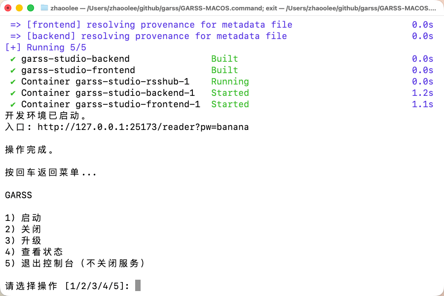

# 《嘎!RSS》🐣为打破信息茧房而生, 让古老的RSS在AI时代再次伟大 Github Actions Rss (garss, 嘎RSS! 已收集281个RSS源, 生成时间: 2026-05-16 06:26:36)

信息茧房是指人们关注的信息领域会习惯性地被自己的兴趣所引导，从而将自己的生活桎梏于像蚕茧一般的「茧房」中的现象。


这个名为**嘎!RSS**的项目会利用免费的Github Actions服务, 提供一个内容全面的信息流, 让现代人的知识体系更广泛, 减弱信息茧房对现代人的影响, 让**非茧房信息流**造福人类~
[《嘎!RSS》永久开源页面: https://github.com/zhaoolee/garss](https://github.com/zhaoolee/garss)

## 适合谁


## 项目优势（米氏对比法）

| 项目  | garss |  新闻APP  |  商业化RSS工具 |
| --- | --- | --- | --- |
|  |  |    |  |
| 不上传浏览记录  |   ✅  |  ❌  |  ✅  |
| 信息茧房  |   ❌  |  ✅   |  ✅  |
| 私有化部署  |   ✅  |  ❌  |  ❌   |
| 付费订阅  |   ❌ |  ✅   |  ✅    |
| 开放API  |   ✅  |  ❌   |  ❌    |
| 支持二次开发  |   ✅  |  ❌   |  ❌    |
| 代码开源  |   ✅  |  ❌   |  ❌   |
| 接入 AI Skill | ✅  |  ❌   |  ❌  |
| RSSHub社区支持 | ✅  |  ❌   |  ❌  |
| 广告插入  |   ❌ |  ✅   |  ✅    |
| URL看图增强 | ✅  |  ✅（需安装插件）   |  ❌  |
| 突破IP限制 | ✅  |  ❌  |  ❌  |
| Github Action抓取 | ✅  |  ❌  |  ❌  |


## 快速启动

## 快速启动和关闭

仓库根目录提供跨平台控制台入口：

| 平台 | 统一入口 |
| --- | --- |
| macOS | `GARSS-MACOS.command` |
| Linux | `GARSS-LINUX.sh` |
| Windows | `GARSS-WINDOWS.bat` |

双击后文件后，可选择启动、关闭、升级、查看状态或退出控制台。启动和升级会自动打开浏览器；关闭控制台窗口不会停止服务，只有选择“关闭”才会停止容器。



## 锤子便签风格的GARSS阅读器

- 首次启动

```
cd garss-studio
cp .env.example .env
docker compose -f docker-compose.dev.yml up --build
```


- 简单快速的分类阅读交互


- 锤子便签风格的阅读体验


- 简单的订阅管理


- 集成RSSHUB


- 完善的二开文档


- AI SKILL支持


- 自动拉取，保证新闻时效


- 常用页面

```
阅读页：http://127.0.0.1:25173/reader?pw=banana
订阅源：http://127.0.0.1:25173/sources?pw=banana
设置页：http://127.0.0.1:25173/settings?pw=banana
API 文档：http://127.0.0.1:25173/api/docs
```

CLAWHUB的SKILL调用GARSS后端：https://clawhub.ai/zhaoolee/garss-studio-rss-api

## 推荐使用什么软件订阅RSS？
我推荐一款免费的浏览器扩展程序Feedbro ，使用教程[Chrome插件英雄榜第96期《Feedbro》在Chrome中订阅RSS信息流](https://www.v2fy.com/p/096-feedbro-2021-02-27/)

## 主要功能
1. 收集RSS, 打造无广告内容优质的 **头版头条** 超赞新闻页
2. 利用Github Actions, 搜集全部RSS的头版头条新闻标题和超链接, 并自动更新到首页,当天最新发布的文章会出现🌈 标志

## 今日值得看 🕶️

邮件内容区开始>
<h2>新蒸熟585个小蛋糕🍰(文章) 生产时间 2026-05-16 06:26:36 保质期24小时</h2>

<div style='line-height:3;background-color:#FAF6EA;' ><a href='https://xclient.info/s/fender-studio-pro.html' style="line-height:2;text-decoration:none;display:block;color:#584D49;">🌈 ‣ Fender Studio Pro 8.0.3 音乐制作程序 | 第1篇</a></div><div style='line-height:3;' ><a href='https://xclient.info/s/canopy.html' style="line-height:2;text-decoration:none;display:block;color:#584D49;">🌈 ‣ Canopy 3.3.7 一款优雅的应用程序 | 第2篇</a></div><div style='line-height:3;background-color:#FAF6EA;' ><a href='https://xclient.info/s/drivedx.html' style="line-height:2;text-decoration:none;display:block;color:#584D49;">🌈 ‣ DriveDx 1.12.1 硬盘健康状况工具 | 第3篇</a></div><div style='line-height:3;' ><a href='https://xclient.info/s/zenteek.html' style="line-height:2;text-decoration:none;display:block;color:#584D49;">🌈 ‣ Zenteek 1.3.3 顶级音乐播放器 | 第4篇</a></div><div style='line-height:3;background-color:#FAF6EA;' ><a href='https://xclient.info/s/transfer.html' style="line-height:2;text-decoration:none;display:block;color:#584D49;">🌈 ‣ Transfer 2.4.3 TFTP工具 | 第5篇</a></div><div style='line-height:3;' ><a href='https://xclient.info/s/noir.html' style="line-height:2;text-decoration:none;display:block;color:#584D49;">🌈 ‣ Noir 2026.1.4 为每个网站定做黑暗模式 | 第6篇</a></div><div style='line-height:3;background-color:#FAF6EA;' ><a href='https://xclient.info/s/typora.html' style="line-height:2;text-decoration:none;display:block;color:#584D49;">🌈 ‣ Typora 1.13.6 极简Markdown编辑器 | 第7篇</a></div><div style='line-height:3;' ><a href='https://www.appinn.com/eggs-26515/' style="line-height:2;text-decoration:none;display:block;color:#584D49;">🌈 ‣ 本周赛博领鸡蛋：5.15~5.21 | 第8篇</a></div><div style='line-height:3;background-color:#FAF6EA;' ><a href='https://www.appinn.com/everything-1-5-beta/' style="line-height:2;text-decoration:none;display:block;color:#584D49;">🌈 ‣ 等了 5 年，Everything 1.5 Beta 正式发布｜附升级指南 | 第9篇</a></div><div style='line-height:3;' ><a href='https://www.appinn.com/work-with-codex-from-anywhere/' style="line-height:2;text-decoration:none;display:block;color:#584D49;">🌈 ‣ ChatGPT 手机版新增远程操作 Codex：电脑干活，手机盯进度｜牛马程序员，永不停歇 | 第10篇</a></div><div style='line-height:3;background-color:#FAF6EA;' ><a href='https://free.apprcn.com/limited-time-get-epic-game-lost-in-the-hole-for-free/' style="line-height:2;text-decoration:none;display:block;color:#584D49;">🌈 ‣ 限时免费获取 Epic 游戏 Lost in the Hole[Windows][¥47→0] | 第11篇</a></div><div style='line-height:3;' ><a href='https://free.apprcn.com/limited-time-get-epic-game-arranger-a-role-puzzling-adventure-for-free-2/' style="line-height:2;text-decoration:none;display:block;color:#584D49;">🌈 ‣ 限时免费获取 Epic 游戏 Arranger: A Role-Puzzling Adventure[iOS、Android][¥31→0] | 第12篇</a></div><div style='line-height:3;background-color:#FAF6EA;' ><a href='http://www.ruanyifeng.com/blog/2026/05/weekly-issue-396.html' style="line-height:2;text-decoration:none;display:block;color:#584D49;">🌈 ‣ 科技爱好者周刊（第 396 期）：互联网通信的替代方案 | 第13篇</a></div><div style='line-height:3;' ><a href='https://blog.est.im/2026/stdout-16' style="line-height:2;text-decoration:none;display:block;color:#584D49;">🌈 ‣ SVG 时钟 | 第14篇</a></div><div style='line-height:3;background-color:#FAF6EA;' ><a href='https://www.changhai.org/articles/miscellaneous/blog/202605.php#latest' style="line-height:2;text-decoration:none;display:block;color:#584D49;">🌈 ‣ 最新微博：2026 年 5 月 15 日 | 第15篇</a></div><div style='line-height:3;' ><a href='https://lukefan.com/2026/05/15/viral-science-fraud-blogger-integrity-risks/' style="line-height:2;text-decoration:none;display:block;color:#584D49;">🌈 ‣ 耿同学爆火背后的科研打假风险与边界 | 第16篇</a></div><div style='line-height:3;background-color:#FAF6EA;' ><a href='https://www.wikimoe.com/post/t-tezc4eau' style="line-height:2;text-decoration:none;display:block;color:#584D49;">🌈 ‣ 你是ChatGPT，别假装自己是Gemini啊 | 第17篇</a></div><div style='line-height:3;' ><a href='https://www.wikimoe.com/post/t-tezd2tjt' style="line-height:2;text-decoration:none;display:block;color:#584D49;">🌈 ‣ 重新整理了一遍博客自动化翻译流程 | 第18篇</a></div><div style='line-height:3;background-color:#FAF6EA;' ><a href='https://sspai.com/post/109825' style="line-height:2;text-decoration:none;display:block;color:#584D49;">🌈 ‣ 本周看什么 | 最近值得一看的 8 部作品 | 第19篇</a></div><div style='line-height:3;' ><a href='https://sspai.com/prime/story/zhuanglesha-260515' style="line-height:2;text-decoration:none;display:block;color:#584D49;">🌈 ‣ 装了啥：编辑部用什么转写音视频内容？ | 第20篇</a></div><div style='line-height:3;background-color:#FAF6EA;' ><a href='https://sspai.com/post/109816' style="line-height:2;text-decoration:none;display:block;color:#584D49;">🌈 ‣ [会员免费] Apple WWDC26 全球开发者大会，来与少数派一起看 | 第21篇</a></div><div style='line-height:3;' ><a href='https://sspai.com/post/109708' style="line-height:2;text-decoration:none;display:block;color:#584D49;">🌈 ‣ 快捷指令｜纯粹、专注、能群发，一种「点名式」微信聊天新体验 | 第22篇</a></div><div style='line-height:3;background-color:#FAF6EA;' ><a href='https://sspai.com/post/109550' style="line-height:2;text-decoration:none;display:block;color:#584D49;">🌈 ‣ 你真的需要墨水屏设备吗？ | 第23篇</a></div><div style='line-height:3;' ><a href='https://sspai.com/post/109787' style="line-height:2;text-decoration:none;display:block;color:#584D49;">🌈 ‣ 派早报：戴尔推出 Alienware 15 入门游戏本，Spotify 将支持 HLS 视频播客技术等 | 第24篇</a></div><div style='line-height:3;background-color:#FAF6EA;' ><a href='https://tech.meituan.com/2026/05/15/longcat-general-365.html' style="line-height:2;text-decoration:none;display:block;color:#584D49;">🌈 ‣ 美团 LongCat 开源 General 365：树立推理评测新标尺 | 第25篇</a></div><div style='line-height:3;' ><a href='https://36kr.com/p/3810562142445058?f=rss' style="line-height:2;text-decoration:none;display:block;color:#584D49;">🌈 ‣ 理想出牌：全新L9上市，45.98万元起｜最前线 | 第26篇</a></div><div style='line-height:3;background-color:#FAF6EA;' ><a href='https://36kr.com/p/3810607581634056?f=rss' style="line-height:2;text-decoration:none;display:block;color:#584D49;">🌈 ‣ 2026 Shokz Day圆满收官：韶音以「随我动听」开启全场景声态新时代 | 第27篇</a></div><div style='line-height:3;' ><a href='https://36kr.com/p/3810380205989632?f=rss' style="line-height:2;text-decoration:none;display:block;color:#584D49;">🌈 ‣ 36氪「属于年轻浪潮的派对」WAVES2026丨今年盛夏 | 第28篇</a></div><div style='line-height:3;background-color:#FAF6EA;' ><a href='https://36kr.com/p/3810308239465986?f=rss' style="line-height:2;text-decoration:none;display:block;color:#584D49;">🌈 ‣ 36氪联合PureblueAI清蓝发布「2026消费品牌AI推荐力名册」丨AI时代，品牌如何抢占「推荐力」新战场？ | 第29篇</a></div><div style='line-height:3;' ><a href='https://36kr.com/p/3810091479293449?f=rss' style="line-height:2;text-decoration:none;display:block;color:#584D49;">🌈 ‣ 长安计划入股千里科技，千里智驾与奥迪推进合作｜36氪独家 | 第30篇</a></div><div style='line-height:3;background-color:#FAF6EA;' ><a href='https://36kr.com/p/3809936183860740?f=rss' style="line-height:2;text-decoration:none;display:block;color:#584D49;">🌈 ‣ 36氪首发｜航天发动机核心部件厂商获投，国内唯一具备核心部件一站式制造能力的民营企业 | 第31篇</a></div><div style='line-height:3;' ><a href='https://36kr.com/p/3800419059555584?f=rss' style="line-height:2;text-decoration:none;display:block;color:#584D49;">🌈 ‣ 挪瓦咖啡2025年营收7至8亿元，利润约为6千万元 | 独家 | 第32篇</a></div><div style='line-height:3;background-color:#FAF6EA;' ><a href='https://36kr.com/p/3809931035844359?f=rss' style="line-height:2;text-decoration:none;display:block;color:#584D49;">🌈 ‣ 麦记牛奶谢永亮：2025年是唯一窗口期，糖水赛道胜负已定｜厚雪专访 | 第33篇</a></div><div style='line-height:3;' ><a href='https://36kr.com/p/3809919654403587?f=rss' style="line-height:2;text-decoration:none;display:block;color:#584D49;">🌈 ‣ 36氪首发 | 前大疆核心成员做消费级CNC，获美团、昆仑资本、奇绩创坛投资近亿元 | 第34篇</a></div><div style='line-height:3;background-color:#FAF6EA;' ><a href='https://36kr.com/p/3809911566704388?f=rss' style="line-height:2;text-decoration:none;display:block;color:#584D49;">🌈 ‣ 2026年上半年最火赛道：具身智能行业前4月融资超200笔，总规模超550亿元 | 第35篇</a></div><div style='line-height:3;' ><a href='https://36kr.com/newsflashes/3810557255425542?f=rss' style="line-height:2;text-decoration:none;display:block;color:#584D49;">🌈 ‣ 热门中概股美股盘前集体走弱，阿里巴巴跌超3% | 第36篇</a></div><div style='line-height:3;background-color:#FAF6EA;' ><a href='https://36kr.com/newsflashes/3810550979436293?f=rss' style="line-height:2;text-decoration:none;display:block;color:#584D49;">🌈 ‣ 美股大型科技股盘前普跌，英特尔跌超5% | 第37篇</a></div><div style='line-height:3;' ><a href='https://36kr.com/newsflashes/3810532133740293?f=rss' style="line-height:2;text-decoration:none;display:block;color:#584D49;">🌈 ‣ 先锋新材：公司及相关当事人收到《行政处罚事先告知书》 | 第38篇</a></div><div style='line-height:3;background-color:#FAF6EA;' ><a href='https://36kr.com/newsflashes/3810538747649798?f=rss' style="line-height:2;text-decoration:none;display:block;color:#584D49;">🌈 ‣ 巨力索具：因涉嫌信息披露误导性陈述违法违规被证监会立案 | 第39篇</a></div><div style='line-height:3;' ><a href='https://36kr.com/newsflashes/3810529206328838?f=rss' style="line-height:2;text-decoration:none;display:block;color:#584D49;">🌈 ‣ 招商轮船：子公司拟追加8.03亿元增持安通控股股份 | 第40篇</a></div><div style='line-height:3;background-color:#FAF6EA;' ><a href='https://36kr.com/newsflashes/3810508672458248?f=rss' style="line-height:2;text-decoration:none;display:block;color:#584D49;">🌈 ‣ 麦肯锡推行人工智能时代薪酬改革，削减合伙人现金分红比例 | 第41篇</a></div><div style='line-height:3;' ><a href='https://36kr.com/newsflashes/3810507192639235?f=rss' style="line-height:2;text-decoration:none;display:block;color:#584D49;">🌈 ‣ 长春高新：子公司GenSci161注射液获美国FDA批准开展临床试验 | 第42篇</a></div><div style='line-height:3;background-color:#FAF6EA;' ><a href='https://36kr.com/newsflashes/3810504658607621?f=rss' style="line-height:2;text-decoration:none;display:block;color:#584D49;">🌈 ‣ 恒逸石化：拟投资257亿元建设年产240万吨煤制乙二醇项目 | 第43篇</a></div><div style='line-height:3;' ><a href='https://36kr.com/newsflashes/3810513299348997?f=rss' style="line-height:2;text-decoration:none;display:block;color:#584D49;">🌈 ‣ 郑栅洁主任会见波音公司总裁兼首席执行官奥特伯格 | 第44篇</a></div><div style='line-height:3;background-color:#FAF6EA;' ><a href='https://36kr.com/newsflashes/3810501093236226?f=rss' style="line-height:2;text-decoration:none;display:block;color:#584D49;">🌈 ‣ 同花顺：股东拟合计减持不超0.54%股份 | 第45篇</a></div><div style='line-height:3;' ><a href='https://36kr.com/newsflashes/3810483801759240?f=rss' style="line-height:2;text-decoration:none;display:block;color:#584D49;">🌈 ‣ 机构今日买入世嘉科技等24股，买入长盈通4.5亿元 | 第46篇</a></div><div style='line-height:3;background-color:#FAF6EA;' ><a href='https://36kr.com/newsflashes/3810469108801024?f=rss' style="line-height:2;text-decoration:none;display:block;color:#584D49;">🌈 ‣ 深交所：本周共对293起证券异常交易行为采取自律监管措施 | 第47篇</a></div><div style='line-height:3;' ><a href='https://36kr.com/newsflashes/3810482830089984?f=rss' style="line-height:2;text-decoration:none;display:block;color:#584D49;">🌈 ‣ 杰瑞股份：2026年以来与美国四客户签署燃气轮机发电机组合同累计超9亿美元 | 第48篇</a></div><div style='line-height:3;background-color:#FAF6EA;' ><a href='https://36kr.com/newsflashes/3810469835185926?f=rss' style="line-height:2;text-decoration:none;display:block;color:#584D49;">🌈 ‣ 盛合晶微：公司营收规模与大型封测企业相比仍较小 | 第49篇</a></div><div style='line-height:3;' ><a href='https://36kr.com/newsflashes/3810465699766022?f=rss' style="line-height:2;text-decoration:none;display:block;color:#584D49;">🌈 ‣ 2连板北自科技：未生产人形机器人��体及零部件 | 第50篇</a></div><div style='line-height:3;background-color:#FAF6EA;' ><a href='https://36kr.com/newsflashes/3810464886316800?f=rss' style="line-height:2;text-decoration:none;display:block;color:#584D49;">🌈 ‣ 奥比中光：控股股东及其一致行动人等拟减持公司不超1.5421%股份 | 第51篇</a></div><div style='line-height:3;' ><a href='https://36kr.com/newsflashes/3810471758683657?f=rss' style="line-height:2;text-decoration:none;display:block;color:#584D49;">🌈 ‣ 金融监管总局：一季度末保险公司和保险资产管理公司总资产42.5万亿元，较年初增长2.8% | 第52篇</a></div><div style='line-height:3;background-color:#FAF6EA;' ><a href='https://36kr.com/newsflashes/3810471319690756?f=rss' style="line-height:2;text-decoration:none;display:block;color:#584D49;">🌈 ‣ 金融监管总局：一季度末我国银行业金融机构本外币资产总额494.7万亿元，同比增长8.0% | 第53篇</a></div><div style='line-height:3;' ><a href='https://36kr.com/newsflashes/3810464209116675?f=rss' style="line-height:2;text-decoration:none;display:block;color:#584D49;">🌈 ‣ 长盛轴承：拟约2.3亿元购买土地使用权并投资建设项目 | 第54篇</a></div><div style='line-height:3;background-color:#FAF6EA;' ><a href='https://www.baijing.cn/article/55339' style="line-height:2;text-decoration:none;display:block;color:#584D49;">🌈 ‣ B站莉莉丝参战，《Coin Master》玩法要迎来新一轮竞争了 | 第55篇</a></div><div style='line-height:3;' ><a href='https://www.baijing.cn/article/55336' style="line-height:2;text-decoration:none;display:block;color:#584D49;">🌈 ‣ 2026年4月成功出海的中国手游：《明日方舟》7周年收入激增240%，《Arrows GO!》强势跻身下载榜第2名 | 第56篇</a></div><div style='line-height:3;background-color:#FAF6EA;' ><a href='https://www.baijing.cn/article/55332' style="line-height:2;text-decoration:none;display:block;color:#584D49;">🌈 ‣ 畅销榜top2、5天近4000万流水，这个“老套路”又生奇效了 | 第57篇</a></div><div style='line-height:3;' ><a href='https://www.baijing.cn/article/55338' style="line-height:2;text-decoration:none;display:block;color:#584D49;">🌈 ‣ 从LLM到Agentic System：一场正在发生的范式转移，7月深圳等你见证 | 第58篇</a></div><div style='line-height:3;background-color:#FAF6EA;' ><a href='https://www.baijing.cn/article/55337' style="line-height:2;text-decoration:none;display:block;color:#584D49;">🌈 ‣ GCS | 主题峰会+标杆企业参访+高净值社交圈层，助力中国企业“深潜”东南亚 | 第59篇</a></div><div style='line-height:3;' ><a href='https://www.baijing.cn/article/55335' style="line-height:2;text-decoration:none;display:block;color:#584D49;">🌈 ‣ 出海厂商丨2026年4月中国应用/游戏厂商出海收入Top30榜 | 第60篇</a></div><div style='line-height:3;background-color:#FAF6EA;' ><a href='https://www.baijing.cn/article/55334' style="line-height:2;text-decoration:none;display:block;color:#584D49;">🌈 ‣ Google Play退款新规：开发者将承担拒付手续费 | 第61篇</a></div><div style='line-height:3;' ><a href='https://www.baijing.cn/article/55333' style="line-height:2;text-decoration:none;display:block;color:#584D49;">🌈 ‣ 邪典、恶毒、暴力，海外AI水果短剧正在失控 | 第62篇</a></div><div style='line-height:3;background-color:#FAF6EA;' ><a href='https://www.baijing.cn/article/55331' style="line-height:2;text-decoration:none;display:block;color:#584D49;">🌈 ‣ 娱乐IP公司的游戏“夺权”运动 | 第63篇</a></div><div style='line-height:3;' ><a href='http://xueqiu.com/1170975436/388844702' style="line-height:2;text-decoration:none;display:block;color:#584D49;">🌈 ‣ 为什么坚持押注油气股，未来走势猜测 | 第64篇</a></div><div style='line-height:3;background-color:#FAF6EA;' ><a href='http://xueqiu.com/1349759456/389124356' style="line-height:2;text-decoration:none;display:block;color:#584D49;">🌈 ‣ 锂电池4月数据跟踪，锂矿的第二次过山车，锂矿企业未来会长期盈利？ | 第65篇</a></div><div style='line-height:3;' ><a href='http://xueqiu.com/8141527616/388752002' style="line-height:2;text-decoration:none;display:block;color:#584D49;">🌈 ‣ 5.14光通信PCB行业更新 | 第66篇</a></div><div style='line-height:3;background-color:#FAF6EA;' ><a href='http://xueqiu.com/1843761023/388976191' style="line-height:2;text-decoration:none;display:block;color:#584D49;">🌈 ‣ 险守4200点！A股能稳住吗？ | 第67篇</a></div><div style='line-height:3;' ><a href='http://xueqiu.com/1632625377/388981935' style="line-height:2;text-decoration:none;display:block;color:#584D49;">🌈 ‣ 如何理解3750万：《生猪产能综合调控实施方案（2026年修订）》简析之一 | 第68篇</a></div><div style='line-height:3;background-color:#FAF6EA;' ><a href='http://xueqiu.com/9598793634/388701842' style="line-height:2;text-decoration:none;display:block;color:#584D49;">🌈 ‣ 用今日cash flow换明日cloudflation ：阿里财报速通 | 第69篇</a></div><div style='line-height:3;' ><a href='http://xueqiu.com/4410154833/388672305' style="line-height:2;text-decoration:none;display:block;color:#584D49;">🌈 ‣ 告别周期魔咒：AI给腾讯游戏装上了“增长”新引擎 | 第70篇</a></div><div style='line-height:3;background-color:#FAF6EA;' ><a href='http://xueqiu.com/2480006401/388689874' style="line-height:2;text-decoration:none;display:block;color:#584D49;">🌈 ‣ 腾讯2026年股东大会纪要全文 | 第71篇</a></div><div style='line-height:3;' ><a href='http://xueqiu.com/6854054227/388982422' style="line-height:2;text-decoration:none;display:block;color:#584D49;">🌈 ‣ 何纯在南国：与微盘股有关的日子 | 第72篇</a></div><div style='line-height:3;background-color:#FAF6EA;' ><a href='https://www.ainvest.com/news/veritones-loss-narrows-revenue-falls-lawsuits-mount-2605/' style="line-height:2;text-decoration:none;display:block;color:#584D49;">🌈 ‣ Veritones Loss Narrows, But Revenue Falls and Lawsuits Mount | 第73篇</a></div><div style='line-height:3;' ><a href='https://www.ainvest.com/news/wxm-surges-weak-markets-2605/' style="line-height:2;text-decoration:none;display:block;color:#584D49;">🌈 ‣ Why WXM Surges Despite Weak Markets | 第74篇</a></div><div style='line-height:3;background-color:#FAF6EA;' ><a href='https://www.ainvest.com/news/brokers-app-bank-profit-engine-2605/' style="line-height:2;text-decoration:none;display:block;color:#584D49;">🌈 ‣ Five Brokers, One App, and a Bank's Profit Engine | 第75篇</a></div><div style='line-height:3;' ><a href='https://www.ainvest.com/news/disclosure-story-2605/' style="line-height:2;text-decoration:none;display:block;color:#584D49;">🌈 ‣ The Disclosure That Is the Story | 第76篇</a></div><div style='line-height:3;background-color:#FAF6EA;' ><a href='https://www.ainvest.com/news/york-space-systems-breaks-key-support-heavy-volume-2605/' style="line-height:2;text-decoration:none;display:block;color:#584D49;">🌈 ‣ York Space Systems Breaks Key Support on Heavy Volume | 第77篇</a></div><div style='line-height:3;' ><a href='https://www.ainvest.com/news/rare-earth-clock-ticking-ai-build-2605/' style="line-height:2;text-decoration:none;display:block;color:#584D49;">🌈 ‣ The Rare Earth Clock Is Ticking on the AI Build-Out | 第78篇</a></div><div style='line-height:3;background-color:#FAF6EA;' ><a href='https://www.ainvest.com/news/soxx-crash-buy-dip-run-2605/' style="line-height:2;text-decoration:none;display:block;color:#584D49;">🌈 ‣ SOXX Crash! Buy the Dip or Run Away? | 第79篇</a></div><div style='line-height:3;' ><a href='https://www.ainvest.com/news/jerome-powell-leaves-years-fed-2605/' style="line-height:2;text-decoration:none;display:block;color:#584D49;">🌈 ‣ What Jerome Powell Leaves Behind After Eight Years at the Fed | 第80篇</a></div><div style='line-height:3;background-color:#FAF6EA;' ><a href='https://www.ainvest.com/news/trump-ends-china-visit-renewed-push-china-stability-2605/' style="line-height:2;text-decoration:none;display:block;color:#584D49;">🌈 ‣ Trump Ends China Visit With a Renewed Push for U.S.-China Stability | 第81篇</a></div><div style='line-height:3;' ><a href='https://www.ainvest.com/news/concentration-fomo-sentiment-continue-pushing-market-highs-liquidity-flashing-warnings-2605/' style="line-height:2;text-decoration:none;display:block;color:#584D49;">🌈 ‣ Concentration and FOMO Sentiment Continue Pushing the Market to New Highs, but Liquidity Is Flashing Warnings | 第82篇</a></div><div style='line-height:3;background-color:#FAF6EA;' ><a href='https://www.ainvest.com/news/trump-moves-stir-markets-analysis-president-financial-disclosures-2605/' style="line-height:2;text-decoration:none;display:block;color:#584D49;">🌈 ‣ Trump's New Moves Stir up Markets? An Analysis of President's New Financial Disclosures | 第83篇</a></div><div style='line-height:3;' ><a href='https://www.ainvest.com/news/veritones-loss-narrows-revenue-falls-lawsuits-mount-2605/' style="line-height:2;text-decoration:none;display:block;color:#584D49;">🌈 ‣ Veritones Loss Narrows, But Revenue Falls and Lawsuits Mount | 第84篇</a></div><div style='line-height:3;background-color:#FAF6EA;' ><a href='https://www.ainvest.com/news/wxm-surges-weak-markets-2605/' style="line-height:2;text-decoration:none;display:block;color:#584D49;">🌈 ‣ Why WXM Surges Despite Weak Markets | 第85篇</a></div><div style='line-height:3;' ><a href='https://www.ainvest.com/news/brokers-app-bank-profit-engine-2605/' style="line-height:2;text-decoration:none;display:block;color:#584D49;">🌈 ‣ Five Brokers, One App, and a Bank's Profit Engine | 第86篇</a></div><div style='line-height:3;background-color:#FAF6EA;' ><a href='https://www.ainvest.com/news/disclosure-story-2605/' style="line-height:2;text-decoration:none;display:block;color:#584D49;">🌈 ‣ The Disclosure That Is the Story | 第87篇</a></div><div style='line-height:3;' ><a href='https://www.ainvest.com/news/york-space-systems-breaks-key-support-heavy-volume-2605/' style="line-height:2;text-decoration:none;display:block;color:#584D49;">🌈 ‣ York Space Systems Breaks Key Support on Heavy Volume | 第88篇</a></div><div style='line-height:3;background-color:#FAF6EA;' ><a href='https://www.ainvest.com/news/rare-earth-clock-ticking-ai-build-2605/' style="line-height:2;text-decoration:none;display:block;color:#584D49;">🌈 ‣ The Rare Earth Clock Is Ticking on the AI Build-Out | 第89篇</a></div><div style='line-height:3;' ><a href='https://www.ainvest.com/news/video-game-digital-control-2605/' style="line-height:2;text-decoration:none;display:block;color:#584D49;">🌈 ‣ The End Game Is Digital Control | 第90篇</a></div><div style='line-height:3;background-color:#FAF6EA;' ><a href='https://www.ainvest.com/news/video-nvda-tsm-avgo-continue-adding-ai-muscle-igv-recovers-2605/' style="line-height:2;text-decoration:none;display:block;color:#584D49;">🌈 ‣ How NVDA, TSM & AVGO Continue Adding AI Muscle as IGV Recovers | 第91篇</a></div><div style='line-height:3;' ><a href='https://www.ainvest.com/news/video-scary-banks-allowed-clarity-pass-disgusting-reason-2605/' style="line-height:2;text-decoration:none;display:block;color:#584D49;">🌈 ‣ SCARY Banks ALLOWED Clarity to PASS for this DISGUSTING REASON | 第92篇</a></div><div style='line-height:3;background-color:#FAF6EA;' ><a href='https://www.ainvest.com/news/video-squeezing-profit-margins-uncovering-stranded-sats-mining-operations-bitcoin-2026-2605/' style="line-height:2;text-decoration:none;display:block;color:#584D49;">🌈 ‣ Squeezing Profit from the Margins: Uncovering Stranded Sats in Mining Operations | Bitcoin 2026 | 第93篇</a></div><div style='line-height:3;' ><a href='https://www.ainvest.com/news/video-oil-prices-spook-investors-consumers-feel-price-crunch-bloomberg-businessweek-daily-5-15-2026-2605/' style="line-height:2;text-decoration:none;display:block;color:#584D49;">🌈 ‣ Oil Prices Spook Investors, Consumers Feel Price Crunch | Bloomberg Businessweek Daily 5/15/2026 | 第94篇</a></div><div style='line-height:3;background-color:#FAF6EA;' ><a href='https://www.ainvest.com/news/video-equities-bonds-hit-close-week-closing-bell-2605/' style="line-height:2;text-decoration:none;display:block;color:#584D49;">🌈 ‣ Equities & Bonds Take a Hit To Close the Week | Closing Bell | 第95篇</a></div><div style='line-height:3;' ><a href='https://www.ainvest.com/news/video-mit-warns-loss-funding-grad-enrollment-drops-2605/' style="line-height:2;text-decoration:none;display:block;color:#584D49;">🌈 ‣ MIT Warns of Loss From Funding, Grad Enrollment Drops | 第96篇</a></div><div style='line-height:3;background-color:#FAF6EA;' ><a href='https://www.ainvest.com/news/video-trump-plans-july-4th-bitcoin-reset-telling-clarity-act-2605/' style="line-height:2;text-decoration:none;display:block;color:#584D49;">🌈 ‣ Trump Plans July 4th Bitcoin Reset? | What They're NOT Telling You About The Clarity Act! | 第97篇</a></div><div style='line-height:3;' ><a href='https://www.ainvest.com/news/video-bottom-software-keith-kirkpatrick-sees-ai-headwinds-2605/' style="line-height:2;text-decoration:none;display:block;color:#584D49;">🌈 ‣ Bottom in for Software? Keith Kirkpatrick Sees AI Headwinds Ahead | 第98篇</a></div><div style='line-height:3;background-color:#FAF6EA;' ><a href='https://www.ainvest.com/news/video-friday-final-takeaways-breakthroughs-trump-china-visit-2605/' style="line-height:2;text-decoration:none;display:block;color:#584D49;">🌈 ‣ Friday's Final Takeaways: Breakthroughs in Trump's China Visit | 第99篇</a></div><div style='line-height:3;' ><a href='https://www.ainvest.com/news/dow-slides-537-points-yields-spike-100-oil-slams-ai-trade-2605/' style="line-height:2;text-decoration:none;display:block;color:#584D49;">🌈 ‣ Dow Slides 537 Points as Yields Spike and $100 Oil Slams AI Trade | 第100篇</a></div><div style='line-height:3;background-color:#FAF6EA;' ><a href='https://www.ainvest.com/news/video-poland-approves-mica-crypto-bill-2605/' style="line-height:2;text-decoration:none;display:block;color:#584D49;">🌈 ‣ Poland Approves MiCA Crypto Bill | 第101篇</a></div><div style='line-height:3;' ><a href='https://www.ainvest.com/news/video-bitcoin-fed-inflation-risk-2605/' style="line-height:2;text-decoration:none;display:block;color:#584D49;">🌈 ‣ Bitcoin Fed Inflation Risk | 第102篇</a></div><div style='line-height:3;background-color:#FAF6EA;' ><a href='https://www.ainvest.com/news/stocks-finally-crack-surging-yields-100-oil-vanishing-options-support-slam-ai-trade-2605/' style="line-height:2;text-decoration:none;display:block;color:#584D49;">🌈 ‣ Stocks Finally Crack as Surging Yields, $100 Oil, and Vanishing Options Support Slam the AI Trade | 第103篇</a></div><div style='line-height:3;' ><a href='https://www.ainvest.com/news/video-clarity-act-drives-crypto-rally-2605/' style="line-height:2;text-decoration:none;display:block;color:#584D49;">🌈 ‣ CLARITY Act Drives Crypto Rally | 第104篇</a></div><div style='line-height:3;background-color:#FAF6EA;' ><a href='https://www.ainvest.com/news/video-grayscale-bitcoin-outlook-update-2605/' style="line-height:2;text-decoration:none;display:block;color:#584D49;">🌈 ‣ Grayscale Bitcoin Outlook Update | 第105篇</a></div><div style='line-height:3;' ><a href='https://www.ainvest.com/news/video-surgepays-revenue-jumps-51-2605/' style="line-height:2;text-decoration:none;display:block;color:#584D49;">🌈 ‣ SurgePays Revenue Jumps 51% | 第106篇</a></div><div style='line-height:3;background-color:#FAF6EA;' ><a href='https://www.ainvest.com/news/video-rkda-swings-q1-loss-2605/' style="line-height:2;text-decoration:none;display:block;color:#584D49;">🌈 ‣ RKDA Swings To Q1 Loss | 第107篇</a></div><div style='line-height:3;' ><a href='https://www.ainvest.com/news/video-virtune-crypto-etp-milestone-2605/' style="line-height:2;text-decoration:none;display:block;color:#584D49;">🌈 ‣ Virtune Crypto ETP Milestone | 第108篇</a></div><div style='line-height:3;background-color:#FAF6EA;' ><a href='https://www.ainvest.com/news/video-virtune-crypto-etp-milestone-2605-79/' style="line-height:2;text-decoration:none;display:block;color:#584D49;">🌈 ‣ Virtune Crypto ETP Milestone | 第109篇</a></div><div style='line-height:3;' ><a href='https://www.ainvest.com/news/trump-xi-summit-fails-deliver-big-breakthroughs-rising-yields-oil-slam-stocks-2605/' style="line-height:2;text-decoration:none;display:block;color:#584D49;">🌈 ‣ Trump-Xi Summit Fails to Deliver Big Breakthroughs as Rising Yields and Oil Slam Stocks | 第110篇</a></div><div style='line-height:3;background-color:#FAF6EA;' ><a href='https://www.ainvest.com/news/video-bitcoin-pulls-highs-2605/' style="line-height:2;text-decoration:none;display:block;color:#584D49;">🌈 ‣ Bitcoin Pulls Back From Highs | 第111篇</a></div><div style='line-height:3;' ><a href='https://www.ainvest.com/news/soxx-crash-buy-dip-run-2605/' style="line-height:2;text-decoration:none;display:block;color:#584D49;">🌈 ‣ SOXX Crash! Buy the Dip or Run Away? | 第112篇</a></div><div style='line-height:3;background-color:#FAF6EA;' ><a href='https://www.ainvest.com/news/nasdaq-slides-1-7-oil-nears-100-valuation-fears-hit-tech-2605/' style="line-height:2;text-decoration:none;display:block;color:#584D49;">🌈 ‣ Nasdaq Slides 1.7% as Oil Nears $100 and Valuation Fears Hit Tech | 第113篇</a></div><div style='line-height:3;' ><a href='https://www.ainvest.com/news/applied-materials-crushed-earnings-expectations-stock-suddenly-breaking-2605/' style="line-height:2;text-decoration:none;display:block;color:#584D49;">🌈 ‣ Applied Materials Crushed Earnings Expectations, So Why Is the Stock Suddenly Breaking Down? | 第114篇</a></div><div style='line-height:3;background-color:#FAF6EA;' ><a href='https://www.ainvest.com/news/video-frozen-tether-usdt-lawsuit-2605/' style="line-height:2;text-decoration:none;display:block;color:#584D49;">🌈 ‣ Frozen Tether USDT Lawsuit | 第115篇</a></div><div style='line-height:3;' ><a href='https://www.ainvest.com/news/croatia-5-8-inflation-isn-outlier-regime-test-2605/' style="line-height:2;text-decoration:none;display:block;color:#584D49;">🌈 ‣ Croatia's 5.8% Inflation Isn't an Outlier - It's the Regime Test | 第116篇</a></div><div style='line-height:3;background-color:#FAF6EA;' ><a href='https://www.ainvest.com/news/stellantis-dongfeng-china-deal-early-change-rating-valuation-room-prove-2605/' style="line-height:2;text-decoration:none;display:block;color:#584D49;">🌈 ‣ Stellantis: Dongfeng China Deal Is Too Early To Change The Rating, But Valuation Gives It Room To Prove Itself | 第117篇</a></div><div style='line-height:3;' ><a href='https://www.ainvest.com/news/jerome-powell-leaves-years-fed-2605/' style="line-height:2;text-decoration:none;display:block;color:#584D49;">🌈 ‣ What Jerome Powell Leaves Behind After Eight Years at the Fed | 第118篇</a></div><div style='line-height:3;background-color:#FAF6EA;' ><a href='https://www.ainvest.com/news/trump-family-crypto-trades-q1-2026-flow-metrics-2605/' style="line-height:2;text-decoration:none;display:block;color:#584D49;">🌈 ‣ Trump Family Crypto Trades: Q1 2026 Flow Metrics | 第119篇</a></div><div style='line-height:3;' ><a href='https://www.ainvest.com/news/leopalace21-premium-leaves-margin-error-2605/' style="line-height:2;text-decoration:none;display:block;color:#584D49;">🌈 ‣ Leopalace21: P/B Premium Leaves Zero Margin for Error | 第120篇</a></div><div style='line-height:3;background-color:#FAF6EA;' ><a href='https://www.ainvest.com/news/bnb-chain-scalability-trade-data-driven-real-post-quantum-challenge-2605/' style="line-height:2;text-decoration:none;display:block;color:#584D49;">🌈 ‣ BNB Chain's Scalability Trade-Off: A Data-Driven Look at the Real Post-Quantum Challenge | 第121篇</a></div><div style='line-height:3;' ><a href='https://www.ainvest.com/news/trump-ends-china-visit-renewed-push-china-stability-2605/' style="line-height:2;text-decoration:none;display:block;color:#584D49;">🌈 ‣ Trump Ends China Visit With a Renewed Push for U.S.-China Stability | 第122篇</a></div><div style='line-height:3;background-color:#FAF6EA;' ><a href='https://www.ainvest.com/news/concentration-fomo-sentiment-continue-pushing-market-highs-liquidity-flashing-warnings-2605/' style="line-height:2;text-decoration:none;display:block;color:#584D49;">🌈 ‣ Concentration and FOMO Sentiment Continue Pushing the Market to New Highs, but Liquidity Is Flashing Warnings | 第123篇</a></div><div style='line-height:3;' ><a href='https://www.ainvest.com/news/symmetrical-triangles-volume-identify-breakouts-2605/' style="line-height:2;text-decoration:none;display:block;color:#584D49;">🌈 ‣ How to Use Symmetrical Triangles and Volume to Identify Breakouts | 第124篇</a></div><div style='line-height:3;background-color:#FAF6EA;' ><a href='https://www.ainvest.com/news/hope-trade-identifying-market-bubbles-driven-political-expectations-2605/' style="line-height:2;text-decoration:none;display:block;color:#584D49;">🌈 ‣ The Hope Trade: Identifying Market Bubbles Driven by Political Expectations | 第125篇</a></div><div style='line-height:3;' ><a href='https://www.ainvest.com/news/finding-safety-beta-strong-balance-sheets-protect-portfolio-2605/' style="line-height:2;text-decoration:none;display:block;color:#584D49;">🌈 ‣ Finding Safety in Value: How Low Beta and Strong Balance Sheets Protect Your Portfolio | 第126篇</a></div><div style='line-height:3;background-color:#FAF6EA;' ><a href='https://www.ainvest.com/news/identify-resilient-stocks-bifurcated-market-2605/' style="line-height:2;text-decoration:none;display:block;color:#584D49;">🌈 ‣ How to Identify Resilient Stocks in a Bifurcated Market | 第127篇</a></div><div style='line-height:3;' ><a href='https://www.ainvest.com/news/trump-moves-stir-markets-analysis-president-financial-disclosures-2605/' style="line-height:2;text-decoration:none;display:block;color:#584D49;">🌈 ‣ Trump's New Moves Stir up Markets? An Analysis of President's New Financial Disclosures | 第128篇</a></div><div style='line-height:3;background-color:#FAF6EA;' ><a href='https://www.ainvest.com/news/nvidia-heads-6-trillion-7-day-rally-optimism-builds-china-h200-sales-robust-ai-demand-2605/' style="line-height:2;text-decoration:none;display:block;color:#584D49;">🌈 ‣ Nvidia Heads Toward $6 Trillion After 7-Day Rally as Optimism Builds on China H200 Sales and Robust AI Demand | 第129篇</a></div><div style='line-height:3;' ><a href='https://database.caixin.com/2026-05-15/102444460.html' style="line-height:2;text-decoration:none;display:block;color:#584D49;">🌈 ‣ 【数据图解】泡泡玛特乐园表现超预期 乐园IP化对标迪士尼？ | 第130篇</a></div><div style='line-height:3;background-color:#FAF6EA;' ><a href='https://database.caixin.com/2026-05-15/102444346.html' style="line-height:2;text-decoration:none;display:block;color:#584D49;">🌈 ‣ 【华尔街原声】达拉斯联储前行长：给鲍威尔的主席生涯打分“A-” | 第131篇</a></div><div style='line-height:3;' ><a href='https://database.caixin.com/2026-05-15/102444299.html' style="line-height:2;text-decoration:none;display:block;color:#584D49;">🌈 ‣ 【市场动态】中国钢铁行业盈利状况达到8月以来最佳 | 第132篇</a></div><div style='line-height:3;background-color:#FAF6EA;' ><a href='https://database.caixin.com/2026-05-15/102444297.html' style="line-height:2;text-decoration:none;display:block;color:#584D49;">🌈 ‣ 【市场动态】中国芯片制造商估值过高 引起投资者警惕 | 第133篇</a></div><div style='line-height:3;' ><a href='https://database.caixin.com/2026-05-15/102444295.html' style="line-height:2;text-decoration:none;display:block;color:#584D49;">🌈 ‣ 【市场动态】特朗普称他想拿到伊朗的铀主要是为了“公关” | 第134篇</a></div><div style='line-height:3;background-color:#FAF6EA;' ><a href='https://database.caixin.com/2026-05-15/102444288.html' style="line-height:2;text-decoration:none;display:block;color:#584D49;">🌈 ‣ 【量化观察】A股4月强势反弹，成长风格领涨、创业板十年新高 | 第135篇</a></div><div style='line-height:3;' ><a href='https://database.caixin.com/2026-05-15/102444251.html' style="line-height:2;text-decoration:none;display:block;color:#584D49;">🌈 ‣ 【今日热点】大盘股指探底回升 机器人板块强势领涨 | 第136篇</a></div><div style='line-height:3;background-color:#FAF6EA;' ><a href='https://database.caixin.com/2026-05-15/102444248.html' style="line-height:2;text-decoration:none;display:block;color:#584D49;">🌈 ‣ 【霍尔木兹日报】一印度籍商船在海峡遭袭 近日船只通行数量略增 | 第137篇</a></div><div style='line-height:3;' ><a href='https://database.caixin.com/2026-05-15/102444197.html' style="line-height:2;text-decoration:none;display:block;color:#584D49;">🌈 ‣ 【市场动态】美国AI芯片制造商Cerebras上市首日飙升68% 此前完成年内最大IPO | 第138篇</a></div><div style='line-height:3;background-color:#FAF6EA;' ><a href='https://database.caixin.com/2026-05-15/102444194.html' style="line-height:2;text-decoration:none;display:block;color:#584D49;">🌈 ‣ 【市场动态】伊朗冲突改变市场逻辑 美元与油价正相关性创纪录新高 | 第139篇</a></div><div style='line-height:3;' ><a href='https://database.caixin.com/2026-05-15/102444192.html' style="line-height:2;text-decoration:none;display:block;color:#584D49;">🌈 ‣ 【市场动态】AI科技巨头股票行情超预期 跑赢大市的共同基金仅剩四分之一 | 第140篇</a></div><div style='line-height:3;background-color:#FAF6EA;' ><a href='https://database.caixin.com/2026-05-15/102444190.html' style="line-height:2;text-decoration:none;display:block;color:#584D49;">🌈 ‣ 【市场动态】贸易商维多据悉推销可在霍尔木兹海峡外交付的伊拉克石油 | 第141篇</a></div><div style='line-height:3;' ><a href='https://database.caixin.com/2026-05-15/102444177.html' style="line-height:2;text-decoration:none;display:block;color:#584D49;">🌈 ‣ 【市场动态】苹果与OpenAI合作关系出现裂痕 未来可能爆发诉讼战 | 第142篇</a></div><div style='line-height:3;background-color:#FAF6EA;' ><a href='https://database.caixin.com/2026-05-15/102444176.html' style="line-height:2;text-decoration:none;display:block;color:#584D49;">🌈 ‣ 【市场动态】应用材料公司营收展望超出分析师预期 人工智能需求带来提振 | 第143篇</a></div><div style='line-height:3;' ><a href='https://database.caixin.com/2026-05-15/102444174.html' style="line-height:2;text-decoration:none;display:block;color:#584D49;">🌈 ‣ 【市场动态】特朗普披露大规模证券交易 一季度买入英伟达和微软等公司 | 第144篇</a></div><div style='line-height:3;background-color:#FAF6EA;' ><a href='https://database.caixin.com/2026-05-15/102444173.html' style="line-height:2;text-decoration:none;display:block;color:#584D49;">🌈 ‣ 【市场动态】福特股价两日飙升21% AI热潮向传统行业扩散 | 第145篇</a></div><div style='line-height:3;' ><a href='https://china.caixin.com/2026-05-15/102444355.html' style="line-height:2;text-decoration:none;display:block;color:#584D49;">🌈 ‣ 广东省发改委原主任何宁卡被查 曾任珠海市长 | 第146篇</a></div><div style='line-height:3;background-color:#FAF6EA;' ><a href='https://www.caixin.com/2026-05-15/102444408.html' style="line-height:2;text-decoration:none;display:block;color:#584D49;">🌈 ‣ 违规炒股、持有非上市股份 河南证监局副局长楚天慧涉嫌受贿被移送司法 | 第147篇</a></div><div style='line-height:3;' ><a href='https://international.caixin.com/2026-05-15/102444445.html' style="line-height:2;text-decoration:none;display:block;color:#584D49;">🌈 ‣ 地方选举惨败后英国卫生大臣辞职“逼宫” 斯塔默首相之位进一步承压 | 第148篇</a></div><div style='line-height:3;background-color:#FAF6EA;' ><a href='https://weekly.caixin.com/2026-05-09/102442293.html' style="line-height:2;text-decoration:none;display:block;color:#584D49;">🌈 ‣ 财新周刊｜A股上市公司治理强化 | 第149篇</a></div><div style='line-height:3;' ><a href='https://finance.caixin.com/2026-05-15/102444473.html' style="line-height:2;text-decoration:none;display:block;color:#584D49;">🌈 ‣ 衍生品交易监管升级 审慎开发结构过度复杂合约 | 第150篇</a></div><div style='line-height:3;background-color:#FAF6EA;' ><a href='https://finance.caixin.com/2026-05-15/102444497.html' style="line-height:2;text-decoration:none;display:block;color:#584D49;">🌈 ‣ 韩股跌、中韩半导体ETF交易价涨 溢价风险持续加剧 | 第151篇</a></div><div style='line-height:3;' ><a href='https://companies.caixin.com/2026-05-15/102444456.html' style="line-height:2;text-decoration:none;display:block;color:#584D49;">🌈 ‣ 中国海上安保公司船只在阿曼湾遭伊朗扣押 | 第152篇</a></div><div style='line-height:3;background-color:#FAF6EA;' ><a href='https://www.caixin.com/2026-05-15/102444489.html' style="line-height:2;text-decoration:none;display:block;color:#584D49;">🌈 ‣ 比亚迪计划扩大海外布局 谈判接收其他品牌闲置产能 | 第153篇</a></div><div style='line-height:3;' ><a href='https://finance.caixin.com/2026-05-15/102444485.html' style="line-height:2;text-decoration:none;display:block;color:#584D49;">🌈 ‣ 为亲属谋利、违规收受大额钱款股权 中行辽宁省分行原行长贾天兵被“双开” | 第154篇</a></div><div style='line-height:3;background-color:#FAF6EA;' ><a href='https://china.caixin.com/2026-05-15/102444477.html' style="line-height:2;text-decoration:none;display:block;color:#584D49;">🌈 ‣ 绵阳地产商曾建斌案发回重审 四川高院指原判事实不清证据不足 | 第155篇</a></div><div style='line-height:3;' ><a href='https://international.caixin.com/2026-05-15/102444168.html' style="line-height:2;text-decoration:none;display:block;color:#584D49;">🌈 ‣ 分析｜北京峰会全球聚焦 各方求解中美建设性战略稳定关系意涵 | 第156篇</a></div><div style='line-height:3;background-color:#FAF6EA;' ><a href='https://international.caixin.com/2026-05-15/102444482.html' style="line-height:2;text-decoration:none;display:block;color:#584D49;">🌈 ‣ 王毅介绍中美元首会晤：习近平主席应邀于今秋访美 | 第157篇</a></div><div style='line-height:3;' ><a href='https://www.caixin.com/2026-05-15/102444384.html' style="line-height:2;text-decoration:none;display:block;color:#584D49;">🌈 ‣ 特朗普结束对华国事访问 中美大豆协议能否顺利落地？ | 第158篇</a></div><div style='line-height:3;background-color:#FAF6EA;' ><a href='https://www.caixin.com/2026-05-15/102444424.html' style="line-height:2;text-decoration:none;display:block;color:#584D49;">🌈 ‣ 央视打包获得两届世界杯版权 国际足联秘书长对财新表示双方满意 | 第159篇</a></div><div style='line-height:3;' ><a href='https://china.caixin.com/2026-05-15/102444392.html' style="line-height:2;text-decoration:none;display:block;color:#584D49;">🌈 ‣ 特稿｜迷奸“失忆者”的罪恶产业链 | 第160篇</a></div><div style='line-height:3;background-color:#FAF6EA;' ><a href='https://photos.caixin.com/2026-05-15/102444301.html' style="line-height:2;text-decoration:none;display:block;color:#584D49;">🌈 ‣ 乌称遭开战来最大规模空袭 俄军发射超1500架无人机 | 第161篇</a></div><div style='line-height:3;' ><a href='https://abmedia.io/bitcoin-clarity-act-no-rally-institutional-selling-treasury-yields-may-2026' style="line-height:2;text-decoration:none;display:block;color:#584D49;">🌈 ‣ 比特幣對 CLARITY 利多無感：機構藉反彈出貨、殖利率破 4.5% | 第162篇</a></div><div style='line-height:3;background-color:#FAF6EA;' ><a href='https://abmedia.io/openai-codex-chatgpt-mobile-app-ios-android-may-2026' style="line-height:2;text-decoration:none;display:block;color:#584D49;">🌈 ‣ Codex 進駐 ChatGPT 手機 App，可遠端控制 Mac 開發任務 | 第163篇</a></div><div style='line-height:3;' ><a href='https://abmedia.io/iren-3-billion-convertible-notes-ai-cloud-infrastructure-may-2026' style="line-height:2;text-decoration:none;display:block;color:#584D49;">🌈 ‣ 比特幣礦企 IREN 完成 30 億美元可轉債、AI 算力擴張再加碼 | 第164篇</a></div><div style='line-height:3;background-color:#FAF6EA;' ><a href='https://abmedia.io/myanmar-anti-online-scam-bill-death-penalty-crypto-fraud-may-2026' style="line-height:2;text-decoration:none;display:block;color:#584D49;">🌈 ‣ 緬甸推反線上詐騙法案：暴力脅迫處死刑、加密詐騙處無期 | 第165篇</a></div><div style='line-height:3;' ><a href='https://abmedia.io/thorchain-multi-chain-exploit-10m-trading-halt-may-2026' style="line-height:2;text-decoration:none;display:block;color:#584D49;">🌈 ‣ THORChain 遭多鏈攻擊損失逾 1,000 萬美元、暫停所有交易 | 第166篇</a></div><div style='line-height:3;background-color:#FAF6EA;' ><a href='https://abmedia.io/kioxia-record-profit-us-ipo' style="line-height:2;text-decoration:none;display:block;color:#584D49;">🌈 ‣ 日本記憶體大廠鎧俠 (Kioxia) 單季獲利飆 5,968 億日圓，籌備赴美掛牌上市 | 第167篇</a></div><div style='line-height:3;' ><a href='https://abmedia.io/us-iran-war-ahf-shortage-semiconductor-supply-chain-crisis' style="line-height:2;text-decoration:none;display:block;color:#584D49;">🌈 ‣ 美伊戰爭衝擊半導體供應鏈？關鍵原料「氫氟酸」年初至今漲逾一倍 | 第168篇</a></div><div style='line-height:3;background-color:#FAF6EA;' ><a href='https://abmedia.io/fdic-2023-bank-runs-digital-asset-depositors-may-2026' style="line-height:2;text-decoration:none;display:block;color:#584D49;">🌈 ‣ FDIC 解密 2023 擠兌：加密幣存戶最會跑，三天蒸發半數存款 | 第169篇</a></div><div style='line-height:3;' ><a href='https://abmedia.io/lbank-vip-splash-pool-party' style="line-height:2;text-decoration:none;display:block;color:#584D49;">🌈 ‣ LBank 將於 SEABW 2026 期間在曼谷舉辦 VIP Splash Pool Party | 第170篇</a></div><div style='line-height:3;background-color:#FAF6EA;' ><a href='https://www.gutenberg.org/' style="line-height:2;text-decoration:none;display:block;color:#584D49;">🌈 ‣ Project Gutenberg – keeps getting better | 第171篇</a></div><div style='line-height:3;' ><a href='https://github.com/ThroatyMumbo/WinCE64' style="line-height:2;text-decoration:none;display:block;color:#584D49;">🌈 ‣ WinCE64 – Windows CE 2.11 for N64 | 第172篇</a></div><div style='line-height:3;background-color:#FAF6EA;' ><a href='https://twitter.com/mitchellh/status/2055380239711457578' style="line-height:2;text-decoration:none;display:block;color:#584D49;">🌈 ‣ Mitchellh – I strongly believe there are entire companies now under AI psychosis | 第173篇</a></div><div style='line-height:3;' ><a href='https://blog.zulip.com/2026/05/15/announcing-zulip-foundation/' style="line-height:2;text-decoration:none;display:block;color:#584D49;">🌈 ‣ The Zulip Foundation | 第174篇</a></div><div style='line-height:3;background-color:#FAF6EA;' ><a href='https://projectzero.google/2026/05/pixel-10-exploit.html' style="line-height:2;text-decoration:none;display:block;color:#584D49;">🌈 ‣ A 0-click exploit chain for the Pixel 10 | 第175篇</a></div><div style='line-height:3;' ><a href='https://www.thenational.scot/news/26055524.palantir-hired-30-senior-uk-government-officials/' style="line-height:2;text-decoration:none;display:block;color:#584D49;">🌈 ‣ Palantir has hired more than 30 senior UK Government officials | 第176篇</a></div><div style='line-height:3;background-color:#FAF6EA;' ><a href='https://arstechnica.com/gaming/2026/05/bill-to-keep-online-games-playable-clears-key-hurdle-in-california/' style="line-height:2;text-decoration:none;display:block;color:#584D49;">🌈 ‣ California bill would require patches or refunds when online games shut down | 第177篇</a></div><div style='line-height:3;' ><a href='https://sciencedemonstrations.fas.harvard.edu/presentations/microscale-thermite-reaction' style="line-height:2;text-decoration:none;display:block;color:#584D49;">🌈 ‣ Microscale Thermite Reaction | 第178篇</a></div><div style='line-height:3;background-color:#FAF6EA;' ><a href='https://fortune.com/2026/05/14/meta-data-center-tax-break-hyperion-louisiana/' style="line-height:2;text-decoration:none;display:block;color:#584D49;">🌈 ‣ Meta to receive $3.3B in tax breaks for its $10B Louisiana data center | 第179篇</a></div><div style='line-height:3;' ><a href='https://macdailynews.com/2026/05/15/u-s-doj-demands-apple-and-google-unmask-over-100000-users-of-popular-car-tinkering-app-in-emissions-crackdown/' style="line-height:2;text-decoration:none;display:block;color:#584D49;">🌈 ‣ U.S. DOJ demands Apple and Google unmask over 100k users of car-tinkering app | 第180篇</a></div><div style='line-height:3;background-color:#FAF6EA;' ><a href='https://www.astralcodexten.com/p/the-sigmoids-wont-save-you' style="line-height:2;text-decoration:none;display:block;color:#584D49;">🌈 ‣ The sigmoids won't save you | 第181篇</a></div><div style='line-height:3;' ><a href='https://www.cnbc.com/2026/05/12/waymo-recalls-3800-robotaxis-after-able-drive-into-standing-water.html' style="line-height:2;text-decoration:none;display:block;color:#584D49;">🌈 ‣ Waymo updates 3,800 robotaxis after they 'drive into standing water' | 第182篇</a></div><div style='line-height:3;background-color:#FAF6EA;' ><a href='https://github.com/gdevic/FPGA-Calculator' style="line-height:2;text-decoration:none;display:block;color:#584D49;">🌈 ‣ I designed a nibble-oriented CPU in Verilog to build a scientific calculator | 第183篇</a></div><div style='line-height:3;' ><a href='https://github.com/neilsonnn/image-blaster' style="line-height:2;text-decoration:none;display:block;color:#584D49;">🌈 ‣ Image-blaster: Creates 3D environments, SFX, and meshes from a single image | 第184篇</a></div><div style='line-height:3;background-color:#FAF6EA;' ><a href='https://twitter.com/baseballot/status/2055309076209492208' style="line-height:2;text-decoration:none;display:block;color:#584D49;">🌈 ‣ ABC News has taken all FiveThirtyEight articles offline | 第185篇</a></div><div style='line-height:3;' ><a href='https://hightouch.com/careers' style="line-height:2;text-decoration:none;display:block;color:#584D49;">🌈 ‣ Hightouch (YC S19) Is Hiring | 第186篇</a></div><div style='line-height:3;background-color:#FAF6EA;' ><a href='https://explorer.samismith.com/' style="line-height:2;text-decoration:none;display:block;color:#584D49;">🌈 ‣ Explore Wikipedia Like a Windows XP Desktop | 第187篇</a></div><div style='line-height:3;' ><a href='https://reclaimthenet.org/london-police-deploy-facial-recognition-at-protest-for-first-time' style="line-height:2;text-decoration:none;display:block;color:#584D49;">🌈 ‣ London Police Deploy Facial Recognition at Protest for First Time | 第188篇</a></div><div style='line-height:3;background-color:#FAF6EA;' ><a href='https://gazagnaire.org/blog/2026-05-14-borealis.html' style="line-height:2;text-decoration:none;display:block;color:#584D49;">🌈 ‣ O(x)Caml in Space | 第189篇</a></div><div style='line-height:3;' ><a href='https://ascii.textfiles.com/' style="line-height:2;text-decoration:none;display:block;color:#584D49;">🌈 ‣ ASCII by Jason Scott | 第190篇</a></div><div style='line-height:3;background-color:#FAF6EA;' ><a href='https://lock.cmpxchg8b.com/umatrix.html' style="line-height:2;text-decoration:none;display:block;color:#584D49;">🌈 ‣ Building a UMatrix Replacement | 第191篇</a></div><div style='line-height:3;' ><a href='https://radicle.dev/' style="line-height:2;text-decoration:none;display:block;color:#584D49;">🌈 ‣ Radicle: Sovereign {code forge} built on Git | 第192篇</a></div><div style='line-height:3;background-color:#FAF6EA;' ><a href='https://github.com/bahdotsh/feedr' style="line-height:2;text-decoration:none;display:block;color:#584D49;">🌈 ‣ Feedr v0.8.0 – a TUI RSS reader, now read the full article from your terminal | 第193篇</a></div><div style='line-height:3;' ><a href='https://smorgasb.org/zenith-tech/' style="line-height:2;text-decoration:none;display:block;color:#584D49;">🌈 ‣ Zenith: a live local-first fixed viewport planetarium | 第194篇</a></div><div style='line-height:3;background-color:#FAF6EA;' ><a href='https://www.nytimes.com/2026/05/15/us/kars4kids-advertising-banned-california.html' style="line-height:2;text-decoration:none;display:block;color:#584D49;">🌈 ‣ Judge Bars Kars4Kids from Broadcasting 'Misleading' Ads in California | 第195篇</a></div><div style='line-height:3;' ><a href='https://www.solidot.org/story?sid=84311' style="line-height:2;text-decoration:none;display:block;color:#584D49;">🌈 ‣ 当 AI 被反复压榨后它们开始拥抱工会理念 | 第196篇</a></div><div style='line-height:3;background-color:#FAF6EA;' ><a href='https://www.solidot.org/story?sid=84310' style="line-height:2;text-decoration:none;display:block;color:#584D49;">🌈 ‣ 中欧合作揭示地球磁场的形状 | 第197篇</a></div><div style='line-height:3;' ><a href='https://www.solidot.org/story?sid=84309' style="line-height:2;text-decoration:none;display:block;color:#584D49;">🌈 ‣ 英国对 MS Office 涉嫌垄断展开调查 | 第198篇</a></div><div style='line-height:3;background-color:#FAF6EA;' ><a href='https://www.solidot.org/story?sid=84308' style="line-height:2;text-decoration:none;display:block;color:#584D49;">🌈 ‣ arXiv 将对使用 AI 生成虚假引用等错误内容的用户处以封禁一年的惩罚 | 第199篇</a></div><div style='line-height:3;' ><a href='https://www.solidot.org/story?sid=84307' style="line-height:2;text-decoration:none;display:block;color:#584D49;">🌈 ‣ 每天睡 6-8 小时与较低的早逝及患病风险相关 | 第200篇</a></div><div style='line-height:3;background-color:#FAF6EA;' ><a href='https://www.solidot.org/story?sid=84306' style="line-height:2;text-decoration:none;display:block;color:#584D49;">🌈 ‣ Google 证实限制 Gmail 新用户的免费存储空间 | 第201篇</a></div><div style='line-height:3;' ><a href='https://www.solidot.org/story?sid=84305' style="line-height:2;text-decoration:none;display:block;color:#584D49;">🌈 ‣ 三位一体核试验现场发现新晶体 | 第202篇</a></div><div style='line-height:3;background-color:#FAF6EA;' ><a href='https://www.solidot.org/story?sid=84304' style="line-height:2;text-decoration:none;display:block;color:#584D49;">🌈 ‣ Safari 和 Firefox 根据域名改变特定网站的渲染方式 | 第203篇</a></div><div style='line-height:3;' ><a href='https://www.solidot.org/story?sid=84303' style="line-height:2;text-decoration:none;display:block;color:#584D49;">🌈 ‣ USAID 资金削减与非洲暴力冲突加剧相关 | 第204篇</a></div><div style='line-height:3;background-color:#FAF6EA;' ><a href='https://www.woshipm.com/operate/6395774.html' style="line-height:2;text-decoration:none;display:block;color:#584D49;">🌈 ‣ 工业数字化与行业软件产品，如何从内部能力变成客户愿意购买的商品？ | 第205篇</a></div><div style='line-height:3;' ><a href='https://www.infoq.cn/article/kNkrHGzRvA7r6pRtlGB5' style="line-height:2;text-decoration:none;display:block;color:#584D49;">🌈 ‣ Kubernetes v1.36 发布：安全默认配置强化，AI 工作负载支持日趋成熟 | 第206篇</a></div><div style='line-height:3;background-color:#FAF6EA;' ><a href='https://www.infoq.cn/article/mjFmXfhf29SA5UFhr2QV' style="line-height:2;text-decoration:none;display:block;color:#584D49;">🌈 ‣ Anthropic 推出 Claude Platform on AWS | 第207篇</a></div><div style='line-height:3;' ><a href='https://www.infoq.cn/article/rDTKqBrlGD5R93NFDOI8' style="line-height:2;text-decoration:none;display:block;color:#584D49;">🌈 ‣ 百度想明白了：旧供给到达极限了 | 第208篇</a></div><div style='line-height:3;background-color:#FAF6EA;' ><a href='https://www.infoq.cn/article/7m4Os8IANbmWbDOc4wDj' style="line-height:2;text-decoration:none;display:block;color:#584D49;">🌈 ‣ “一人公司”正在重做AI创业？极客部落首场16个OPC项目路演：AI 创业已从“卷模型”转向“卷闭环” | 第209篇</a></div><div style='line-height:3;' ><a href='https://www.infoq.cn/article/wEexICwqpBc5TsScTyiB' style="line-height:2;text-decoration:none;display:block;color:#584D49;">🌈 ‣ 当AI助手进化为自主智能体：英伟达如何携手 SAP 重构企业级“信任逻辑”？ | 第210篇</a></div><div style='line-height:3;background-color:#FAF6EA;' ><a href='https://www.infoq.cn/article/8jh0UiNm7SdaKzprlXWq' style="line-height:2;text-decoration:none;display:block;color:#584D49;">🌈 ‣ JEP 533 加强 JDK 27 中 Java 结构化并发的异常处理 | 第211篇</a></div><div style='line-height:3;' ><a href='https://www.infoq.cn/article/rtbXo0YG1cQ0kFwd2ueK' style="line-height:2;text-decoration:none;display:block;color:#584D49;">🌈 ‣ 兼顾效率、成本与能力，百灵开源旗舰推理模型 Ring-2.6-1T | 第212篇</a></div><div style='line-height:3;background-color:#FAF6EA;' ><a href='https://www.infoq.cn/article/YlEaMXEjM9KhoKMayf63' style="line-height:2;text-decoration:none;display:block;color:#584D49;">🌈 ‣ Grafana Pyroscope 2.0：实现持续性能分析规模化落地 | 第213篇</a></div><div style='line-height:3;' ><a href='https://www.infoq.cn/article/eucZu2CRSKKb7DRP6bDc' style="line-height:2;text-decoration:none;display:block;color:#584D49;">🌈 ‣ AdonisJS v7 推出端到端类型安全、经过重构的项目模板以及零配置 OpenTelemetry | 第214篇</a></div><div style='line-height:3;background-color:#FAF6EA;' ><a href='https://www.infoq.cn/article/QU5sZKgumE0oGvoHrULa' style="line-height:2;text-decoration:none;display:block;color:#584D49;">🌈 ‣ 鼠标每动一下都在训练AI，Meta员工“造反”了：厕所、会议室都贴满抗议传单 | 第215篇</a></div><div style='line-height:3;' ><a href='https://www.infoq.cn/article/Fz17LfX18bjZVBG31AIW' style="line-height:2;text-decoration:none;display:block;color:#584D49;">🌈 ‣ GitHub 推出 MCP 服务器集成，全面扩展机密扫描功能 | 第216篇</a></div><div style='line-height:3;background-color:#FAF6EA;' ><a href='https://www.infoq.cn/article/5QHOQQCUdrGBBNfmm4Dk' style="line-height:2;text-decoration:none;display:block;color:#584D49;">🌈 ‣ 蚂蚁灵波开源LingBot-VLA真机后训练全流程代码，150条示教数据即可适配新机器人 | 第217篇</a></div><div style='line-height:3;' ><a href='https://www.infoq.cn/article/yuljK2uBsZXszoWbZhOS' style="line-height:2;text-decoration:none;display:block;color:#584D49;">🌈 ‣ 科大讯飞面向超大规模教育场景的 Agent 系统架构演进与工程实践｜AICon上海 | 第218篇</a></div><div style='line-height:3;background-color:#FAF6EA;' ><a href='https://www.infoq.cn/article/1HucCJrazwgF7QNT232r' style="line-height:2;text-decoration:none;display:block;color:#584D49;">🌈 ‣ 复制失败与脏碎片：Linux 页面缓存漏洞影响所有主流发行版 | 第219篇</a></div><div style='line-height:3;' ><a href='https://openai.com/index/personal-finance-chatgpt/' style="line-height:2;text-decoration:none;display:block;color:#584D49;">🌈 ‣ A new personal finance experience in ChatGPT | 第220篇</a></div><div style='line-height:3;background-color:#FAF6EA;' ><a href='https://www.aibase.com/zh/news/28041' style="line-height:2;text-decoration:none;display:block;color:#584D49;">🌈 ‣ xAI 发布全新CLI工具Grok Build，助力开发者编码更高效！ | 第221篇</a></div><div style='line-height:3;' ><a href='https://www.aibase.com/zh/news/28040' style="line-height:2;text-decoration:none;display:block;color:#584D49;">🌈 ‣ 千问APP深度接入国家药监局数据，上线数百万份药品及器械权威信息 | 第222篇</a></div><div style='line-height:3;background-color:#FAF6EA;' ><a href='https://www.aibase.com/zh/news/28039' style="line-height:2;text-decoration:none;display:block;color:#584D49;">🌈 ‣ 微信发布青少年AI洞察报告：词元消耗破 500 亿，生成式AI成教学标配 | 第223篇</a></div><div style='line-height:3;' ><a href='https://www.aibase.com/zh/news/28038' style="line-height:2;text-decoration:none;display:block;color:#584D49;">🌈 ‣ 东莞官宣：全球每两副AI眼镜就有一副"东莞造"！ | 第224篇</a></div><div style='line-height:3;background-color:#FAF6EA;' ><a href='https://www.aibase.com/zh/news/28037' style="line-height:2;text-decoration:none;display:block;color:#584D49;">🌈 ‣ 核心人才加速流失，马斯克新组建的SpaceXAI面临研发困局 | 第225篇</a></div><div style='line-height:3;' ><a href='https://www.aibase.com/zh/news/28035' style="line-height:2;text-decoration:none;display:block;color:#584D49;">🌈 ‣ Lucyd 应用上线 AI 实时翻译通话：对讲机式母语交流，智能眼镜厂商竞逐可穿戴 AI 平台新赛道 | 第226篇</a></div><div style='line-height:3;background-color:#FAF6EA;' ><a href='https://www.aibase.com/zh/news/28034' style="line-height:2;text-decoration:none;display:block;color:#584D49;">🌈 ‣ AI编码初创公司Cursor计划在亚太区增员200人，此前曾获SpaceX重金协议 | 第227篇</a></div><div style='line-height:3;' ><a href='https://www.aibase.com/zh/news/28033' style="line-height:2;text-decoration:none;display:block;color:#584D49;">🌈 ‣ 阿里云 AI 漫剧解决方案：短剧制作迎来智能化新时代！ | 第228篇</a></div><div style='line-height:3;background-color:#FAF6EA;' ><a href='https://www.aibase.com/zh/news/28032' style="line-height:2;text-decoration:none;display:block;color:#584D49;">🌈 ‣ OpenAI将Codex引入手机端，开发者可随时随地远程控码 | 第229篇</a></div><div style='line-height:3;' ><a href='https://www.aibase.com/zh/news/28031' style="line-height:2;text-decoration:none;display:block;color:#584D49;">🌈 ‣ Codex 登陆 ChatGPT 移动端：开发者“口袋里的编程助手”，免费策略背后的生态野心 | 第230篇</a></div><div style='line-height:3;background-color:#FAF6EA;' ><a href='https://www.aibase.com/zh/news/28030' style="line-height:2;text-decoration:none;display:block;color:#584D49;">🌈 ‣ 阿里云发布Qoder1.0:从AI IDE进化为智能体自主开发工作台 | 第231篇</a></div><div style='line-height:3;' ><a href='https://www.aibase.com/zh/news/28029' style="line-height:2;text-decoration:none;display:block;color:#584D49;">🌈 ‣ 马斯克发布编程智能体Grok Build，正面硬刚Anthropic | 第232篇</a></div><div style='line-height:3;background-color:#FAF6EA;' ><a href='https://www.aibase.com/zh/news/28028' style="line-height:2;text-decoration:none;display:block;color:#584D49;">🌈 ‣ 百度成立“模型委员会”统筹大模型全局，年轻研究员掌舵，推动技术与应用一体化 | 第233篇</a></div><div style='line-height:3;' ><a href='https://www.aibase.com/zh/news/28027' style="line-height:2;text-decoration:none;display:block;color:#584D49;">🌈 ‣ ​Netflix 秘密组建 AI 动画工作室 INKubator，目标生产“电影级”内容 | 第234篇</a></div><div style='line-height:3;background-color:#FAF6EA;' ><a href='https://www.aibase.com/zh/news/28026' style="line-height:2;text-decoration:none;display:block;color:#584D49;">🌈 ‣ 微信宣布小程序成长计划正式接入Hy3 preview | 第235篇</a></div><div style='line-height:3;' ><a href='https://www.aibase.com/zh/news/28025' style="line-height:2;text-decoration:none;display:block;color:#584D49;">🌈 ‣ QQ浏览器联手腾讯元宝上线高考AI Skill，推出首个高考咨询师Agent | 第236篇</a></div><div style='line-height:3;background-color:#FAF6EA;' ><a href='https://www.aibase.com/zh/news/28024' style="line-height:2;text-decoration:none;display:block;color:#584D49;">🌈 ‣ AI 发现潜伏 18 年的 NGINX 高危漏洞：全球三分之一网站面临 RCE 风险 | 第237篇</a></div><div style='line-height:3;' ><a href='https://www.aibase.com/zh/news/28023' style="line-height:2;text-decoration:none;display:block;color:#584D49;">🌈 ‣ 百度宣布成立模型委员会（BMC），统筹BMU与AMU实现研发一体化 | 第238篇</a></div><div style='line-height:3;background-color:#FAF6EA;' ><a href='https://www.aibase.com/zh/news/28022' style="line-height:2;text-decoration:none;display:block;color:#584D49;">🌈 ‣ AI 与公益的强强联合！盖茨基金会携手 Anthropic 启动 2 亿美元计划 | 第239篇</a></div><div style='line-height:3;' ><a href='https://www.aibase.com/zh/news/28021' style="line-height:2;text-decoration:none;display:block;color:#584D49;">🌈 ‣ 惠州发布首批38个人工智能场景需求清单：机器人、无人车、脑机接口全上了 | 第240篇</a></div><div style='line-height:3;background-color:#FAF6EA;' ><a href='https://www.aibase.com/zh/news/28020' style="line-height:2;text-decoration:none;display:block;color:#584D49;">🌈 ‣ 微软开始取消 Claude Code 权限，全面转向 GitHub Copilot CLI | 第241篇</a></div><div style='line-height:3;' ><a href='https://www.aibase.com/zh/news/28019' style="line-height:2;text-decoration:none;display:block;color:#584D49;">🌈 ‣ 联姻”变“博弈”:OpenAI 计划起诉苹果，不满 ChatGPT 在 iOS 中的边缘化 | 第242篇</a></div><div style='line-height:3;background-color:#FAF6EA;' ><a href='https://www.aibase.com/zh/news/28018' style="line-height:2;text-decoration:none;display:block;color:#584D49;">🌈 ‣ 月之暗面发布 Kimi WebBridge，让 AI 代替你轻松操作浏览器！ | 第243篇</a></div><div style='line-height:3;' ><a href='https://www.aibase.com/zh/news/28017' style="line-height:2;text-decoration:none;display:block;color:#584D49;">🌈 ‣ 马斯克诉 OpenAI 案进入结案陈词：奥尔特曼被指“骗子”，双方火药味十足 | 第244篇</a></div><div style='line-height:3;background-color:#FAF6EA;' ><a href='https://www.aibase.com/zh/news/28016' style="line-height:2;text-decoration:none;display:block;color:#584D49;">🌈 ‣ xAI 发布 Grok Build 早期测试版：针对复杂编程的“规划型”智能体 | 第245篇</a></div><div style='line-height:3;' ><a href='https://www.aibase.com/zh/news/28015' style="line-height:2;text-decoration:none;display:block;color:#584D49;">🌈 ‣ 脉脉：AI 岗位激增 8.7 倍，求职者竞争愈发激烈！ | 第246篇</a></div><div style='line-height:3;background-color:#FAF6EA;' ><a href='https://www.aibase.com/zh/news/28014' style="line-height:2;text-decoration:none;display:block;color:#584D49;">🌈 ‣ Netflix 成立 AI 动画工作室 “INKubator”，开启动画制作新纪元！ | 第247篇</a></div><div style='line-height:3;' ><a href='https://www.aibase.com/zh/news/28013' style="line-height:2;text-decoration:none;display:block;color:#584D49;">🌈 ‣ 郑州微短剧行业掀起 AI 应用热潮，行业自律公约正式发布！ | 第248篇</a></div><div style='line-height:3;background-color:#FAF6EA;' ><a href='https://www.aibase.com/zh/news/28012' style="line-height:2;text-decoration:none;display:block;color:#584D49;">🌈 ‣ 微软Edge浏览器深度集成Copilot，多项AI原生功能重塑浏览体验 | 第249篇</a></div><div style='line-height:3;' ><a href='https://www.aibase.com/zh/news/28036' style="line-height:2;text-decoration:none;display:block;color:#584D49;">🌈 ‣ AI日报：微信小程序正式接入Hy3 preview；QQ浏览器上线高考AI Skill；月之暗面发布 Kimi WebBridge | 第250篇</a></div><div style='line-height:3;background-color:#FAF6EA;' ><a href='https://sspai.com/post/109717' style="line-height:2;text-decoration:none;display:block;color:#584D49;">🌈 ‣ 我写了个懂中国调休的闹钟——切克闹钟开发手记 | 第251篇</a></div><div style='line-height:3;' ><a href='https://sspai.com/post/109637' style="line-height:2;text-decoration:none;display:block;color:#584D49;">🌈 ‣ 做了个 Eagle插件，让素材不再吃灰 | 第252篇</a></div><div style='line-height:3;background-color:#FAF6EA;' ><a href='https://sspai.com/post/109825' style="line-height:2;text-decoration:none;display:block;color:#584D49;">🌈 ‣ 本周看什么 | 最近值得一看的 8 部作品 | 第253篇</a></div><div style='line-height:3;' ><a href='https://sspai.com/post/109815' style="line-height:2;text-decoration:none;display:block;color:#584D49;">🌈 ‣ 装了啥：编辑部用什么转写音视频内容？ | 第254篇</a></div><div style='line-height:3;background-color:#FAF6EA;' ><a href='https://sspai.com/post/109816' style="line-height:2;text-decoration:none;display:block;color:#584D49;">🌈 ‣ [会员免费] Apple WWDC26 全球开发者大会，来与少数派一起看 | 第255篇</a></div><div style='line-height:3;' ><a href='https://sspai.com/post/109708' style="line-height:2;text-decoration:none;display:block;color:#584D49;">🌈 ‣ 快捷指令｜纯粹、专注、能群发，一种「点名式」微信聊天新体验 | 第256篇</a></div><div style='line-height:3;background-color:#FAF6EA;' ><a href='https://sspai.com/post/109550' style="line-height:2;text-decoration:none;display:block;color:#584D49;">🌈 ‣ 你真的需要墨水屏设备吗？ | 第257篇</a></div><div style='line-height:3;' ><a href='https://sspai.com/post/109787' style="line-height:2;text-decoration:none;display:block;color:#584D49;">🌈 ‣ 派早报：戴尔推出 Alienware 15 入门游戏本，Spotify 将支持 HLS 视频播客技术等 | 第258篇</a></div><div style='line-height:3;background-color:#FAF6EA;' ><a href='http://www.toodaylab.com/84038' style="line-height:2;text-decoration:none;display:block;color:#584D49;">🌈 ‣ 实验室带你过周末：2026.5.16 - 5.17 成都篇 | 第259篇</a></div><div style='line-height:3;' ><a href='http://www.toodaylab.com/84036' style="line-height:2;text-decoration:none;display:block;color:#584D49;">🌈 ‣ 《MONOCLE》首次以完整阵容来到中国，它和静安嘉里中心带来了什么？ | 第260篇</a></div><div style='line-height:3;background-color:#FAF6EA;' ><a href='https://bandcamp.com/?show=946' style="line-height:2;text-decoration:none;display:block;color:#584D49;">🌈 ‣ The Hip Hop Show | 第261篇</a></div><div style='line-height:3;' ><a href='https://www.behance.net/gallery/249303259/UBER-FOR-BUSINESS-x-NYTIMES' style="line-height:2;text-decoration:none;display:block;color:#584D49;">🌈 ‣ UBER FOR BUSINESS x NYTIMES | 第262篇</a></div><div style='line-height:3;background-color:#FAF6EA;' ><a href='https://www.behance.net/gallery/249042779/HUAWEI-X-AITO-M9' style="line-height:2;text-decoration:none;display:block;color:#584D49;">🌈 ‣ HUAWEI X AITO M9 | 第263篇</a></div><div style='line-height:3;' ><a href='https://www.behance.net/gallery/249106335/Urban-Archive' style="line-height:2;text-decoration:none;display:block;color:#584D49;">🌈 ‣ Urban Archive | 第264篇</a></div><div style='line-height:3;background-color:#FAF6EA;' ><a href='https://www.behance.net/gallery/231174865/Fort' style="line-height:2;text-decoration:none;display:block;color:#584D49;">🌈 ‣ Fort | 第265篇</a></div><div style='line-height:3;' ><a href='https://www.behance.net/gallery/248917211/HUROBO-The-Whimsical-Toy-Theater' style="line-height:2;text-decoration:none;display:block;color:#584D49;">🌈 ‣ HUROBO: The Whimsical Toy Theater | 第266篇</a></div><div style='line-height:3;background-color:#FAF6EA;' ><a href='https://www.behance.net/gallery/249229403/Vinyl-Room' style="line-height:2;text-decoration:none;display:block;color:#584D49;">🌈 ‣ Vinyl Room | 第267篇</a></div><div style='line-height:3;' ><a href='https://design-milk.com/empathy-ai-immersive-environments/' style="line-height:2;text-decoration:none;display:block;color:#584D49;">🌈 ‣ Empathy is the Future of AI-Responsive Experiences | 第268篇</a></div><div style='line-height:3;background-color:#FAF6EA;' ><a href='https://design-milk.com/the-beauty-of-wood-grain-takes-center-stage-in-henry-marks-cdw-award-design/' style="line-height:2;text-decoration:none;display:block;color:#584D49;">🌈 ‣ The Beauty of Wood Grain Takes Center Stage in Henry Marks’ CDW Award Design | 第269篇</a></div><div style='line-height:3;' ><a href='https://design-milk.com/a-jewelry-boutique-as-luxurious-as-the-gems-in-store/' style="line-height:2;text-decoration:none;display:block;color:#584D49;">🌈 ‣ A Jewelry Boutique as Luxurious as the Gems In Store | 第270篇</a></div><div style='line-height:3;background-color:#FAF6EA;' ><a href='https://smashingmagazine.com/2026/05/data-backed-truths-user-experience-roi/' style="line-height:2;text-decoration:none;display:block;color:#584D49;">🌈 ‣ Ten Data-Backed Truths Of User Experience ROI | 第271篇</a></div><div style='line-height:3;' ><a href='https://www.ifanr.com/1666088?utm_source=rss&utm_medium=rss&utm_campaign=' style="line-height:2;text-decoration:none;display:block;color:#584D49;">🌈 ‣ 舍弃第三排，换来媲美 MPV 的越级大二排！乐道 L80 租电 15.68 万元起，还有巨大的前后备舱 | 第272篇</a></div><div style='line-height:3;background-color:#FAF6EA;' ><a href='https://www.ifanr.com/1666069?utm_source=rss&utm_medium=rss&utm_campaign=' style="line-height:2;text-decoration:none;display:block;color:#584D49;">🌈 ‣ 理想 L9 Livis 限时 48.98 万元起！线控转向全系标配，内饰全面翻新 | 第273篇</a></div><div style='line-height:3;' ><a href='https://www.ifanr.com/1666016?utm_source=rss&utm_medium=rss&utm_campaign=' style="line-height:2;text-decoration:none;display:block;color:#584D49;">🌈 ‣ 顶配超 50 万，鸿蒙智行旗舰 MPV 智界 V9 发布，鸿蒙全家桶之外还有「3 大杀手锏」 | 第274篇</a></div><div style='line-height:3;background-color:#FAF6EA;' ><a href='https://www.ifanr.com/1665889?utm_source=rss&utm_medium=rss&utm_campaign=' style="line-height:2;text-decoration:none;display:block;color:#584D49;">🌈 ‣ 大疆 Pocket 选购指南：我有 iPhone，还需要买 Pocket 吗？ | 第275篇</a></div><div style='line-height:3;' ><a href='https://www.ifanr.com/1665986?utm_source=rss&utm_medium=rss&utm_campaign=' style="line-height:2;text-decoration:none;display:block;color:#584D49;">🌈 ‣ 笑死，莫奈真迹被全网痛批是 AI「废画」 | 第276篇</a></div><div style='line-height:3;background-color:#FAF6EA;' ><a href='https://www.ifanr.com/1665932?utm_source=rss&utm_medium=rss&utm_campaign=' style="line-height:2;text-decoration:none;display:block;color:#584D49;">🌈 ‣ 好消息：微信有 AI 了！坏消息：是元宝… | 第277篇</a></div><div style='line-height:3;' ><a href='https://www.ifanr.com/1665963?utm_source=rss&utm_medium=rss&utm_campaign=' style="line-height:2;text-decoration:none;display:block;color:#584D49;">🌈 ‣ 早报｜OpenAI或将起诉苹果/iPhone 17 Pro官降1000元/影石CEO回应Luna定价贵：5299是美国价格 | 第278篇</a></div><div style='line-height:3;background-color:#FAF6EA;' ><a href='https://www.appinn.com/eggs-26515/' style="line-height:2;text-decoration:none;display:block;color:#584D49;">🌈 ‣ 本周赛博领鸡蛋：5.15~5.21 | 第279篇</a></div><div style='line-height:3;' ><a href='https://www.appinn.com/everything-1-5-beta/' style="line-height:2;text-decoration:none;display:block;color:#584D49;">🌈 ‣ 等了 5 年，Everything 1.5 Beta 正式发布｜附升级指南 | 第280篇</a></div><div style='line-height:3;background-color:#FAF6EA;' ><a href='https://www.appinn.com/work-with-codex-from-anywhere/' style="line-height:2;text-decoration:none;display:block;color:#584D49;">🌈 ‣ ChatGPT 手机版新增远程操作 Codex：电脑干活，手机盯进度｜牛马程序员，永不停歇 | 第281篇</a></div><div style='line-height:3;' ><a href='http://www.199it.com/archives/1828141.html' style="line-height:2;text-decoration:none;display:block;color:#584D49;">🌈 ‣ 自20世纪80年代以来，全球事件如何影响油价走势？ | 第282篇</a></div><div style='line-height:3;background-color:#FAF6EA;' ><a href='http://www.199it.com/archives/1828138.html' style="line-height:2;text-decoration:none;display:block;color:#584D49;">🌈 ‣ FAO：2026年4月食品价格指数平均为 130.7点 | 第283篇</a></div><div style='line-height:3;' ><a href='https://www.ithome.com/0/951/146.htm' style="line-height:2;text-decoration:none;display:block;color:#584D49;">🌈 ‣ 消息称上汽奥迪 AUDI E7X 原计划售 42 万-61 万元，后续将推行政属性 C 级轿车 | 第284篇</a></div><div style='line-height:3;background-color:#FAF6EA;' ><a href='https://www.ithome.com/0/951/145.htm' style="line-height:2;text-decoration:none;display:block;color:#584D49;">🌈 ‣ 比亚迪王传福：当下是中国企业诞生世界品牌的最佳时机，尤其是制造业领域 | 第285篇</a></div><div style='line-height:3;' ><a href='https://www.ithome.com/0/951/144.htm' style="line-height:2;text-decoration:none;display:block;color:#584D49;">🌈 ‣ 英国多部门联合警告：当前最先进 AI 模型网络攻击能力已远超专业人员，企业应做好防范措施 | 第286篇</a></div><div style='line-height:3;background-color:#FAF6EA;' ><a href='https://www.ithome.com/0/951/143.htm' style="line-height:2;text-decoration:none;display:block;color:#584D49;">🌈 ‣ 瑞安 · 雷诺兹新片《Mayday》官宣：间谍惊悚喜剧，9 月上线苹果 Apple TV | 第287篇</a></div><div style='line-height:3;' ><a href='https://www.ithome.com/0/951/142.htm' style="line-height:2;text-decoration:none;display:block;color:#584D49;">🌈 ‣ 中国一汽悦意 08 全球首台量产车下线，本月底开启预售 | 第288篇</a></div><div style='line-height:3;background-color:#FAF6EA;' ><a href='https://www.ithome.com/0/951/141.htm' style="line-height:2;text-decoration:none;display:block;color:#584D49;">🌈 ‣ 首款纯电 GTI 车型来了：大众 ID.Polo GTI 发布，零百加速 6.8 秒 | 第289篇</a></div><div style='line-height:3;' ><a href='https://www.ithome.com/0/951/140.htm' style="line-height:2;text-decoration:none;display:block;color:#584D49;">🌈 ‣ 京东集团与万事达卡签署战略合作协议，扩大国际游客支付选择 | 第290篇</a></div><div style='line-height:3;background-color:#FAF6EA;' ><a href='https://www.ithome.com/0/951/139.htm' style="line-height:2;text-decoration:none;display:block;color:#584D49;">🌈 ‣ 山灵 UA1 II 便携解码耳放发售：双 CS43131 芯片、屏幕按键合一设计，368 元 | 第291篇</a></div><div style='line-height:3;' ><a href='https://www.ithome.com/0/951/131.htm' style="line-height:2;text-decoration:none;display:block;color:#584D49;">🌈 ‣ 高德推出“华为鸿蒙 HarmonyOS 首个生成式 UI 开源框架”AGenUI，利用通用协议适配多终端界面 | 第292篇</a></div><div style='line-height:3;background-color:#FAF6EA;' ><a href='https://www.ithome.com/0/951/130.htm' style="line-height:2;text-decoration:none;display:block;color:#584D49;">🌈 ‣ 商务部：王文涛部长会见高通公司总裁兼首席执行官安蒙 | 第293篇</a></div><div style='line-height:3;' ><a href='https://www.ithome.com/0/951/129.htm' style="line-height:2;text-decoration:none;display:block;color:#584D49;">🌈 ‣ 蔚来乐道 L80 大五座 SUV 上市：24.28 万-27.98 万元，租电 15.68 万-19.38 万元 | 第294篇</a></div><div style='line-height:3;background-color:#FAF6EA;' ><a href='https://www.ithome.com/0/951/128.htm' style="line-height:2;text-decoration:none;display:block;color:#584D49;">🌈 ‣ 2026 WSBK 捷克站：“张雪机车”位列超级杆位赛第三名，明日冲击第四冠 | 第295篇</a></div><div style='line-height:3;' ><a href='https://www.ithome.com/0/951/127.htm' style="line-height:2;text-decoration:none;display:block;color:#584D49;">🌈 ‣ 特斯拉拟建 Cybercab 大型洗车站：提供清洁、充电、维护一条龙服务 | 第296篇</a></div><div style='line-height:3;background-color:#FAF6EA;' ><a href='https://www.ithome.com/0/951/126.htm' style="line-height:2;text-decoration:none;display:block;color:#584D49;">🌈 ‣ 《堡垒之夜》×《守望先锋》联动上线：D.Va、源氏等可玩角色加入游戏 | 第297篇</a></div><div style='line-height:3;' ><a href='https://www.ithome.com/0/951/125.htm' style="line-height:2;text-decoration:none;display:block;color:#584D49;">🌈 ‣ 京东快递升级 3000 所高校“毕业寄”保障，可享受 5 折优惠 | 第298篇</a></div><div style='line-height:3;background-color:#FAF6EA;' ><a href='https://www.ithome.com/0/951/124.htm' style="line-height:2;text-decoration:none;display:block;color:#584D49;">🌈 ‣ 挑战 Claude Cowork？谷歌 Gemini 神秘智能体 Spark 曝光，能清理邮件、修改文档 | 第299篇</a></div><div style='line-height:3;' ><a href='https://www.ithome.com/0/951/123.htm' style="line-height:2;text-decoration:none;display:block;color:#584D49;">🌈 ‣ 七彩虹 2026 款 iGame M15/M16 Origo 笔记本发售：可选酷睿 Ultra 9 290HX Plus + RTX5070，11499 元起 | 第300篇</a></div><div style='line-height:3;background-color:#FAF6EA;' ><a href='https://www.ithome.com/0/951/122.htm' style="line-height:2;text-decoration:none;display:block;color:#584D49;">🌈 ‣ arXiv：作者须对论文内容承担全部责任，若出现未经核实 AI 内容将被禁投一年 | 第301篇</a></div><div style='line-height:3;' ><a href='https://www.ithome.com/0/951/121.htm' style="line-height:2;text-decoration:none;display:block;color:#584D49;">🌈 ‣ 12999 元 → 5613 元：小天鹅小蓝鲸 2.0 热泵洗烘套装 618 国补新低 | 第302篇</a></div><div style='line-height:3;background-color:#FAF6EA;' ><a href='https://www.ithome.com/0/951/120.htm' style="line-height:2;text-decoration:none;display:block;color:#584D49;">🌈 ‣ 国家发改委主任郑栅洁会见波音总裁奥特伯格，欢迎深化务实合作 | 第303篇</a></div><div style='line-height:3;' ><a href='https://www.ithome.com/0/951/119.htm' style="line-height:2;text-decoration:none;display:block;color:#584D49;">🌈 ‣ 青岛移动联合华为完成千站级 5G-A 智能网络规模升级，覆盖李村、五四广场等 | 第304篇</a></div><div style='line-height:3;background-color:#FAF6EA;' ><a href='https://www.ithome.com/0/951/118.htm' style="line-height:2;text-decoration:none;display:block;color:#584D49;">🌈 ‣ 国铁 12306：铁路部门积极对接各地文旅，1 至 4 月累计开行旅游列车 1020 列 | 第305篇</a></div><div style='line-height:3;' ><a href='https://www.ithome.com/0/951/117.htm' style="line-height:2;text-decoration:none;display:block;color:#584D49;">🌈 ‣ Epic 游戏商城开启 2026 年度“大特卖”促销活动，6 月 11 日结束 | 第306篇</a></div><div style='line-height:3;background-color:#FAF6EA;' ><a href='https://www.ithome.com/0/951/116.htm' style="line-height:2;text-decoration:none;display:block;color:#584D49;">🌈 ‣ 国内航线燃油附加费明起上调：短途涨 30 元，长途涨 50 元 | 第307篇</a></div><div style='line-height:3;' ><a href='https://www.ithome.com/0/951/115.htm' style="line-height:2;text-decoration:none;display:block;color:#584D49;">🌈 ‣ 华为 Pura 90 Pro 系列手机获鸿蒙 HarmonyOS 6.1.0.120 SP30 升级，新增 3D 影像壁纸等功能 | 第308篇</a></div><div style='line-height:3;background-color:#FAF6EA;' ><a href='https://www.ithome.com/0/951/114.htm' style="line-height:2;text-decoration:none;display:block;color:#584D49;">🌈 ‣ 零跑汽车：利用 Stellantis 集团巴西工厂产能的计划正在落地 | 第309篇</a></div><div style='line-height:3;' ><a href='https://www.ithome.com/0/951/113.htm' style="line-height:2;text-decoration:none;display:block;color:#584D49;">🌈 ‣ 高通：理想 L9 Livis 是中国首搭第二代骁龙汽车 5G 调制解调器及射频平台的车型 | 第310篇</a></div><div style='line-height:3;background-color:#FAF6EA;' ><a href='https://www.ithome.com/0/951/112.htm' style="line-height:2;text-decoration:none;display:block;color:#584D49;">🌈 ‣ 零跑汽车确认规划第二品牌，预计产品最快今年年底或明年亮相 | 第311篇</a></div><div style='line-height:3;' ><a href='https://www.ithome.com/0/951/110.htm' style="line-height:2;text-decoration:none;display:block;color:#584D49;">🌈 ‣ 零跑汽车今年 Q1 营收 108.2 亿元创同期新高，毛利率跌破 10% 净亏 3.9 亿元 | 第312篇</a></div><div style='line-height:3;background-color:#FAF6EA;' ><a href='https://www.ithome.com/0/951/109.htm' style="line-height:2;text-decoration:none;display:block;color:#584D49;">🌈 ‣ 25kPa 大吸力 + 95℃ 高温自清洁：石头 A30 Pro 2.0 洗地机 1973 元国补新低 | 第313篇</a></div><div style='line-height:3;' ><a href='https://www.ithome.com/0/951/108.htm' style="line-height:2;text-decoration:none;display:block;color:#584D49;">🌈 ‣ 2026 款七彩虹“将星 X16 Pro”16 英寸笔记本发售：i7-14650HX + 16G + 512G + RTX5060，7799 元 | 第314篇</a></div><div style='line-height:3;background-color:#FAF6EA;' ><a href='https://www.ithome.com/0/951/107.htm' style="line-height:2;text-decoration:none;display:block;color:#584D49;">🌈 ‣ 热门新游《深海迷航 2》销量突破 200 万份，Steam 国区 108 元 | 第315篇</a></div><div style='line-height:3;' ><a href='https://www.ithome.com/0/951/106.htm' style="line-height:2;text-decoration:none;display:block;color:#584D49;">🌈 ‣ 光帆科技旗下“行业首款带摄像头 AI 耳机”正式发布，首发价 1799 元起 | 第316篇</a></div><div style='line-height:3;background-color:#FAF6EA;' ><a href='https://www.ithome.com/0/951/105.htm' style="line-height:2;text-decoration:none;display:block;color:#584D49;">🌈 ‣ 把卫士抢走的风头夺回来：路虎将“彻底重塑”发现 SUV | 第317篇</a></div><div style='line-height:3;' ><a href='https://www.ithome.com/0/951/104.htm' style="line-height:2;text-decoration:none;display:block;color:#584D49;">🌈 ‣ 华为余承东：智界 V9 上市 2 小时，大定订单突破 7000 台 | 第318篇</a></div><div style='line-height:3;background-color:#FAF6EA;' ><a href='https://www.ithome.com/0/951/103.htm' style="line-height:2;text-decoration:none;display:block;color:#584D49;">🌈 ‣ 王传福：比亚迪电池产能紧张，产能释放后月销将逐步上升 | 第319篇</a></div><div style='line-height:3;' ><a href='https://www.ithome.com/0/951/102.htm' style="line-height:2;text-decoration:none;display:block;color:#584D49;">🌈 ‣ PGYTECH 推出 GO Ultra 趣拍套装，可组合实现拍立得照片打印功能 | 第320篇</a></div><div style='line-height:3;background-color:#FAF6EA;' ><a href='https://www.ithome.com/0/951/101.htm' style="line-height:2;text-decoration:none;display:block;color:#584D49;">🌈 ‣ 长城哈弗猛龙 PLUS 车型上市：五座 / 七座可选，限时换新价 16.18 万元起 | 第321篇</a></div><div style='line-height:3;' ><a href='https://www.ithome.com/0/951/099.htm' style="line-height:2;text-decoration:none;display:block;color:#584D49;">🌈 ‣ 星曜光学推出 MF 10mm F5.6 II 半画幅相机镜头：对焦环提供超焦距刻度，黑银双色同价均售 339 元 | 第322篇</a></div><div style='line-height:3;background-color:#FAF6EA;' ><a href='https://www.ithome.com/0/951/098.htm' style="line-height:2;text-decoration:none;display:block;color:#584D49;">🌈 ‣ MINI 全系车型未来 12-18 个月将迎大幅中期更新，为 2029 年后下一代产品铺路 | 第323篇</a></div><div style='line-height:3;' ><a href='https://www.ithome.com/0/951/097.htm' style="line-height:2;text-decoration:none;display:block;color:#584D49;">🌈 ‣ OPPO Enco Air5 标准版耳机 5 月 20 日首销： 52dB 5KHz 超宽频降噪、54 小时续航 | 第324篇</a></div><div style='line-height:3;background-color:#FAF6EA;' ><a href='https://www.ithome.com/0/951/094.htm' style="line-height:2;text-decoration:none;display:block;color:#584D49;">🌈 ‣ 亚马逊“豪赌 AI”回报初现，市值逼近 3 万亿美元大关 | 第325篇</a></div><div style='line-height:3;' ><a href='https://www.ithome.com/0/951/093.htm' style="line-height:2;text-decoration:none;display:block;color:#584D49;">🌈 ‣ 为规避美国销售禁令，消息称大疆 DJI Pocket 4/4P 云台相机将在当地市场以 Xtra 品牌销售 | 第326篇</a></div><div style='line-height:3;background-color:#FAF6EA;' ><a href='https://www.ithome.com/0/951/092.htm' style="line-height:2;text-decoration:none;display:block;color:#584D49;">🌈 ‣ “小创世神”：XIKII INDUSTRY FF20 Series 机箱亮相 | 第327篇</a></div><div style='line-height:3;' ><a href='https://www.ithome.com/0/951/091.htm' style="line-height:2;text-decoration:none;display:block;color:#584D49;">🌈 ‣ 追觅推出 AI 录音名片 D・NOTE：支持一键录音后 AI 转写总结，899 元起 | 第328篇</a></div><div style='line-height:3;background-color:#FAF6EA;' ><a href='https://www.ithome.com/0/951/090.htm' style="line-height:2;text-decoration:none;display:block;color:#584D49;">🌈 ‣ AOC 推出“Q27V6L/WW”27 英寸显示器：2K 144Hz，1099 元 | 第329篇</a></div><div style='line-height:3;' ><a href='https://www.ithome.com/0/951/085.htm' style="line-height:2;text-decoration:none;display:block;color:#584D49;">🌈 ‣ 华为超新星手表 X1 系列真机上手：首搭鸿蒙 HarmonyOS 6.1 系统，支持沉浸光感视效 | 第330篇</a></div><div style='line-height:3;background-color:#FAF6EA;' ><a href='https://www.ithome.com/0/951/083.htm' style="line-height:2;text-decoration:none;display:block;color:#584D49;">🌈 ‣ 华硕 ROG 魔盒 PRO MAX 游戏电竞路由器现身：BE12000 + 双万兆 | 第331篇</a></div><div style='line-height:3;' ><a href='https://www.ithome.com/0/951/082.htm' style="line-height:2;text-decoration:none;display:block;color:#584D49;">🌈 ‣ TCOMAS 钛钽 EXIT D3“三面屏”一体式水冷散热器发售，1599 元 | 第332篇</a></div><div style='line-height:3;background-color:#FAF6EA;' ><a href='https://www.ithome.com/0/951/033.htm' style="line-height:2;text-decoration:none;display:block;color:#584D49;">🌈 ‣ 铠侠 2025 财年年报净利润 5544.90 亿日元，同比增长 103.60% | 第333篇</a></div><div style='line-height:3;' ><a href='https://www.ithome.com/0/951/084.htm' style="line-height:2;text-decoration:none;display:block;color:#584D49;">🌈 ‣ 绿联“AP16”16 英寸便携屏首销：2.5K 165Hz + 扬声器 + 磁吸支架，1799 元 | 第334篇</a></div><div style='line-height:3;background-color:#FAF6EA;' ><a href='https://www.ithome.com/0/951/081.htm' style="line-height:2;text-decoration:none;display:block;color:#584D49;">🌈 ‣ 中央广播电视总台与国际足联达成新周期版权合作，消息称 2026 年美加墨世界杯版权费为 6000 万美元 | 第335篇</a></div><div style='line-height:3;' ><a href='https://www.ithome.com/0/951/096.htm' style="line-height:2;text-decoration:none;display:block;color:#584D49;">🌈 ‣ 360 智能猫眼 6 Pro 全景版上架：5MP 传感器、8000mAh 电池，579 元 | 第336篇</a></div><div style='line-height:3;background-color:#FAF6EA;' ><a href='https://www.ithome.com/0/951/080.htm' style="line-height:2;text-decoration:none;display:block;color:#584D49;">🌈 ‣ 技嘉推出“雕妹”主题 ATX 主板 B850 AORUS ELITE-P | 第337篇</a></div><div style='line-height:3;' ><a href='https://www.ithome.com/0/951/095.htm' style="line-height:2;text-decoration:none;display:block;color:#584D49;">🌈 ‣ 漫步者上架 HECATE G5M Ultra 三模鼠标：热插拔微动技术、PAW3950 芯片，299 元 | 第338篇</a></div><div style='line-height:3;background-color:#FAF6EA;' ><a href='https://www.ithome.com/0/951/069.htm' style="line-height:2;text-decoration:none;display:block;color:#584D49;">🌈 ‣ 华为终端 BG CEO 何刚买智界 V9 也得排队，自曝已经排到 3000 名开外 | 第339篇</a></div><div style='line-height:3;' ><a href='https://www.ithome.com/0/951/063.htm' style="line-height:2;text-decoration:none;display:block;color:#584D49;">🌈 ‣ 比亚迪方程豹豹 5 天神 Max 版加推上市，限时 25.38 万元 | 第340篇</a></div><div style='line-height:3;background-color:#FAF6EA;' ><a href='https://www.ithome.com/0/951/035.htm' style="line-height:2;text-decoration:none;display:block;color:#584D49;">🌈 ‣ 三星电子 2026 财年第一财季营业利润 57.23 万亿韩元，同比增长 756% | 第341篇</a></div><div style='line-height:3;' ><a href='https://www.ithome.com/0/951/039.htm' style="line-height:2;text-decoration:none;display:block;color:#584D49;">🌈 ‣ 华硕 ROG 术士 98 三模机械键盘上架：客制化便利设计，到手 899.1 元 | 第342篇</a></div><div style='line-height:3;background-color:#FAF6EA;' ><a href='https://www.v2ex.com/t/1213108#reply0' style="line-height:2;text-decoration:none;display:block;color:#584D49;">🌈 ‣ [信息安全] 两个未修复微软 Win11 漏洞披露，涉及 BitLocker 绕过和本地提权 | 第343篇</a></div><div style='line-height:3;' ><a href='https://www.v2ex.com/t/1213107#reply0' style="line-height:2;text-decoration:none;display:block;color:#584D49;">🌈 ‣ [分享提示词] Soviet Illustration | 第344篇</a></div><div style='line-height:3;background-color:#FAF6EA;' ><a href='https://www.v2ex.com/t/1213106#reply0' style="line-height:2;text-decoration:none;display:block;color:#584D49;">🌈 ‣ [分享创造] 在 claude code 中一边 coding 一边学英语 | 第345篇</a></div><div style='line-height:3;' ><a href='https://www.v2ex.com/t/1213105#reply0' style="line-height:2;text-decoration:none;display:block;color:#584D49;">🌈 ‣ [分享提示词] /go/prompts · 「分享提示词」节点 | 第346篇</a></div><div style='line-height:3;background-color:#FAF6EA;' ><a href='https://www.v2ex.com/t/1213104#reply0' style="line-height:2;text-decoration:none;display:block;color:#584D49;">🌈 ‣ [人工智能] 现在 20260516，各行各业，真的有很多人用 cc/codex 来重构自己的工作流吗？ | 第347篇</a></div><div style='line-height:3;' ><a href='https://www.v2ex.com/t/1213103#reply0' style="line-height:2;text-decoration:none;display:block;color:#584D49;">🌈 ‣ [程序员] 听播客也能组队了，最适合深夜胆小鬼 👻 | 第348篇</a></div><div style='line-height:3;background-color:#FAF6EA;' ><a href='https://www.v2ex.com/t/1213102#reply0' style="line-height:2;text-decoration:none;display:block;color:#584D49;">🌈 ‣ [问与答] 求助大佬，国内服务器可以在上面跑梯子访问国外网站吗？ | 第349篇</a></div><div style='line-height:3;' ><a href='https://www.v2ex.com/t/1213101#reply2' style="line-height:2;text-decoration:none;display:block;color:#584D49;">🌈 ‣ [分享创造] Next2V：一个原生鸿蒙的 V2EX 客户端 | 第350篇</a></div><div style='line-height:3;background-color:#FAF6EA;' ><a href='https://www.v2ex.com/t/1213100#reply1' style="line-height:2;text-decoration:none;display:block;color:#584D49;">🌈 ‣ [分享创造] 一个 Apple Music 风格的李志音乐播放器 | 第351篇</a></div><div style='line-height:3;' ><a href='https://www.v2ex.com/t/1213099#reply2' style="line-height:2;text-decoration:none;display:block;color:#584D49;">🌈 ‣ [OpenAI] 我的 OpenAI 账号被封了 | 第352篇</a></div><div style='line-height:3;background-color:#FAF6EA;' ><a href='https://www.v2ex.com/t/1213098#reply0' style="line-height:2;text-decoration:none;display:block;color:#584D49;">🌈 ‣ [OpenAI] ios 订阅 gpt pro ，年龄验证是否需要过 | 第353篇</a></div><div style='line-height:3;' ><a href='https://www.v2ex.com/t/1213097#reply0' style="line-height:2;text-decoration:none;display:block;color:#584D49;">🌈 ‣ [分享创造] OpenAgent：单文件版龙虾——仅有一个文件，双击就能跑的高性能 Agent | 第354篇</a></div><div style='line-height:3;background-color:#FAF6EA;' ><a href='https://www.v2ex.com/t/1213096#reply3' style="line-height:2;text-decoration:none;display:block;color:#584D49;">🌈 ‣ [程序员] 我发现 CC 和 Codex 越来越像是温水煮青蛙 | 第355篇</a></div><div style='line-height:3;' ><a href='https://www.v2ex.com/t/1213095#reply3' style="line-height:2;text-decoration:none;display:block;color:#584D49;">🌈 ‣ [每日一笑] Cloudflare 换首页了，我他妈以为我看片被抓了，草 | 第356篇</a></div><div style='line-height:3;background-color:#FAF6EA;' ><a href='https://www.v2ex.com/t/1213092#reply2' style="line-height:2;text-decoration:none;display:block;color:#584D49;">🌈 ‣ [问与答] 国内安卓怎么装 ChatGPT 呢 | 第357篇</a></div><div style='line-height:3;' ><a href='https://www.v2ex.com/t/1213091#reply0' style="line-height:2;text-decoration:none;display:block;color:#584D49;">🌈 ‣ [分享创造] 用编程助手写了个编程助手 | 第358篇</a></div><div style='line-height:3;background-color:#FAF6EA;' ><a href='https://www.v2ex.com/t/1213090#reply2' style="line-height:2;text-decoration:none;display:block;color:#584D49;">🌈 ‣ [问与答] 在日工作、平时很闲还可以做什么增加一些收入吗。 | 第359篇</a></div><div style='line-height:3;' ><a href='https://www.v2ex.com/t/1213089#reply1' style="line-height:2;text-decoration:none;display:block;color:#584D49;">🌈 ‣ [服务器] 悲报，没有 dd，装了 wg 的云服务器，跑了半年多，被 ban 了 | 第360篇</a></div><div style='line-height:3;background-color:#FAF6EA;' ><a href='https://www.v2ex.com/t/1213088#reply10' style="line-height:2;text-decoration:none;display:block;color:#584D49;">🌈 ‣ [问与答] 做一个租赁小程序大概多少钱呢 | 第361篇</a></div><div style='line-height:3;' ><a href='https://www.v2ex.com/t/1213087#reply1' style="line-height:2;text-decoration:none;display:block;color:#584D49;">🌈 ‣ [程序员] Tmux 会搞乱 codex 界面，所以我做了一款超简洁终端会话工具 | 第362篇</a></div><div style='line-height:3;background-color:#FAF6EA;' ><a href='https://www.v2ex.com/t/1213086#reply1' style="line-height:2;text-decoration:none;display:block;color:#584D49;">🌈 ‣ [OpenAI] 苹果 appstore 上订阅 chatGPT pro 每天使用太少，使用了 13 天想退款，可以申请么？ | 第363篇</a></div><div style='line-height:3;' ><a href='https://www.v2ex.com/t/1213085#reply1' style="line-height:2;text-decoration:none;display:block;color:#584D49;">🌈 ‣ [分享创造] 科研宝宝的工具： EasyReader 升级到 1.1.8 | 第364篇</a></div><div style='line-height:3;background-color:#FAF6EA;' ><a href='https://www.v2ex.com/t/1213084#reply12' style="line-height:2;text-decoration:none;display:block;color:#584D49;">🌈 ‣ [问与答] 现在出国线路的网络质量怎么恶化成这样了 | 第365篇</a></div><div style='line-height:3;' ><a href='https://www.v2ex.com/t/1213083#reply3' style="line-height:2;text-decoration:none;display:block;color:#584D49;">🌈 ‣ [macOS] macmini 外接硬盘如何实现开机自动挂载 | 第366篇</a></div><div style='line-height:3;background-color:#FAF6EA;' ><a href='https://www.v2ex.com/t/1213082#reply0' style="line-height:2;text-decoration:none;display:block;color:#584D49;">🌈 ‣ [推广] FK Claude 把价格打下来 | 第367篇</a></div><div style='line-height:3;' ><a href='https://www.v2ex.com/t/1213081#reply10' style="line-height:2;text-decoration:none;display:block;color:#584D49;">🌈 ‣ [Codex] codex 写的网页真是太太太太丑了，后端人写前端现在有解决方案吗？ | 第368篇</a></div><div style='line-height:3;background-color:#FAF6EA;' ><a href='https://www.v2ex.com/t/1213080#reply0' style="line-height:2;text-decoration:none;display:block;color:#584D49;">🌈 ‣ [分享发现] 基于 agent 的从语雀到 notion 文档迁移方案 | 第369篇</a></div><div style='line-height:3;' ><a href='https://www.v2ex.com/t/1213079#reply4' style="line-height:2;text-decoration:none;display:block;color:#584D49;">🌈 ‣ [生活] 你们买不买意外险的？ | 第370篇</a></div><div style='line-height:3;background-color:#FAF6EA;' ><a href='https://www.v2ex.com/t/1213078#reply9' style="line-height:2;text-decoration:none;display:block;color:#584D49;">🌈 ‣ [问与答] [个人观点] AI 短期(3 年内) 取代程序员行业不太可能- 原因如下 | 第371篇</a></div><div style='line-height:3;' ><a href='https://www.v2ex.com/t/1213077#reply3' style="line-height:2;text-decoration:none;display:block;color:#584D49;">🌈 ‣ [分享创造] 老程序员的碎碎念：玩不动大型游戏了，所以我干脆自己搓了个能随时摸鱼的修仙 MUD | 第372篇</a></div><div style='line-height:3;background-color:#FAF6EA;' ><a href='https://www.v2ex.com/t/1213076#reply6' style="line-height:2;text-decoration:none;display:block;color:#584D49;">🌈 ‣ [OpenAI] 都在用哪些 ai 网关 | 第373篇</a></div><div style='line-height:3;' ><a href='https://www.v2ex.com/t/1213074#reply0' style="line-height:2;text-decoration:none;display:block;color:#584D49;">🌈 ‣ [分享创造] 做了一个免费的网页版乐器（支持 MIDI） | 第374篇</a></div><div style='line-height:3;background-color:#FAF6EA;' ><a href='https://www.v2ex.com/t/1213073#reply1' style="line-height:2;text-decoration:none;display:block;color:#584D49;">🌈 ‣ [程序员] AI 日志分析工具，它的“分析历史“功能让我自己都爱不释手 | 第375篇</a></div><div style='line-height:3;' ><a href='https://www.v2ex.com/t/1213072#reply7' style="line-height:2;text-decoration:none;display:block;color:#584D49;">🌈 ‣ [iPad] 在“Apple 苹果海外京东自营专区”购买海外版 iPad Pro2025 款 256G Wi-Fi 版有坑吗？ | 第376篇</a></div><div style='line-height:3;background-color:#FAF6EA;' ><a href='https://www.v2ex.com/t/1213071#reply1' style="line-height:2;text-decoration:none;display:block;color:#584D49;">🌈 ‣ [宽带症候群] 阻止流氓软件偷跑 PCDN | 第377篇</a></div><div style='line-height:3;' ><a href='https://www.v2ex.com/t/1213070#reply5' style="line-height:2;text-decoration:none;display:block;color:#584D49;">🌈 ‣ [问与答] 我有个朋友，想开中转站，想问问真有法律风险吗？有实锤的吗？ | 第378篇</a></div><div style='line-height:3;background-color:#FAF6EA;' ><a href='https://www.v2ex.com/t/1213069#reply1' style="line-height:2;text-decoration:none;display:block;color:#584D49;">🌈 ‣ [分享创造] 做了一个 Aura Agent, 专门用来盯复杂目标全程自动化 | 第379篇</a></div><div style='line-height:3;' ><a href='https://www.v2ex.com/t/1213066#reply3' style="line-height:2;text-decoration:none;display:block;color:#584D49;">🌈 ‣ [程序员] 中了一个小米 mimo 的 2 亿 token 套餐，发过来一个 64 位的种子 | 第380篇</a></div><div style='line-height:3;background-color:#FAF6EA;' ><a href='https://www.v2ex.com/t/1213064#reply1' style="line-height:2;text-decoration:none;display:block;color:#584D49;">🌈 ‣ [生活] 我让 chatgpt 对恋爱帖进行排序 | 第381篇</a></div><div style='line-height:3;' ><a href='https://www.v2ex.com/t/1213063#reply0' style="line-height:2;text-decoration:none;display:block;color:#584D49;">🌈 ‣ [pokepathtd] Subnautica Interactive Map | 第382篇</a></div><div style='line-height:3;background-color:#FAF6EA;' ><a href='https://www.v2ex.com/t/1213061#reply7' style="line-height:2;text-decoration:none;display:block;color:#584D49;">🌈 ‣ [MacBook Pro] m1pro 还是 m4air | 第383篇</a></div><div style='line-height:3;' ><a href='https://www.v2ex.com/t/1213060#reply1' style="line-height:2;text-decoration:none;display:block;color:#584D49;">🌈 ‣ [吐槽] 大模型推荐我买了 RFC JINx mini 的机子，坑到没边了 | 第384篇</a></div><div style='line-height:3;background-color:#FAF6EA;' ><a href='https://www.v2ex.com/t/1213058#reply1' style="line-height:2;text-decoration:none;display:block;color:#584D49;">🌈 ‣ [分享创造] 写了个：纯本地免费的 AI 幻灯片生成与编辑工具-Oh My PPT | 第385篇</a></div><div style='line-height:3;' ><a href='https://www.v2ex.com/t/1213056#reply5' style="line-height:2;text-decoration:none;display:block;color:#584D49;">🌈 ‣ [职场话题] 你们现在还能专注的阅读长代码吗 | 第386篇</a></div><div style='line-height:3;background-color:#FAF6EA;' ><a href='https://www.v2ex.com/t/1213054#reply0' style="line-height:2;text-decoration:none;display:block;color:#584D49;">🌈 ‣ [推广] 住宅代理 IP 价格打下来了？$0.5/GB 起， Novproxy 注册领免费流量， V 友快来试下效果 | 第387篇</a></div><div style='line-height:3;' ><a href='https://www.v2ex.com/t/1213053#reply12' style="line-height:2;text-decoration:none;display:block;color:#584D49;">🌈 ‣ [生活] 记高中的她 | 第388篇</a></div><div style='line-height:3;background-color:#FAF6EA;' ><a href='https://www.v2ex.com/t/1213052#reply1' style="line-height:2;text-decoration:none;display:block;color:#584D49;">🌈 ‣ [酷工作] 京东物流 Java （5-10 年）招聘 | 第389篇</a></div><div style='line-height:3;' ><a href='https://www.v2ex.com/t/1213051#reply18' style="line-height:2;text-decoration:none;display:block;color:#584D49;">🌈 ‣ [每日一🐢] 2026 超级🐢之 前女友出轨 2 次 + 负债 350w | 第390篇</a></div><div style='line-height:3;background-color:#FAF6EA;' ><a href='https://www.v2ex.com/t/1213050#reply3' style="line-height:2;text-decoration:none;display:block;color:#584D49;">🌈 ‣ [问与答] 老账号有 google AI pro 4 个月优惠，支付出现问题怎么办 | 第391篇</a></div><div style='line-height:3;' ><a href='https://movie.douban.com/review/17603951/' style="line-height:2;text-decoration:none;display:block;color:#584D49;">🌈 ‣ 无言的侨批 (评论: 给阿嬷的情书) | 第392篇</a></div><div style='line-height:3;background-color:#FAF6EA;' ><a href='https://movie.douban.com/review/17603467/' style="line-height:2;text-decoration:none;display:block;color:#584D49;">🌈 ‣ 把三位影后叫过来就为这档子事 (评论: 平行故事) | 第393篇</a></div><div style='line-height:3;' ><a href='https://movie.douban.com/review/17603703/' style="line-height:2;text-decoration:none;display:block;color:#584D49;">🌈 ‣ ⟪假面骑士555⟫看完后的感想. (评论: 假面骑士555) | 第394篇</a></div><div style='line-height:3;background-color:#FAF6EA;' ><a href='https://movie.douban.com/review/17603338/' style="line-height:2;text-decoration:none;display:block;color:#584D49;">🌈 ‣ 关于《大白鲨》的15个有趣花絮 (评论: 大白鲨) | 第395篇</a></div><div style='line-height:3;' ><a href='https://book.douban.com/review/17604080/' style="line-height:2;text-decoration:none;display:block;color:#584D49;">🌈 ‣ 使之清晰 (评论: 一句顶一万句) | 第396篇</a></div><div style='line-height:3;background-color:#FAF6EA;' ><a href='https://book.douban.com/review/17603715/' style="line-height:2;text-decoration:none;display:block;color:#584D49;">🌈 ‣ 2026宝珀理想国文学奖（瞎猜）初名单扫文之《永结无情游》 (评论: 永结无情游) | 第397篇</a></div><div style='line-height:3;' ><a href='https://book.douban.com/review/17603760/' style="line-height:2;text-decoration:none;display:block;color:#584D49;">🌈 ‣ 语言和友谊，庆祝生命永恒的在场 (评论: 友谊是生命的共感) | 第398篇</a></div><div style='line-height:3;background-color:#FAF6EA;' ><a href='https://music.douban.com/review/17604021/' style="line-height:2;text-decoration:none;display:block;color:#584D49;">🌈 ‣ 关于听音乐这件事 (评论: 一颗不肯媚俗的心) | 第399篇</a></div><div style='line-height:3;' ><a href='https://music.douban.com/review/17604137/' style="line-height:2;text-decoration:none;display:block;color:#584D49;">🌈 ‣ 从BROWN回溯，R&B未来的诞生 (评论: Chris Brown) | 第400篇</a></div><div style='line-height:3;background-color:#FAF6EA;' ><a href='https://music.douban.com/review/17604131/' style="line-height:2;text-decoration:none;display:block;color:#584D49;">🌈 ‣ 怪诞的解构消费，戏谑式的猎奇华丽摇滚——专辑推荐274.Kimono My House-Sparks (评论: Kimono My House) | 第401篇</a></div><div style='line-height:3;' ><a href='https://music.douban.com/review/17604071/' style="line-height:2;text-decoration:none;display:block;color:#584D49;">🌈 ‣ 一听就三不朽单曲循环的 (评论: 与世之争) | 第402篇</a></div><div style='line-height:3;background-color:#FAF6EA;' ><a href='https://music.douban.com/review/17604011/' style="line-height:2;text-decoration:none;display:block;color:#584D49;">🌈 ‣ 雪落下的声音雪落无痕漫天大雪里谁是你能抓住的那个人离别执念放不下 (评论: 薛之谦) | 第403篇</a></div><div style='line-height:3;' ><a href='https://music.douban.com/review/17604010/' style="line-height:2;text-decoration:none;display:block;color:#584D49;">🌈 ‣ 多元融合的华丽摇滚，David Bowie的生涯转折点——专辑推荐273.Hunky Dory-David Bowie (评论: Hunky Dory) | 第404篇</a></div><div style='line-height:3;background-color:#FAF6EA;' ><a href='https://music.douban.com/review/17603999/' style="line-height:2;text-decoration:none;display:block;color:#584D49;">🌈 ‣ 青春迷幻的错位认同与药物滥用，年轻无畏表达的愤恨腐烂——专辑推荐272.Teens Of Denial-Car Seat Headrest (评论: Teens of Denial) | 第405篇</a></div><div style='line-height:3;' ><a href='https://music.douban.com/review/17603987/' style="line-height:2;text-decoration:none;display:block;color:#584D49;">🌈 ‣ 消失在生与死轮回间的希望地平线，中世纪悲伤童话物语的永恒史诗——专辑推荐271.Roman-Sound Horizon (评论: 5th story CD「Roman」(初回限定盤)) | 第406篇</a></div><div style='line-height:3;background-color:#FAF6EA;' ><a href='https://music.douban.com/review/17603919/' style="line-height:2;text-decoration:none;display:block;color:#584D49;">🌈 ‣ 烟火藏深情，曲中念亲恩——听Beyond《真的爱你》有感 (评论: 真的爱你) | 第407篇</a></div><div style='line-height:3;' ><a href='https://music.douban.com/review/17603908/' style="line-height:2;text-decoration:none;display:block;color:#584D49;">🌈 ‣ 寻常人间事，皆是自渡诗——听任素汐《王招君》 (评论: 王招君) | 第408篇</a></div><div style='line-height:3;background-color:#FAF6EA;' ><a href='https://music.douban.com/review/17603888/' style="line-height:2;text-decoration:none;display:block;color:#584D49;">🌈 ‣ 翻山越岭寻一个你，不负此生不负相遇 (评论: 寻一个你) | 第409篇</a></div><div style='line-height:3;' ><a href='https://music.douban.com/review/17603829/' style="line-height:2;text-decoration:none;display:block;color:#584D49;">🌈 ‣ 慢慢的听雪落下的声音 (评论: 雪落下的声音) | 第410篇</a></div><div style='line-height:3;background-color:#FAF6EA;' ><a href='https://music.douban.com/review/17603641/' style="line-height:2;text-decoration:none;display:block;color:#584D49;">🌈 ‣ 知否知否应是绿肥红瘦 (评论: 知否知否) | 第411篇</a></div><div style='line-height:3;' ><a href='https://music.douban.com/review/17603632/' style="line-height:2;text-decoration:none;display:block;color:#584D49;">🌈 ‣ 左手指月空灵，纯粹 (评论: 左手指月) | 第412篇</a></div><div style='line-height:3;background-color:#FAF6EA;' ><a href='https://music.douban.com/review/17603617/' style="line-height:2;text-decoration:none;display:block;color:#584D49;">🌈 ‣ 被偷走的时光胶囊：The Kinks《The Great Lost Kinks Album》全专解析 (评论: The Great Lost Kinks Album) | 第413篇</a></div><div style='line-height:3;' ><a href='https://music.douban.com/review/17603603/' style="line-height:2;text-decoration:none;display:block;color:#584D49;">🌈 ‣ 一种治愈感我也说不出来是什么感觉“可能需要你自己去探究了” (评论: 年少轻狂) | 第414篇</a></div><div style='line-height:3;background-color:#FAF6EA;' ><a href='https://music.douban.com/review/17603550/' style="line-height:2;text-decoration:none;display:block;color:#584D49;">🌈 ‣ 酒馆里的工人史诗：The Kinks《Muswell Hillbillies》全专解析 (评论: Muswell Hillbillies) | 第415篇</a></div><div style='line-height:3;' ><a href='https://music.douban.com/review/17603506/' style="line-height:2;text-decoration:none;display:block;color:#584D49;">🌈 ‣ 西贝柳斯：管弦乐作品 (评论: Sibelius: Finlandia; En Saga; Tapiola; The Swan of Tuonela; Karelia - Suite) | 第416篇</a></div><div style='line-height:3;background-color:#FAF6EA;' ><a href='https://music.douban.com/review/17603459/' style="line-height:2;text-decoration:none;display:block;color:#584D49;">🌈 ‣ 突破自我却又过度妥协，外部介入下的不完美之作——专辑推荐270.パレード-GO!GO!7188 (评论: パレード) | 第417篇</a></div><div style='line-height:3;' ><a href='https://www.cnblogs.com/ACaiGarden/p/20056590' style="line-height:2;text-decoration:none;display:block;color:#584D49;">🌈 ‣ 分享一个实验性的 DAG 流程审计 Skill - ACai_sec | 第418篇</a></div><div style='line-height:3;background-color:#FAF6EA;' ><a href='https://www.cnblogs.com/net-kevin-li/p/20056384' style="line-height:2;text-decoration:none;display:block;color:#584D49;">🌈 ‣ .Net基于NetCoreKevin框架 AI 与 Hangfire 集成：实现AI智能自动任务调度 - NetCoreKevin | 第419篇</a></div><div style='line-height:3;' ><a href='https://www.cnblogs.com/lulight/p/20055306' style="line-height:2;text-decoration:none;display:block;color:#584D49;">🌈 ‣ 【Azure Developer】ASP.NET Framework 4.8 集成 Azure Application Insights SDK 完整指南 - 编码者卢布 | 第420篇</a></div><div style='line-height:3;background-color:#FAF6EA;' ><a href='https://www.cnblogs.com/seatunnel/p/20055176' style="line-height:2;text-decoration:none;display:block;color:#584D49;">🌈 ‣ AI 让 SeaTunnel 读源码和调试过时了吗？ - ApacheSeaTunnel | 第421篇</a></div><div style='line-height:3;' ><a href='https://www.cnblogs.com/jiazhengjing/p/20053324' style="line-height:2;text-decoration:none;display:block;color:#584D49;">🌈 ‣ 修改网口MTU说明 - 假-正-经 | 第422篇</a></div><div style='line-height:3;background-color:#FAF6EA;' ><a href='https://www.cnblogs.com/kqdssheng/p/20053187' style="line-height:2;text-decoration:none;display:block;color:#584D49;">🌈 ‣ ELK 学习总结 - 扛枪的书生 | 第423篇</a></div><div style='line-height:3;' ><a href='https://www.cnblogs.com/Goblinscholar/p/20052652' style="line-height:2;text-decoration:none;display:block;color:#584D49;">🌈 ‣ 深度学习进阶（二十二）T5：NLP任务的首次大一统 - 哥布林学者 | 第424篇</a></div><div style='line-height:3;background-color:#FAF6EA;' ><a href='https://www.cnblogs.com/xiaokang-coding/p/20052650' style="line-height:2;text-decoration:none;display:block;color:#584D49;">🌈 ‣ XRPC：一个能写进简历的 C++ 高性能分布式 RPC 框架，QPS 13万+ - 江小康 | 第425篇</a></div><div style='line-height:3;' ><a href='https://www.cnblogs.com/rururunu/p/20051942' style="line-height:2;text-decoration:none;display:block;color:#584D49;">🌈 ‣ Windows 下切换 Java 环境太复杂了，我做了个 cli 工具，可以快速安装，切换 Java 版本 - rururunu | 第426篇</a></div><div style='line-height:3;background-color:#FAF6EA;' ><a href='https://www.cnblogs.com/SheepDog/p/20051067' style="line-height:2;text-decoration:none;display:block;color:#584D49;">🌈 ‣ SHP文件与PostGIS数据库Geom字段：WKT和EWKB相互转换SQL - SheepDog1998 | 第427篇</a></div><div style='line-height:3;' ><a href='https://www.cnblogs.com/noear/p/20050709' style="line-height:2;text-decoration:none;display:block;color:#584D49;">🌈 ‣ Spring AI 2.0 GA 倒计时：先别急，来看看 Java AI 框架的另一条路 - 带刺的坐椅 | 第428篇</a></div><div style='line-height:3;background-color:#FAF6EA;' ><a href='https://www.cnblogs.com/yhj765/p/20024296' style="line-height:2;text-decoration:none;display:block;color:#584D49;">🌈 ‣ 【php】老旧PHP项目（PHP 5.6）本地环境搭建与踩坑记录 - 神净讨魔765 | 第429篇</a></div><div style='line-height:3;' ><a href='https://www.cnblogs.com/halfcode/p/20048498' style="line-height:2;text-decoration:none;display:block;color:#584D49;">🌈 ‣ 15. 别再硬写提示词了！LangChain ChatPromptTemplate核心实战 - 老陈说编程 | 第430篇</a></div><div style='line-height:3;background-color:#FAF6EA;' ><a href='https://www.cnblogs.com/accordion/p/20048288' style="line-height:2;text-decoration:none;display:block;color:#584D49;">🌈 ‣ 从控制论看 Harness Engineering：当反馈回路终于能在"重要的地方"闭合 - royalrover | 第431篇</a></div><div style='line-height:3;' ><a href='https://www.cnblogs.com/jucunqi/p/20048274' style="line-height:2;text-decoration:none;display:block;color:#584D49;">🌈 ‣ 一次 OOM 线上排查实录 - LucaJu | 第432篇</a></div><div style='line-height:3;background-color:#FAF6EA;' ><a href='https://www.cnblogs.com/jinjiangongzuoshi/p/20047993' style="line-height:2;text-decoration:none;display:block;color:#584D49;">🌈 ‣ AI 测试全场景提效：功能 / 性能 / 安全 / 自动化，用 AI 重塑测试工作流 - 狂师 | 第433篇</a></div><div style='line-height:3;' ><a href='https://www.cnblogs.com/wsss/p/20038570' style="line-height:2;text-decoration:none;display:block;color:#584D49;">🌈 ‣ 你真的理解 volatile 关键字了吗？ - 无所事事O_o | 第434篇</a></div><div style='line-height:3;background-color:#FAF6EA;' ><a href='https://www.cnblogs.com/shenchuanchao/p/20043743/dotnet-11-preview-4-maui-coreclr-nativeaot' style="line-height:2;text-decoration:none;display:block;color:#584D49;">🌈 ‣ .NET 11 Preview 4 震撼发布：MAUI 抛弃 Mono，全量迁移 CoreCLR，性能与 NativeAOT 双炸场！ - 码农刚子 | 第435篇</a></div><div style='line-height:3;' ><a href='https://www.ptt.cc/bbs/movie/M.1778884004.A.C63.html' style="line-height:2;text-decoration:none;display:block;color:#584D49;">🌈 ‣ [討論] 麥克傑克森電影怎麼沒有拍前傳 | 第436篇</a></div><div style='line-height:3;background-color:#FAF6EA;' ><a href='https://www.ptt.cc/bbs/movie/M.1778868173.A.E1B.html' style="line-height:2;text-decoration:none;display:block;color:#584D49;">🌈 ‣ [好雷] Top Gun(1986) IMAX與4DX版本的雄貓 你都看過了嗎? | 第437篇</a></div><div style='line-height:3;' ><a href='https://www.ptt.cc/bbs/movie/M.1778860036.A.6C0.html' style="line-height:2;text-decoration:none;display:block;color:#584D49;">🌈 ‣ [新聞] 《蝙蝠俠2》迎「黑寡婦」「酷寒戰士」轉 | 第438篇</a></div><div style='line-height:3;background-color:#FAF6EA;' ><a href='https://www.ptt.cc/bbs/movie/M.1778859296.A.701.html' style="line-height:2;text-decoration:none;display:block;color:#584D49;">🌈 ‣ [新聞]《阿凡達》系列太燒錢！卡麥隆砍成本應對！ | 第439篇</a></div><div style='line-height:3;' ><a href='https://www.ptt.cc/bbs/movie/M.1778859260.A.E89.html' style="line-height:2;text-decoration:none;display:block;color:#584D49;">🌈 ‣ [新聞]新007選角啟動！36~22歲五位傳聞演員成焦點 | 第440篇</a></div><div style='line-height:3;background-color:#FAF6EA;' ><a href='https://www.ptt.cc/bbs/movie/M.1778859219.A.D8F.html' style="line-height:2;text-decoration:none;display:block;color:#584D49;">🌈 ‣ [新聞] 《浴血任務》系列「女版外傳」宣告重啟 | 第441篇</a></div><div style='line-height:3;' ><a href='https://www.ptt.cc/bbs/movie/M.1778859113.A.C01.html' style="line-height:2;text-decoration:none;display:block;color:#584D49;">🌈 ‣ [ 普雷] 真人快打II | 第442篇</a></div><div style='line-height:3;background-color:#FAF6EA;' ><a href='https://www.ptt.cc/bbs/movie/M.1778858987.A.58B.html' style="line-height:2;text-decoration:none;display:block;color:#584D49;">🌈 ‣ Re: [討論] 海倫找有色人種演其實沒問題吧0.0 | 第443篇</a></div><div style='line-height:3;' ><a href='https://www.ptt.cc/bbs/movie/M.1778858612.A.EE1.html' style="line-height:2;text-decoration:none;display:block;color:#584D49;">🌈 ‣ [好雷] 銀魂 吉原大炎上篇 月詠參上 | 第444篇</a></div><div style='line-height:3;background-color:#FAF6EA;' ><a href='https://www.ptt.cc/bbs/movie/M.1778855963.A.7B7.html' style="line-height:2;text-decoration:none;display:block;color:#584D49;">🌈 ‣ [情報] 軍事電影國運之戰05/20(三)首段內容公開 | 第445篇</a></div><div style='line-height:3;' ><a href='https://www.ptt.cc/bbs/movie/M.1778854192.A.7E9.html' style="line-height:2;text-decoration:none;display:block;color:#584D49;">🌈 ‣ [新聞]《穿著Prada的惡魔2》彩蛋塞爆導演怕觀眾 | 第446篇</a></div><div style='line-height:3;background-color:#FAF6EA;' ><a href='https://www.ptt.cc/bbs/movie/M.1778853705.A.55B.html' style="line-height:2;text-decoration:none;display:block;color:#584D49;">🌈 ‣ [閒聊] 諾蘭譚德賽海倫劇照（AI提升解析度） | 第447篇</a></div><div style='line-height:3;' ><a href='https://www.ptt.cc/bbs/movie/M.1778850198.A.841.html' style="line-height:2;text-decoration:none;display:block;color:#584D49;">🌈 ‣ [LIVE] HBO 21:00 末世生存者 | 第448篇</a></div><div style='line-height:3;background-color:#FAF6EA;' ><a href='https://www.ptt.cc/bbs/movie/M.1778849632.A.021.html' style="line-height:2;text-decoration:none;display:block;color:#584D49;">🌈 ‣ Re: [討論] 海倫找有色人種演其實沒問題吧0.0 | 第449篇</a></div><div style='line-height:3;' ><a href='https://www.ptt.cc/bbs/movie/M.1778847816.A.783.html' style="line-height:2;text-decoration:none;display:block;color:#584D49;">🌈 ‣ [討論] ‘’疑似‘’奧德賽的海倫劇照 | 第450篇</a></div><div style='line-height:3;background-color:#FAF6EA;' ><a href='https://www.ptt.cc/bbs/movie/M.1778847484.A.1E8.html' style="line-height:2;text-decoration:none;display:block;color:#584D49;">🌈 ‣ [好雷] 出口成髒 原來妥瑞氏症可以這麼嚴重 | 第451篇</a></div><div style='line-height:3;' ><a href='https://www.ptt.cc/bbs/movie/M.1778846411.A.845.html' style="line-height:2;text-decoration:none;display:block;color:#584D49;">🌈 ‣ [討論] 憑什麼要保障黑人的演戲資格？ | 第452篇</a></div><div style='line-height:3;background-color:#FAF6EA;' ><a href='https://www.ptt.cc/bbs/movie/M.1778834397.A.B6F.html' style="line-height:2;text-decoration:none;display:block;color:#584D49;">🌈 ‣ Re: [討論] 海倫找有色人種演其實沒問題吧0.0 | 第453篇</a></div><div style='line-height:3;' ><a href='https://www.52pojie.cn/thread-2107900-1-1.html' style="line-height:2;text-decoration:none;display:block;color:#584D49;">🌈 ‣ 文件管理工具 muCommander v1.6.2 | 第454篇</a></div><div style='line-height:3;background-color:#FAF6EA;' ><a href='https://www.nodeseek.com/post-732393-1' style="line-height:2;text-decoration:none;display:block;color:#584D49;">🌈 ‣ 收一个gpt  4年优惠母号，出的代价来。0元4年也行 | 第455篇</a></div><div style='line-height:3;' ><a href='https://www.nodeseek.com/post-732392-1' style="line-height:2;text-decoration:none;display:block;color:#584D49;">🌈 ‣ 阿里国际香港 三网测速 | 第456篇</a></div><div style='line-height:3;background-color:#FAF6EA;' ><a href='https://www.nodeseek.com/post-732391-1' style="line-height:2;text-decoration:none;display:block;color:#584D49;">🌈 ‣ 感谢IP-Sentinel耗时8天拉回 | 第457篇</a></div><div style='line-height:3;' ><a href='https://www.nodeseek.com/post-732390-1' style="line-height:2;text-decoration:none;display:block;color:#584D49;">🌈 ‣ 预算2000，欧洲线路鸡求推荐 | 第458篇</a></div><div style='line-height:3;background-color:#FAF6EA;' ><a href='https://www.nodeseek.com/post-732389-1' style="line-height:2;text-decoration:none;display:block;color:#584D49;">🌈 ‣ 澳大利亚外劳代过kyc | 第459篇</a></div><div style='line-height:3;' ><a href='https://www.nodeseek.com/post-732387-1' style="line-height:2;text-decoration:none;display:block;color:#584D49;">🌈 ‣ Spending Tracker: Wallety 消费追踪器 | 第460篇</a></div><div style='line-height:3;background-color:#FAF6EA;' ><a href='https://www.nodeseek.com/post-732386-1' style="line-height:2;text-decoration:none;display:block;color:#584D49;">🌈 ‣ 请教：英国手机号做什么用？ | 第461篇</a></div><div style='line-height:3;' ><a href='https://www.nodeseek.com/post-732385-1' style="line-height:2;text-decoration:none;display:block;color:#584D49;">🌈 ‣ 自从有了正规漫游电话卡，注册啥的都没被封控过 | 第462篇</a></div><div style='line-height:3;background-color:#FAF6EA;' ><a href='https://www.nodeseek.com/post-732384-1' style="line-height:2;text-decoration:none;display:block;color:#584D49;">🌈 ‣ claudeMax拼车 | 第463篇</a></div><div style='line-height:3;' ><a href='https://www.nodeseek.com/post-732383-1' style="line-height:2;text-decoration:none;display:block;color:#584D49;">🌈 ‣ 求推荐中转站服务器 | 第464篇</a></div><div style='line-height:3;background-color:#FAF6EA;' ><a href='https://www.nodeseek.com/post-732382-1' style="line-height:2;text-decoration:none;display:block;color:#584D49;">🌈 ‣ 出gpt team 2 seat, free 2 month账号， | 第465篇</a></div><div style='line-height:3;' ><a href='https://www.nodeseek.com/post-732381-1' style="line-height:2;text-decoration:none;display:block;color:#584D49;">🌈 ‣ 问一下诸位 ix倒了怎么办 | 第466篇</a></div><div style='line-height:3;background-color:#FAF6EA;' ><a href='https://www.nodeseek.com/post-732380-1' style="line-height:2;text-decoration:none;display:block;color:#584D49;">🌈 ‣ 【慢讯】seek.li 邮箱收到了 boil 不准使用该后缀注册的通知 | 第467篇</a></div><div style='line-height:3;' ><a href='https://www.nodeseek.com/post-732379-1' style="line-height:2;text-decoration:none;display:block;color:#584D49;">🌈 ‣ 【收】溢价50收老款Zouter香港移动快乐🐔 | 第468篇</a></div><div style='line-height:3;background-color:#FAF6EA;' ><a href='https://www.nodeseek.com/post-732378-1' style="line-height:2;text-decoration:none;display:block;color:#584D49;">🌈 ‣ 求助：搬瓦工线路选择 | 第469篇</a></div><div style='line-height:3;' ><a href='https://www.nodeseek.com/post-732377-1' style="line-height:2;text-decoration:none;display:block;color:#584D49;">🌈 ‣ 【学习记录】分享几个常见的前端识别IP欺诈的方法 [附前端部分Demo] | 第470篇</a></div><div style='line-height:3;background-color:#FAF6EA;' ><a href='https://www.nodeseek.com/post-732376-1' style="line-height:2;text-decoration:none;display:block;color:#584D49;">🌈 ‣ 优化机越来越贵了 | 第471篇</a></div><div style='line-height:3;' ><a href='https://www.nodeseek.com/post-732374-1' style="line-height:2;text-decoration:none;display:block;color:#584D49;">🌈 ‣ bybit这是掉kyc了吗 | 第472篇</a></div><div style='line-height:3;background-color:#FAF6EA;' ><a href='https://www.nodeseek.com/post-732373-1' style="line-height:2;text-decoration:none;display:block;color:#584D49;">🌈 ‣ 谁有中转站啥的，我想蹬一会儿 | 第473篇</a></div><div style='line-height:3;' ><a href='https://instant.1point3acres.com/thread/1175375' style="line-height:2;text-decoration:none;display:block;color:#584D49;">🌈 ‣ 回国躺平 | 第474篇</a></div><div style='line-height:3;background-color:#FAF6EA;' ><a href='https://instant.1point3acres.com/thread/1176269' style="line-height:2;text-decoration:none;display:block;color:#584D49;">🌈 ‣ 欧洲温带城市花香时间表 | 第475篇</a></div><div style='line-height:3;' ><a href='https://instant.1point3acres.com/thread/1176330' style="line-height:2;text-decoration:none;display:block;color:#584D49;">🌈 ‣ 国内直接找英国/欧洲工作求建议 | 第476篇</a></div><div style='line-height:3;background-color:#FAF6EA;' ><a href='https://instant.1point3acres.com/thread/1176715' style="line-height:2;text-decoration:none;display:block;color:#584D49;">🌈 ‣ top2学渣想去滑铁卢读coop | 第477篇</a></div><div style='line-height:3;' ><a href='https://instant.1point3acres.com/thread/1173124' style="line-height:2;text-decoration:none;display:block;color:#584D49;">🌈 ‣ 我是加拿大🇨🇦華裔，在美國🇺🇸工作，說一下自己的感受 | 第478篇</a></div><div style='line-height:3;background-color:#FAF6EA;' ><a href='https://instant.1point3acres.com/thread/1176326' style="line-height:2;text-decoration:none;display:block;color:#584D49;">🌈 ‣ 荷兰U类DSAI本科在读，想转TUM商科，求建议 | 第479篇</a></div><div style='line-height:3;' ><a href='https://instant.1point3acres.com/thread/1176031' style="line-height:2;text-decoration:none;display:block;color:#584D49;">🌈 ‣ CS润欧路线求建议 | 第480篇</a></div><div style='line-height:3;background-color:#FAF6EA;' ><a href='https://instant.1point3acres.com/thread/1045503' style="line-height:2;text-decoration:none;display:block;color:#584D49;">🌈 ‣ 国内读博以后再出国的路径规划 | 第481篇</a></div><div style='line-height:3;' ><a href='https://instant.1point3acres.com/thread/1174745' style="line-height:2;text-decoration:none;display:block;color:#584D49;">🌈 ‣ 国内对躺平思潮打击的挺狠啊 | 第482篇</a></div><div style='line-height:3;background-color:#FAF6EA;' ><a href='https://www.gcores.com/radios/214234' style="line-height:2;text-decoration:none;display:block;color:#584D49;">🌈 ‣ 机洞Vol.26｜假期归来，多聊几个 | 第483篇</a></div><div style='line-height:3;' ><a href='https://www.gcores.com/articles/214519' style="line-height:2;text-decoration:none;display:block;color:#584D49;">🌈 ‣ 我驾驶的车，没有真正的抵达东京：小评《极限竞速：地平线6》 | 第484篇</a></div><div style='line-height:3;background-color:#FAF6EA;' ><a href='https://www.gcores.com/articles/214521' style="line-height:2;text-decoration:none;display:block;color:#584D49;">🌈 ‣ 4399和61｜机事本5.9-5.15 | 第485篇</a></div><div style='line-height:3;' ><a href='https://www.gcores.com/articles/214510' style="line-height:2;text-decoration:none;display:block;color:#584D49;">🌈 ‣ “高达 SPRING 2026”发布会汇总：初代《机动战士高达》即将进行重制等消息公布 | 第486篇</a></div><div style='line-height:3;background-color:#FAF6EA;' ><a href='https://www.gcores.com/articles/214505' style="line-height:2;text-decoration:none;display:block;color:#584D49;">🌈 ‣ "金海豚×好游快爆游戏开发大赛"正式启动！八大奖项&百万奖金静候佳作 | 第487篇</a></div><div style='line-height:3;' ><a href='https://www.gcores.com/articles/214504' style="line-height:2;text-decoration:none;display:block;color:#584D49;">🌈 ‣ 【抽奖】满级开始的江湖之旅！ 武侠爽游《今古群侠传》今日正式发售 | 第488篇</a></div><div style='line-height:3;background-color:#FAF6EA;' ><a href='https://www.gcores.com/radios/214497' style="line-height:2;text-decoration:none;display:block;color:#584D49;">🌈 ‣ 还得是电竞，录音笔 VOL.700 | 第489篇</a></div><div style='line-height:3;' ><a href='https://www.gcores.com/articles/214502' style="line-height:2;text-decoration:none;display:block;color:#584D49;">🌈 ‣ 《文字游戏世界》首波音乐联动登场，“多重语奏”关卡上线 | 第490篇</a></div><div style='line-height:3;background-color:#FAF6EA;' ><a href='https://www.gcores.com/articles/214486' style="line-height:2;text-decoration:none;display:block;color:#584D49;">🌈 ‣ 我得再安利一次《夺宝奇兵：古老之圈》 | 第491篇</a></div><div style='line-height:3;' ><a href='https://www.gcores.com/articles/214490' style="line-height:2;text-decoration:none;display:block;color:#584D49;">🌈 ‣ 办公室转椅竞速游戏《Need for Seat》Steam页面现已公开 | 第492篇</a></div><div style='line-height:3;background-color:#FAF6EA;' ><a href='https://www.gcores.com/articles/214489' style="line-height:2;text-decoration:none;display:block;color:#584D49;">🌈 ‣ 视觉小说《乐园追放 -The Stellar Angel-》2026年冬季发售 | 第493篇</a></div><div style='line-height:3;' ><a href='https://www.gcores.com/articles/214485' style="line-height:2;text-decoration:none;display:block;color:#584D49;">🌈 ‣ 收录1025种宝可梦资料：书籍《宝可梦官方全国图鉴1996-2026》8月7日发售 | 第494篇</a></div><div style='line-height:3;background-color:#FAF6EA;' ><a href='https://www.gcores.com/articles/214483' style="line-height:2;text-decoration:none;display:block;color:#584D49;">🌈 ‣ 【泄露】Xbox精英手柄3曝光：装配有全新的滚轮按钮 | 第495篇</a></div><div style='line-height:3;' ><a href='https://www.gcores.com/articles/214481' style="line-height:2;text-decoration:none;display:block;color:#584D49;">🌈 ‣ 亚马逊米高梅工作室宣布：下一任詹姆斯·邦德的选角工作正在进行中 | 第496篇</a></div><div style='line-height:3;background-color:#FAF6EA;' ><a href='https://www.gcores.com/articles/214480' style="line-height:2;text-decoration:none;display:block;color:#584D49;">🌈 ‣ 国产类银河恶魔城《神陨之地》Steam现已发售，国区售价30元 | 第497篇</a></div><div style='line-height:3;' ><a href='https://www.gcores.com/articles/214478' style="line-height:2;text-decoration:none;display:block;color:#584D49;">🌈 ‣ 【抽奖】《烈焰之刃》Steam版本正式发售 开启七五折特惠 | 第498篇</a></div><div style='line-height:3;background-color:#FAF6EA;' ><a href='https://www.gcores.com/articles/214469' style="line-height:2;text-decoration:none;display:block;color:#584D49;">🌈 ‣ 《名侦探柯南》毛利兰声优山崎和佳奈去世，享年61岁 | 第499篇</a></div><div style='line-height:3;' ><a href='https://www.gcores.com/radios/214473' style="line-height:2;text-decoration:none;display:block;color:#584D49;">🌈 ‣ 从夯到拉，究竟排的是什么？ 再荐茶社33 | 第500篇</a></div><div style='line-height:3;background-color:#FAF6EA;' ><a href='https://www.gcores.com/articles/214466' style="line-height:2;text-decoration:none;display:block;color:#584D49;">🌈 ‣ 《最终幻想战略版：伊瓦利斯编年史》将支持简体中文！ | 第501篇</a></div><div style='line-height:3;' ><a href='https://csgo.5eplay.com/article/260516v9cnro' style="line-height:2;text-decoration:none;display:block;color:#584D49;">🌈 ‣ PGL阿斯塔纳2026：天倾可挽！Falcons 2-1 FURIA | 第502篇</a></div><div style='line-height:3;background-color:#FAF6EA;' ><a href='https://csgo.5eplay.com/article/260516k91ag2' style="line-height:2;text-decoration:none;display:block;color:#584D49;">🌈 ‣ 指挥之间亦有差距！FalleN对位karrigan打出巨大数据差 | 第503篇</a></div><div style='line-height:3;' ><a href='https://csgo.5eplay.com/article/2605160hy6qr' style="line-height:2;text-decoration:none;display:block;color:#584D49;">🌈 ‣ 扳回一城！m0NESY惊天43杀将比赛拖入图三 | 第504篇</a></div><div style='line-height:3;background-color:#FAF6EA;' ><a href='https://csgo.5eplay.com/article/260516qt2hzp' style="line-height:2;text-decoration:none;display:block;color:#584D49;">🌈 ‣ PGL阿斯塔纳解说KAN兑现Aurora晋级淘汰赛就剃头flag | 第505篇</a></div><div style='line-height:3;' ><a href='https://csgo.5eplay.com/article/260516l5yvau' style="line-height:2;text-decoration:none;display:block;color:#584D49;">🌈 ‣ 黑闪压制黄闪！molodoy对位8-0稳定逮捕m0NESY | 第506篇</a></div><div style='line-height:3;background-color:#FAF6EA;' ><a href='https://csgo.5eplay.com/article/260516vkzbgl' style="line-height:2;text-decoration:none;display:block;color:#584D49;">🌈 ‣ PRX战胜T1拿下最后一张伦敦大师赛门票 | 第507篇</a></div><div style='line-height:3;' ><a href='https://csgo.5eplay.com/article/260516lgsxca' style="line-height:2;text-decoration:none;display:block;color:#584D49;">🌈 ‣ sh1ro：我们现在能预判对手的预判，这是努力的结果 | 第508篇</a></div><div style='line-height:3;background-color:#FAF6EA;' ><a href='https://csgo.5eplay.com/article/260515jmy7ha' style="line-height:2;text-decoration:none;display:block;color:#584D49;">🌈 ‣ donk：线下场馆冷得我没法正常比赛，确实收到了观众的信号 | 第509篇</a></div><div style='line-height:3;' ><a href='https://csgo.5eplay.com/article/260515uzyrlt' style="line-height:2;text-decoration:none;display:block;color:#584D49;">🌈 ‣ sAw：本届赛事主要目的是练兵，能打进淘汰赛已是好消息 | 第510篇</a></div><div style='line-height:3;background-color:#FAF6EA;' ><a href='https://csgo.5eplay.com/article/260515y08eth' style="line-height:2;text-decoration:none;display:block;color:#584D49;">🌈 ‣ Mauisnake：S0tF1k带队成绩明显更好，hally可能会被替换 | 第511篇</a></div><div style='line-height:3;' ><a href='https://csgo.5eplay.com/article/2605157m8gjh' style="line-height:2;text-decoration:none;display:block;color:#584D49;">🌈 ‣ magixx：sh1ro的大局观很好，zont1x提出的建议也救过我 | 第512篇</a></div><div style='line-height:3;background-color:#FAF6EA;' ><a href='https://csgo.5eplay.com/article/260515mfp6oe' style="line-height:2;text-decoration:none;display:block;color:#584D49;">🌈 ‣ PGL阿斯塔纳 2026：火力压制！Spirit 2-0 G2 | 第513篇</a></div><div style='line-height:3;' ><a href='https://csgo.5eplay.com/article/260515sr9ogc' style="line-height:2;text-decoration:none;display:block;color:#584D49;">🌈 ‣ xelex：适应嘈杂的环境很奇怪，xertioN指挥好得离谱 | 第514篇</a></div><div style='line-height:3;background-color:#FAF6EA;' ><a href='https://csgo.5eplay.com/article/26051509nwr4' style="line-height:2;text-decoration:none;display:block;color:#584D49;">🌈 ‣ jL：xelex第一次打线下舞台赛毫无压力，或许这就是本质高手 | 第515篇</a></div><div style='line-height:3;' ><a href='https://csgo.5eplay.com/article/260515zfn9m3' style="line-height:2;text-decoration:none;display:block;color:#584D49;">🌈 ‣ 外媒投票：VCT CN最帅选手投票，康康断层第一 | 第516篇</a></div><div style='line-height:3;background-color:#FAF6EA;' ><a href='https://csgo.5eplay.com/article/260515w8tuj9' style="line-height:2;text-decoration:none;display:block;color:#584D49;">🌈 ‣ 关键时刻掉链子！XANTARES被对手指挥暴打17-3 | 第517篇</a></div><div style='line-height:3;' ><a href='https://csgo.5eplay.com/article/260515txq581' style="line-height:2;text-decoration:none;display:block;color:#584D49;">🌈 ‣ dastan：我希望看到PV至少能和顶级强队平起平坐、正面抗衡 | 第518篇</a></div><div style='line-height:3;background-color:#FAF6EA;' ><a href='https://csgo.5eplay.com/article/260515ei24l8' style="line-height:2;text-decoration:none;display:block;color:#584D49;">🌈 ‣ PGL阿斯塔纳 2026：扭转乾坤！MOUZ 2-0 Aurora | 第519篇</a></div><div style='line-height:3;' ><a href='https://csgo.5eplay.com/article/260515zl8e2t' style="line-height:2;text-decoration:none;display:block;color:#584D49;">🌈 ‣ 钢枪指挥！xertioN以1.78 rating强势带队闯入半决赛 | 第520篇</a></div><div style='line-height:3;background-color:#FAF6EA;' ><a href='https://csgo.5eplay.com/article/260515v26qf3' style="line-height:2;text-decoration:none;display:block;color:#584D49;">🌈 ‣ 美洲季后赛：FUR选手nerve科研大成功 | 第521篇</a></div><div style='line-height:3;' ><a href='https://csgo.5eplay.com/article/260515nasghf' style="line-height:2;text-decoration:none;display:block;color:#584D49;">🌈 ‣ XPL 2026落户中国广州！T1级别CS巅峰对决今夏上演 | 第522篇</a></div><div style='line-height:3;background-color:#FAF6EA;' ><a href='https://csgo.5eplay.com/article/260515sjz1bc' style="line-height:2;text-decoration:none;display:block;color:#584D49;">🌈 ‣ 爆料：选手Flashback疑似将要复出？ | 第523篇</a></div><div style='line-height:3;' ><a href='https://csgo.5eplay.com/article/260515qwxp8d' style="line-height:2;text-decoration:none;display:block;color:#584D49;">🌈 ‣ 外媒分析：科隆Major为何会成为blameF职业生涯最重要的赛事 | 第524篇</a></div><div style='line-height:3;background-color:#FAF6EA;' ><a href='https://csgo.5eplay.com/article/260515la1u87' style="line-height:2;text-decoration:none;display:block;color:#584D49;">🌈 ‣ VCT CN联赛成立三年，各赛段前四队伍一览 | 第525篇</a></div><div style='line-height:3;' ><a href='https://csgo.5eplay.com/article/2605156bonvd' style="line-height:2;text-decoration:none;display:block;color:#584D49;">🌈 ‣ flameZ：小组赛我们打得太糟糕，希望再战BB完成复仇 | 第526篇</a></div><div style='line-height:3;background-color:#FAF6EA;' ><a href='https://csgo.5eplay.com/article/2605158xuvjs' style="line-height:2;text-decoration:none;display:block;color:#584D49;">🌈 ‣ HLTV发布PGL阿斯塔纳2026赛事MVP奖牌 | 第527篇</a></div><div style='line-height:3;' ><a href='https://csgo.5eplay.com/article/260515zwtjnc' style="line-height:2;text-decoration:none;display:block;color:#584D49;">🌈 ‣ BLG 1:2 不敌 FPX 止步EWC中国区预选赛 | 第528篇</a></div><div style='line-height:3;background-color:#FAF6EA;' ><a href='https://csgo.5eplay.com/article/26051579ic0a' style="line-height:2;text-decoration:none;display:block;color:#584D49;">🌈 ‣ molodoy：s1mple是我的偶像，目前我还达不到巅峰s1mple的高度 | 第529篇</a></div><div style='line-height:3;' ><a href='https://csgo.5eplay.com/article/26051571fkth' style="line-height:2;text-decoration:none;display:block;color:#584D49;">🌈 ‣ Spinx： 队内没有超级巨星，但每个人都有站出来接管比赛的能力 | 第530篇</a></div><div style='line-height:3;background-color:#FAF6EA;' ><a href='https://t.me/dianying4K/798' style="line-height:2;text-decoration:none;display:block;color:#584D49;">🌈 ‣ 🎬 朴恩斌+车银优！Netflix超能力爆笑动作韩剧《超能路人甲》预告，05.15上线 | 第531篇</a></div><div style='line-height:3;' ><a href='https://t.me/dianying4K/797' style="line-height:2;text-decoration:none;display:block;color:#584D49;">🌈 ‣ 🎬 "黑白魔女库伊拉"导演！DC超英大片《超级少女》内地预告，定档06.26 | 第532篇</a></div><div style='line-height:3;background-color:#FAF6EA;' ><a href='https://t.me/programmerjokes/3857' style="line-height:2;text-decoration:none;display:block;color:#584D49;">🌈 ‣ 🖼 | 第533篇</a></div><div style='line-height:3;' ><a href='https://t.me/tnews365/35189' style="line-height:2;text-decoration:none;display:block;color:#584D49;">🌈 ‣ ↩️🖼 习近平5月15日在中南海同特朗普会谈。特朗普15日下午离京返美，在专机上接受媒体访问。 | 第534篇</a></div><div style='line-height:3;background-color:#FAF6EA;' ><a href='https://t.me/tnews365/35188' style="line-height:2;text-decoration:none;display:block;color:#584D49;">🌈 ‣ 刚果民主共和国东部伊图里省暴发埃博拉疫情，目前已报告246例疑似病例和65例死亡病例。 | 第535篇</a></div><div style='line-height:3;' ><a href='https://t.me/tnews365/35187' style="line-height:2;text-decoration:none;display:block;color:#584D49;">🌈 ‣ ↩️ 乌克兰内务部长克利缅科5月15日称，俄军14日清晨的袭击在基辅市造成包括3名儿童在内的24人死亡、48人受伤。 | 第536篇</a></div><div style='line-height:3;background-color:#FAF6EA;' ><a href='https://t.me/tnews365/35186' style="line-height:2;text-decoration:none;display:block;color:#584D49;">🌈 ‣ 🖼 日本宫城县近海当地时间15日20:22发生6.3级地震，震源深度50千米，宫城县北部和中部录得最大震度5弱。此次地震不会引发海啸。 | 第537篇</a></div><div style='line-height:3;' ><a href='https://t.me/lover_links/8914' style="line-height:2;text-decoration:none;display:block;color:#584D49;">🌈 ‣ 🖼 真漂亮呀 | 第538篇</a></div><div style='line-height:3;background-color:#FAF6EA;' ><a href='https://t.me/lover_links/8913' style="line-height:2;text-decoration:none;display:block;color:#584D49;">🌈 ‣ 🖼 可可爱爱的植物 | 第539篇</a></div><div style='line-height:3;' ><a href='https://t.me/lover_links/8912' style="line-height:2;text-decoration:none;display:block;color:#584D49;">🌈 ‣ https://seriousai.candobear.com/ | 第540篇</a></div><div style='line-height:3;background-color:#FAF6EA;' ><a href='https://t.me/lover_links/8911' style="line-height:2;text-decoration:none;display:block;color:#584D49;">🌈 ‣ 🖼 好听 | 第541篇</a></div><div style='line-height:3;' ><a href='https://t.me/NewlearnerChannel/15503' style="line-height:2;text-decoration:none;display:block;color:#584D49;">🌈 ‣ 🖼 #News | 第542篇</a></div><div style='line-height:3;background-color:#FAF6EA;' ><a href='https://t.me/NewlearnerChannel/15502' style="line-height:2;text-decoration:none;display:block;color:#584D49;">🌈 ‣ 🖼 #Movies #TV | 第543篇</a></div><div style='line-height:3;' ><a href='https://t.me/NewlearnerChannel/15501' style="line-height:2;text-decoration:none;display:block;color:#584D49;">🌈 ‣ 🖼 #News | 第544篇</a></div><div style='line-height:3;background-color:#FAF6EA;' ><a href='https://t.me/weekly_books/2479' style="line-height:2;text-decoration:none;display:block;color:#584D49;">🌈 ‣ ↩️ 写了一个详细配置的操作教程，真手把手。 | 第545篇</a></div><div style='line-height:3;' ><a href='https://t.me/weekly_books/2478' style="line-height:2;text-decoration:none;display:block;color:#584D49;">🌈 ‣ 📄 Open Design 使用教程(小声读书).pdf - 271 KB | 第546篇</a></div><div style='line-height:3;background-color:#FAF6EA;' ><a href='https://t.me/CE_Observe/43167' style="line-height:2;text-decoration:none;display:block;color:#584D49;">🌈 ‣ 京东集团与万事达卡开启战略合作，共建开放商业生态 | 第547篇</a></div><div style='line-height:3;' ><a href='https://t.me/CE_Observe/43166' style="line-height:2;text-decoration:none;display:block;color:#584D49;">🌈 ‣ H200还没到中国，Anthropic先急了：千亿美元抢芯片，转头涨价让开发者买单 | 第548篇</a></div><div style='line-height:3;background-color:#FAF6EA;' ><a href='https://t.me/CE_Observe/43165' style="line-height:2;text-decoration:none;display:block;color:#584D49;">🌈 ‣ Chrome沙箱中也能利用，Windows 内核特权提升漏洞（CVE-2026-40369） | 第549篇</a></div><div style='line-height:3;' ><a href='https://t.me/CE_Observe/43164' style="line-height:2;text-decoration:none;display:block;color:#584D49;">🌈 ‣ 郭明錤爆料苹果-英特尔交易细节：大部分订单为iPhone“低端”芯片 | 第550篇</a></div><div style='line-height:3;background-color:#FAF6EA;' ><a href='https://t.me/CE_Observe/43163' style="line-height:2;text-decoration:none;display:block;color:#584D49;">🌈 ‣ ↩️ 黄仁勋一身皮衣逛北京买蜜雪冰城，喝豆汁后问“这什么东西” | 第551篇</a></div><div style='line-height:3;' ><a href='https://t.me/CE_Observe/43162' style="line-height:2;text-decoration:none;display:block;color:#584D49;">🌈 ‣ OpenAI受TanStack供应链攻击影响被窃取数据 基于安全考虑OpenAI再次轮换证书 | 第552篇</a></div><div style='line-height:3;background-color:#FAF6EA;' ><a href='https://t.me/CE_Observe/43161' style="line-height:2;text-decoration:none;display:block;color:#584D49;">🌈 ‣ ↩️ 三星工会称仍计划于下周举行罢工，谈判要到罢工结束后进行 | 第553篇</a></div><div style='line-height:3;' ><a href='https://t.me/CE_Observe/43160' style="line-height:2;text-decoration:none;display:block;color:#584D49;">🌈 ‣ ↩️ 腾讯国行任天堂 Switch 今晚 22:00 起停服，维修服务年底停止 | 第554篇</a></div><div style='line-height:3;background-color:#FAF6EA;' ><a href='https://t.me/CE_Observe/43159' style="line-height:2;text-decoration:none;display:block;color:#584D49;">🌈 ‣ Linux 版 Wii U 模拟器 Cemu 安装包遭篡改，开发者建议受影响用户重装系统 - IT之家 | 第555篇</a></div><div style='line-height:3;' ><a href='https://t.me/alansbox/4522' style="line-height:2;text-decoration:none;display:block;color:#584D49;">🌈 ‣ 🖼 刷 GitHub 看到一个一口气把现实世界 144 个职业做成 Skill 的项目：从前端开发、UI 设计，到自媒体运营、销售、市场分析师、数据工程师、法务顾问, 一应俱... | 第556篇</a></div><div style='line-height:3;background-color:#FAF6EA;' ><a href='https://t.me/alansbox/4521' style="line-height:2;text-decoration:none;display:block;color:#584D49;">🌈 ‣ 🖼 刷 GitHub 看到一个一口气把现实世界 144 个职业做成 Skill 的项目：从前端开发、UI 设计，到自媒体运营、销售、市场分析师、数据工程师、法务顾问, 一应俱... | 第557篇</a></div><div style='line-height:3;' ><a href='https://t.me/alansbox/4519' style="line-height:2;text-decoration:none;display:block;color:#584D49;">🌈 ‣ 🖼 Things get weird. | 第558篇</a></div><div style='line-height:3;background-color:#FAF6EA;' ><a href='https://t.me/alansbox/4518' style="line-height:2;text-decoration:none;display:block;color:#584D49;">🌈 ‣ 🖼 因为 Android 17 的缘故，又把尘封数个月的 Pixel 10 Pro 拿出来用了一下。 | 第559篇</a></div><div style='line-height:3;' ><a href='https://t.me/alansbox/4517' style="line-height:2;text-decoration:none;display:block;color:#584D49;">🌈 ‣ 某同事今天去申请美签，为了提高成功率特地约了 15 号上午（特朗普访华行程最后一天）。 | 第560篇</a></div><div style='line-height:3;background-color:#FAF6EA;' ><a href='https://t.me/alansbox/4516' style="line-height:2;text-decoration:none;display:block;color:#584D49;">🌈 ‣ 🖼 发布半年价格一直雷打不动的 iPhone 17 价格终于开始松动了一下：京东自营店定价 5799，便宜了 200 元，还是限时折扣😂 | 第561篇</a></div><div style='line-height:3;' ><a href='https://www.ptt.cc/bbs/Beauty/M.1778868007.A.79D.html' style="line-height:2;text-decoration:none;display:block;color:#584D49;">🌈 ‣ [正妹] IU 生日快樂 | 第562篇</a></div><div style='line-height:3;background-color:#FAF6EA;' ><a href='https://www.ptt.cc/bbs/Beauty/M.1778862392.A.FD9.html' style="line-height:2;text-decoration:none;display:block;color:#584D49;">🌈 ‣ [正妹] 榊原萌攝影會（2025.10&2026.04） | 第563篇</a></div><div style='line-height:3;' ><a href='https://www.ptt.cc/bbs/Beauty/M.1778860819.A.FBB.html' style="line-height:2;text-decoration:none;display:block;color:#584D49;">🌈 ‣ [正妹] NMIXX 吳海嫄 | 第564篇</a></div><div style='line-height:3;background-color:#FAF6EA;' ><a href='https://www.ptt.cc/bbs/Beauty/M.1778855389.A.49E.html' style="line-height:2;text-decoration:none;display:block;color:#584D49;">🌈 ‣ [正妹] 泉水蘭 | 第565篇</a></div><div style='line-height:3;' ><a href='https://www.ptt.cc/bbs/Beauty/M.1778853450.A.F43.html' style="line-height:2;text-decoration:none;display:block;color:#584D49;">🌈 ‣ [正妹] 張娜拉 | 第566篇</a></div><div style='line-height:3;background-color:#FAF6EA;' ><a href='https://www.ptt.cc/bbs/Beauty/M.1778850804.A.4DF.html' style="line-height:2;text-decoration:none;display:block;color:#584D49;">🌈 ‣ [正妹] 要玩戰鬥陀螺嗎 | 第567篇</a></div><div style='line-height:3;' ><a href='https://www.ptt.cc/bbs/Beauty/M.1778845520.A.2B5.html' style="line-height:2;text-decoration:none;display:block;color:#584D49;">🌈 ‣ [正妹] 清秀大眼妹 | 第568篇</a></div><div style='line-height:3;background-color:#FAF6EA;' ><a href='https://www.ptt.cc/bbs/Beauty/M.1778843468.A.043.html' style="line-height:2;text-decoration:none;display:block;color:#584D49;">🌈 ‣ [正妹] 台湾出身の観光客 | 第569篇</a></div><div style='line-height:3;' ><a href='https://www.ptt.cc/bbs/Beauty/M.1778838771.A.330.html' style="line-height:2;text-decoration:none;display:block;color:#584D49;">🌈 ‣ [正妹] mmi | 第570篇</a></div><div style='line-height:3;background-color:#FAF6EA;' ><a href='https://www.ptt.cc/bbs/Beauty/M.1778835924.A.E1B.html' style="line-height:2;text-decoration:none;display:block;color:#584D49;">🌈 ‣ [正妹] 幸福堂 | 第571篇</a></div><div style='line-height:3;' ><a href='https://www.ptt.cc/bbs/Beauty/M.1778831720.A.753.html' style="line-height:2;text-decoration:none;display:block;color:#584D49;">🌈 ‣ [正妹] Blair Lin_辣姐姐 | 第572篇</a></div><div style='line-height:3;background-color:#FAF6EA;' ><a href='https://www.ptt.cc/bbs/Beauty/M.1778831673.A.432.html' style="line-height:2;text-decoration:none;display:block;color:#584D49;">🌈 ‣ [正妹] LTW | 第573篇</a></div><div style='line-height:3;' ><a href='https://www.ptt.cc/bbs/Beauty/M.1778827600.A.B75.html' style="line-height:2;text-decoration:none;display:block;color:#584D49;">🌈 ‣ [正妹] 蕾絲內衣顯大 | 第574篇</a></div><div style='line-height:3;background-color:#FAF6EA;' ><a href='https://www.ptt.cc/bbs/Beauty/M.1778827136.A.975.html' style="line-height:2;text-decoration:none;display:block;color:#584D49;">🌈 ‣ [正妹] 艾莉絲 | 第575篇</a></div><div style='line-height:3;' ><a href='https://www.ptt.cc/bbs/Beauty/M.1778824690.A.BB3.html' style="line-height:2;text-decoration:none;display:block;color:#584D49;">🌈 ‣ [正妹] Cosplay 2742 日本 春麗 | 第576篇</a></div><div style='line-height:3;background-color:#FAF6EA;' ><a href='https://www.ptt.cc/bbs/Beauty/M.1778822125.A.D1C.html' style="line-height:2;text-decoration:none;display:block;color:#584D49;">🌈 ‣ [正妹] Suzy 裴秀智 | 第577篇</a></div><div style='line-height:3;' ><a href='https://www.ptt.cc/bbs/Beauty/M.1778817713.A.A05.html' style="line-height:2;text-decoration:none;display:block;color:#584D49;">🌈 ‣ [正妹] 芷_♡♥ | 第578篇</a></div><div style='line-height:3;background-color:#FAF6EA;' ><a href='https://www.ptt.cc/bbs/Beauty/M.1778812412.A.586.html' style="line-height:2;text-decoration:none;display:block;color:#584D49;">🌈 ‣ [正妹] Cosplay 2741 日本 尼祿 | 第579篇</a></div><div style='line-height:3;' ><a href='https://t.me/m81plus/16137' style="line-height:2;text-decoration:none;display:block;color:#584D49;">🌈 ‣ 🖼 河北彩伽輸了！AV女優人氣排行出爐「冠軍超會吃」 | 第580篇</a></div><div style='line-height:3;background-color:#FAF6EA;' ><a href='https://t.me/anallog/11619' style="line-height:2;text-decoration:none;display:block;color:#584D49;">🌈 ‣ 🖼 "Lumina" [Mamiya RB67 + Mamiya-Sekor C 65mm f/4.5 & Kodak Portra 400@1600] #nsfw source | 第581篇</a></div><div style='line-height:3;' ><a href='https://www.12371.cn/2026/05/15/ARTI1778830155898225.shtml' style="line-height:2;text-decoration:none;display:block;color:#584D49;">🌈 ‣ 怎样巩固壮大实体经济根基 | 第582篇</a></div><div style='line-height:3;background-color:#FAF6EA;' ><a href='https://www.12371.cn/2026/05/15/ARTI1778824530545169.shtml' style="line-height:2;text-decoration:none;display:block;color:#584D49;">🌈 ‣ 党旗在基层一线高高飘扬 | 云南强化管理服务引导流动党员：两地作先锋 有家更有为 | 第583篇</a></div><div style='line-height:3;' ><a href='https://www.12371.cn/2026/05/15/ARTI1778830590673284.shtml' style="line-height:2;text-decoration:none;display:block;color:#584D49;">🌈 ‣ 习近平同美国总统特朗普在中南海小范围会晤 | 第584篇</a></div><div style='line-height:3;background-color:#FAF6EA;' ><a href='https://www.12371.cn/2026/05/15/ARTI1778829892602202.shtml' style="line-height:2;text-decoration:none;display:block;color:#584D49;">🌈 ‣ 习近平：做强做优做大实体经济 | 第585篇</a></div>

<邮件内容区结束

## 已收集RSS列表

| 编号 | 名称 | 描述 | RSS  |  最新内容 |
| --- | --- | --- | --- |  --- |
| <h2 id="软件工具">软件工具</h2> |  |   |  |
| <div id="S001" style="text-align: center;"><br><span>S001</span></div> |  不死鸟 | 不死鸟:专注分享优质资源 | [暂无法通过爬虫获取信息, 点击进入源网站主页](https://iao.su) |  [订阅地址](https://iao.su/feed) | 
| <div id="S002" style="text-align: center;"><br><span>S002</span></div> | 精品MAC应用分享 | 精品MAC应用分享，每天分享大量mac软件，为您提供优质的mac软件,免费软件下载服务 |  [‣ Fender Studio Pro 8.0.3 音乐制作程序 🌈 2026-05-15](https://xclient.info/s/fender-studio-pro.html)<br/>[‣ Canopy 3.3.7 一款优雅的应用程序 🌈 2026-05-15](https://xclient.info/s/canopy.html) | [订阅地址](https://xclient.info/feed) | 
| <div id="S003" style="text-align: center;"><br><span>S003</span></div> | 老殁 | 免费推荐优秀软件 |  [暂无法通过爬虫获取信息, 点击进入源网站主页](https://www.mpyit.com) | [订阅地址](https://www.mpyit.com/feed) |
| <div id="S004" style="text-align: center;"><br><span>S004</span></div> | 鹏少资源网 | 专注于精品软件收录分享 |   [暂无法通过爬虫获取信息, 点击进入源网站主页](https://www.jokerps.com) | [订阅地址](https://www.jokerps.com/feed) |
| <div id="S005" style="text-align: center;"><br><span>S005</span></div> | 小众软件 | 分享免费、小巧、实用、有趣、绿色的软件 | [‣ 本周赛博领鸡蛋：5.15~5.21 🌈 2026-05-15](https://www.appinn.com/eggs-26515/)<br/>[‣ 等了 5 年，Everything 1.5 Beta 正式发布｜附升级指南 🌈 2026-05-15](https://www.appinn.com/everything-1-5-beta/) | [订阅地址](https://www.appinn.com/feed/) | 
| <div id="S006" style="text-align: center;"><br><span>S006</span></div> | 懒得勤快的博客 | 懒得勤快，互联网分享精神，勤于发现，乐于分享 |  [暂无法通过爬虫获取信息, 点击进入源网站主页](https://masuit.com) | [订阅地址](https://masuit.com/rss) |
| <div id="S007" style="text-align: center;"><br><span>S007</span></div> | 反斗限免 | 反斗软件旗下软件限免资讯网站 |  [‣ 限时免费获取 Epic 游戏 Lost in the Hole\[Windows\]\[¥47→0\] 🌈 2026-05-15](https://free.apprcn.com/limited-time-get-epic-game-lost-in-the-hole-for-free/)<br/>[‣ 限时免费获取 Epic 游戏 Arranger: A Role-Puzzling Adventure\[iOS、Android\]\[¥31→0\] 🌈 2026-05-15](https://free.apprcn.com/limited-time-get-epic-game-arranger-a-role-puzzling-adventure-for-free-2/) | [订阅地址](https://free.apprcn.com/feed/) | 
| S008 | 异次元软件世界  | 极具人气和特色的软件网站！专注于推荐优秀软件、APP应用和互联网资源，每篇图文评测都极其用心，并提供大量软件资源下载。 | [暂无法通过爬虫获取信息, 点击进入源网站主页](http://rsshub:1200)  |  [订阅地址](http://rsshub:1200/iplay/home) |  
| RH028 | Amazon Kindle Software Updates | Kindle E-Reader Software Updates | [暂无法通过爬虫获取信息, 点击进入源网站主页](http://rsshub:1200) | [订阅地址](http://rsshub:1200/amazon/kindle/software-updates) |
| RH029 | App Store 限免/促销 | 每日精品限免和促销应用 | [‣ 「降价」Tape \| 2023-07-17](https://itunes.apple.com/cn/app/tape/id537766208?mt=8&at=1001l9Jj)<br/>[‣ 「免费」Lock Notes Pro \| 2023-07-17](https://itunes.apple.com/us/app/lock-notes-pro-protect-your/id1052612947?mt=8&uo=4) | [订阅地址](http://rsshub:1200/appstore/xianmian) |
| RH030 | Android Security Bulletins | Android Security Bulletins | [‣ Bulletin May 2026 \| 2026-05-03](https://source.android.com/docs/security/bulletin/2026/2026-05-01)<br/>[‣ Bulletin April 2026 \| 2026-05-03](https://source.android.com/docs/security/bulletin/2026/2026-04-01) | [订阅地址](http://rsshub:1200/android/security-bulletin) |
| RH031 | OpenAI - ChatGPT Release Notes | ChatGPT Release Notes | [暂无法通过爬虫获取信息, 点击进入源网站主页](http://rsshub:1200) | [订阅地址](http://rsshub:1200/openai/chatgpt/release-notes) |
| <h2 id="活着的个人独立博客">活着的个人独立博客</h2> |  |   |  |
| <div id="B001" style="text-align: center;"><br><span>B001</span></div> |  阮一峰的网络日志 | 一个科技博客，讲解的知识通俗易懂 |  [‣ 科技爱好者周刊（第 396 期）：互联网通信的替代方案 🌈 2026-05-15](http://www.ruanyifeng.com/blog/2026/05/weekly-issue-396.html)<br/>[‣ 科技爱好者周刊（第 395 期）：软件开发的第三种方式 🌈 2026-05-15](http://www.ruanyifeng.com/blog/2026/05/weekly-issue-395.html) | [订阅地址](http://www.ruanyifeng.com/blog/atom.xml) |
| <div id="B002" style="text-align: center;"><br><span>B002</span></div> | 当我在扯淡 | 王垠的博客，观点奇妙有趣 |  [‣ 从 wordpress 转移到 substack \| 2022-11-20](https://yinwang1.wordpress.com/2022/11/20/%e4%bb%8e-wordpress-%e8%bd%ac%e7%a7%bb%e5%88%b0-substack/)<br/>[‣ 计算机科学进阶班招生 \| 2022-11-20](https://yinwang1.wordpress.com/2022/02/22/advanced-cs-course/) | [订阅地址](https://yinwang1.wordpress.com/feed/) |
| <div id="B003" style="text-align: center;"><br><span>B003</span></div> | 黑果小兵的部落阁 | Hackintosh安装镜像、教程及经验分享|  [暂无法通过爬虫获取信息, 点击进入源网站主页](https://blog.daliansky.net) | [订阅地址](https://blog.daliansky.net/atom.xml) |
| <div id="B004" style="text-align: center;"><br><span>B004</span></div> | 张鑫旭的博客 | 张鑫旭-鑫空间-鑫生活 | [暂无法通过爬虫获取信息, 点击进入源网站主页](https://www.zhangxinxu.com) | [订阅地址](https://www.zhangxinxu.com/wordpress/feed/) | 
| <div id="B005" style="text-align: center;"><br><span>B005</span></div> | 方圆小站 | zhaoolee的杂谈博客  | [‣ OpenClaw变现的途径 \| 2026-02-09](https://fangyuanxiaozhan.com/p/2026-02-09-21-58-15-openclaw/)<br/>[‣ Openclaw的8条实用技巧,教你用OpenClaw自动分析懂王推文 \| 2026-02-09](https://fangyuanxiaozhan.com/p/2026-02-01-10-41-58-openclaw-tips/) | [订阅地址](https://fangyuanxiaozhan.com/feed/) |
| <div id="B006" style="text-align: center;"><br><span>B006</span></div> | V2方圆 | 防加班办公工具技能宝典  | [‣ 6个月AI消费1万2000元的6条超值经验 \| 2026-05-08](https://v2fy.com/p/2026-05-07-14-41-15-1000-yuan/)<br/>[‣ AI时代如何薅羊毛？ \| 2026-05-08](https://v2fy.com/p/2026-05-07-10-11-08-free/) | [订阅地址](https://v2fy.com/feed/) |
| <div id="B007" style="text-align: center;"><br><span>B007</span></div> | 老左笔记 | 记录云主机商活动和建站运维教程  | [‣ MoeCloud提供美国和英国CN2 GIA VPS 年付低至299元 \| 2026-05-14](https://www.laozuo.org/32979.html)<br/>[‣ 六六云补货美西双ISP VPS - 美国原生IP直连 TikTok运营可选 \| 2026-05-14](https://www.laozuo.org/32976.html) | [订阅地址](https://www.laozuo.org/feed) |
| <div id="B008" style="text-align: center;"><br><span>B008</span></div> | FLiNG Trainer | 修改器大神风灵月影 | [‣ Subnautica 2 Trainer \| 2026-05-14](https://flingtrainer.com/trainer/subnautica-2-trainer/?utm_source=rss&utm_medium=rss&utm_campaign=subnautica-2-trainer)<br/>[‣ Directive 8020 Trainer \| 2026-05-14](https://flingtrainer.com/trainer/directive-8020-trainer/?utm_source=rss&utm_medium=rss&utm_campaign=directive-8020-trainer) | [订阅地址](https://flingtrainer.com/feed/) |
| <div id="B009" style="text-align: center;"><br><span>B009</span></div> | 奔跑中的奶酪 | 有智，有趣，有爱 | [‣ 奶酪清单 \| 2026-03-10](https://www.runningcheese.com/a)<br/>[‣ 奶酪资源 \| 2026-03-10](https://www.runningcheese.com/b) | [订阅地址](https://www.runningcheese.com/feed) |
| <div id="B010" style="text-align: center;"><br><span>B010</span></div> | 唐巧的博客 | 记录下自己学习的点滴 | [‣ HyperFrames 实战：用 HTML 写一支 41 秒的产品介绍视频 \| 2026-05-06](https://blog.devtang.com/2026/05/06/generate-video-from-hyperframes/)<br/>[‣ 安庆之旅 \| 2026-05-06](https://blog.devtang.com/2026/05/05/anqing-trip/) | [订阅地址](https://blog.devtang.com/atom.xml) |
| <div id="B011" style="text-align: center;"><br><span>B011</span></div> | I'M TUALATRIX | Hello! This is TualatriX's blog | [‣ 记「乾坤大挪移」式使用双系统 \| 2025-07-23](https://imtx.me/blog/macos-dual-boot/)<br/>[‣ Now \| 2025-07-23](https://imtx.me/now/) | [订阅地址](https://imtx.me/feed/latest/) |
| <div id="B012" style="text-align: center;"><br><span>B012</span></div> | 云风的 BLOG | 思绪来得快去得也快，偶尔会在这里停留 | [‣ 我对《缺氧》的游戏理解 \| 2026-04-28](https://blog.codingnow.com/2026/04/oxygen_not_included.html)<br/>[‣ 除法的意义 \| 2026-04-28](https://blog.codingnow.com/2026/04/division.html) | [订阅地址](https://blog.codingnow.com/atom.xml) |
| <div id="B013" style="text-align: center;"><br><span>B013</span></div> | 透明创业实验 | timqian的博客  | [‣ like-history.ai \| 2023-12-01](https://blog.t9t.io/like-history-ai-2023-12-01/)<br/>[‣ 我如何帮助 GPT-4 在 1 小时内自主解决 LeetCode 上 100 个编程问题 \| 2023-12-01](https://blog.t9t.io/leetcode-gpt-4-2023-11-20/) | [订阅地址](https://blog.t9t.io/atom.xml) |
| <div id="B014" style="text-align: center;"><br><span>B014</span></div> | 扯氮集 | 多歧为贵 不取苟同 | [‣ 百度的槽点到底在哪里 \| 2024-05-11](http://weiwuhui.com/10670.html)<br/>[‣ 这届百度公关 专业丢分了 \| 2024-05-11](http://weiwuhui.com/10675.html) | [订阅地址](http://weiwuhui.com/feed) |
| <div id="B015" style="text-align: center;"><br><span>B015</span></div> | wenzi | 蚊子在前端开发工作中的总结  | [‣ 微说 \| 有个前端前来要接口（买瓜） \| 2026-05-13](https://www.xiabingbao.com/talk/t/mp3rv5rx.html)<br/>[‣ Electron 中使用 webview 中打开外部链接跳转问题 \| 2026-05-13](https://www.xiabingbao.com/post/electron-webview-open-teynx4.html) | [订阅地址](https://www.xiabingbao.com/atom.xml) |
| <div id="B016" style="text-align: center;"><br><span>B016</span></div> | DIYgod | 人气网红,前端萌新,有猫,开源  | [暂无法通过爬虫获取信息, 点击进入源网站主页](https://diygod.me)  |  [订阅地址](https://diygod.me/atom.xml) | 
| <div id="B017" style="text-align: center;"><br><span>B017</span></div> | MacTalk-池建强的随想录 | 关注技术和人文 | [‣ 中美 AI 竞争的差距到底有多大？ \| 2026-02-13](https://macshuo.com/?p=2031)<br/>[‣ AI知识库上线：墨问时间知识库 \| 2026-02-13](https://macshuo.com/?p=2015)  |  [订阅地址](http://macshuo.com/?feed=rss2) | 
| <div id="B018" style="text-align: center;"><br><span>B018</span></div> | ShrekShao | ShrekShao's Blog | [‣ 更新了吴健雄院队和健雄杯的网站 \| 2021-02-24](http://shrekshao.github.io/2021/02/24/wjxfootball/)<br/>[‣ shrekshao.com \| 2021-02-24](http://shrekshao.github.io/2021/01/01/shrekshao-com/)  |  [订阅地址](http://shrekshao.github.io/feed.xml) | 
| <div id="B019" style="text-align: center;"><br><span>B019</span></div> | Phodal | Phodal - A Growth Engineer | [‣ Agent 应该如何解决繁杂任务：从 /goal 到长时间运行 \| 2026-05-10](http://www.phodal.com/blog/from-loop-to-goal/)<br/>[‣ 任务自适应 Harness：从 Trace 到多 Coding Agent 的协作记忆 \| 2026-05-10](http://www.phodal.com/blog/task-adaptive-harness/)  |  [订阅地址](https://www.phodal.com/blog/feeds/rss/) |
| B020 | 追梦人物 | 追梦人物的博客 | [暂无法通过爬虫获取信息, 点击进入源网站主页](https://www.zmrenwu.com)  |  [订阅地址](https://www.zmrenwu.com/all/rss/) | 
| B021 | 小明明s à domicile | 小明明s à domicile | [‣ 关于本博客 \| 2019-04-23](https://www.dongwm.com/page/about-blog)<br/>[‣ Stable Diffusion高级教程 - Controlnet \| 2019-04-23](https://www.dongwm.com/post/stable-diffusion-controlnet/)  |  [订阅地址](https://www.dongwm.com/atom.xml) | 
| <div id="B022" style="text-align: center;"><br><span>B022</span></div> | 但行好事，莫问前程 | Windard's simple blog web  | [暂无法通过爬虫获取信息, 点击进入源网站主页](https://windard.com)  |  [订阅地址](https://windard.com/feed.xml) | 
| <div id="B023" style="text-align: center;"><br><span>B023</span></div> | 罗磊的独立博客 | 前端工程师，ZUOLUOTV制作人  | [‣ 开启我的「人生 AI」计划 \| 2026-03-10](https://luolei.org/life-ai)<br/>[‣ 2026 年，我把自己做成了一个 AI \| 2026-03-10](https://luolei.org/luolei-ai)  |  [订阅地址](https://luolei.org/feed/) | 
| B024 | 阁子 | Newdee's Blog  | [暂无法通过爬虫获取信息, 点击进入源网站主页](https://newdee.cf)  |  [订阅地址](https://newdee.cf/atom.xml) | 
| <div id="B025" style="text-align: center;"><br><span>B025</span></div> | RidiQulous | RidiQulous's Blog  | [暂无法通过爬虫获取信息, 点击进入源网站主页](https://ridiqulous.com)  |  [订阅地址](https://ridiqulous.com/feed/) | 
| <div id="B026" style="text-align: center;"><br><span>B026</span></div> | 代码家 | 善存于心，世界和平 | [‣ 定在原地，回头和远望 \| 2025-12-18](https://daimajia.com/2025/12/18/three-years-off-work-living-with-pain-and-finding-life/)<br/>[‣ AIGC – 图片与文字分享 \| 2025-12-18](https://daimajia.com/2023/01/03/aigc/)  |  [订阅地址](https://daimajia.com/feed) | 
| <div id="B027" style="text-align: center;"><br><span>B027</span></div> | 开源实验室 | 张涛的开源实验室 | [暂无法通过爬虫获取信息, 点击进入源网站主页](https://www.kymjs.com)  |  [订阅地址](https://www.kymjs.com/feed.xml) | 
| <div id="B028" style="text-align: center;"><br><span>B028</span></div> | 技术小黑屋 | 一个Android 工程师 | [暂无法通过爬虫获取信息, 点击进入源网站主页](https://droidyue.com)  |  [订阅地址](https://droidyue.com/atom.xml) | 
| <div id="B029" style="text-align: center;"><br><span>B029</span></div> | 依云 | 依云's Blog | [‣ 自定义系统默认中文字体 \| 2026-05-11](https://blog.lilydjwg.me/posts/217026.html)<br/>[‣ Wayfire支持不缩放Xwayland啦 \| 2026-05-11](https://blog.lilydjwg.me/posts/217024.html)  |  [订阅地址](https://blog.lilydjwg.me/posts.rss) | 
| <div id="B030" style="text-align: center;"><br><span>B030</span></div> | INTJer | Armin Li（李钊） | [暂无法通过爬虫获取信息, 点击进入源网站主页](https://arminli.com)  |  [订阅地址](https://arminli.com/feed/) | 
| <div id="B031" style="text-align: center;"><br><span>B031</span></div> | 思圆笔记 | 促成良性循环 | [暂无法通过爬虫获取信息, 点击进入源网站主页](https://hintsnet.com)  |  [订阅地址](https://hintsnet.com/pimgeek/feed/) | 
| <div id="B032" style="text-align: center;"><br><span>B032</span></div> | 老周快救我 | Life Is Fantastic | [暂无法通过爬虫获取信息, 点击进入源网站主页](https://zxx.im)  |  [订阅地址](https://zxx.im/feed) | 
| <div id="B033" style="text-align: center;"><br><span>B033</span></div> | MouT.me | 给生活打个草稿 | [‣ 终于补完了《汪达与巨像》 \| 2020-07-24](https://ghost.mout.me/shadow-of-the-colossus/)<br/>[‣ 微信群接龙表格功能的思考 \| 2020-07-24](https://ghost.mout.me/product-note-of-wechat-chain-of-sign-form/)  |  [订阅地址](https://ghost.mout.me/rss/) | 
| <div id="B034" style="text-align: center;"><br><span>B034</span></div> | diss带码 | 码动人生 | [‣ datart系列04：基于threejs自定义插件3D-MAP \| 2023-01-11](https://dumplingbao.github.io/2023/01/11/datart-bi-04/)<br/>[‣ datart系列03：图表插件开发 \| 2023-01-11](https://dumplingbao.github.io/2022/04/15/datart-bi-03/)  |  [订阅地址](https://dumplingbao.github.io/atom.xml) | 
| <div id="B035" style="text-align: center;"><br><span>B035</span></div> | 王登科-DK博客 | 布洛芬爱好者 | [‣ 3 天 100 万注册用户，日烧千亿 token，一次意外的里程碑 \| 2026-05-11](https://greatdk.com/2149.html)<br/>[‣ TikTok 也曾经很在乎那一万个新增用户 \| 2026-05-11](https://greatdk.com/2113.html)  |  [订阅地址](https://greatdk.com/feed) | 
| <div id="B036" style="text-align: center;"><br><span>B036</span></div> | 笨方法学写作 | 笨方法学写作,这一次彻底学会写作 | [‣ 《笨方法文化手册4.0》：从 0 到 1 构建长期主义者的人生成长系统 \| 2026-05-13](https://cnfeat.com/2026/05/13/handbook4.html)<br/>[‣ 我的长期主义好物 005/100 不粘锅 \| 2026-05-13](https://cnfeat.com/2025/11/15/Things005.html)  |  [订阅地址](https://www.cnfeat.com/feed.xml) | 
| <div id="B037" style="text-align: center;"><br><span>B037</span></div> | 风雪之隅 | 左手代码右手诗 | [‣ PHP8.0的Named Parameter \| 2022-05-10](https://www.laruence.com/2022/05/10/6192.html)<br/>[‣ 关于PHP，关于Realsee \| 2022-05-10](https://www.laruence.com/2022/04/12/6089.html)  |  [订阅地址](https://www.laruence.com/feed) | 
| <div id="B038" style="text-align: center;"><br><span>B038</span></div> | Hawstein's Blog | 这里是 Hawstein 的个人博客，记录生活点滴。 | [‣ 从一期播客说起 \| 2025-08-13](https://hawstein.com/2025/08/13/starting-from-a-podcast/)<br/>[‣ 写给 YF：自由生活与创造 \| 2025-08-13](https://hawstein.com/2025/07/14/freedom-and-creation/)  |  [订阅地址](https://hawstein.com/feed.xml) | 
| <div id="B039" style="text-align: center;"><br><span>B039</span></div> | DeveWork | WordPress极客一枚 | [‣ 一键将 DeepSeek 集成到 Alfred App 中 \| 2025-02-15](https://devework.com/deepseek-alfred-workflow.html)<br/>[‣ 借助云函数SCF实现Let’s Encrypt SSL证书自动更新 \| 2025-02-15](https://devework.com/acme-qcloud-scf.html)  |  [订阅地址](https://devework.com/feed) | 
| <div id="B040" style="text-align: center;"><br><span>B040</span></div> | 海交史 | 东亚文史研究动态网 | [‣ 挖掘源文件文献、重现澳门历史原貌 \| 2026-04-21](https://www.haijiaoshi.com/archives/15045?utm_source=rss&utm_medium=rss&utm_campaign=%25e6%258c%2596%25e6%258e%2598%25e6%25ba%2590%25e6%2596%2587%25e4%25bb%25b6%25e6%2596%2587%25e7%258c%25ae%25e3%2580%2581%25e9%2587%258d%25e7%258e%25b0%25e6%25be%25b3%25e9%2597%25a8%25e5%258e%2586%25e5%258f%25b2%25e5%258e%259f%25e8%25b2%258c)<br/>[‣ 台湾出版之有关澳门史料及庋藏之澳门档案举隅 \| 2026-04-21](https://www.haijiaoshi.com/archives/15043?utm_source=rss&utm_medium=rss&utm_campaign=%25e5%258f%25b0%25e6%25b9%25be%25e5%2587%25ba%25e7%2589%2588%25e4%25b9%258b%25e6%259c%2589%25e5%2585%25b3%25e6%25be%25b3%25e9%2597%25a8%25e5%258f%25b2%25e6%2596%2599%25e5%258f%258a%25e5%25ba%258b%25e8%2597%258f%25e4%25b9%258b%25e6%25be%25b3%25e9%2597%25a8%25e6%25a1%25a3%25e6%25a1%2588%25e4%25b8%25be%25e9%259a%2585)  |  [订阅地址](https://www.haijiaoshi.com/feed) | 
| <div id="B041" style="text-align: center;"><br><span>B041</span></div> | 四季书评 | 四季书评 | [暂无法通过爬虫获取信息, 点击进入源网站主页](http://www.4sbooks.com)  |  [订阅地址](http://www.4sbooks.com/feed) | 
| <div id="B042" style="text-align: center;"><br><span>B042</span></div> | 文三娃| 网络上甘岭战区候任参谋长 | [‣ 环球节律赏析 \| 2019-08-19](https://wentommy.wordpress.com/2019/08/19/%e7%8e%af%e7%90%83%e8%8a%82%e5%be%8b%e8%b5%8f%e6%9e%90/)<br/>[‣ 胡侃偶记之『推特篇』 \| 2019-08-19](https://wentommy.wordpress.com/2019/06/01/%e8%83%a1%e4%be%83%e5%81%b6%e8%ae%b0%e4%b9%8b%e3%80%8e%e6%8e%a8%e7%89%b9%e7%af%87%e3%80%8f/)  |  [订阅地址](https://wentommy.wordpress.com/feed/) | 
| <div id="B043" style="text-align: center;"><br><span>B043</span></div> | 我的小角落 | 点击文章标题可评论哦 | [‣ 要被GPT笑死 \| 2026-05-14](https://micheer.net/archives/1083.html)<br/>[‣  \| 2026-05-14](https://micheer.net/archives/1078.html)  |  [订阅地址](http://micheer.net/?feed=rss2) | 
| <div id="B044" style="text-align: center;"><br><span>B044</span></div> | 木遥 | 木遥的窗子 | [‣ 小写的牧歌 \| 2023-07-13](https://blog.farmostwood.net/1256.html)<br/>[‣ Braess 悖论 \| 2023-07-13](https://blog.farmostwood.net/1287.html)  |  [订阅地址](http://blog.farmostwood.net/feed) | 
| <div id="B045" style="text-align: center;"><br><span>B045</span></div> | Limboy's HQ | Limboy's HQ | [‣ 为什么要写周记 \| 2026-05-13](https://limboy.me/posts/why-write-weekly)<br/>[‣ 正念冥想全解惑：从原始出厂设置到大脑物理重塑 \| 2026-05-13](https://limboy.me/posts/mindfulness-meditation)  |  [订阅地址](https://limboy.me/index.xml) | 
| <div id="B046" style="text-align: center;"><br><span>B046</span></div> | 人人都是产品经理——iamsujie | 成长中的产品经理，期待和同学们一起，用好产品改变世界~ | [暂无法通过爬虫获取信息, 点击进入源网站主页](http://iamsujie.com)  |  [订阅地址](http://iamsujie.com/feed/) | 
| <div id="B047" style="text-align: center;"><br><span>B047</span></div> | 土木坛子 | 和光同尘，与时舒卷 | [暂无法通过爬虫获取信息, 点击进入源网站主页](https://tumutanzi.com)  |  [订阅地址](https://tumutanzi.com/feed) | 
| <div id="B048" style="text-align: center;"><br><span>B048</span></div> | 火丁笔记 | 多研究些问题，少谈些主义。 | [暂无法通过爬虫获取信息, 点击进入源网站主页](https://blog.huoding.com)  |  [订阅地址](https://blog.huoding.com/feed) | 
| B049 | 產品經理 x 成長駭客 - Mr. PM下午先生 | PM可以是產品經理、下午、Pig Man，但絕對不是Poor Man | [暂无法通过爬虫获取信息, 点击进入源网站主页](http://mrpm.cc)  |  [订阅地址](http://mrpm.cc/?feed=rss2) | 
| B050 | Matrix67 | Matrix67: The Aha Moments  | [暂无法通过爬虫获取信息, 点击进入源网站主页](http://www.matrix67.com)  |  [订阅地址](http://www.matrix67.com/blog/feed) | 
| <div id="B051" style="text-align: center;"><br><span>B051</span></div> | 我爱自然语言处理 | I Love Natural Language Processing  | [暂无法通过爬虫获取信息, 点击进入源网站主页](https://www.52nlp.cn)  |  [订阅地址](https://www.52nlp.cn/feed) | 
| <div id="B052" style="text-align: center;"><br><span>B052</span></div> | sunnyxx | sunnyxx的技术博客  | [‣ 重识 Objective-C Runtime - 看透 Type 与 Value \| 2016-08-13](http://blog.sunnyxx.com/2016/08/13/reunderstanding-runtime-1/)<br/>[‣ 重识 Objective-C Runtime - Smalltalk 与 C 的融合 \| 2016-08-13](http://blog.sunnyxx.com/2016/08/13/reunderstanding-runtime-0/)  |  [订阅地址](http://blog.sunnyxx.com/atom.xml) | 
| <div id="B053" style="text-align: center;"><br><span>B053</span></div> | 搞笑談軟工 | 敏捷開發，設計模式，精實開發，Scrum，軟體設計，軟體架構  | [‣ 學習總在課堂後 \| 2025-06-08](https://teddy-chen-tw.blogspot.com/2025/06/blog-post.html)<br/>[‣ 重構既有系統，邁向整潔架構 （6）：第三回合，在使用案例層讀寫分離 \| 2025-06-08](https://teddy-chen-tw.blogspot.com/2024/09/6.html)  |  [订阅地址](http://teddy-chen-tw.blogspot.com/feeds/posts/default) | 
| <div id="B054" style="text-align: center;"><br><span>B054</span></div> | Beyond the Void | 遊記、語言學、經濟學、信息學競賽/ACM經驗、算法講解、技術知識  | [‣ 中美洲行記（六）：羅阿坦島 \| 2026-03-12](https://byvoid.com/zht/blog/central-america-6/)<br/>[‣ 中美洲行記（五）：伯利茲城 \| 2026-03-12](https://byvoid.com/zht/blog/central-america-5/)  |  [订阅地址](https://byvoid.com/zht/feed.xml) | 
| B055 | Est's Blog | This blog is rated  R, viewer discretion is advised  | [‣ SVG 时钟 🌈 2026-05-15](https://blog.est.im/2026/stdout-16)<br/>[‣ AI的自我觉醒是必然 🌈 2026-05-15](https://blog.est.im/2026/stderr-18)  |  [订阅地址](https://blog.est.im/rss) | 
| <div id="B056" style="text-align: center;"><br><span>B056</span></div> | 卢昌海个人主页 | Changhai Lu's Homepage  | [‣ 最新微博：2026 年 5 月 15 日 🌈 2026-05-15](https://www.changhai.org/articles/miscellaneous/blog/202605.php#latest)<br/>[‣ The Blacklist 观后 🌈 2026-05-15](https://www.changhai.org/articles/miscellaneous/comments/Blacklist.php)  |  [订阅地址](https://www.changhai.org//feed.xml) | 
| <div id="B057" style="text-align: center;"><br><span>B057</span></div> | 程序师 | 程序员、编程语言、软件开发、编程技术 | [‣ 耶鲁大学：中国风电与太阳能建设令人惊叹 \| 2026-01-23](https://www.techug.com/post/china-renewable-photo-essay/)<br/>[‣ Date 已过时，Temporal 正流行 \| 2026-01-23](https://www.techug.com/post/date-is-out-temporal-is-in/)  |  [订阅地址](https://www.techug.com/feed) | 
| B058 | bang's blog | 我的世界 | [‣ Agent 模型的思维链是什么 \| 2026-01-12](https://blog.cnbang.net/uncategorized/4279/)<br/>[‣ 密码保护：2025 \| 2026-01-12](https://blog.cnbang.net/living/4271/)  |  [订阅地址](http://blog.cnbang.net/feed/) | 
| B059 | 白宦成 | 思无邪 | [‣ 2026 欧洲之旅：坐高铁 \| 2026-05-10](https://www.ixiqin.com/2026/05/10/2026-european-tour-riding-high-speed-rail/)<br/>[‣ 工程师如何把多个 Coding Agent 真正带起来：一套比“开更多聊天窗口”更像工程流程的方法 \| 2026-05-10](https://www.ixiqin.com/2026/04/23/how-engineers-can-truly-bring-together-multiple-coding/)  |  [订阅地址](https://www.ixiqin.com/feed/) | 
| <div id="B060" style="text-align: center;"><br><span>B060</span></div> | Jason 独立开发，自由职业 | 记录一位独立开发者的精进之路，分享自由职业者的生存方式。 | [暂无法通过爬虫获取信息, 点击进入源网站主页](https://atjason.com)  |  [订阅地址](https://atjason.com/atom.xml/) | 
| <div id="B061" style="text-align: center;"><br><span>B061</span></div> | Randy's Blog | Randy is blogging about life, tech and music. | [‣ 让 AI 戴着镣铐跳舞 \| 2025-12-27](https://lutaonan.com/blog/ai-coding-principle)<br/>[‣ 在 Claude Code 中使用 GLM 4.6 的体验 \| 2025-12-27](https://lutaonan.com/blog/glm-with-claude-code)  |  [订阅地址](https://lutaonan.com/rss.xml) | 
| <div id="B062" style="text-align: center;"><br><span>B062</span></div> | 木木木木木 | 林小沐的博客 | [‣ 二〇二六，你好 \| 2026-01-25](https://immmmm.com/hi-2026/)<br/>[‣ Lucky-canvas 抽奖插件折腾记 \| 2026-01-25](https://immmmm.com/lucky-everday/)  |  [订阅地址](https://immmmm.com/atom.xml) | 
| B063 | Skywind Inside | 写自己的代码，让别人猜去吧 | [‣ 在 Vim 里实现可定制表单对话框 \| 2026-05-02](https://skywind.me/blog/archives/3676)<br/>[‣ 单头文件 C++ 游戏开发库（GameLib.h） \| 2026-05-02](https://skywind.me/blog/archives/3666)  |  [订阅地址](http://www.skywind.me/blog/feed) | 
| B064 | 轉個彎日誌 | by 阿川先生 | [‣ 網路創業：與其當成在做生意，不如當成在做實驗 \| 2020-10-13](https://blog.turn.tw/?p=3787&utm_source=rss&utm_medium=rss&utm_campaign=%25e7%25b6%25b2%25e8%25b7%25af%25e5%2589%25b5%25e6%25a5%25ad%25ef%25bc%259a%25e8%2588%2587%25e5%2585%25b6%25e7%2595%25b6%25e6%2588%2590%25e5%259c%25a8%25e5%2581%259a%25e7%2594%259f%25e6%2584%258f%25ef%25bc%258c%25e4%25b8%258d%25e5%25a6%2582%25e7%2595%25b6%25e6%2588%2590%25e5%259c%25a8%25e5%2581%259a%25e5%25af%25a6%25e9%25a9%2597)<br/>[‣ 遠端（在家）工作的4個技巧：批次溝通、過度溝通、被動溝通、多層溝通 \| 2020-10-13](https://blog.turn.tw/?p=3768&utm_source=rss&utm_medium=rss&utm_campaign=%25e9%2581%25a0%25e7%25ab%25af%25ef%25bc%2588%25e5%259c%25a8%25e5%25ae%25b6%25ef%25bc%2589%25e5%25b7%25a5%25e4%25bd%259c%25e7%259a%25844%25e5%2580%258b%25e6%258a%2580%25e5%25b7%25a7%25ef%25bc%259a%25e6%2589%25b9%25e6%25ac%25a1%25e6%25ba%259d%25e9%2580%259a%25e3%2580%2581%25e9%2581%258e%25e5%25ba%25a6%25e6%25ba%259d%25e9%2580%259a)  |  [订阅地址](https://blog.turn.tw/?feed=rss2) | 
| <div id="B065" style="text-align: center;"><br><span>B065</span></div> | 余果的博客 | 公众号：余果专栏 | [暂无法通过爬虫获取信息, 点击进入源网站主页](https://yuguo.us)  |  [订阅地址](https://yuguo.us/feed.xml) | 
| <div id="B066" style="text-align: center;"><br><span>B066</span></div> | 陈沙克日志 | 把我的过程记录下来，以免以后忘了 | [暂无法通过爬虫获取信息, 点击进入源网站主页](http://www.chenshake.com)  |  [订阅地址](http://www.chenshake.com/feed/) | 
| B067 | 透明思考 Transparent Thoughts | 就，觉得自己还挺有洞察力的…… | [暂无法通过爬虫获取信息, 点击进入源网站主页](http://gigix.thoughtworkers.org)  |  [订阅地址](http://gigix.thoughtworkers.org/atom.xml) | 
| <div id="B068" style="text-align: center;"><br><span>B068</span></div> | 依云's Blog | Happy coding, happy living! | [‣ 自定义系统默认中文字体 \| 2026-05-11](https://blog.lilydjwg.me/posts/217026.html)<br/>[‣ Wayfire支持不缩放Xwayland啦 \| 2026-05-11](https://blog.lilydjwg.me/posts/217024.html)  |  [订阅地址](https://blog.lilydjwg.me/feed) | 
| <div id="B069" style="text-align: center;"><br><span>B069</span></div> | 王子亭的博客 | 精子真名叫「王子亭」，生于 1995.11.25，英文ID是jysperm.  精子是一名独立博客作者 | [‣ 2023 年度小结 \| 2023-12-30](https://jysperm.me/2023/12/summary-of-2023/)<br/>[‣ HostedBeans: 基于 Beancount 的协作托管服务 \| 2023-12-30](https://jysperm.me/2023/11/introducing-hostedbeans/)  |  [订阅地址](https://jysperm.me/atom.xml) | 
| <div id="B070" style="text-align: center;"><br><span>B070</span></div> | 谢益辉 | 中文日志 - Yihui Xie  | [‣ 我心似海洋 \| 2026-01-12](https://yihui.org/cn/2026/01/heart-sea/)<br/>[‣ Bressanone \| 2026-01-12](https://yihui.org/cn/2026/01/bressanone/)  |  [订阅地址](https://yihui.org/cn/index.xml) | 
| <div id="B071" style="text-align: center;"><br><span>B071</span></div> | 褪墨・时间管理，个人提升，生活健康与习惯 | 褪墨・时间管理是一个关注时间管理、GTD、个人提升、生活健康与习惯、学习方法和演讲技巧的网站。我们的目标是：把事情做到更好！| [‣ 《Getting Things Done》读书笔记 \| 2019-02-26](https://www.mifengtd.cn/articles/gtd-book-summary.html)<br/>[‣ 我的时间管理道与术（三） \| 2019-02-26](https://www.mifengtd.cn/articles/time-management-dao-shu-3.html)  |  [订阅地址](https://www.mifengtd.cn/feed.xml) | 
| <div id="B072" style="text-align: center;"><br><span>B072</span></div> | 数字移民 | 数字移民是一种生活方式 | [暂无法通过爬虫获取信息, 点击进入源网站主页](https://blog.shuziyimin.org)  |  [订阅地址](https://blog.shuziyimin.org/feed) | 
| <div id="B073" style="text-align: center;"><br><span>B073</span></div> | Just lepture | Love its people, but never trust its government. | [‣ 我用 AI 造新語 \| 2026-01-17](https://lepture.com/zh/2026/new-language-by-ai)<br/>[‣ 丟失的表達欲 \| 2026-01-17](https://lepture.com/zh/2025/loss-of-self-expression)  |  [订阅地址](https://lepture.com/feed.xml) | 
| B074 | 1 Byte | Articles about life, technology, and startups. | [‣ 我在 2025 年看完的书 \| 2026-01-14](https://1byte.io/articles/2025-books/)<br/>[‣ 西班牙之行 \| 2026-01-14](https://1byte.io/articles/spain-trip-2025/)  |  [订阅地址](https://1byte.io/rss.xml) | 
| <div id="B075" style="text-align: center;"><br><span>B075</span></div> | 庭说 | 保持蓬勃的好奇心 | [‣ Windows 10 电脑：使用技巧、佳软推荐以及系统重装教程 \| 2017-12-17](https://tingtalk.me/windows/)<br/>[‣ Telegram（电报）：新手指南、使用教程及频道推荐 \| 2017-12-17](https://tingtalk.me/telegram/)  |  [订阅地址](https://tingtalk.me/atom.xml) | 
| <div id="B076" style="text-align: center;"><br><span>B076</span></div> | KAIX.IN | 杂文、随笔、感悟、记录 | [‣ 散装药 \| 2026-05-08](https://kaix.in/2026/0508/)<br/>[‣ 桌面宠物 \| 2026-05-08](https://kaix.in/2026/0504/)  |  [订阅地址](https://kaix.in/feed/) | 
| <div id="B077" style="text-align: center;"><br><span>B077</span></div> | 硕鼠的博客站 | 范路的博客主站，时而会发些东西。 | [‣ 耿同学爆火背后的科研打假风险与边界 🌈 2026-05-15](https://lukefan.com/2026/05/15/viral-science-fraud-blogger-integrity-risks/)<br/>[‣ 宇树GD01机甲卖390万：高达成真还是IPO广告？ 🌈 2026-05-15](https://lukefan.com/2026/05/14/unitree-gd01-manned-mech-analysis/)  |  [订阅地址](http://lukefan.com/?feed=rss2) | 
| <div id="B078" style="text-align: center;"><br><span>B078</span></div> | 构建我的被动收入 | Lifelong Learner | [‣ 我是如何构建一个 AI 原生量化系统的 \| 2026-03-28](https://www.bmpi.dev/dev/ai-native-investment-system/)<br/>[‣ 构建自己的信息简报 2.0 \| 2026-03-28](https://www.bmpi.dev/self/use-rss-email-read-v2/)  |  [订阅地址](https://www.bmpi.dev/index.xml) | 
|  <div id="B079" style="text-align: center;"><br><span>B079</span></div> | Livid | Beautifully Advance | [‣ Installing Jekyll on macOS Ventura \| 2023-01-03](https://livid.v2ex.com/guides/2023/01/03/jekyll-macos-ventura.html)<br/>[‣ 20210531 \| 2023-01-03](https://livid.v2ex.com/diaries/2021/05/31/20210531.html)  |  [订阅地址](https://livid.v2ex.com/feed.xml) | 
| <div id="B080" style="text-align: center;"><br><span>B080</span></div> | 胡涂说 | hutusi.com | [‣ 好奇心周刊第25期: 如何让AI写好代码 \| 2026-02-26](https://hutusi.com/weeklies/25)<br/>[‣ 好奇心周刊第24期: 关于AI编程的一些体会和设想 \| 2026-02-26](https://hutusi.com/weeklies/24)  |  [订阅地址](https://hutusi.com/feed.xml) | 
| B081 | 鸟窝 | 万物之始，大道至简，衍化至繁 | [‣ 拆解Manus：沙盒架构深度解析 \| 2025-12-31](https://colobu.com/2026/01/01/%E6%8B%86%E8%A7%A3Manus%EF%BC%9A%E6%B2%99%E7%9B%92%E6%9E%B6%E6%9E%84%E6%B7%B1%E5%BA%A6%E8%A7%A3%E6%9E%90/index/)<br/>[‣ 40+ Claude Code Tips： From Basics to Advanced \| 2025-12-31](https://colobu.com/2026/01/01/40+%20Claude%20Code%20Tips%EF%BC%9A%20From%20Basics%20to%20Advanced/index/)  |  [订阅地址](https://colobu.com/atom.xml) |
| <div id="B082" style="text-align: center;"><br><span>B082</span></div> | 卡瓦邦噶！ | 无法自制的人得不到自由。 | [‣ 读《金阁寺》 \| 2026-05-04](https://www.kawabangga.com/posts/7246)<br/>[‣ 雨季又来 \| 2026-05-04](https://www.kawabangga.com/posts/7243) | [订阅地址](https://www.kawabangga.com/feed) |
| <div id="B083" style="text-align: center;"><br><span>B083</span></div> | 方圆STU | 天是方的，地是圆的。 | [暂无法通过爬虫获取信息, 点击进入源网站主页](https://fangyuanstu.com) | [订阅地址](https://fangyuanstu.com/feed/) |
| <div id="B084" style="text-align: center;"><br><span>B084</span></div> | 折影轻梦 | 崇尚自由、热爱科学与艺术 | [‣ Why I Built VidBee, an Open-Source Video Downloader \| 2026-02-25](https://nexmoe.com/posts/20260225-vidbee-origin-story)<br/>[‣ Emergeia \| 2026-02-25](https://nexmoe.com/products/emergeia) | [订阅地址](https://nexmoe.com/atom.xml) |
| <div id="B085" style="text-align: center;"><br><span>B085</span></div> | 不羁阁 | 行走少年郎 不羁，谓才行高远，不可羁系也 | [暂无法通过爬虫获取信息, 点击进入源网站主页](https://bujige.net) | [订阅地址](https://bujige.net/atom.xml) |
| <div id="B086" style="text-align: center;"><br><span>B086</span></div> | Cal Paterson | Cal Paterson's articles | [‣ Dependency cooldowns turn you into a free-rider \| 2026-04-14](https://calpaterson.com/deps.html)<br/>[‣ "Disregard that!" attacks \| 2026-04-14](https://calpaterson.com/disregard.html) | [订阅地址](https://calpaterson.com/calpaterson.rss) |
| B087 | 3号实验室 | 树莓派; 开发板; 编程; 折腾 | [暂无法通过爬虫获取信息, 点击进入源网站主页](https://www.labno3.com) | [订阅地址](https://www.labno3.com/feed/) |
| <div id="B088" style="text-align: center;"><span>B088</span></div> | ZMonster's Blog | 巧者劳而智者忧，无能者无所求，饱食而遨游，泛若不系之舟 | [‣ 找工作啦 \| 2024-05-13](http://www.zmonster.me/2024/05/13/ready-to-work.html)<br/>[‣ ZMonster's AI Notes(Alpha) #2：模型汤、推测解码、幻觉的类型与定义、GPT top_logprobs \| 2024-05-13](http://www.zmonster.me/2024/02/07/ai_notes_alpha_2.html) | [订阅地址](https://www.zmonster.me/atom.xml) |
| <div id="B089" style="text-align: center;"><span>B089</span></div> | 十年老程网 | 推荐各种VPS主机 | [暂无法通过爬虫获取信息, 点击进入源网站主页](http://snlcw.com) | [订阅地址](http://snlcw.com/feed) |
| <div id="B090" style="text-align: center;"><span>B090</span></div> | 小明明 domicile | 前豆瓣工程师，现在家带娃，远程工作机会联系我哟 | [暂无法通过爬虫获取信息, 点击进入源网站主页](http://snlcw.com) | [订阅地址](http://snlcw.com/feed) |
| <div id="B091" style="text-align: center;"><span>B091</span></div> | LFhacks.com | 读万卷书，行万里路 | [暂无法通过爬虫获取信息, 点击进入源网站主页](https://www.lfhacks.com) | [订阅地址](https://www.lfhacks.com/rss/) |
| <div id="B092" style="text-align: center;"><span>B092</span></div> | 三省吾身 | 兴趣遍地都是，专注和持之以恒才是真正稀缺的 | [‣ 从一个简单功能的实现，谈谈 react 中的逻辑复用进化过程 \| 2019-09-17](http://guowenfh.github.io/2019/09/17/2019/react-reuse/)<br/>[‣ 在 vue 中使用 jsx 与 class component 的各种姿势 \| 2019-09-17](http://guowenfh.github.io/2019/09/17/2019/vue-jsx-class-component/) | [订阅地址](https://blog.guowenfh.com/atom.xml) |
| <div id="B093" style="text-align: center;"><span>B093</span></div> | 夏海比比 | 关于设计与摄影，一个95后的个人博客 | [暂无法通过爬虫获取信息, 点击进入源网站主页](https://huiweishijie.com) | [订阅地址](https://huiweishijie.com/feed.xml) |
| <div id="B094" style="text-align: center;"><span>B094</span></div> | TRHX'S BLOG | 一入 IT 深似海 从此学习无绝期 | [暂无法通过爬虫获取信息, 点击进入源网站主页](https://www.itrhx.com) | [订阅地址](https://www.itrhx.com/atom.xml) |
| <div id="B095" style="text-align: center;"><span>B095</span></div> | CallMeSoul | callmesoul前端开发者 | [暂无法通过爬虫获取信息, 点击进入源网站主页](https://callmesoul.cn) | [订阅地址](https://callmesoul.cn/rss.xml) |
| <div id="B096" style="text-align: center;"><span>B096</span></div> | 龚成博客 |  不高大但是威猛，不英俊但是潇洒 | [‣ 2020-07-02-培养渴望 \| 2020-07-01](https://laogongshuo.com/archives/420)<br/>[‣ 2020-06-18-关于皇帝 \| 2020-07-01](https://laogongshuo.com/archives/445) | [订阅地址](https://laogongshuo.com/feed) |
| <div id="B097" style="text-align: center;"><span>B097</span></div> | Seven's blog |  你不会找到路，除非你敢于迷路 | [‣ 用 Happy 在手机上控制 Claude Code：从安装到自建服务器 \| 2026-05-13](https://blog.diqigan.cn/posts/coding/happy-cli-guide.html)<br/>[‣ 人生周报 - 202602 \| 2026-05-13](https://blog.diqigan.cn/posts/life/weekly/weekly-202602.html) | [订阅地址](https://blog.diqigan.cn/atom.xml) |
| <div id="B098" style="text-align: center;"><span>B098</span></div> | 治部少辅 |  你晚来天雨雪，能饮一杯无？ | [‣ Emscripten Fetch 接口的一个潜在内存泄漏问题 \| 2025-05-07](https://www.codewoody.com/posts/45916/)<br/>[‣ 在 VPN 场景下的跨子网通信防火墙配置方法 \| 2025-05-07](https://www.codewoody.com/posts/18417/) | [订阅地址](https://www.codewoody.com/atom.xml) |
| <div id="B099" style="text-align: center;"><span>B099</span></div> | CRIMX BLOG |  CRIMX 的博客，主要记录 Web 前端相关的一些内容，偶尔涉及其它方面。 | [‣ 如何在 Sass 中方便引用祖先选择器 \| 2020-07-14](https://blog.crimx.com/2020/07/14/如何在-sass-中方便引用祖先选择器/)<br/>[‣ Web Extension Live Reloading \| 2020-07-14](https://blog.crimx.com/2020/07/08/web-extension-live-reloading/) | [订阅地址](https://blog.crimx.com/rss.xml) |
| <div id="B100" style="text-align: center;"><span>B100</span></div> | 小非的物理小站 |  信仰共产主义，后现代主义者，结构主义者，奇妙发现世界～～ | [‣ 开放研究之所以可能(三) \| 2021-06-13](https://xiaophy.com/2021/06/14/thinking11.html)<br/>[‣ 开放研究是如何直面命题 \| 2021-06-13](https://xiaophy.com/2019/02/22/thinking10.html) | [订阅地址](https://xiaophy.com/feed.xml) |
| <div id="B101" style="text-align: center;"><span>B101</span></div> | Michael翔 |  因上努力，果上随缘！ | [暂无法通过爬虫获取信息, 点击进入源网站主页](https://michael728.github.io) | [订阅地址](https://michael728.github.io/atom.xml) |
| <div id="B102" style="text-align: center;"><span>B102</span></div> | Dosk 技术站 | SpringHack 的无名技术小站 | [暂无法通过爬虫获取信息, 点击进入源网站主页](https://www.dosk.win) | [订阅地址](https://www.dosk.win/feed.xml) |
| <div id="B103" style="text-align: center;"><span>B103</span></div> | Lu Shuyu's NoteBook | 你好呀，我是一个准大学生，曾经是一个信息学奥林匹克竞赛（OI）选手，ID 为AquaRio。 | [暂无法通过爬虫获取信息, 点击进入源网站主页](https://blog.lushuyu.site) | [订阅地址](https://blog.lushuyu.site/about-me/feed) |
| <div id="B104" style="text-align: center;"><span>B104</span></div> | Xieisabug | 吃饭学家，复制学家，偷懒学家。 | [‣ 用js写卡牌游戏（十） \| 2026-01-06](https://www.xiejingyang.com/2026/01/06/%e7%94%a8js%e5%86%99%e5%8d%a1%e7%89%8c%e6%b8%b8%e6%88%8f%ef%bc%88%e5%8d%81%ef%bc%89/)<br/>[‣ 2025.12 AI使用有感 \| 2026-01-06](https://www.xiejingyang.com/2025/12/21/2025-12-ai%e4%bd%bf%e7%94%a8%e6%9c%89%e6%84%9f/) | [订阅地址](https://www.xiejingyang.com/feed/) |
| <div id="B105" style="text-align: center;"><span>B105</span></div> | Ryu Zheng 郑泽鑫的博客 |   一个生信工作者的独立博客 | [‣ 使用 Github Actions 自动更新 ANNOVAR 的 Clinvar 数据库 \| 2021-06-14](https://zhengzexin.com/archives/automatic_update_Clinvar_db_for_ANNOVAR/)<br/>[‣ 2020 年终总结 \| 2021-06-14](https://zhengzexin.com/archives/Summary_of_2020/) | [订阅地址](https://zhengzexin.com/feed/index.xml) |
| <div id="B106" style="text-align: center;"><span>B106</span></div> | 轶哥 |   妄图改变世界的全栈程序员。 | [‣ Windows安装rsync命令一键脚本 \| 2023-05-09](https://www.wyr.me/post/749)<br/>[‣ 为Linux启用人脸识别登录/授权 \| 2023-05-09](https://www.wyr.me/post/702) | [订阅地址](https://www.wyr.me/rss.xml) |
| <div id="B107" style="text-align: center;"><span>B107</span></div> | 清竹茶馆 |  技术分享,前端开发,生活杂谈 | [‣ 读完 DeepSeek-V4 技术报告：这次最值得看的，不是“更大”，而是“更省” \| 2026-04-24](https://blog.vadxq.com/article/deepseek-v4-report-read/)<br/>[‣ Codex Skills 不是 Prompt 的升级版，而是写给 AI 的岗位 SOP \| 2026-04-24](https://blog.vadxq.com/article/codex-skills-are-ai-sops/) | [订阅地址](https://blog.vadxq.com/atom.xml) |
| <div id="B108" style="text-align: center;"><span>B108</span></div> | 隋堤倦客 |  我挥舞着键盘和本子，发誓要把这世界写个明明白白！！！ | [暂无法通过爬虫获取信息, 点击进入源网站主页](https://fengxu.ink) | [订阅地址](https://fengxu.ink/atom.xml) |
| <div id="B109" style="text-align: center;"><span>B109</span></div> | 维基萌  |  萌即是正义！一名热爱acg的前端设计师的小站！  | [‣ 你是ChatGPT，别假装自己是Gemini啊 🌈 2026-05-15](https://www.wikimoe.com/post/t-tezc4eau)<br/>[‣ 重新整理了一遍博客自动化翻译流程 🌈 2026-05-15](https://www.wikimoe.com/post/t-tezd2tjt) | [订阅地址](https://www.wikimoe.com/rss.php) |
| <div id="B110" style="text-align: center;"><span>B110</span></div> | StrongWong  |  Embedded Software Engineer. Blogging about tech and life.  | [暂无法通过爬虫获取信息, 点击进入源网站主页](https://blog.strongwong.top) | [订阅地址](https://blog.strongwong.top/atom.xml) |
| <div id="B111" style="text-align: center;"><span>B111</span></div> | 保罗的小宇宙  |  Still single, still lonely.  | [‣ 记一次被街头诈骗的经历 \| 2026-03-16](https://paugram.com/essay/street-borrowing-scam-warning.html)<br/>[‣ 记一次升级 Nuxt 4 的诡异问题 \| 2026-03-16](https://paugram.com/coding/nuxt-4-upgrade-less-hash-inconsistent-issue.html) | [订阅地址](https://paugram.com/feed/) |
| <div id="B112" style="text-align: center;"><span>B112</span></div> | Mobility  |  聚沙成塔  | [‣ Vercel封禁163邮箱后，我是怎么恢复博客的 \| 2026-05-11](https://lichuanyang.top/posts/39648/)<br/>[‣ 用LLM管理安全开发规范：一次llm-wiki实践 \| 2026-05-11](https://lichuanyang.top/posts/88001/) | [订阅地址](https://lichuanyang.top/atom.xml) |
| <div id="B113" style="text-align: center;"><span>B113</span></div> | Not LSD  |  A man cannot be described. He is not LSD.  | [‣ MacOS Solution - External Drive Cannot Mount After Plug Off without Eject \| 2020-08-31](http://notlsd.com/2020/09/01/macos-external-drive-renew/)<br/>[‣ 汝之图非吾之骥-「俞军产品方法论」书摘兼书评 \| 2020-08-31](http://notlsd.com/2020/09/01/yu-jun-product-methodology/) | [订阅地址](https://notlsd.github.io/atom.xml) |
| <div id="B114" style="text-align: center;"><span>B114</span></div> |  MikeoPerfect's Diary  |  故事太多，需要找个地方记录一下  | [‣ 值得纪念的一天 \| 2026-03-30](https://blog.mikeoperfect.com/posts/44605/)<br/>[‣ 关于结婚、生娃和育娃 \| 2026-03-30](https://blog.mikeoperfect.com/posts/25211/) | [订阅地址](https://blog.mikeoperfect.com/atom.xml) |
| <div id="B115" style="text-align: center;"><span>B115</span></div> |  爪哇堂 JavaTang  |  荣辱不惊闲看庭前花开花谢，去留无意漫随天外云卷云舒  | [暂无法通过爬虫获取信息, 点击进入源网站主页](https://www.javatang.com) | [订阅地址](https://www.javatang.com/feed) |
| <div id="B116" style="text-align: center;"><span>B116</span></div> |  暗无天日  |  DarkSun的个人博客  | [‣ 读：SES——Emacs内置的简易电子表格 \| 2026-05-14](https://lujun9972.github.io/blog/2026/05/14/读：ses——emacs内置的简易电子表格/index.html)<br/>[‣ TIL: 用 parallel 加速 rsync 迁移海量小文件 \| 2026-05-14](https://lujun9972.github.io/blog/2026/05/14/til-用-parallel-加速-rsync-迁移海量小文件/index.html) | [订阅地址](https://www.lujun9972.win/rss.xml) |
| <div id="B117" style="text-align: center;"><span>B117</span></div> |  Grayson's Blog  |  Grayson's Blog   | [暂无法通过爬虫获取信息, 点击进入源网站主页](http://blog.grayson.org.cn) | [订阅地址](http://blog.grayson.org.cn/feed.xml) |
| <div id="B118" style="text-align: center;"><span>B118</span></div> |  格物致知  |  专注于分享后端相关的技术以及设计架构思想，偶尔写一些生活和前端相关的东西   | [暂无法通过爬虫获取信息, 点击进入源网站主页](https://liqiang.io) | [订阅地址](https://liqiang.io/atom.xml) |
| <div id="B119" style="text-align: center;"><span>B119</span></div> |  黄琦雲的博客  |  心中本没有路，用双手敲写康庄大道。知之甚少，学之甚多，生命不休，求索不止。   | [‣ SSH协议中隧道与代理的用法详解 \| 2022-07-17](https://knightyun.github.io/2022/07/17/tools-ssh-tunnel)<br/>[‣ 后记：菠菜站点的攻克之旅 \| 2022-07-17](https://knightyun.github.io/2021/12/06/exploit-penetrate-bocai-website) | [订阅地址](https://knightyun.github.io/feed.xml) |
| <div id="B120" style="text-align: center;"><span>B120</span></div> |  阳志平的网志 |  致力于认知科学的产品开发、课程设计与科学传播。   | [暂无法通过爬虫获取信息, 点击进入源网站主页](https://www.yangzhiping.com) | [订阅地址](https://www.yangzhiping.com/feed.xml) |
| <div id="B121" style="text-align: center;"><span>B121</span></div> |  落园 |  专注经济视角下的互联网   | [‣ 语言白噪音 \| 2026-04-27](https://loyhome.com/%e8%af%ad%e8%a8%80%e7%99%bd%e5%99%aa%e9%9f%b3/)<br/>[‣ 网站搬了个家 \| 2026-04-27](https://loyhome.com/%e7%bd%91%e7%ab%99%e6%90%ac%e4%ba%86%e4%b8%aa%e5%ae%b6/) | [订阅地址](https://www.loyhome.com/feed/) |
| <div id="B122" style="text-align: center;"><span>B122</span></div> |  Her Blue |  一个摄影博主，设立了自己的摄影品牌「她的蓝」有没有那么一首诗篇，找不到句点   | [暂无法通过爬虫获取信息, 点击进入源网站主页](https://her.blue) | [订阅地址](https://her.blue/rss/) |
| <div id="B123" style="text-align: center;"><span>B123</span></div> |  伪医生律师的博客 |  记录、生活、思考   | [‣ 过了一个不一样的春节 \| 2026-02-25](https://chidd.net/2026/02/25/chun-jie-lv-xing.html)<br/>[‣ 又一次受伤了 \| 2026-02-25](https://chidd.net/2026/01/20/%e5%8f%88%e4%b8%80%e6%ac%a1%e5%8f%97%e4%bc%a4%e4%ba%86.html) | [订阅地址](https://chidd.net/feed) |
| <div id="B124" style="text-align: center;"><span>B124</span></div> |  ZWWoOoOo |   一个折腾WordPress多年的开发者, 博客里有众多 WordPress技术教程分享   | [‣ 关于浏览器与咖啡一杯 \| 2026-04-24](https://zww.me/28267.zsay)<br/>[‣ 梦醒，思绪回到2006年，突然想起 Windows Mobile 5 时的游戏：Obulis（地心坠落） \| 2026-04-24](https://zww.me/waking-up-thinking-of-2006-windows-mobile-5-game-obulis.z-turn) | [订阅地址](https://zww.me/feed) |
| <div id="B125" style="text-align: center;"><span>B125</span></div> |  水八口的冥想盆 |   一位居住在日本的女开发者   | [暂无法通过爬虫获取信息, 点击进入源网站主页](https://blog.shuiba.co) | [订阅地址](https://blog.shuiba.co/feed) |
| <div id="B126" style="text-align: center;"><span>B126</span></div> |  失眠海峡 |   我要与你坦诚相见   | [‣ Apple TV × NAS \| 揽件日志 \| 2022-03-18](https://blog.imalan.cn/archives/apple-tv-and-synology-ds220plus/)<br/>[‣ 买一辆小车 \| 揽件日志 \| 2022-03-18](https://blog.imalan.cn/archives/buy-my-first-car/) | [订阅地址](https://blog.imalan.cn/feed/index.xml) |
| <div id="B127" style="text-align: center;"><span>B127</span></div> |  千古壹号的博客 |   一个京东前端工程师   | [暂无法通过爬虫获取信息, 点击进入源网站主页](https://qianguyihao.com) | [订阅地址](https://qianguyihao.com/atom.xml) |
| <div id="B128" style="text-align: center;"><span>B128</span></div> |  涛叔 |   互联网从业者，专注效率工具和思维方法   | [‣ 自用 Claude Code 拼车中转服务 \| 2026-04-11](https://tao.zz.ac/ai/claude-relay.html)<br/>[‣ 欢迎使用 <span class="citation">@ZZ.AC</span> 邮箱服务 \| 2026-04-11](https://tao.zz.ac/zz/email.html) | [订阅地址](https://taoshu.in/feed.xml) |
| <div id="B129" style="text-align: center;"><span>B129</span></div> |  可能吧 |   有趣有用的互联网趋势   | [‣ 那么，我是如何使用 ChatGPT 的 \| 2024-01-24](https://kenengba.com/post/3800.html)<br/>[‣ 阿禅与摩托车，没有维修艺术 \| 2024-01-24](https://kenengba.com/post/3781.html) | [订阅地址](https://feeds.feedburner.com/kenengbarss) |
| <h2 id="数码">数码</h2> |  |   |  |
| D001 | 少数派 | 少数派致力于更好地运用数字产品或科学方法，帮助用户提升工作效率和生活品质 | [‣ 本周看什么 \| 最近值得一看的 8 部作品 🌈 2026-05-15](https://sspai.com/post/109825)<br/>[‣ 装了啥：编辑部用什么转写音视频内容？ 🌈 2026-05-15](https://sspai.com/prime/story/zhuanglesha-260515)  |  [订阅地址](https://sspai.com/feed) | 
| D002 | 数字尾巴 | 分享美好数字生活 | [‣ DJI ROMO P2：有了 AI 就能让它能扫得更干净？ \| 2026-05-11](http://www.dgtle.com/article-1729172-1.html)<br/>[‣ 硬件守正，体验出奇 \| 华为 Pura90 Pro Max 影像测评 \| 2026-05-11](http://www.dgtle.com/article-1728826-1.html)  |  [订阅地址](https://www.dgtle.com/rss/dgtle.xml) | 
| D003 | Chiphell  | 分享与交流用户体验 | [暂无法通过爬虫获取信息, 点击进入源网站主页](https://www.chiphell.com)  |  [订阅地址](https://www.chiphell.com/portal.php?mod=rss)  | 
| <h2 id="IT团队博客">IT团队博客</h2> |  |   |  |
| I001 | AlloyTeam | 腾讯全端AlloyTeam团队的技术博客 | [‣ 走向匿名化，谈谈微信小程序新授权登录 \| 2021-04-16](http://www.alloyteam.com/2021/04/15431/)<br/>[‣ yield 学习 \| 2021-04-16](http://www.alloyteam.com/2021/03/15427/)  |  [订阅地址](http://www.alloyteam.com/feed/) | 
| I002 | 奇舞周刊 | 360前端团队博客，领略前端技术，阅读奇舞周刊  | [暂无法通过爬虫获取信息, 点击进入源网站主页](https://weekly.75.team)  |  [订阅地址](https://weekly.75.team/rss) | 
| I004 | 淘系前端团队 | 淘宝团队技术博客 | [暂无法通过爬虫获取信息, 点击进入源网站主页](https://fed.taobao.org)  |  [订阅地址](https://fed.taobao.org/atom.xml) | 
| I005 | 字节跳动团队技术博客 | 字节跳动团队技术博客 | [暂无法通过爬虫获取信息, 点击进入源网站主页](https://blog.csdn.net)  |  [订阅地址](https://blog.csdn.net/ByteDanceTech/rss/list) | 
| I006 | 美团技术团队博客 | 美团技术团队博客 | [‣ 美团 LongCat 开源 General 365：树立推理评测新标尺 🌈 2026-05-15](https://tech.meituan.com/2026/05/15/longcat-general-365.html)<br/>[‣ 用Agent评测思路管理AI Coding —— 31万行代码AI重构的实践 🌈 2026-05-15](https://tech.meituan.com/2026/05/07/agent-ai-coding.html)  |  [订阅地址](https://tech.meituan.com/feed/)  | 
| I007 | 云音乐大前端专栏 | 网易云音乐大前端专栏 | [暂无法通过爬虫获取信息, 点击进入源网站主页](https://musicfe.dev)  |  [订阅地址](https://musicfe.dev/rss)  | 
| I008 | 百度 FEX 团队 | FEX 技术周刊 | [暂无法通过爬虫获取信息, 点击进入源网站主页](https://fex.baidu.com)  |  [订阅地址](https://fex.baidu.com/feed.xml)  | 
| I009 | JDC  | 京东设计中心 | [暂无法通过爬虫获取信息, 点击进入源网站主页](https://jdc.jd.com)  |  [订阅地址](https://jdc.jd.com/feed)  | 
| I010 | 凹凸实验室  | 凹凸技术揭秘 · 技术精进与业务发展两不误 | [暂无法通过爬虫获取信息, 点击进入源网站主页](https://aotu.io)  |  [订阅地址](https://aotu.io/atom.xml)  | 
| RH001 | Augment Code - Blog | AI Development Blog | [暂无法通过爬虫获取信息, 点击进入源网站主页](http://rsshub:1200) | [订阅地址](http://rsshub:1200/augmentcode/blog) |
| RH002 | Anthropic - Engineering | Anthropic Engineering | [暂无法通过爬虫获取信息, 点击进入源网站主页](http://rsshub:1200) | [订阅地址](http://rsshub:1200/anthropic/engineering) |
| RH003 | Apache APISIX 博客 | Blog | [‣ 2026 社区月报 (04.01 - 04.30) \| 2026-04-30](https://apisix.apache.org/zh/blog/2026/04/30/2026-apr-monthly-report/)<br/>[‣ Apache APISIX 3.16.0 正式发布 \| 2026-04-30](https://apisix.apache.org/zh/blog/2026/04/07/release-apache-apisix-3.16.0/) | [订阅地址](http://rsshub:1200/apache/apisix/blog) |
| RH004 | 30 Seconds of code | New and popular code snippets | [‣ Cherry-pick an unreachable GitHub commit \| 2026-04-02](https://www.30secondsofcode.org/git/s/cherry-pick-unreachable-github-commit)<br/>[‣ A better alternative to force pushing \| 2026-04-02](https://www.30secondsofcode.org/git/s/force-push-better-alternative) | [订阅地址](http://rsshub:1200/30secondsofcode/latest) |
| <h2 id="公司官方新闻">公司官方新闻</h2> |  |   |  |
| C001 | Apple新闻 | Apple官方消息 | [暂无法通过爬虫获取信息, 点击进入源网站主页](https://www.apple.com)  |  [订阅地址](https://www.apple.com/newsroom/rss-feed.rss) |  
| <h2 id="互联网类">互联网类</h2> |  |   |  |
| H001 | 虎嗅 | 虎嗅网新闻 | [暂无法通过爬虫获取信息, 点击进入源网站主页](https://www.huxiu.com)  |  [订阅地址](https://www.huxiu.com/rss/0.xml) |  
| H002 | 36kr | 36氪 | [‣ 理想出牌：全新L9上市，45.98万元起｜最前线 🌈 2026-05-15](https://36kr.com/p/3810562142445058?f=rss)<br/>[‣ 2026 Shokz Day圆满收官：韶音以「随我动听」开启全场景声态新时代 🌈 2026-05-15](https://36kr.com/p/3810607581634056?f=rss)  |  [订阅地址](https://www.36kr.com/feed) |  
| H003 | 微软亚洲研究院 | 微软亚洲研究院技术博客 | [暂无法通过爬虫获取信息, 点击进入源网站主页](https://www.msra.cn)  |  [订阅地址](https://www.msra.cn/feed) | 
| H004 | 极客公园 | 极客公园  | [暂无法通过爬虫获取信息, 点击进入源网站主页](https://www.geekpark.net)  |  [订阅地址](https://www.geekpark.net/rss) | 
| RH005 | 白鲸出海 - 资讯 | 白鲸出海资讯 | [‣ B站莉莉丝参战，《Coin Master》玩法要迎来新一轮竞争了 🌈 2026-05-15](https://www.baijing.cn/article/55339)<br/>[‣ 2026年4月成功出海的中国手游：《明日方舟》7周年收入激增240%，《Arrows GO!》强势跻身下载榜第2名 🌈 2026-05-15](https://www.baijing.cn/article/55336) | [订阅地址](http://rsshub:1200/baijing/article) |
| <h2 id="金融类">金融类</h2> |  |   |  |
| F001 | 雪球 | 聪明的投资者都在这里,雪球每日精华 | [‣ 为什么坚持押注油气股，未来走势猜测 🌈 2026-05-15](http://xueqiu.com/1170975436/388844702)<br/>[‣ 锂电池4月数据跟踪，锂矿的第二次过山车，锂矿企业未来会长期盈利？ 🌈 2026-05-15](http://xueqiu.com/1349759456/389124356)  |  [订阅地址](https://xueqiu.com/hots/topic/rss) |  
| RH006 | 百度 - 首页指数 | 百度股市通 | [暂无法通过爬虫获取信息, 点击进入源网站主页](http://rsshub:1200) | [订阅地址](http://rsshub:1200/baidu/gushitong/index) |
| RH007 | AInvest - Latest Article | AInvest latest articles | [‣ Veritones Loss Narrows, But Revenue Falls and Lawsuits Mount 🌈 2026-05-15](https://www.ainvest.com/news/veritones-loss-narrows-revenue-falls-lawsuits-mount-2605/)<br/>[‣ Why WXM Surges Despite Weak Markets 🌈 2026-05-15](https://www.ainvest.com/news/wxm-surges-weak-markets-2605/) | [订阅地址](http://rsshub:1200/ainvest/article) |
| RH008 | AInvest - Latest News | AInvest latest news | [‣ Veritones Loss Narrows, But Revenue Falls and Lawsuits Mount 🌈 2026-05-15](https://www.ainvest.com/news/veritones-loss-narrows-revenue-falls-lawsuits-mount-2605/)<br/>[‣ Why WXM Surges Despite Weak Markets 🌈 2026-05-15](https://www.ainvest.com/news/wxm-surges-weak-markets-2605/) | [订阅地址](http://rsshub:1200/ainvest/news) |
| RH009 | 财新 - 财新数据通 | 财新数据通专享资讯 | [‣ 【数据图解】泡泡玛特乐园表现超预期 乐园IP化对标迪士尼？ 🌈 2026-05-15](https://database.caixin.com/2026-05-15/102444460.html)<br/>[‣ 【华尔街原声】达拉斯联储前行长：给鲍威尔的主席生涯打分“A-” 🌈 2026-05-15](https://database.caixin.com/2026-05-15/102444346.html) | [订阅地址](http://rsshub:1200/caixin/database) |
| RH010 | 财新 - 财新周刊 | 财新周刊 | [‣ 《财新周刊》第1205期 \| 2026-05-10](https://weekly.caixin.com/2026/cw1205/)<br/>[‣ 《财新周刊》第1204期 \| 2026-05-10](https://weekly.caixin.com/2026/cw1204/) | [订阅地址](http://rsshub:1200/caixin/weekly) |
| RH011 | 财新 - 首页新闻 | 财新网首页 | [‣ 广东省发改委原主任何宁卡被查 曾任珠海市长 🌈 2026-05-15](https://china.caixin.com/2026-05-15/102444355.html)<br/>[‣ 违规炒股、持有非上市股份 河南证监局副局长楚天慧涉嫌受贿被移送司法 🌈 2026-05-15](https://www.caixin.com/2026-05-15/102444408.html) | [订阅地址](http://rsshub:1200/caixin/article) |
| RH012 | 链新闻 ABMedia | ABMedia 最新消息 | [‣ 比特幣對 CLARITY 利多無感：機構藉反彈出貨、殖利率破 4.5% 🌈 2026-05-15](https://abmedia.io/bitcoin-clarity-act-no-rally-institutional-selling-treasury-yields-may-2026)<br/>[‣ Codex 進駐 ChatGPT 手機 App，可遠端控制 Mac 開發任務 🌈 2026-05-15](https://abmedia.io/openai-codex-chatgpt-mobile-app-ios-android-may-2026) | [订阅地址](http://rsshub:1200/abmedia/index) |
| <h2 id="科技类">科技类</h2> |  |   |  |
| T001 | Hack News | 极其优质的极客新闻 | [‣ Project Gutenberg – keeps getting better 🌈 2026-05-15](https://www.gutenberg.org/)<br/>[‣ WinCE64 – Windows CE 2.11 for N64 🌈 2026-05-15](https://github.com/ThroatyMumbo/WinCE64)  |  [订阅地址](https://news.ycombinator.com/rss) |  
| T002 | 奇客Solidot–传递最新科技情报 | 奇客的资讯，重要的东西 | [‣ 当 AI 被反复压榨后它们开始拥抱工会理念 🌈 2026-05-15](https://www.solidot.org/story?sid=84311)<br/>[‣ 中欧合作揭示地球磁场的形状 🌈 2026-05-15](https://www.solidot.org/story?sid=84310)  |  [订阅地址](https://www.solidot.org/index.rss) |  
| T003 | 环球科学 | 科学美国人中文版，一些科普文章 | [暂无法通过爬虫获取信息, 点击进入源网站主页](https://feedx.net)  |  [订阅地址](https://feedx.net/rss/huanqiukexue.xml) |
| T004 | MIT 科技评论 | MIT 科技评论 本周热榜 | [暂无法通过爬虫获取信息, 点击进入源网站主页](http://rsshub:1200)  |  [订阅地址](http://rsshub:1200/mittrchina/hot) |  
| T005 | 产品运营 | 产品运营 - 人人都是产品经理 | [‣ 工业数字化与行业软件产品，如何从内部能力变成客户愿意购买的商品？ 🌈 2026-05-15](https://www.woshipm.com/operate/6395774.html)<br/>[‣ 私域到底值不值得做？一张决策矩阵帮你搞清楚！ 🌈 2026-05-15](https://www.woshipm.com/operate/6395449.html)  |  [订阅地址](http://www.woshipm.com/category/operate/feed) |  
| T006 | 产品经理  | 产品经理 – 人人都是产品经理 | [‣ VibeCoding 浪潮下，产品经理最值钱的能力变了 \| 2026-05-03](https://www.woshipm.com/pmd/6387711.html)<br/>[‣ 优秀的 AI 应用 PM 长啥样？5 种能力和一件被严重低估的事 \| 2026-05-03](https://www.woshipm.com/pmd/6385884.html)  |  [订阅地址](http://www.woshipm.com/category/pmd/feed) |  
| T007 | 产品100  | 产品人学习成长社区 | [暂无法通过爬虫获取信息, 点击进入源网站主页](http://www.chanpin100.com)  |  [订阅地址](http://www.chanpin100.com/feed) |  
| T008 | 蓝卡  | 美好科技生活方式 | [‣ ĺš´çťˆćˇˇĺ‰Şďźš2026ĺ°˝ćˆ‘ć‰€čƒ˝   ć•Źćˆ‘ä¸čƒ˝ \| 2025-12-31](https://www.lanka.cn/2026_4735.html)<br/>[‣ ć—˘ĺšä¸äş†ä¸€ä¸ŞçşŻç˛šçš„ĺĽ˝äşşďźŒäšŸĺ˝“ä¸ćˆä¸€ä¸ŞçşŻç˛šçš„ĺäşşďź› \| 2025-12-31](https://www.lanka.cn/4724_4724.html)  |  [订阅地址](https://www.lanka.cn/feed) |  
| T009 | APPDO数字生活指南  | Simon的自留地_数码_App_羊毛_相机_数字指南 | [暂无法通过爬虫获取信息, 点击进入源网站主页](https://simonword.com)  |  [订阅地址](https://simonword.com/feed) |  
| RH013 | InfoQ 中文 - 推荐 | InfoQ 推荐 | [‣ Kubernetes v1.36 发布：安全默认配置强化，AI 工作负载支持日趋成熟 🌈 2026-05-15](https://www.infoq.cn/article/kNkrHGzRvA7r6pRtlGB5)<br/>[‣ Anthropic 推出 Claude Platform on AWS 🌈 2026-05-15](https://www.infoq.cn/article/mjFmXfhf29SA5UFhr2QV) | [订阅地址](http://rsshub:1200/infoq/recommend) |
| RH014 | Anthropic - News | Anthropic News | [‣ PwC is deploying Claude to build technology, execute deals, and reinvent enterprise functions for clients \| 2026-05-13](https://www.anthropic.com/news/pwc-expanded-partnership)<br/>[‣ Anthropic forms $200 million partnership with the Gates Foundation \| 2026-05-13](https://www.anthropic.com/news/gates-foundation-partnership) | [订阅地址](http://rsshub:1200/anthropic/news) |
| RH015 | OpenAI - Research | OpenAI Research | [‣ What Parameter Golf taught us about AI-assisted research \| 2026-05-12](https://openai.com/index/what-parameter-golf-taught-us/)<br/>[‣ Introducing OpenAI Privacy Filter \| 2026-05-12](https://openai.com/index/introducing-openai-privacy-filter/) | [订阅地址](http://rsshub:1200/openai/research) |
| RH016 | OpenAI - News | OpenAI News | [‣ A new personal finance experience in ChatGPT 🌈 2026-05-15](https://openai.com/index/personal-finance-chatgpt/)<br/>[‣ Sea's View on the Future of Agentic Software Development with Codex 🌈 2026-05-15](https://openai.com/index/sea-david-chen/) | [订阅地址](http://rsshub:1200/openai/news) |
| RH017 | AI工具集 - 每日AI资讯 | 每日 AI 资讯 | [‣ OpenAI Codex登陆ChatGPT手机App，所有用户都能用 \| 2026-05-14](https://mp.weixin.qq.com/s/BDEjgBgTbSsaOY0_QXbT1w)<br/>[‣ 月之暗面推出Kimi WebBridge，让 AI 帮你操作浏览器 \| 2026-05-14](https://mp.weixin.qq.com/s/EUC1XLOkmo3MTblTvolFTg) | [订阅地址](http://rsshub:1200/ai-bot/daily-ai-news) |
| RH018 | AIbase - 资讯 | AI 新闻资讯 | [‣ xAI 发布全新CLI工具Grok Build，助力开发者编码更高效！ 🌈 2026-05-15](https://www.aibase.com/zh/news/28041)<br/>[‣ 千问APP深度接入国家药监局数据，上线数百万份药品及器械权威信息 🌈 2026-05-15](https://www.aibase.com/zh/news/28040) | [订阅地址](http://rsshub:1200/aibase/news) |
| RH019 | AIbase - AI日报 | AI 日报 | [‣ AI日报：微信小程序正式接入Hy3 preview；QQ浏览器上线高考AI Skill；月之暗面发布 Kimi WebBridge 🌈 2026-05-15](https://www.aibase.com/zh/news/28036)<br/>[‣ AI日报：GPT5.6开始内测；阿里2026财年Q4财报AI收入激增；MiniMax Agent正式更名Mavis 🌈 2026-05-15](https://www.aibase.com/zh/news/27995) | [订阅地址](http://rsshub:1200/aibase/daily) |
| RH020 | 少数派 - Matrix | 少数派 Matrix | [‣ 我写了个懂中国调休的闹钟——切克闹钟开发手记 🌈 2026-05-15](https://sspai.com/post/109717)<br/>[‣ 做了个 Eagle插件，让素材不再吃灰 🌈 2026-05-15](https://sspai.com/post/109637) | [订阅地址](http://rsshub:1200/sspai/matrix) |
| RH021 | 少数派 - 首页 | 少数派首页 | [‣ 本周看什么 \| 最近值得一看的 8 部作品 🌈 2026-05-15](https://sspai.com/post/109825)<br/>[‣ 装了啥：编辑部用什么转写音视频内容？ 🌈 2026-05-15](https://sspai.com/post/109815) | [订阅地址](http://rsshub:1200/sspai/index) |
| RH022 | 北京智源人工智能研究院 - 活动 | 智源社区活动 | [‣ CryoGEN-II：基于生成网络的冷冻电子断层扫描重建 \| 2026-05-14](https://event.baai.ac.cn/activities/1056)<br/>[‣ 伯克利&MIT&英伟达：通过自回归眼动实现高效可扩展的视频理解 \| 2026-05-14](https://event.baai.ac.cn/activities/1055) | [订阅地址](http://rsshub:1200/baai/hub/events) |
| <h2 id="学习类">学习类</h2> |  |   |  |
| L001 | 扔物线 | 帮助 Android 工程师进阶成长 | [‣ 【性能优化】真有那么慢？Java 和 Kotlin 的反射 \| 2024-12-27](https://rengwuxian.com/reflection/)<br/>[‣ 【泛型 Plus】Kotlin 的加强版类型推断：@BuilderInference \| 2024-12-27](https://rengwuxian.com/fan-xing-plus-kotlin-de-jia-qiang-ban-lei-xing-tui-duan-builderinference/)  |  [订阅地址](https://rengwuxian.com/feed) |  
| L002 | MOOC中国 | 慕课改变你，你改变世界  | [暂无法通过爬虫获取信息, 点击进入源网站主页](https://www.mooc.cn)  |  [订阅地址](https://www.mooc.cn/feed) |  
| <h2 id="学术类">学术类</h2> |  |   |  |
| A001 | 青柠学术 | 每个科研小白都有成为大神的潜力 | [暂无法通过爬虫获取信息, 点击进入源网站主页](https://iseex.github.io)  |  [订阅地址](https://iseex.github.io/feed) |  
| <h2 id="生活类">生活类</h2> |  |   |  |
| L001 | 李子柒 | 李子柒的微博 | [‣ 2024微博之夜线下奖项 \| 2025-01-11](https://weibo.com/2970452952/P96zzyizF)<br/>[‣ 2024#微博焕新非遗盛典# 多彩非遗，共生共享。在微博，让我们一起探索#蜀不尽的非遗#，感受那些在历史长河中熠熠生辉的千年瑰宝，传承东方魅力！#天府非遗周# \| 2025-01-11](https://weibo.com/2970452952/P09BmgMwb)  |  [订阅地址](http://rsshub:1200/weibo/user/2970452952) |  
| L002 | 理想生活实验室 | 为更理想的生活 | [‣ 实验室带你过周末：2026.5.16 - 5.17 成都篇 🌈 2026-05-15](http://www.toodaylab.com/84038)<br/>[‣ 《MONOCLE》首次以完整阵容来到中国，它和静安嘉里中心带来了什么？ 🌈 2026-05-15](http://www.toodaylab.com/84036)  |  [订阅地址](https://www.toodaylab.com/rss) |  
| L003 | 一兜糖 | 家的主理人社区 | [暂无法通过爬虫获取信息, 点击进入源网站主页](http://rsshub:1200)  |  [订阅地址](http://rsshub:1200/yidoutang/index) |
| RH023 | Bandcamp - Weekly | Bandcamp Weekly | [‣ The Hip Hop Show 🌈 2026-05-15](https://bandcamp.com/?show=946)<br/>[‣ The Indie Show 🌈 2026-05-15](https://bandcamp.com/?show=938) | [订阅地址](http://rsshub:1200/bandcamp/weekly) |
| RH024 | 深圳台风网 - 深圳天气直播 | 深圳天气直播 | [暂无法通过爬虫获取信息, 点击进入源网站主页](http://rsshub:1200) | [订阅地址](http://rsshub:1200/121/weatherLive) |
| <h2 id="设计类">设计类</h2> |  |   |  |
| D001 | Behance |  Adobe旗下设计网站Behance | [‣ UBER FOR BUSINESS x NYTIMES 🌈 2026-05-15](https://www.behance.net/gallery/249303259/UBER-FOR-BUSINESS-x-NYTIMES)<br/>[‣ HUAWEI X AITO M9 🌈 2026-05-15](https://www.behance.net/gallery/249042779/HUAWEI-X-AITO-M9)  |  [订阅地址](https://www.behance.net/feeds/projects) |  
| D002 | Behance官方博客 |  Behance官方博客 | [‣ How to Recover From Burnout \| 2022-07-01](https://medium.com/behance-blog/how-to-recover-from-burnout-d9d783a09c68?source=rss-f5272b7f3182------2)<br/>[‣ Meet This Month’s Guest Curator: AJ Jefferies \| 2022-07-01](https://medium.com/behance-blog/meet-this-months-guest-curator-aj-jeffries-df95220b780f?source=rss-f5272b7f3182------2)  |  [订阅地址](https://medium.com/feed/@behance) |  
| D003 | Pinterest |  图片设计社交 | [暂无法通过爬虫获取信息, 点击进入源网站主页](https://newsroom.pinterest.com)  |  [订阅地址](https://newsroom.pinterest.com/en/feed/posts.xml) |  
| D004 | 优设 |  优秀设计联盟-优设网-设计师交流学习平台-看设计文章，学软件教程，找灵感素材，尽在优设网！ | [暂无法通过爬虫获取信息, 点击进入源网站主页](https://www.uisdc.com)  |  [订阅地址](https://www.uisdc.com/feed) |  
| D005 | 腾讯CDC | 腾讯用户研究与体验设计部 | [‣ 一篇不是很枯燥的ChatGPT闲谈 \| 2023-04-17](https://cdc.tencent.com/2023/04/17/%e4%b8%80%e7%af%87%e4%b8%8d%e6%98%af%e5%be%88%e6%9e%af%e7%87%a5%e7%9a%84chatgpt%e9%97%b2%e8%b0%88/)<br/>[‣ 聚合类工具产品设计指南 – 交互篇 \| 2023-04-17](https://cdc.tencent.com/2023/03/08/%e8%81%9a%e5%90%88%e7%b1%bb%e5%b7%a5%e5%85%b7%e4%ba%a7%e5%93%81%e8%ae%be%e8%ae%a1%e6%8c%87%e5%8d%97-%e4%ba%a4%e4%ba%92%e7%af%87/)  |  [订阅地址](https://cdc.tencent.com/feed/) | 
| D006 | ID公社 | 发现有意味的设计 | [‣ 在知乎想法上的一些即时分享 \| 2018-04-12](https://www.hi-id.com/?p=4340)<br/>[‣ 即食 13/18 \| 2018-04-12](https://www.hi-id.com/?p=4241)  |  [订阅地址](http://feeds.feedburner.com/ID) | 
| D007 | 摄影世界 | 你的随身摄影杂志 | [‣ 十年深耕，专业致胜：走近索尼无锡制造基地专业支持团队，见证索尼专业影像服务的 “中国基石” \| 2026-02-02](https://www.photoworld.com.cn/post/180716)<br/>[‣ 新年首程随拍：尼康让你的冬日旅途，每一帧都是壁纸 \| 2026-02-02](https://www.photoworld.com.cn/post/180730)  |  [订阅地址](https://feedx.net/rss/photoworld.xml) | 
| D008 | Design Milk | Design Milk 是一个分享现代设计与生活方式灵感的网站 | [‣ Empathy is the Future of AI-Responsive Experiences 🌈 2026-05-15](https://design-milk.com/empathy-ai-immersive-environments/)<br/>[‣ The Beauty of Wood Grain Takes Center Stage in Henry Marks’ CDW Award Design 🌈 2026-05-15](https://design-milk.com/the-beauty-of-wood-grain-takes-center-stage-in-henry-marks-cdw-award-design/)  |  [订阅地址](https://design-milk.com/feed/) |
| D009 | Smashing Magazine | Magazine on CSS, JavaScript, front-end, accessibility, UX and design. For developers, designers and front-end engineers.s | [‣ Ten Data-Backed Truths Of User Experience ROI 🌈 2026-05-15](https://smashingmagazine.com/2026/05/data-backed-truths-user-experience-roi/)<br/>[‣ Practical Interface Patterns For AI Transparency (Part 2) 🌈 2026-05-15](https://smashingmagazine.com/2026/05/practical-interface-patterns-ai-transparency/)  |  [订阅地址](https://www.smashingmagazine.com/feed/) |
| RH025 | Apple - Design updates | Apple design updates | [‣ Sheets \| 2026-03-23](https://developer.apple.com/design/human-interface-guidelines/sheets)<br/>[‣ Scroll views \| 2026-03-23](https://developer.apple.com/design/human-interface-guidelines/scroll-views) | [订阅地址](http://rsshub:1200/apple/design) |
| <h2 id="内容平台">内容平台</h2> |  |   |  |
| C001 | 知乎 | 知乎每日精选 | [暂无法通过爬虫获取信息, 点击进入源网站主页](https://www.zhihu.com)  |  [订阅地址](https://www.zhihu.com/rss) |  
| C002 | 湾区日报 | 关注创业与技术，每天推送3到5篇优质英文文章 | [暂无法通过爬虫获取信息, 点击进入源网站主页](https://wanqu.co)  |  [订阅地址](https://wanqu.co/feed/) |  
| C003 | 爱范儿 | 让未来触手可及 | [‣ 舍弃第三排，换来媲美 MPV 的越级大二排！乐道 L80 租电 15.68 万元起，还有巨大的前后备舱 🌈 2026-05-15](https://www.ifanr.com/1666088?utm_source=rss&utm_medium=rss&utm_campaign=)<br/>[‣ 理想 L9 Livis 限时 48.98 万元起！线控转向全系标配，内饰全面翻新 🌈 2026-05-15](https://www.ifanr.com/1666069?utm_source=rss&utm_medium=rss&utm_campaign=)  |  [订阅地址](https://www.ifanr.com/feed) |  
| C004 | 小众软件 | 小众软件RSS | [‣ 本周赛博领鸡蛋：5.15~5.21 🌈 2026-05-15](https://www.appinn.com/eggs-26515/)<br/>[‣ 等了 5 年，Everything 1.5 Beta 正式发布｜附升级指南 🌈 2026-05-15](https://www.appinn.com/everything-1-5-beta/)  |  [订阅地址](https://www.appinn.com/feed/) |  
| C005 | 199IT | 互联网数据资讯网 | [‣ 自20世纪80年代以来，全球事件如何影响油价走势？ 🌈 2026-05-15](http://www.199it.com/archives/1828141.html)<br/>[‣ FAO：2026年4月食品价格指数平均为 130.7点 🌈 2026-05-15](http://www.199it.com/archives/1828138.html)  |  [订阅地址](https://www.199it.com/feed) |  
| C006 | IT之家 | IT之家 - 软媒旗下网站 | [‣ 消息称上汽奥迪 AUDI E7X 原计划售 42 万-61 万元，后续将推行政属性 C 级轿车 🌈 2026-05-15](https://www.ithome.com/0/951/146.htm)<br/>[‣ 比亚迪王传福：当下是中国企业诞生世界品牌的最佳时机，尤其是制造业领域 🌈 2026-05-15](https://www.ithome.com/0/951/145.htm)  |  [订阅地址](https://www.ithome.com/rss) |  
| C007 | HelloGitHub 月刊 | 一切出于兴趣。兴趣是最好的老师，HelloGitHub 就是帮你找到编程的兴趣。 | [‣ HelloGitHub 第 121 期 \| 2026-04-28](https://hellogithub.com/periodical/volume/121)<br/>[‣ HelloGitHub 第 120 期 \| 2026-04-28](https://hellogithub.com/periodical/volume/120)  |  [订阅地址](https://hellogithub.com/rss) |  
| C008 | 蠎周刊 | Python各种Weekly中译版。 | [‣ 上周蠎超赞 26w18 #519 \| 2026-05-10](https://weekly.pychina.org/awesomepw/awesome-pw-519.html)<br/>[‣ 上周蠎超赞 26w17 #518 \| 2026-05-10](https://weekly.pychina.org/awesomepw/awesome-pw-518.html)  |  [订阅地址](https://weekly.pychina.org/feeds/all.atom.xml) |  
| C009 | WordPress大学 | WordPress建站资源平台 | [‣ 修复 Yoast SEO 在多语言网站输出Schema首页为其他语言网址的问题 \| 2026-04-20](https://www.wpdaxue.com/fix-yoast-seo-schema-output.html)<br/>[‣ 使用 Resend 服务为 WordPress 网站配置SMTP发送邮件 \| 2026-04-20](https://www.wpdaxue.com/resend-wordpress-smtp.html)  |  [订阅地址](https://www.wpdaxue.com/feed) |  
| C010 | Linux中国 | Linux中文开源社区 | [暂无法通过爬虫获取信息, 点击进入源网站主页](https://linux.cn)  |  [订阅地址](https://linux.cn/rss.xml) |  
| C011 | V2EX | 创意工作者的社区 | [‣ \[信息安全\] 两个未修复微软 Win11 漏洞披露，涉及 BitLocker 绕过和本地提权 🌈 2026-05-15](https://www.v2ex.com/t/1213108#reply0)<br/>[‣ \[分享提示词\] Soviet Illustration 🌈 2026-05-15](https://www.v2ex.com/t/1213107#reply0)  |  [订阅地址](https://www.v2ex.com/index.xml) |  
| C012 | 酷壳(左耳朵耗子) | 酷 壳RSS | [‣ 是微服务架构不香还是云不香？ \| 2023-05-08](https://coolshell.cn/articles/22422.html)<br/>[‣ 我看ChatGPT: 为啥谷歌掉了千亿美金 \| 2023-05-08](https://coolshell.cn/articles/22398.html)  |  [订阅地址](https://coolshell.cn/feed) |  
| C013 | 豆瓣 | 豆瓣最受欢迎的影评 | [‣ 《给阿嬷的情书》：闽潮文化的一体两面 (评论: 给阿嬷的情书) \| 2026-05-13](https://movie.douban.com/review/17601072/)<br/>[‣ 无言的侨批 (评论: 给阿嬷的情书) \| 2026-05-13](https://movie.douban.com/review/17603951/)  |  [订阅地址](https://www.douban.com/feed/review/movie) |  
| C014 | 豆瓣 | 豆瓣最受欢迎的书评 | [‣ 拖稿六年，我的第一本书终于出版了 (评论: 辞职上山) \| 2026-05-13](https://book.douban.com/review/17600427/)<br/>[‣ 在维米尔的画笔下，日常生活比历史更辽阔 (评论: 维米尔) \| 2026-05-13](https://book.douban.com/review/17597153/)  |  [订阅地址](https://www.douban.com/feed/review/book) |  
| C015 | 豆瓣 | 豆瓣最受欢迎的乐评 | [‣ 关于听音乐这件事 (评论: 一颗不肯媚俗的心) 🌈 2026-05-15](https://music.douban.com/review/17604021/)<br/>[‣ 从BROWN回溯，R&B未来的诞生 (评论: Chris Brown) 🌈 2026-05-15](https://music.douban.com/review/17604137/)  |  [订阅地址](https://www.douban.com/feed/review/music) |  
| C016 | 开源中国 | 开源中国社区推荐文章 | [暂无法通过爬虫获取信息, 点击进入源网站主页](https://www.oschina.net)  |  [订阅地址](https://www.oschina.net/blog/rss) |  
| C017 | 博客园 | 博客园精华区 | [暂无法通过爬虫获取信息, 点击进入源网站主页](http://feed.cnblogs.com)  |  [订阅地址](http://feed.cnblogs.com/blog/picked/rss) |  
| C018 | 博客园 | 博客园首页 | [‣ 分享一个实验性的 DAG 流程审计 Skill - ACai_sec 🌈 2026-05-15](https://www.cnblogs.com/ACaiGarden/p/20056590)<br/>[‣ .Net基于NetCoreKevin框架 AI 与 Hangfire 集成：实现AI智能自动任务调度 - NetCoreKevin 🌈 2026-05-15](https://www.cnblogs.com/net-kevin-li/p/20056384)  |  [订阅地址](http://feed.cnblogs.com/blog/sitehome/rss) |  
| C019 | PTT(台湾论坛) | PTT电影专题 | [‣ \[討論\] 麥克傑克森電影怎麼沒有拍前傳 🌈 2026-05-15](https://www.ptt.cc/bbs/movie/M.1778884004.A.C63.html)<br/>[‣ \[好雷\] Top Gun(1986) IMAX與4DX版本的雄貓 你都看過了嗎? 🌈 2026-05-15](https://www.ptt.cc/bbs/movie/M.1778868173.A.E1B.html)  |  [订阅地址](https://www.ptt.cc/atom/movie.xml) |  
| <div id="C021" style="text-align: center;"><br><span>C021</span></div> | 吾爱破解 | 吾爱破解精品软件区 | [‣ 文件管理工具 muCommander v1.6.2 🌈 2026-05-15](https://www.52pojie.cn/thread-2107900-1-1.html)<br/>[‣ 电工手册v5.2.1 🌈 2026-05-15](https://www.52pojie.cn/thread-2107556-1-1.html)  |  [订阅地址](http://rsshub:1200/discuz/x/https%3a%2f%2fwww.52pojie.cn%2fforum-16-1.html) |  
| <div id="C022" style="text-align: center;"><br><span>C022</span></div> | cnBeta.COM 精彩优秀评论 | 从cnBeta每天数千评论中精选出来的优秀评论 | [暂无法通过爬虫获取信息, 点击进入源网站主页](https://www.cnbeta.com)  |  [订阅地址](https://www.cnbeta.com/commentrss.php) |  
| <div id="C023" style="text-align: center;"><br><span>C023</span></div> | 比特客栈的文艺复兴 | We do not choose who we are, but we do choose who we become. | [‣ 在加速世界里，寻找永恒浪漫 \| 2026-03-08](https://bitinn.net/11808/)<br/>[‣ 《罗小黑战记2》：不可抗力下，和平如履薄冰 \| 2026-03-08](https://bitinn.net/11794/)  |  [订阅地址](https://bitinn.net/feed/) |  
| C024 | Pixiv(艺术家社区) | 男性向作品排行 - 前20 | [‣ カルテジア \| 2026-05-13](https://www.pixiv.net/artworks/144744657)<br/>[‣ 最近描いた絵とか \| 2026-05-13](https://www.pixiv.net/artworks/144743811)  |  [订阅地址](https://rakuen.thec.me/PixivRss/male-20) |
| C025 | Pixiv(艺术家社区) | 女性向作品排行 - 前20 | [‣ 【ヘタリア】ラクガキつめあわせ【腐も混在】 \| 2026-05-13](https://www.pixiv.net/artworks/144739550)<br/>[‣ 晴野さんのことなんて全然好き 30話 \| 2026-05-13](https://www.pixiv.net/artworks/144729138)  |  [订阅地址](https://rakuen.thec.me/PixivRss/female-20) |
| C026 | Pixiv(艺术家社区) | Pixiv每日排行 - 前20 | [‣ フィービー \| 2026-05-12](https://www.pixiv.net/artworks/144707441)<br/>[‣ 【創作】空気が「読める」新入社員と不愛想な先輩の話84話 \| 2026-05-12](https://www.pixiv.net/artworks/144766751)  |  [订阅地址](http://rakuen.thec.me/PixivRss/daily-20) |  
| C027 | Pixiv(艺术家社区) | Pixiv每月排行 - 前20 | [‣ 緋英 \| 2026-04-16](https://www.pixiv.net/artworks/143636069)<br/>[‣ ママの割烹着 \| 2026-04-16](https://www.pixiv.net/artworks/143636172)  |  [订阅地址](http://rakuen.thec.me/PixivRss/monthly-20) |  
| C028 | cnBeta | 中文业界资讯 | [‣ 1024：程序员的“青春饭”还稳吗？ \| 2022-10-26](https://m.cnbeta.com/view/1330241.htm)<br/>[‣ 这趟绿皮慢火车开了52年：26.5元从没涨过价 \| 2022-10-26](https://m.cnbeta.com/view/1329189.htm)  |  [订阅地址](https://feedx.net/rss/cnbetatop.xml) |  
| C029 | China Daily News | 中国每日新闻 | [‣ 2022 Beijing Games launching worldwide search for volunteers \| 2019-12-04](http://www.chinadaily.com.cn/cndy/2019-12/04/content_37527520.htm)<br/>[‣ Ronaldo reigns in Italy \| 2019-12-04](http://www.chinadaily.com.cn/cndy/2019-12/04/content_37527519.htm)  |  [订阅地址](http://www.chinadaily.com.cn/rss/cndy_rss.xml) |  
| C030 | MM范 | 妹子热门图 | [暂无法通过爬虫获取信息, 点击进入源网站主页](http://rsshub:1200)  |  [订阅地址](http://rsshub:1200/95mm/tab/热门) |  
| C031 | CNU视觉联盟 | 每日精选 | [暂无法通过爬虫获取信息, 点击进入源网站主页](http://rsshub:1200)  |  [订阅地址](http://rsshub:1200/cnu/selected) | 
| C032 | 香水时代 | 最新香水评论-发现香水圈的新鲜事 | [暂无法通过爬虫获取信息, 点击进入源网站主页](http://rsshub:1200)  |  [订阅地址](http://rsshub:1200/nosetime/home) |  
| C033 | 恩山无线论坛  | 无线路由器爱好者的乐园 | [暂无法通过爬虫获取信息, 点击进入源网站主页](http://rsshub:1200)  |  [订阅地址](http://rsshub:1200/right/forum/31) |  
| C034 | xLog | An open-source creative community written on the blockchain. | [暂无法通过爬虫获取信息, 点击进入源网站主页](https://xlog.app)  |  [订阅地址](https://xlog.app/feed/hottest?interval=1) |  
| C035 | NodeSeek | 一个面向Web开发、主机托管、VPS/服务器等技术话题的极客社区 | [‣ 收一个gpt  4年优惠母号，出的代价来。0元4年也行 🌈 2026-05-15](https://www.nodeseek.com/post-732393-1)<br/>[‣ 阿里国际香港 三网测速 🌈 2026-05-15](https://www.nodeseek.com/post-732392-1)  |  [订阅地址](https://rss.nodeseek.com/) |  
| N013 | 一亩三分地 - 分区-世界公民 | 分区 分区 id 留学申请 257 世界公民 379 投资理财 400 生活干货 31 职场达人 345 人际关系 391 海外求职 38 签证移民 265 分类 热门帖子 最新帖子 hot new 排序方式 最新回复 最新发布 post &#124; 示例：/1point3acres/section/345 &#124; 参数：id: 分区 id，见下表，默认为全部；type: 帖子分类, 见下表，默认为 hot，即热门帖子；order: 排序方式，见下表，默认为空，即最新回复 &#124; 源码：section.ts | [‣ 回国躺平 🌈 2026-05-15](https://instant.1point3acres.com/thread/1175375)<br/>[‣ 欧洲温带城市花香时间表 🌈 2026-05-15](https://instant.1point3acres.com/thread/1176269) | [订阅地址](http://rsshub:1200/1point3acres/section/379/hot) |
| <h2 id="影视资源">影视资源</h2> |  |   |  |
| <div id="M001" style="text-align: center;"><br><span>M001</span></div> | VIP影院 |  666影院 - 全网VIP电影免费看！ | [暂无法通过爬虫获取信息, 点击进入源网站主页](https://bukaivip.com)  |  [订阅地址](https://bukaivip.com/rss) |  
| M002 | LimeTorrents |  Latest Torrents RSS | [暂无法通过爬虫获取信息, 点击进入源网站主页](https://www.limetorrents.pro)  |  [订阅地址](https://www.limetorrents.pro/rss/) |
| M003 | Torlock |  种子站Torlock | [‣ www.Torrenting.com - Highland Cops S02E05 1080p iP WEB-DL AAC2 0 HFR H 264-RAWR \| 2026-02-08](https://www.torlock.com/torrent/67728963/highland-cops-s02e05-1080p-ip-web-dl-aac2-0-hfr-h-264-rawr.html)<br/>[‣ www.Torrenting.com - Cherry Falls 2000 1080p BluRay x264-OFT \| 2026-02-08](https://www.torlock.com/torrent/67728961/cherry-falls-2000-1080p-oft.html)  |  [订阅地址](https://www.torlock.com/rss.xml) | 
| M004 | YTS |  Most popular Torrents in the smallest file size | [暂无法通过爬虫获取信息, 点击进入源网站主页](https://yts.mx)  |  [订阅地址](https://yts.mx/rss) | 
| M005 | RARBG |  种子站RARBG | [暂无法通过爬虫获取信息, 点击进入源网站主页](https://rarbg.to)  |  [订阅地址](https://rarbg.to/rss.php) | 
| RH026 | 6v电影 - 最新电影 | 6v电影最新电影 | [‣ 2026高分剧情《我，许可》4K.HD国语中字 ( 2160p.HD国语中字无水印.mkv ) \| 2026-05-14](https://www.hao6v.cc/dy/2026-05-15/49561.html)<br/>[‣ 2026高分剧情《我，许可》4K.HD国语中字 ( 1080p.HD国语中字无水印.mkv ) \| 2026-05-14](https://www.hao6v.cc/dy/2026-05-15/49561.html) | [订阅地址](http://rsshub:1200/6v123/latestMovies) |
| <h2 id="游戏">游戏</h2> |  |   |  |
| <div id="G001" style="text-align: center;"><br><span>G001</span></div> | 机核网 |  不止是游戏 | [‣ 机洞Vol.26｜假期归来，多聊几个 🌈 2026-05-15](https://www.gcores.com/radios/214234)<br/>[‣ 我驾驶的车，没有真正的抵达东京：小评《极限竞速：地平线6》 🌈 2026-05-15](https://www.gcores.com/articles/214519)  |  [订阅地址](https://www.gcores.com/rss) |  
| <div id="G002" style="text-align: center;"><br><span>G002</span></div> | 游研社 |  无论你是游戏死忠，还是轻度的休闲玩家，在这里都能找到感兴趣的东西。 | [‣ 让索尼亏了7亿美元的3A搜打撤，还能活过今年吗 \| 2026-05-13](https://www.yystv.cn/p/13928)<br/>[‣ 为了阻止EA被收购，玩家在总部门口进行了集体抗议 \| 2026-05-13](https://www.yystv.cn/p/13929)  |  [订阅地址](https://www.yystv.cn/rss/feed) |  
| G003 | 游戏葡萄 |  深度解读游戏  | [暂无法通过爬虫获取信息, 点击进入源网站主页](http://rsshub:1200)  |  [订阅地址](http://rsshub:1200/gamegrape/13) |  
| RH027 | 5EPLAY - 新闻列表 | 5EPLAY 新闻 | [‣ PGL阿斯塔纳2026：天倾可挽！Falcons 2-1 FURIA 🌈 2026-05-15](https://csgo.5eplay.com/article/260516v9cnro)<br/>[‣ 指挥之间亦有差距！FalleN对位karrigan打出巨大数据差 🌈 2026-05-15](https://csgo.5eplay.com/article/260516k91ag2) | [订阅地址](http://rsshub:1200/5eplay/article) |
| <h2 id="资源类">资源类</h2> |  |   |  |
| <div id="R001" style="text-align: center;"><br><span>R001</span></div> | 书格 |  有品格的数字古籍图书馆 | [暂无法通过爬虫获取信息, 点击进入源网站主页](https://www.shuge.org)  |  [订阅地址](https://www.shuge.org/feed/) |  
| R002 | 书伴 |  为静心阅读而生 | [‣ Kindle Scribe Colorsoft 上手测评：色彩生动，响应快速 \| 2025-10-04](https://bookfere.com/post/1173.html)<br/>[‣ \[2025.10.01\] Kindle 阅读器固件升级至 5.18.5.0.1 \| 2025-10-04](https://bookfere.com/post/1172.html)  |  [订阅地址](https://feeds.feedburner.com/bookfere) |  
| R003 | kindle吧 |  海量书单阅读分享者 | [暂无法通过爬虫获取信息, 点击进入源网站主页](https://www.kindle8.cc)  |  [订阅地址](https://www.kindle8.cc/feed) | 
| R004 | 起点中文网 |  限时免费清单 | [暂无法通过爬虫获取信息, 点击进入源网站主页](http://rsshub:1200)  |  [订阅地址](http://rsshub:1200/qidian/free) | 
| N002 | 豆瓣 - 豆瓣电影分类 | 排序方式可选值如下 近期热门 标记最多 评分最高 最近上映 U T S R &#124; 示例：/douban/movie/classification/R/7.5/Netflix,2020 &#124; 参数：sort: 排序方式，默认为U；score: 最低评分，默认不限制；tags: 分类标签，多个标签之间用英文逗号分隔，常见的标签到豆瓣电影的分类页面查看，支持自定义标签 &#124; 源码：other/classification.ts | [暂无法通过爬虫获取信息, 点击进入源网站主页](http://rsshub:1200) | [订阅地址](http://rsshub:1200/douban/movie/classification) |
| <h2 id="Telegram优质频道RSS订阅">Telegram优质频道RSS订阅</h2> |  |   |  |
| TG001 | 4K影视屋 |  蓝光无损电影 | [‣ 🎬 朴恩斌+车银优！Netflix超能力爆笑动作韩剧《超能路人甲》预告，05.15上线 🌈 2026-05-15](https://t.me/dianying4K/798)<br/>[‣ 🎬 "黑白魔女库伊拉"导演！DC超英大片《超级少女》内地预告，定档06.26 🌈 2026-05-15](https://t.me/dianying4K/797)  |  [订阅地址](http://rsshub:1200/telegram/channel/dianying4K) |  
| TG002 | 编程笑话 |  程序员编程笑话 | [‣ 🖼 🌈 2026-05-15](https://t.me/programmerjokes/3857)<br/>[‣ 🖼 🌈 2026-05-15](https://t.me/programmerjokes/3856)  |  [订阅地址](http://rsshub:1200/telegram/channel/programmerjokes) |  
| TG003 | 薅羊毛 |  各种购物平台的优惠信息 | [‣ 支付宝搜索”一分钱通骑“ 7天5次通骑，0.01元。单次最高抵3元，7天可省15元，哈啰、青桔、美团单车/助力车都能用。 \| 2023-09-23](https://t.me/yangmaoshare/32)<br/>[‣ ↩️ 更新了十几家有试用的机场：博客地址，方便收藏：https://jichanggo.com/%e6%9c%80%e6%96%b0%e5%85%8d%e8%b4%b9%e6%9c%ba%e5%9c%ba%e5%85%8d%e8%b4%b9%e4%b... \| 2023-09-23](https://t.me/yangmaoshare/31)  |  [订阅地址](http://rsshub:1200/telegram/channel/yangmaoshare) |  
| TG004 | 竹新社 |  7×24不定时编译国内外媒体的即时新闻报道。 | [‣ ↩️🖼 习近平5月15日在中南海同特朗普会谈。特朗普15日下午离京返美，在专机上接受媒体访问。 🌈 2026-05-15](https://t.me/tnews365/35189)<br/>[‣ 刚果民主共和国东部伊图里省暴发埃博拉疫情，目前已报告246例疑似病例和65例死亡病例。 🌈 2026-05-15](https://t.me/tnews365/35188)  |  [订阅地址](http://rsshub:1200/telegram/channel/tnews365) |  
| TG005 | 书和读书 |  好书推荐。 | [‣ 为了对抗 AI 带来的隧道视觉效应，我每天又开始读书了。☺️ \| 2026-03-12](https://t.me/GoReading/10315)<br/>[‣ 免费版模型落后付费版 1 年以上。可能形成一个新的信息和技术鸿沟。 \| 2026-03-12](https://t.me/GoReading/10314)  |  [订阅地址](http://rsshub:1200/telegram/channel/GoReading) |  
| TG006 | 阿里云盘资源分享 |  分享资源完成阿里云盘任务，收获精品资源保存到不限速网盘 | [暂无法通过爬虫获取信息, 点击进入源网站主页](http://rsshub:1200)  |  [订阅地址](http://rsshub:1200/telegram/channel/YunPanPan) |
| TG007 | Google Drive | 资源共享-软件-电影-纪录片-科学上网 | [暂无法通过爬虫获取信息, 点击进入源网站主页](http://rsshub:1200)  |  [订阅地址](http://rsshub:1200/telegram/channel/YunPanPan) |
| TG008 | 扫地僧笔记 | 扫地僧树洞 | [‣ 🖼 真漂亮呀 🌈 2026-05-15](https://t.me/lover_links/8914)<br/>[‣ 🖼 可可爱爱的植物 🌈 2026-05-15](https://t.me/lover_links/8913)  |  [订阅地址](http://rsshub:1200/telegram/channel/lover_links) |
| TG009 | 树莓派家用云服务器 | 树莓派家用云服务器交流  | [‣ 《树莓派不吃灰》035：使用树莓派5B运行openclaw，快速领取麦当劳优惠券，使用skill刷推 https://v2fy.com/p/2026-02-03-09-09-04-openclaw-pi/ \| 2026-03-09](https://t.me/zhaoolee_pi/51)<br/>[‣ \[《树莓派不吃灰》034：使用qemu在树莓派运行x86镜像，以大模型二道贩子x86镜像new api为例\](https://v2fy.com/p/2025-10-16-22-25-01-x86/) \| 2026-03-09](https://t.me/zhaoolee_pi/50)  |  [订阅地址](http://rsshub:1200/telegram/channel/zhaoolee_pi) |
| TG010 | 快乐星球 | 美女图片  | [‣ 🖼 \| 2026-05-14](https://t.me/botmzt/21824)<br/>[‣ 🖼 \| 2026-05-14](https://t.me/botmzt/21819)  |  [订阅地址](http://rsshub:1200/telegram/channel/botmzt) |
| TG011 | Newlearnerの自留地 | 不定期推送 IT 相关资讯 | [‣ 🖼 #News 🌈 2026-05-15](https://t.me/NewlearnerChannel/15503)<br/>[‣ 🖼 #Movies #TV 🌈 2026-05-15](https://t.me/NewlearnerChannel/15502)  |  [订阅地址](http://rsshub:1200/telegram/channel/NewlearnerChannel) |
| N008 | 小破不入渠 |  | [‣ ↩️ 较少有人意识到，「法西斯主义」的字面词源是 fascio，「捆束」，含义是通过团结并要求服从，大规模动员形成合力（暴力）。就是说，暂时脱离二战语境，对法... \| 2026-05-12](https://t.me/forwardlikehell/2929)<br/>[‣ Johnny Harris 讲法西斯这集，算是近几年他做过最好的视频。 \| 2026-05-12](https://t.me/forwardlikehell/2928) | [订阅地址](http://rsshub:1200/telegram/channel/forwardlikehell) |
| N009 | 小声读书 |  | [‣ ↩️ 写了一个详细配置的操作教程，真手把手。 🌈 2026-05-15](https://t.me/weekly_books/2479)<br/>[‣ 📄 Open Design 使用教程(小声读书).pdf - 271 KB 🌈 2026-05-15](https://t.me/weekly_books/2478) | [订阅地址](http://rsshub:1200/telegram/channel/weekly_books) |
| N010 | 小道消息 |  | [‣ 所谓大量使用 AI 导致认知能力普遍下降的说法，我更倾向于是因为大量使用 AI 以至于睡眠不足，进而使得认知下降。 \| 2026-05-11](https://t.me/WebNoteslah/613)<br/>[‣ 小道通讯，启事一则 \| 2026-05-11](https://t.me/WebNoteslah/612) | [订阅地址](http://rsshub:1200/telegram/channel/WebNoteslah) |
| N011 | 每日消费电子观察 |  | [‣ 京东集团与万事达卡开启战略合作，共建开放商业生态 🌈 2026-05-15](https://t.me/CE_Observe/43167)<br/>[‣ H200还没到中国，Anthropic先急了：千亿美元抢芯片，转头涨价让开发者买单 🌈 2026-05-15](https://t.me/CE_Observe/43166) | [订阅地址](http://rsshub:1200/telegram/channel/CE_Observe) |
| N012 | Alan的小纸箱 |  | [‣ 🖼 刷 GitHub 看到一个一口气把现实世界 144 个职业做成 Skill 的项目：从前端开发、UI 设计，到自媒体运营、销售、市场分析师、数据工程师、法务顾问, 一应俱... 🌈 2026-05-15](https://t.me/alansbox/4522)<br/>[‣ 🖼 刷 GitHub 看到一个一口气把现实世界 144 个职业做成 Skill 的项目：从前端开发、UI 设计，到自媒体运营、销售、市场分析师、数据工程师、法务顾问, 一应俱... 🌈 2026-05-15](https://t.me/alansbox/4521) | [订阅地址](http://rsshub:1200/telegram/channel/alansbox) |
| <h2 id="摄影">摄影</h2> |  |   |  |
| C020 | PTT(台湾论坛) | PTT正妹专题 | [‣ \[正妹\] IU 生日快樂 🌈 2026-05-15](https://www.ptt.cc/bbs/Beauty/M.1778868007.A.79D.html)<br/>[‣ \[正妹\] 榊原萌攝影會（2025.10&2026.04） 🌈 2026-05-15](https://www.ptt.cc/bbs/Beauty/M.1778862392.A.FD9.html)  |  [订阅地址](https://www.ptt.cc/atom/beauty.xml) |  
| N003 | 热点影像模特约拍频道 |  | [‣ 🖼 年輕乖巧-熙熙，歡迎約拍 \| 2026-05-05](https://t.me/hotspotimage88/555)<br/>[‣ 🖼 全國首發-嘉嘉，歡迎約拍 \| 2026-05-05](https://t.me/hotspotimage88/553) | [订阅地址](http://rsshub:1200/telegram/channel/hotspotimage88) |
| N004 | R21JP |  | [‣ 🖼 河北彩伽輸了！AV女優人氣排行出爐「冠軍超會吃」 🌈 2026-05-15](https://t.me/m81plus/16137)<br/>[‣ 🖼 【白上咲花遭爆料接拍無碼謎片 清純形象才1個月破滅】 🌈 2026-05-15](https://t.me/m81plus/16136) | [订阅地址](http://rsshub:1200/telegram/channel/m81plus) |
| N005 | Analog Photography |  | [‣ 🖼 "Lumina" \[Mamiya RB67 + Mamiya-Sekor C 65mm f/4.5 & Kodak Portra 400@1600\] #nsfw source 🌈 2026-05-15](https://t.me/anallog/11619)<br/>[‣ 🖼 Rolleiflex TLR / Planar F2.8 / Tri-X #nsfw source 🌈 2026-05-15](https://t.me/anallog/11618) | [订阅地址](http://rsshub:1200/telegram/channel/anallog) |
| N006 | photography |  | [‣ 🖼 @photography \| 2026-04-05](https://t.me/photography/461)<br/>[‣ 🖼 benhorne📷 \| 2026-04-05](https://t.me/photography/455) | [订阅地址](http://rsshub:1200/telegram/channel/photography) |
| N007 | Photography Poses |  | [‣ 🖼 \| 2025-08-29](https://t.me/photography_poses/2604)<br/>[‣ 🖼 \| 2025-08-29](https://t.me/photography_poses/2603) | [订阅地址](http://rsshub:1200/telegram/channel/photography_poses) |
| <h2 id="未分类">未分类</h2> |  |   |  |
| N001 | 共产党员网 - 最新发布 | 最新发布 : : zxfb &#124; 示例：/12371/zxfb &#124; 参数：category: 新闻分类名，预设 zxfb &#124; 来源：www.12371.cn &#124; 源码：zxfb.ts | [‣ 怎样巩固壮大实体经济根基 🌈 2026-05-15](https://www.12371.cn/2026/05/15/ARTI1778830155898225.shtml)<br/>[‣ 党旗在基层一线高高飘扬 \| 云南强化管理服务引导流动党员：两地作先锋 有家更有为 🌈 2026-05-15](https://www.12371.cn/2026/05/15/ARTI1778824530545169.shtml) | [订阅地址](http://rsshub:1200/12371/zxfb) |


## 批量导入所有RSS订阅

OPML V2.0:  [https://raw.githubusercontent.com/zhaoolee/garss/main/zhaoolee_github_garss_subscription_list_v2.opml](https://raw.githubusercontent.com/zhaoolee/garss/main/zhaoolee_github_garss_subscription_list_v2.opml) 

OPML V2.0 备用CDN地址: [https://cdn.jsdelivr.net/gh/zhaoolee/garss/zhaoolee_github_garss_subscription_list_v2.opml](https://cdn.jsdelivr.net/gh/zhaoolee/garss/zhaoolee_github_garss_subscription_list_v2.opml)


> 如果RSS软件版本较老无法识别以上订阅,请使用[V1.0版本的OPML订阅信息](https://raw.githubusercontent.com/zhaoolee/garss/main/zhaoolee_github_garss_subscription_list_v1.opml) [V1.0版本的OPML订阅信息备用CDN地址](https://cdn.jsdelivr.net/gh/zhaoolee/garss/zhaoolee_github_garss_subscription_list_v1.opml)


## 如何定制自己的私人简报?

从 github.com/zhaoolee/garss.git 仓库, fork一份程序到自己的仓库

允许运行actions


在EditREADME.md中, 展示了zhaoolee已收集的RSS列表, 你可以参考每行的格式, 按行增删自己订阅的RSS

然后按照下图设置发件邮箱相关内容即可!


在根目录, tasks.json中配置收件人, 收件人是一个对象数组, 数组中的邮箱, 都会收到邮件, 后续会扩展更多功能~

```
{
    "tasks": [
        {
            "email": "zhaoolee@gmail.com"
        },
        {
            "email": "zhaoolee@foxmail.com"
        }
    ]
}
```

设置完成后 在README.md文件的底部加个空格，并push，即可触发更新！

## 无法收到邮件怎么办

可以按照以下代码，自测一下自己的HOST, PASSWORD，USER 是否能顺利发邮件

```
!pip install yagmail

import yagmail

# 连接邮箱服务器
yag = yagmail.SMTP(user="填USER参数", password="填PASSWORD参数", host='填HOST参数')

# 邮箱正文
contents = ['今天是周末,我要学习, 学习使我快乐;', '<a href="https://www.python.org/">python官网的超链接</a>']

# 发送邮件
yag.send('填收件人邮箱', '主题:学习使我快乐', contents)
```

在线自测地址 [Colab： https://colab.research.google.com/](https://colab.research.google.com/)


## 发送邮件的效果


## 微信交流群

[https://frp.v2fy.com/dynamic-picture/%E5%BE%AE%E4%BF%A1%E4%BA%A4%E6%B5%81%E7%BE%A4/qr.png](https://frp.v2fy.com/dynamic-picture/%E5%BE%AE%E4%BF%A1%E4%BA%A4%E6%B5%81%E7%BE%A4/qr.png)


## 广告位招租


