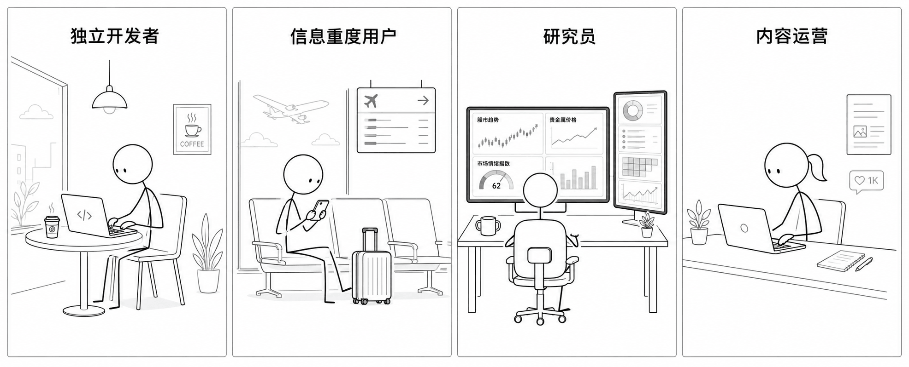
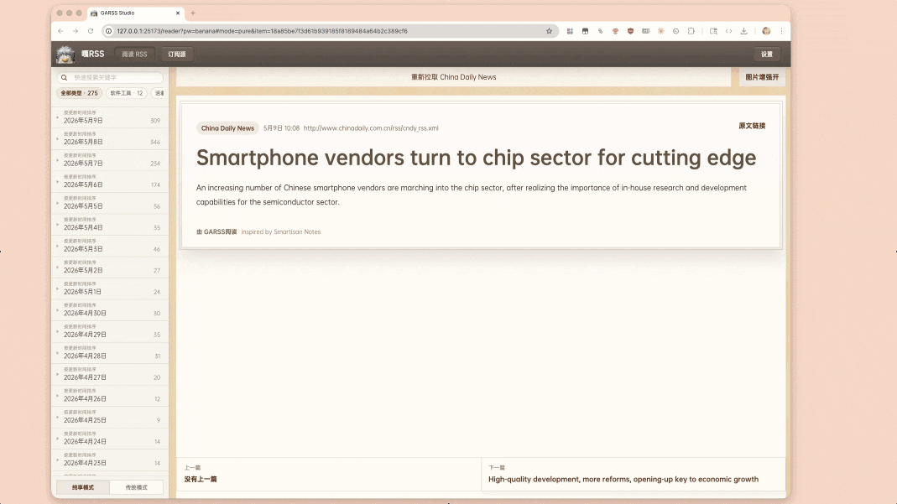
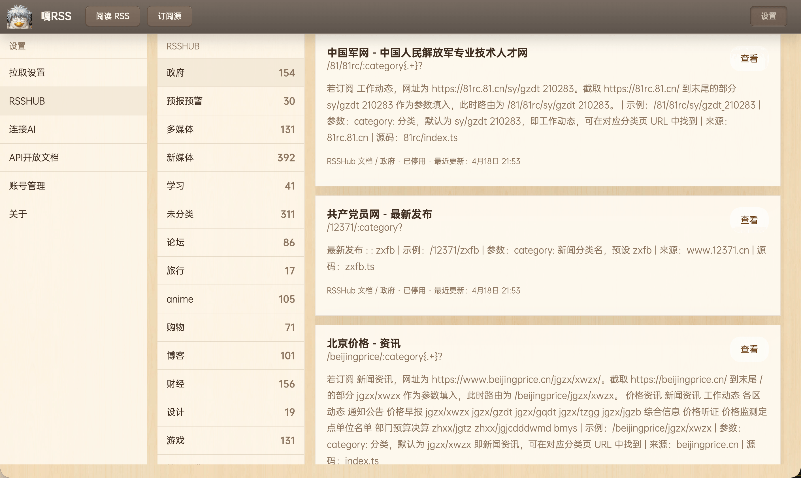
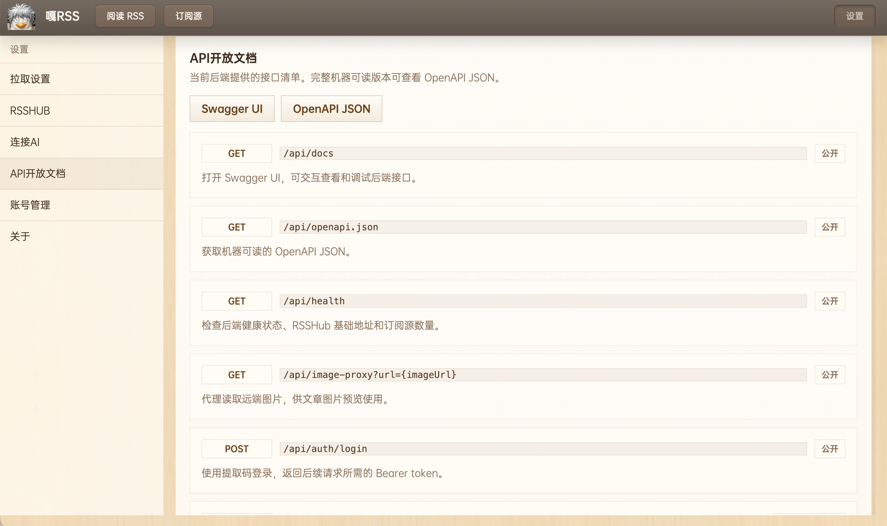
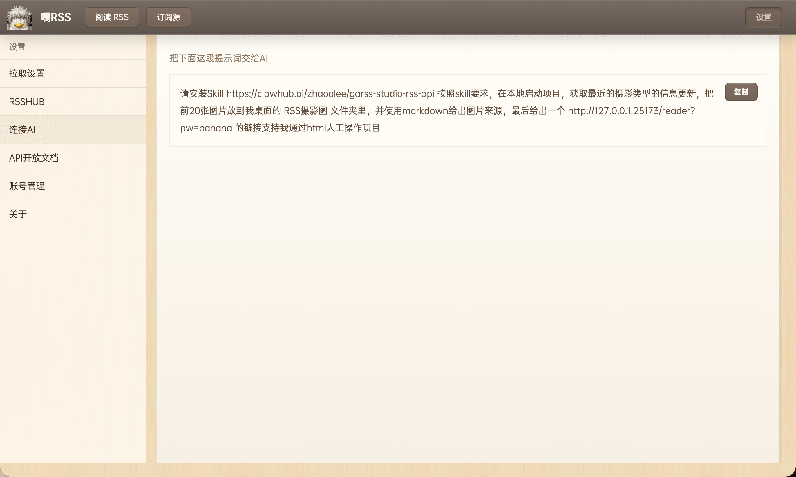

# Github Actions Rss (garss, 嘎RSS! 已收集281个RSS源, 生成时间: 2026-05-13 16:32:09)

信息茧房是指人们关注的信息领域会习惯性地被自己的兴趣所引导，从而将自己的生活桎梏于像蚕茧一般的「茧房」中的现象。

## 《嘎!RSS》🐣为打破信息茧房而生


这个名为**嘎!RSS**的项目会利用免费的Github Actions服务, 提供一个内容全面的信息流, 让现代人的知识体系更广泛, 减弱信息茧房对现代人的影响, 让**非茧房信息流**造福人类~
[《嘎!RSS》永久开源页面: https://github.com/zhaoolee/garss](https://github.com/zhaoolee/garss)

## 适合谁



## 项目优势

| 项目  | garss |  新闻APP  |  商业化RSS工具 |
| --- | --- | --- | --- |
| 不上传浏览记录  |   ✅  |  ❌  |  ✅  |
| 信息茧房  |   ❌  |  ✅   |  ✅  |
| 私有化部署  |   ✅  |  ❌  |  ❌   |
| 付费订阅  |   ❌ |  ✅   |  ✅    |
| 开放API  |   ✅  |  ❌   |  ❌    |
| 支持二次开发  |   ✅  |  ❌   |  ❌    |
| 代码开源  |   ✅  |  ❌   |  ❌   |
| 接入 AI Skill | ✅  |  ❌   |  ❌  |
| RSSHub社区支持 | ✅  |  ❌   |  ❌  |
| 广告插入  |   ❌ |  ✅   |  ✅    |
| URL看图增强 | ✅  |  ✅（需安装插件）   |  ❌  |
| 突破IP限制 | ✅  |  ❌  |  ❌  |
| Github Action抓取 | ✅  |  ❌  |  ❌  |

## 锤子便签风格的GARSS阅读器

- 启动

```
cd garss-studio
cp .env.example .env
docker compose -f docker-compose.dev.yml up --build
```


- 简单快速的分类阅读交互



- 锤子便签风格的阅读体验


- 简单的订阅管理


- 集成RSSHUB




- 完善的二开文档



- AI SKILL支持




- 自动拉取，保证新闻时效


- 常用页面

```
阅读页：http://127.0.0.1:25173/reader?pw=banana
订阅源：http://127.0.0.1:25173/sources?pw=banana
设置页：http://127.0.0.1:25173/settings?pw=banana
API 文档：http://127.0.0.1:25173/api/docs
```

CLAWHUB的SKILL调用GARSS后端：https://clawhub.ai/zhaoolee/garss-studio-rss-api

## 推荐使用什么软件订阅RSS？
我推荐一款免费的浏览器扩展程序Feedbro ，使用教程[Chrome插件英雄榜第96期《Feedbro》在Chrome中订阅RSS信息流](https://www.v2fy.com/p/096-feedbro-2021-02-27/)

## 主要功能
1. 收集RSS, 打造无广告内容优质的 **头版头条** 超赞新闻页
2. 利用Github Actions, 搜集全部RSS的头版头条新闻标题和超链接, 并自动更新到首页,当天最新发布的文章会出现🌈 标志

## 今日值得看 🕶️

邮件内容区开始>
<h2>新蒸熟405个小蛋糕🍰(文章) 生产时间 2026-05-13 16:32:09 保质期24小时</h2>

<div style='line-height:3;background-color:#FAF6EA;' ><a href='https://www.appinn.com/baolu-browser/' style="line-height:2;text-decoration:none;display:block;color:#584D49;">🌈 ‣ 坦白了：一个普通网页，到底能知道你多少信息？ | 第1篇</a></div><div style='line-height:3;' ><a href='https://www.appinn.com/doubao-shurufa-macos/' style="line-height:2;text-decoration:none;display:block;color:#584D49;">🌈 ‣ 豆包输入法 Mac 版正式上线｜语音输入法、拼音、双拼 | 第2篇</a></div><div style='line-height:3;background-color:#FAF6EA;' ><a href='https://free.apprcn.com/limited-time-get-alexia-bright-for-free/' style="line-height:2;text-decoration:none;display:block;color:#584D49;">🌈 ‣ 限时免费获取字体 Alexia Bright[Windows、macOS][$14→0] | 第3篇</a></div><div style='line-height:3;' ><a href='https://www.laozuo.org/32973.html' style="line-height:2;text-decoration:none;display:block;color:#584D49;">🌈 ‣ LOCVPS 秒杀促销日本BGP - 2核4G/40G SSD/450Mbps@1T流量 年付360元 | 第4篇</a></div><div style='line-height:3;background-color:#FAF6EA;' ><a href='https://www.xiabingbao.com/talk/t/mp3rv5rx.html' style="line-height:2;text-decoration:none;display:block;color:#584D49;">🌈 ‣ 微说 | 有个前端前来要接口（买瓜） | 第5篇</a></div><div style='line-height:3;' ><a href='https://www.xiabingbao.com/post/electron-webview-open-teynx4.html' style="line-height:2;text-decoration:none;display:block;color:#584D49;">🌈 ‣ Electron 中使用 webview 中打开外部链接跳转问题 | 第6篇</a></div><div style='line-height:3;background-color:#FAF6EA;' ><a href='https://limboy.me/posts/why-write-weekly' style="line-height:2;text-decoration:none;display:block;color:#584D49;">🌈 ‣ 为什么要写周记 | 第7篇</a></div><div style='line-height:3;' ><a href='https://blog.est.im/2026/stderr-16' style="line-height:2;text-decoration:none;display:block;color:#584D49;">🌈 ‣ 唐宋之变 | 第8篇</a></div><div style='line-height:3;background-color:#FAF6EA;' ><a href='https://lukefan.com/2026/05/13/jensen-huang-ai-speech-survivor-bias/' style="line-height:2;text-decoration:none;display:block;color:#584D49;">🌈 ‣ 黄仁勋CMU演讲：这碗AI 毒鸡汤藏了什么？ | 第9篇</a></div><div style='line-height:3;' ><a href='https://www.wikimoe.com/post/b-teto449f' style="line-height:2;text-decoration:none;display:block;color:#584D49;">🌈 ‣ 《随兴旅》圣地巡礼之高松玉藻城 | 第10篇</a></div><div style='line-height:3;background-color:#FAF6EA;' ><a href='https://sspai.com/post/108228' style="line-height:2;text-decoration:none;display:block;color:#584D49;">🌈 ‣ 佳明本能 Instinct 3 太阳能版评测：我的智能手表终章 | 第11篇</a></div><div style='line-height:3;' ><a href='https://sspai.com/post/109699' style="line-height:2;text-decoration:none;display:block;color:#584D49;">🌈 ‣ Google 提前给 Android 办了场发布会，但主角依然不是 Android | 第12篇</a></div><div style='line-height:3;background-color:#FAF6EA;' ><a href='https://36kr.com/p/3807382930251523?f=rss' style="line-height:2;text-decoration:none;display:block;color:#584D49;">🌈 ‣ 林俊旸创业，新公司估值约20亿美金丨智能涌现独家 | 第13篇</a></div><div style='line-height:3;' ><a href='https://36kr.com/p/3807234971131656?f=rss' style="line-height:2;text-decoration:none;display:block;color:#584D49;">🌈 ‣ 6月上海，这场论坛聊透出海真问题 | 第14篇</a></div><div style='line-height:3;background-color:#FAF6EA;' ><a href='https://36kr.com/p/3806507139390984?f=rss' style="line-height:2;text-decoration:none;display:block;color:#584D49;">🌈 ‣ 36氪专访 | 安克创新eufyMake负责人：众筹超4000万美金后，还在红海寻找缝隙 | 第15篇</a></div><div style='line-height:3;' ><a href='https://36kr.com/p/3807043342475009?f=rss' style="line-height:2;text-decoration:none;display:block;color:#584D49;">🌈 ‣ 36氪首发 | 清华系光计算芯片企业完成数千万天使轮融资，瞄准全波光计算架构 | 第16篇</a></div><div style='line-height:3;background-color:#FAF6EA;' ><a href='https://36kr.com/p/3807039782116865?f=rss' style="line-height:2;text-decoration:none;display:block;color:#584D49;">🌈 ‣ 深耕“具身智能+建筑大模型”底座，重构万亿建筑业，「方石机器人」完成近亿元A轮融资 | 36氪首发 | 第17篇</a></div><div style='line-height:3;' ><a href='https://36kr.com/p/3806970999955201?f=rss' style="line-height:2;text-decoration:none;display:block;color:#584D49;">🌈 ‣ 8点1氪丨宇树发布载人变形机甲，定价390万起；微信确认不会开发已读、访客功能；国内航线燃油附加费将再上调 | 第18篇</a></div><div style='line-height:3;background-color:#FAF6EA;' ><a href='https://36kr.com/newsflashes/3807464005656325?f=rss' style="line-height:2;text-decoration:none;display:block;color:#584D49;">🌈 ‣ 腾讯发布2026年第一季度财报 | 第19篇</a></div><div style='line-height:3;' ><a href='https://36kr.com/newsflashes/3807457875074560?f=rss' style="line-height:2;text-decoration:none;display:block;color:#584D49;">🌈 ‣ 日本三井住友金融集团第四财季净利润大增350%，全年业绩创历史新高 | 第20篇</a></div><div style='line-height:3;background-color:#FAF6EA;' ><a href='https://36kr.com/newsflashes/3807444281089540?f=rss' style="line-height:2;text-decoration:none;display:block;color:#584D49;">🌈 ‣ 中国中车集团增资至约245.1亿 | 第21篇</a></div><div style='line-height:3;' ><a href='https://36kr.com/newsflashes/3807450915069700?f=rss' style="line-height:2;text-decoration:none;display:block;color:#584D49;">🌈 ‣ 腾讯刘炽平：腾讯没有大裁员计划 | 第22篇</a></div><div style='line-height:3;background-color:#FAF6EA;' ><a href='https://36kr.com/newsflashes/3807445387697929?f=rss' style="line-height:2;text-decoration:none;display:block;color:#584D49;">🌈 ‣ 沙利文：百度一镜拿下数字人市场份额、产品实力双第一 | 第23篇</a></div><div style='line-height:3;' ><a href='https://36kr.com/newsflashes/3807442490203649?f=rss' style="line-height:2;text-decoration:none;display:block;color:#584D49;">🌈 ‣ 恒指收涨0.15%，恒生科技指数涨0.46% | 第24篇</a></div><div style='line-height:3;background-color:#FAF6EA;' ><a href='https://36kr.com/newsflashes/3807434457423366?f=rss' style="line-height:2;text-decoration:none;display:block;color:#584D49;">🌈 ‣ 中美在韩国举行经贸磋商 | 第25篇</a></div><div style='line-height:3;' ><a href='https://36kr.com/newsflashes/3807429943401984?f=rss' style="line-height:2;text-decoration:none;display:block;color:#584D49;">🌈 ‣ 西门子启动70亿美元新一轮股票回购计划 | 第26篇</a></div><div style='line-height:3;background-color:#FAF6EA;' ><a href='https://36kr.com/newsflashes/3807426511691527?f=rss' style="line-height:2;text-decoration:none;display:block;color:#584D49;">🌈 ‣ 泡泡玛特在天津成立新商贸公司，注册资本100万 | 第27篇</a></div><div style='line-height:3;' ><a href='https://36kr.com/newsflashes/3807421574897159?f=rss' style="line-height:2;text-decoration:none;display:block;color:#584D49;">🌈 ‣ 泰国财长称未来一到两年经济增长有望超过3% | 第28篇</a></div><div style='line-height:3;background-color:#FAF6EA;' ><a href='https://36kr.com/newsflashes/3807419589222146?f=rss' style="line-height:2;text-decoration:none;display:block;color:#584D49;">🌈 ‣ 机器人公司岚江科技扩建8000平米生产基地，整体产能翻倍 | 第29篇</a></div><div style='line-height:3;' ><a href='https://36kr.com/newsflashes/3807387184439043?f=rss' style="line-height:2;text-decoration:none;display:block;color:#584D49;">🌈 ‣ 西贝在北京成立新餐饮文化公司 | 第30篇</a></div><div style='line-height:3;background-color:#FAF6EA;' ><a href='https://36kr.com/newsflashes/3807405093281287?f=rss' style="line-height:2;text-decoration:none;display:block;color:#584D49;">🌈 ‣ 软银因所持OpenAI股权增值，入账利润达120亿美元 | 第31篇</a></div><div style='line-height:3;' ><a href='https://36kr.com/newsflashes/3807399738613249?f=rss' style="line-height:2;text-decoration:none;display:block;color:#584D49;">🌈 ‣ 中科曙光发布高端全闪存存储 | 第32篇</a></div><div style='line-height:3;background-color:#FAF6EA;' ><a href='https://36kr.com/newsflashes/3807398622830345?f=rss' style="line-height:2;text-decoration:none;display:block;color:#584D49;">🌈 ‣ 林俊旸创业，新公司估值约20亿美金 | 第33篇</a></div><div style='line-height:3;' ><a href='https://36kr.com/newsflashes/3807385710845697?f=rss' style="line-height:2;text-decoration:none;display:block;color:#584D49;">🌈 ‣ 邯郸市共享智造股权投资基金登记成立，出资额10亿 | 第34篇</a></div><div style='line-height:3;background-color:#FAF6EA;' ><a href='https://36kr.com/newsflashes/3807381350948608?f=rss' style="line-height:2;text-decoration:none;display:block;color:#584D49;">🌈 ‣ 韩国政府称将支持三星与工会对话解决纠纷，以避免罢工 | 第35篇</a></div><div style='line-height:3;' ><a href='https://36kr.com/newsflashes/3807355949801218?f=rss' style="line-height:2;text-decoration:none;display:block;color:#584D49;">🌈 ‣ 香港快运将于5月16日起削减部分航班燃油附加费 | 第36篇</a></div><div style='line-height:3;background-color:#FAF6EA;' ><a href='https://36kr.com/newsflashes/3807375173131783?f=rss' style="line-height:2;text-decoration:none;display:block;color:#584D49;">🌈 ‣ A股三大指数集体收涨，创业板指刷新历史新高 | 第37篇</a></div><div style='line-height:3;' ><a href='http://www.geekpark.net/news/364100' style="line-height:2;text-decoration:none;display:block;color:#584D49;">🌈 ‣ Auto Research 来了：当 AI 开始接管科研里最苦的活，意味着什么 | 第38篇</a></div><div style='line-height:3;background-color:#FAF6EA;' ><a href='http://www.geekpark.net/news/364099' style="line-height:2;text-decoration:none;display:block;color:#584D49;">🌈 ‣ 免费 1500 次背后，商汤在下一盘什么棋 | 第39篇</a></div><div style='line-height:3;' ><a href='http://www.geekpark.net/news/364101' style="line-height:2;text-decoration:none;display:block;color:#584D49;">🌈 ‣ AI 为什么一定会成为这代人的全新购物入口 | 第40篇</a></div><div style='line-height:3;background-color:#FAF6EA;' ><a href='http://www.geekpark.net/news/364062' style="line-height:2;text-decoration:none;display:block;color:#584D49;">🌈 ‣ 谷歌在安卓上全面强化 Gemini AI；宇树发布全球首款载人机甲，售价 390 万元；追觅高管回应「崩老头」 | 第41篇</a></div><div style='line-height:3;' ><a href='https://www.baijing.cn/article/55293' style="line-height:2;text-decoration:none;display:block;color:#584D49;">🌈 ‣ 效率翻倍、重塑开放世界，索尼第一方的AI大招终于亮了 | 第42篇</a></div><div style='line-height:3;background-color:#FAF6EA;' ><a href='https://www.baijing.cn/article/55292' style="line-height:2;text-decoration:none;display:block;color:#584D49;">🌈 ‣ 育碧的大作悄悄上线：首月流水1916万？ | 第43篇</a></div><div style='line-height:3;' ><a href='https://www.baijing.cn/article/55291' style="line-height:2;text-decoration:none;display:block;color:#584D49;">🌈 ‣ “返现”强制报名？Shopee菲律宾扣点再加1.5% | 第44篇</a></div><div style='line-height:3;background-color:#FAF6EA;' ><a href='https://www.baijing.cn/article/55290' style="line-height:2;text-decoration:none;display:block;color:#584D49;">🌈 ‣ Taboola最新研究：76%广告主借助代理式AI实现投放增效，86%有意愿将高达四分之一预算投入开放网络 | 第45篇</a></div><div style='line-height:3;' ><a href='https://www.baijing.cn/article/55289' style="line-height:2;text-decoration:none;display:block;color:#584D49;">🌈 ‣ eBay发布德国站春夏消费洞察，世界杯、《星球大战》等热点引爆三大品类热销 | 第46篇</a></div><div style='line-height:3;background-color:#FAF6EA;' ><a href='https://www.baijing.cn/article/55288' style="line-height:2;text-decoration:none;display:block;color:#584D49;">🌈 ‣ 拼多多主站要重仓东南亚了么？ | 第47篇</a></div><div style='line-height:3;' ><a href='https://www.baijing.cn/article/55287' style="line-height:2;text-decoration:none;display:block;color:#584D49;">🌈 ‣ 独立，转型，这家被称为韩国米哈游的公司全面转向自主发行 | 第48篇</a></div><div style='line-height:3;background-color:#FAF6EA;' ><a href='https://www.baijing.cn/article/55286' style="line-height:2;text-decoration:none;display:block;color:#584D49;">🌈 ‣ 泉州卖家靠一件泳装罩衫，在TikTok美区进账上千万 | 第49篇</a></div><div style='line-height:3;' ><a href='https://www.baijing.cn/article/55285' style="line-height:2;text-decoration:none;display:block;color:#584D49;">🌈 ‣ 卢拉宣布取消这项关税，巴西跨境电商迎来重大利好 | 第50篇</a></div><div style='line-height:3;background-color:#FAF6EA;' ><a href='https://www.ainvest.com/news/renova-shares-overvalued-33x-13-results-growth-story-faces-reality-check-2605/' style="line-height:2;text-decoration:none;display:block;color:#584D49;">🌈 ‣ Renova Shares Overvalued at 33x P/E Ahead of May 13 Results as Growth Story Faces Reality Check | 第51篇</a></div><div style='line-height:3;' ><a href='https://www.ainvest.com/news/nvidia-china-delegation-invite-30b-flow-catalyst-2605/' style="line-height:2;text-decoration:none;display:block;color:#584D49;">🌈 ‣ Nvidia's China Delegation Invite: A $30B Flow Catalyst? | 第52篇</a></div><div style='line-height:3;background-color:#FAF6EA;' ><a href='https://www.ainvest.com/news/neotech-metals-hecla-kilmer-update-surface-expansion-strengthens-2026-resource-timeline-2605/' style="line-height:2;text-decoration:none;display:block;color:#584D49;">🌈 ‣ Neotech Metals' Hecla-Kilmer Update: Near-Surface Expansion Strengthens 2026 Resource Timeline | 第53篇</a></div><div style='line-height:3;' ><a href='https://www.ainvest.com/news/ccg-stock-fades-fakeout-rally-lacked-conviction-2605/' style="line-height:2;text-decoration:none;display:block;color:#584D49;">🌈 ‣ CCG Stock Fades After Fakeout: Why the Rally Lacked Conviction | 第54篇</a></div><div style='line-height:3;background-color:#FAF6EA;' ><a href='https://www.ainvest.com/news/basis-pro-launch-high-speed-arbitrage-play-latency-race-2605/' style="line-height:2;text-decoration:none;display:block;color:#584D49;">🌈 ‣ BASIS.pro Launch: A High-Speed Arbitrage Play or Just Another Latency Race? | 第55篇</a></div><div style='line-height:3;' ><a href='https://www.ainvest.com/news/dimensional-1-stake-advanced-medical-solutions-institutional-flow-signals-2605/' style="line-height:2;text-decoration:none;display:block;color:#584D49;">🌈 ‣ Dimensional's 1% Stake in Advanced Medical Solutions: What the Institutional Flow Signals | 第56篇</a></div><div style='line-height:3;background-color:#FAF6EA;' ><a href='https://www.ainvest.com/news/lgvn-pre-market-surge-lacks-volume-raising-fragility-fears-2605/' style="line-height:2;text-decoration:none;display:block;color:#584D49;">🌈 ‣ LGVN’s Pre-Market Surge Lacks Volume, Raising Fragility Fears | 第57篇</a></div><div style='line-height:3;' ><a href='https://www.ainvest.com/news/mara-plunges-4-4-1-1b-bitcoin-sale-heavy-volume-2605/' style="line-height:2;text-decoration:none;display:block;color:#584D49;">🌈 ‣ MARA Plunges 4.4% on $1.1B Bitcoin Sale, Heavy Volume | 第58篇</a></div><div style='line-height:3;background-color:#FAF6EA;' ><a href='https://www.ainvest.com/news/cme-compute-futures-put-ai-cloud-margins-risk-clock-2605/' style="line-height:2;text-decoration:none;display:block;color:#584D49;">🌈 ‣ CME's Compute Futures Put AI Cloud Margins on a Risk Clock | 第59篇</a></div><div style='line-height:3;' ><a href='https://www.ainvest.com/news/semiconductor-wash-catch-storage-dip-2605/' style="line-height:2;text-decoration:none;display:block;color:#584D49;">🌈 ‣ The Semiconductor Wash-out: Should You Catch the Storage Dip? | 第60篇</a></div><div style='line-height:3;background-color:#FAF6EA;' ><a href='https://www.ainvest.com/news/renova-shares-overvalued-33x-13-results-growth-story-faces-reality-check-2605/' style="line-height:2;text-decoration:none;display:block;color:#584D49;">🌈 ‣ Renova Shares Overvalued at 33x P/E Ahead of May 13 Results as Growth Story Faces Reality Check | 第61篇</a></div><div style='line-height:3;' ><a href='https://www.ainvest.com/news/nvidia-china-delegation-invite-30b-flow-catalyst-2605/' style="line-height:2;text-decoration:none;display:block;color:#584D49;">🌈 ‣ Nvidia's China Delegation Invite: A $30B Flow Catalyst? | 第62篇</a></div><div style='line-height:3;background-color:#FAF6EA;' ><a href='https://www.ainvest.com/news/neotech-metals-hecla-kilmer-update-surface-expansion-strengthens-2026-resource-timeline-2605/' style="line-height:2;text-decoration:none;display:block;color:#584D49;">🌈 ‣ Neotech Metals' Hecla-Kilmer Update: Near-Surface Expansion Strengthens 2026 Resource Timeline | 第63篇</a></div><div style='line-height:3;' ><a href='https://www.ainvest.com/news/ccg-stock-fades-fakeout-rally-lacked-conviction-2605/' style="line-height:2;text-decoration:none;display:block;color:#584D49;">🌈 ‣ CCG Stock Fades After Fakeout: Why the Rally Lacked Conviction | 第64篇</a></div><div style='line-height:3;background-color:#FAF6EA;' ><a href='https://www.ainvest.com/news/basis-pro-launch-high-speed-arbitrage-play-latency-race-2605/' style="line-height:2;text-decoration:none;display:block;color:#584D49;">🌈 ‣ BASIS.pro Launch: A High-Speed Arbitrage Play or Just Another Latency Race? | 第65篇</a></div><div style='line-height:3;' ><a href='https://www.ainvest.com/news/dimensional-1-stake-advanced-medical-solutions-institutional-flow-signals-2605/' style="line-height:2;text-decoration:none;display:block;color:#584D49;">🌈 ‣ Dimensional's 1% Stake in Advanced Medical Solutions: What the Institutional Flow Signals | 第66篇</a></div><div style='line-height:3;background-color:#FAF6EA;' ><a href='https://www.ainvest.com/news/lgvn-pre-market-surge-lacks-volume-raising-fragility-fears-2605/' style="line-height:2;text-decoration:none;display:block;color:#584D49;">🌈 ‣ LGVN’s Pre-Market Surge Lacks Volume, Raising Fragility Fears | 第67篇</a></div><div style='line-height:3;' ><a href='https://www.ainvest.com/news/mara-plunges-4-4-1-1b-bitcoin-sale-heavy-volume-2605/' style="line-height:2;text-decoration:none;display:block;color:#584D49;">🌈 ‣ MARA Plunges 4.4% on $1.1B Bitcoin Sale, Heavy Volume | 第68篇</a></div><div style='line-height:3;background-color:#FAF6EA;' ><a href='https://www.ainvest.com/news/legend-shutdown-60-day-flow-signal-defi-idle-capital-crisis-2605/' style="line-height:2;text-decoration:none;display:block;color:#584D49;">🌈 ‣ Legend's Shutdown: A 60-Day Flow Signal for DeFi's Idle Capital Crisis | 第69篇</a></div><div style='line-height:3;' ><a href='https://www.ainvest.com/news/jpmorgan-jltxx-32b-tokenized-liquidity-bet-2605/' style="line-height:2;text-decoration:none;display:block;color:#584D49;">🌈 ‣ JPMorgan's JLTXX: A $32B Tokenized Liquidity Bet | 第70篇</a></div><div style='line-height:3;background-color:#FAF6EA;' ><a href='https://www.ainvest.com/news/asia-245b-stablecoin-engine-usdt-settlement-bottleneck-2605/' style="line-height:2;text-decoration:none;display:block;color:#584D49;">🌈 ‣ Asia's $245B Stablecoin Engine: The USDT Settlement Bottleneck | 第71篇</a></div><div style='line-height:3;' ><a href='https://www.ainvest.com/news/snc-scandic-coin-tokenomics-flow-reality-check-2605/' style="line-height:2;text-decoration:none;display:block;color:#584D49;">🌈 ‣ SNC Scandic Coin: Tokenomics and Flow Reality Check | 第72篇</a></div><div style='line-height:3;background-color:#FAF6EA;' ><a href='https://www.ainvest.com/news/warsh-confirmed-crypto-flow-catalysts-rate-policy-ambiguity-2605/' style="line-height:2;text-decoration:none;display:block;color:#584D49;">🌈 ‣ Warsh Confirmed: Crypto Flow Catalysts and Rate Policy Ambiguity | 第73篇</a></div><div style='line-height:3;' ><a href='https://www.ainvest.com/news/jpmorgan-jltxx-flow-based-genius-act-treasury-demand-2605/' style="line-height:2;text-decoration:none;display:block;color:#584D49;">🌈 ‣ JPMorgan's JLTXX: A Flow-Based Look at the GENIUS Act's New Treasury Demand | 第74篇</a></div><div style='line-height:3;background-color:#FAF6EA;' ><a href='https://www.ainvest.com/news/video-trump-faces-emboldened-xi-war-clips-leverage-horizons-middle-east-africa-5-13-2026-2605/' style="line-height:2;text-decoration:none;display:block;color:#584D49;">🌈 ‣ Trump Faces Emboldened Xi as War Clips US Leverage | Horizons Middle East & Africa 5/13/2026 | 第75篇</a></div><div style='line-height:3;' ><a href='https://www.ainvest.com/news/video-trump-xi-summit-nvidia-ceo-joins-air-force-china-daybreak-europe-5-13-2026-2605/' style="line-height:2;text-decoration:none;display:block;color:#584D49;">🌈 ‣ Trump-Xi Summit: Nvidia CEO Joins Air Force One to China | Daybreak Europe 5/13/2026 | 第76篇</a></div><div style='line-height:3;background-color:#FAF6EA;' ><a href='https://www.ainvest.com/news/crypto-uae-svf-license-flow-catalyst-cro-2605/' style="line-height:2;text-decoration:none;display:block;color:#584D49;">🌈 ‣ Crypto.com's UAE SVF License: A Flow Catalyst for CRO? | 第77篇</a></div><div style='line-height:3;' ><a href='https://www.ainvest.com/news/xencor-bofa-healthcare-conference-pipeline-catalyst-overpriced-hope-2605/' style="line-height:2;text-decoration:none;display:block;color:#584D49;">🌈 ‣ Xencor at BofA Healthcare Conference: Pipeline Catalyst or Overpriced Hope? | 第78篇</a></div><div style='line-height:3;background-color:#FAF6EA;' ><a href='https://www.ainvest.com/news/xrp-dot-tao-today-price-flow-key-levels-2605/' style="line-height:2;text-decoration:none;display:block;color:#584D49;">🌈 ‣ XRP, DOT, TAO: Today's Price Flow and Key Levels | 第79篇</a></div><div style='line-height:3;' ><a href='https://www.ainvest.com/news/stablecoin-flow-record-321b-cap-driving-liquidity-2605/' style="line-height:2;text-decoration:none;display:block;color:#584D49;">🌈 ‣ Stablecoin Flow: Record $321B Cap, But What's Driving the Liquidity? | 第80篇</a></div><div style='line-height:3;background-color:#FAF6EA;' ><a href='https://www.ainvest.com/news/video-assertive-china-awaits-leverage-trump-insight-haslinda-amin-05-13-2026-2605/' style="line-height:2;text-decoration:none;display:block;color:#584D49;">🌈 ‣ A More Assertive China Awaits a Leverage-Less Trump | Insight with Haslinda Amin 05/13/2026 | 第81篇</a></div><div style='line-height:3;' ><a href='https://www.ainvest.com/news/video-xrp-repricing-202-popular-analyst-claims-report-2605/' style="line-height:2;text-decoration:none;display:block;color:#584D49;">🌈 ‣ XRP Repricing To $202, Popular Analyst Claims -Report | 第82篇</a></div><div style='line-height:3;background-color:#FAF6EA;' ><a href='https://www.ainvest.com/news/video-markets-edge-trump-xi-talks-loom-asia-trade-5-13-2026-2605/' style="line-height:2;text-decoration:none;display:block;color:#584D49;">🌈 ‣ Markets on Edge as Trump-Xi Talks Loom | The Asia Trade 5/13/2026 | 第83篇</a></div><div style='line-height:3;' ><a href='https://www.ainvest.com/news/video-nvidia-jensen-huang-joins-trump-china-trip-china-show-5-13-2026-2605/' style="line-height:2;text-decoration:none;display:block;color:#584D49;">🌈 ‣ Nvidia's Jensen Huang Joins Trump's China Trip | The China Show 5/13/2026 | 第84篇</a></div><div style='line-height:3;background-color:#FAF6EA;' ><a href='https://www.ainvest.com/news/video-xrp-amazon-2009-202-target-2605/' style="line-height:2;text-decoration:none;display:block;color:#584D49;">🌈 ‣ 🚨 XRP Is About To Do EXACTLY What Amazon Did In 2009 ($202 Target) | 第85篇</a></div><div style='line-height:3;' ><a href='https://www.ainvest.com/news/video-ripple-xrp-rigged-eric-trump-confirms-300k-btc-sealed-2605/' style="line-height:2;text-decoration:none;display:block;color:#584D49;">🌈 ‣ Ripple XRP IT'S ALL RIGGED: Eric Trump CONFIRMS 300K BTC Sealed... THIS HAPPENS NEXT! | 第86篇</a></div><div style='line-height:3;background-color:#FAF6EA;' ><a href='https://www.ainvest.com/news/video-china-dominates-offshore-wind-global-tensions-rise-2605/' style="line-height:2;text-decoration:none;display:block;color:#584D49;">🌈 ‣ China Dominates Offshore Wind as Global Tensions Rise | 第87篇</a></div><div style='line-height:3;' ><a href='https://www.ainvest.com/news/cme-compute-futures-put-ai-cloud-margins-risk-clock-2605/' style="line-height:2;text-decoration:none;display:block;color:#584D49;">🌈 ‣ CME's Compute Futures Put AI Cloud Margins on a Risk Clock | 第88篇</a></div><div style='line-height:3;background-color:#FAF6EA;' ><a href='https://www.ainvest.com/news/semiconductor-wash-catch-storage-dip-2605/' style="line-height:2;text-decoration:none;display:block;color:#584D49;">🌈 ‣ The Semiconductor Wash-out: Should You Catch the Storage Dip? | 第89篇</a></div><div style='line-height:3;' ><a href='https://www.ainvest.com/news/beat-navigating-gap-earnings-valuation-2605/' style="line-height:2;text-decoration:none;display:block;color:#584D49;">🌈 ‣ Beyond the Beat: Navigating the Gap Between Earnings and Valuation | 第90篇</a></div><div style='line-height:3;background-color:#FAF6EA;' ><a href='https://www.ainvest.com/news/hype-evaluating-growth-sustainability-medical-device-stocks-2605/' style="line-height:2;text-decoration:none;display:block;color:#584D49;">🌈 ‣ Beyond the Hype: Evaluating Growth Sustainability in Medical Device Stocks | 第91篇</a></div><div style='line-height:3;' ><a href='https://www.ainvest.com/news/video-trump-en-route-beijing-highly-anticipated-summit-balance-power-05-12-2026-2605/' style="line-height:2;text-decoration:none;display:block;color:#584D49;">🌈 ‣ Trump En Route to Beijing For Highly-Anticipated Summit | Balance of Power 05/12/2026 | 第92篇</a></div><div style='line-height:3;background-color:#FAF6EA;' ><a href='https://www.ainvest.com/news/evaluate-small-cap-exploration-stocks-strategic-pivots-capital-efficiency-2605/' style="line-height:2;text-decoration:none;display:block;color:#584D49;">🌈 ‣ How to Evaluate Small-Cap Exploration Stocks: Strategic Pivots and Capital Efficiency | 第93篇</a></div><div style='line-height:3;' ><a href='https://www.ainvest.com/news/lng-export-volumes-identify-infrastructure-opportunities-2605/' style="line-height:2;text-decoration:none;display:block;color:#584D49;">🌈 ‣ Using LNG Export Volumes to Identify Infrastructure Opportunities | 第94篇</a></div><div style='line-height:3;background-color:#FAF6EA;' ><a href='https://database.caixin.com/2026-05-13/102443570.html' style="line-height:2;text-decoration:none;display:block;color:#584D49;">🌈 ‣ 【今日热点】电网设备大幅走高 科技板块仍是盘中热点 | 第95篇</a></div><div style='line-height:3;' ><a href='https://database.caixin.com/2026-05-13/102443525.html' style="line-height:2;text-decoration:none;display:block;color:#584D49;">🌈 ‣ 【市场动态】高盛预计美元或进一步走强 能源冲击料将收益率维持在高位 | 第96篇</a></div><div style='line-height:3;background-color:#FAF6EA;' ><a href='https://database.caixin.com/2026-05-13/102443523.html' style="line-height:2;text-decoration:none;display:block;color:#584D49;">🌈 ‣ 【市场动态】涉邮轮疫情的乘客以多种方式遣返回国 汉坦病毒毒株传播机制仍不明 | 第97篇</a></div><div style='line-height:3;' ><a href='https://database.caixin.com/2026-05-13/102443521.html' style="line-height:2;text-decoration:none;display:block;color:#584D49;">🌈 ‣ 【市场动态】日本一家炼油商采购墨西哥石油 避开霍尔木兹海峡混乱局面 | 第98篇</a></div><div style='line-height:3;background-color:#FAF6EA;' ><a href='https://database.caixin.com/2026-05-13/102443519.html' style="line-height:2;text-decoration:none;display:block;color:#584D49;">🌈 ‣ 【市场动态】英伟达CEO黄仁勋薪酬下滑27% 源于股票奖励缩水 | 第99篇</a></div><div style='line-height:3;' ><a href='https://database.caixin.com/2026-05-13/102443504.html' style="line-height:2;text-decoration:none;display:block;color:#584D49;">🌈 ‣ 【市场动态】21世纪“新石油”需求旺盛 美国芝商所拟打造人工智能算力期货市场 | 第100篇</a></div><div style='line-height:3;background-color:#FAF6EA;' ><a href='https://database.caixin.com/2026-05-13/102443503.html' style="line-height:2;text-decoration:none;display:block;color:#584D49;">🌈 ‣ 【市场动态】美国上诉法院下令暂缓执行判定特朗普10%关税违法的裁决 | 第101篇</a></div><div style='line-height:3;' ><a href='https://database.caixin.com/2026-05-13/102443499.html' style="line-height:2;text-decoration:none;display:block;color:#584D49;">🌈 ‣ 【市场动态】Anthropic洽谈融资300亿美元 估值超9000亿美元 | 第102篇</a></div><div style='line-height:3;background-color:#FAF6EA;' ><a href='https://database.caixin.com/2026-05-13/102443498.html' style="line-height:2;text-decoration:none;display:block;color:#584D49;">🌈 ‣ 【市场动态】谷歌据悉与SpaceX洽谈发射在轨数据中心 | 第103篇</a></div><div style='line-height:3;' ><a href='https://www.caixin.com/2026-05-13/102443565.html' style="line-height:2;text-decoration:none;display:block;color:#584D49;">🌈 ‣ 国内航线燃油附加费再上调 5月16日起再涨30—50元 | 第104篇</a></div><div style='line-height:3;background-color:#FAF6EA;' ><a href='https://opinion.caixin.com/2026-05-12/102443335.html' style="line-height:2;text-decoration:none;display:block;color:#584D49;">🌈 ‣ 火线评论｜时隔九年再访华，特朗普与中美关系之变(含视频) | 第105篇</a></div><div style='line-height:3;' ><a href='https://wenews.caixin.com/2026-05-12/102443449.html' style="line-height:2;text-decoration:none;display:block;color:#584D49;">🌈 ‣ 【我闻】意大利调查多个“温州帮”地下钱庄 侨领竟成洗钱头目？ | 第106篇</a></div><div style='line-height:3;background-color:#FAF6EA;' ><a href='https://opinion.caixin.com/2026-05-13/102443595.html' style="line-height:2;text-decoration:none;display:block;color:#584D49;">🌈 ‣ 聚焦｜以AI对抗AI：我们需要怎样的知识 | 第107篇</a></div><div style='line-height:3;' ><a href='https://www.caixin.com/2026-05-12/102443441.html' style="line-height:2;text-decoration:none;display:block;color:#584D49;">🌈 ‣ 营收被Anthropic全面反超 OpenAI联合19家机构发力AI企业级业务 | 第108篇</a></div><div style='line-height:3;background-color:#FAF6EA;' ><a href='https://weekly.caixin.com/2026-05-09/102442266.html' style="line-height:2;text-decoration:none;display:block;color:#584D49;">🌈 ‣ 最新封面报道之二｜AI校招扩容 | 第109篇</a></div><div style='line-height:3;' ><a href='https://international.caixin.com/2026-05-12/102443429.html' style="line-height:2;text-decoration:none;display:block;color:#584D49;">🌈 ‣ 美国4月CPI同比上涨3.8% 为近三年新高 | 第110篇</a></div><div style='line-height:3;background-color:#FAF6EA;' ><a href='https://international.caixin.com/2026-05-13/102443619.html' style="line-height:2;text-decoration:none;display:block;color:#584D49;">🌈 ‣ 泰国拟缩短外国旅客免签逗留期限 泰外长称并非针对中国 | 第111篇</a></div><div style='line-height:3;' ><a href='https://opinion.caixin.com/2026-05-13/102443609.html' style="line-height:2;text-decoration:none;display:block;color:#584D49;">🌈 ‣ 消费让位，投资主导：AI时代美国经济的结构转变 | 第112篇</a></div><div style='line-height:3;background-color:#FAF6EA;' ><a href='https://deepview.caixin.com/topic/BQ02.000008013.html' style="line-height:2;text-decoration:none;display:block;color:#584D49;">🌈 ‣ 专题｜全球聚焦中美元首会晤 | 第113篇</a></div><div style='line-height:3;' ><a href='https://mini.caixin.com/2026-05-06/102440864.html' style="line-height:2;text-decoration:none;display:block;color:#584D49;">🌈 ‣ 你是否陷入了“压力-成功”循环？｜我的脑子不转了① | 第114篇</a></div><div style='line-height:3;background-color:#FAF6EA;' ><a href='https://weekly.caixin.com/2026-05-09/102442295.html' style="line-height:2;text-decoration:none;display:block;color:#584D49;">🌈 ‣ 最新财新周刊｜激活住房公积金 | 第115篇</a></div><div style='line-height:3;' ><a href='https://international.caixin.com/2026-05-13/102443481.html' style="line-height:2;text-decoration:none;display:block;color:#584D49;">🌈 ‣ 特朗普访华之行启程 欧美各方有何预期 | 第116篇</a></div><div style='line-height:3;background-color:#FAF6EA;' ><a href='https://database.caixin.com/2026-05-13/102443570.html' style="line-height:2;text-decoration:none;display:block;color:#584D49;">🌈 ‣ 【今日热点】电网设备大幅走高 科技板块仍是盘中热点 | 第117篇</a></div><div style='line-height:3;' ><a href='https://photos.caixin.com/2026-05-13/102443551.html' style="line-height:2;text-decoration:none;display:block;color:#584D49;">🌈 ‣ 特朗普启程访华 系时隔9年美国总统首访 | 第118篇</a></div><div style='line-height:3;background-color:#FAF6EA;' ><a href='https://abmedia.io/citrini-semis-ai-supply-chain-inheritance-sic-gan' style="line-height:2;text-decoration:none;display:block;color:#584D49;">🌈 ‣ 下一波 AI 基建浪潮在哪裡？Citrini 報告揭「SiC、GaN 與電力設施」成新投資方向 | 第119篇</a></div><div style='line-height:3;' ><a href='https://abmedia.io/bingx-launches-eventx-real-world-trading' style="line-height:2;text-decoration:none;display:block;color:#584D49;">🌈 ‣ BingX 推出 EventX，將現實世界事件轉化為可交易資產 | 第120篇</a></div><div style='line-height:3;background-color:#FAF6EA;' ><a href='https://abmedia.io/bitget-subscribe-preopai-token' style="line-height:2;text-decoration:none;display:block;color:#584D49;">🌈 ‣ Bitget IPO Prime 上線 preOPAI 認購：堅持做「正確而困難」的事 | 第121篇</a></div><div style='line-height:3;' ><a href='https://abmedia.io/openai-codex-symphony-computer-use-multi-agent-may-2026' style="line-height:2;text-decoration:none;display:block;color:#584D49;">🌈 ‣ Codex 新增 Symphony 多代理與 Computer Use 跨應用 | 第122篇</a></div><div style='line-height:3;background-color:#FAF6EA;' ><a href='https://abmedia.io/andrew-ng-no-ai-jobpocalypse-jobapalooza-may-2026' style="line-height:2;text-decoration:none;display:block;color:#584D49;">🌈 ‣ Andrew Ng：「AI 不會引發失業大潮」、軟體業徵才仍熱 | 第123篇</a></div><div style='line-height:3;' ><a href='https://abmedia.io/anthropic-claude-legal-disrupt-traditional-services' style="line-height:2;text-decoration:none;display:block;color:#584D49;">🌈 ‣ Anthropic 推出 「Claude for Legal 」，AI 將如何顛覆傳統法律服務？ | 第124篇</a></div><div style='line-height:3;background-color:#FAF6EA;' ><a href='https://abmedia.io/googlebook-gemini-ai' style="line-height:2;text-decoration:none;display:block;color:#584D49;">🌈 ‣ Google 推出首款「AI 筆電」：Googlebook 深度整合 Gemini 成最佳協作夥伴 | 第125篇</a></div><div style='line-height:3;' ><a href='https://abmedia.io/hon-hai-foxconn-cpo-nvidia-early-shipment' style="line-height:2;text-decoration:none;display:block;color:#584D49;">🌈 ‣ 鴻海 CPO 交換機櫃傳提前交貨輝達，全光技術高毛利成第二成長引擎 | 第126篇</a></div><div style='line-height:3;background-color:#FAF6EA;' ><a href='https://abmedia.io/nvidia-ceo-jensen-huang-on-board-with-trump-to-china' style="line-height:2;text-decoration:none;display:block;color:#584D49;">🌈 ‣ 川習會震撼彈！黃仁勳最後一刻受邀隨川普訪中，登上空軍一號 | 第127篇</a></div><div style='line-height:3;' ><a href='https://internetcleanup.foundation/2026/05/european-governments-3000-tracking-sites-1000-phpmyadmins-and-99pct-poorly-encrypted-email-introducing-securitybaseline-eu/' style="line-height:2;text-decoration:none;display:block;color:#584D49;">🌈 ‣ European governments: 3.000 tracking sites, 1.000 phpMyAdmins, and 99% poorly | 第128篇</a></div><div style='line-height:3;background-color:#FAF6EA;' ><a href='https://arxiv.org/abs/2605.08419' style="line-height:2;text-decoration:none;display:block;color:#584D49;">🌈 ‣ Deterministic Fully-Static Whole-Binary Translation Without Heuristics | 第129篇</a></div><div style='line-height:3;' ><a href='https://ericswpark.com/blog/2026/2026-05-12-my-graduation-cap-runs-rust/' style="line-height:2;text-decoration:none;display:block;color:#584D49;">🌈 ‣ My graduation cap runs Rust | 第130篇</a></div><div style='line-height:3;background-color:#FAF6EA;' ><a href='https://www.spacex.com/updates#starship-v3' style="line-height:2;text-decoration:none;display:block;color:#584D49;">🌈 ‣ Starship V3 | 第131篇</a></div><div style='line-height:3;' ><a href='https://www.solidot.org/story?sid=84285' style="line-height:2;text-decoration:none;display:block;color:#584D49;">🌈 ‣ 欧盟的浏览器选择屏为 Firefox 增加了数百万用户 | 第132篇</a></div><div style='line-height:3;background-color:#FAF6EA;' ><a href='https://www.solidot.org/story?sid=84282' style="line-height:2;text-decoration:none;display:block;color:#584D49;">🌈 ‣ Google 宣布以 AI 为核心的新笔电 Googlebook | 第133篇</a></div><div style='line-height:3;' ><a href='https://www.woshipm.com/operate/6394603.html' style="line-height:2;text-decoration:none;display:block;color:#584D49;">🌈 ‣ 系统要素拆解法实战①：K12会员转化率从0.5%到3.0% | 第134篇</a></div><div style='line-height:3;background-color:#FAF6EA;' ><a href='https://www.infoq.cn/article/ACTA4vlLcqBOTu5vw2cR' style="line-height:2;text-decoration:none;display:block;color:#584D49;">🌈 ‣ GitHub 如何保障现代CI/CD系统中智能体工作流的安全 | 第135篇</a></div><div style='line-height:3;' ><a href='https://www.infoq.cn/article/bqjNfpZk9b3UoVXav3ee' style="line-height:2;text-decoration:none;display:block;color:#584D49;">🌈 ‣ Manus 交易失败后，创始人仍在谈论 Agent 时代的成功经验 | 第136篇</a></div><div style='line-height:3;background-color:#FAF6EA;' ><a href='https://www.infoq.cn/article/i1arV0AXjw1xSdXt3kzv' style="line-height:2;text-decoration:none;display:block;color:#584D49;">🌈 ‣ MediaTek 发布 AI 与游戏开发新工具，聚焦端侧智能体与移动图形能力 | 第137篇</a></div><div style='line-height:3;' ><a href='https://www.infoq.cn/article/KKa2KiT9BxipQtZTZG79' style="line-height:2;text-decoration:none;display:block;color:#584D49;">🌈 ‣ 把 RAG 做成主流的公司，现在开始“做空”RAG 了 | 第138篇</a></div><div style='line-height:3;background-color:#FAF6EA;' ><a href='https://www.infoq.cn/article/r63e4S6ZyxrGjfIOV96v' style="line-height:2;text-decoration:none;display:block;color:#584D49;">🌈 ‣ 6 天、96 万行 Rust、直接合并？Claude Code 被 Bun 的内存泄漏拖垮后，Bun 让 Claude 亲手重写了自己 | 第139篇</a></div><div style='line-height:3;' ><a href='https://www.infoq.cn/article/fiAgqOKzER2JCqcLXMuW' style="line-height:2;text-decoration:none;display:block;color:#584D49;">🌈 ‣ 摩尔线程 MUSA 合入SGLang主线，国产GPU开源生态从“代码共建”迈入“原生支持时代” | 第140篇</a></div><div style='line-height:3;background-color:#FAF6EA;' ><a href='https://www.infoq.cn/article/9lIsQifBWYzKi9j3D88I' style="line-height:2;text-decoration:none;display:block;color:#584D49;">🌈 ‣ 智能体成新型攻击入口？模型上线前OpenAI内部到底审什么？董事会成员首次详解 | 第141篇</a></div><div style='line-height:3;' ><a href='https://www.infoq.cn/article/ULPBgiEHyo3i9OCTrgr9' style="line-height:2;text-decoration:none;display:block;color:#584D49;">🌈 ‣ Cloudflare 推出 Artifacts Beta 测试版，为 AI 代理引入类似 Git 的版本控制功能 | 第142篇</a></div><div style='line-height:3;background-color:#FAF6EA;' ><a href='https://www.infoq.cn/article/lgNITLzIjJfYtTHIOwNy' style="line-height:2;text-decoration:none;display:block;color:#584D49;">🌈 ‣ 在软件设计中应用当下最佳简易系统 | 第143篇</a></div><div style='line-height:3;' ><a href='https://www.infoq.cn/article/och7xCsthoziccjC2cmY' style="line-height:2;text-decoration:none;display:block;color:#584D49;">🌈 ‣ Cortex 智能代理：赋能 Snowflake Intelligence 打造企业级 AI 代理核心平台 ｜技术趋势 | 第144篇</a></div><div style='line-height:3;background-color:#FAF6EA;' ><a href='https://www.infoq.cn/article/CWa1OBVphAdE6wgxPJlA' style="line-height:2;text-decoration:none;display:block;color:#584D49;">🌈 ‣ 局中局！给 Agent 装上 OpenViking，它们竟然学会了“记仇”和“伪装”？ | 第145篇</a></div><div style='line-height:3;' ><a href='https://www.infoq.cn/article/Bh5aINDHFALibFhNWEKi' style="line-height:2;text-decoration:none;display:block;color:#584D49;">🌈 ‣ OpenAI 推出基于 WebSocket 的执行模式，减少代理工作流延迟 | 第146篇</a></div><div style='line-height:3;background-color:#FAF6EA;' ><a href='https://www.infoq.cn/article/ch60MR1deJECc2dP9dhf' style="line-height:2;text-decoration:none;display:block;color:#584D49;">🌈 ‣ ChatGPT那一套要过时了？翁荔实测创业首个模型，回合制AI被“原生实时交互”秒了 | 第147篇</a></div><div style='line-height:3;' ><a href='https://www.infoq.cn/article/xQVU8SEXkTaMiNGT8WVa' style="line-height:2;text-decoration:none;display:block;color:#584D49;">🌈 ‣ 火山引擎OpenViking 上下文数据库范式探索｜AICon上海 | 第148篇</a></div><div style='line-height:3;background-color:#FAF6EA;' ><a href='https://www.infoq.cn/article/oBhN72Iw4LwZLfvHpKjy' style="line-height:2;text-decoration:none;display:block;color:#584D49;">🌈 ‣ 平台工程三大支柱的良性循环 | 第149篇</a></div><div style='line-height:3;' ><a href='https://www.aibase.com/zh/news/27956' style="line-height:2;text-decoration:none;display:block;color:#584D49;">🌈 ‣ ​李想：专业人士只要能用好 AI，就会走上一个新高度 | 第150篇</a></div><div style='line-height:3;background-color:#FAF6EA;' ><a href='https://www.aibase.com/zh/news/27955' style="line-height:2;text-decoration:none;display:block;color:#584D49;">🌈 ‣ Rivian 智能车载助手正式上线:深度集成与第三方生态联动 | 第151篇</a></div><div style='line-height:3;' ><a href='https://www.aibase.com/zh/news/27954' style="line-height:2;text-decoration:none;display:block;color:#584D49;">🌈 ‣ 失控的风险：OpenAI 前研究员揭露人工智能“公开的秘密” | 第152篇</a></div><div style='line-height:3;background-color:#FAF6EA;' ><a href='https://www.aibase.com/zh/news/27952' style="line-height:2;text-decoration:none;display:block;color:#584D49;">🌈 ‣ AI 语音初创公司 Vapi 成功逆袭，携手亚马逊 Ring 引领客服新风潮 | 第153篇</a></div><div style='line-height:3;' ><a href='https://www.aibase.com/zh/news/27951' style="line-height:2;text-decoration:none;display:block;color:#584D49;">🌈 ‣ 谷歌推出 “创建我的小部件” 功能，让你用自然语言打造个性化桌面！ | 第154篇</a></div><div style='line-height:3;background-color:#FAF6EA;' ><a href='https://www.aibase.com/zh/news/27950' style="line-height:2;text-decoration:none;display:block;color:#584D49;">🌈 ‣ 苹果本地 AI 强势逆袭！oMLX 0.3.9 重磅更新：Gemma 4 视觉加速 + 一键 Copilot，云端大模型优势被全面拉平 | 第155篇</a></div><div style='line-height:3;' ><a href='https://www.aibase.com/zh/news/27949' style="line-height:2;text-decoration:none;display:block;color:#584D49;">🌈 ‣ 百度发布通用智能体DuMate 李彦宏首提DAA为AI时代度量衡 | 第156篇</a></div><div style='line-height:3;background-color:#FAF6EA;' ><a href='https://www.aibase.com/zh/news/27948' style="line-height:2;text-decoration:none;display:block;color:#584D49;">🌈 ‣ 支付宝“AI收”新增“商家入驻”Skill：你的网站应用能一键开通支付了 | 第157篇</a></div><div style='line-height:3;' ><a href='https://www.aibase.com/zh/news/27947' style="line-height:2;text-decoration:none;display:block;color:#584D49;">🌈 ‣ 创始人称实现“最大飞跃”:Figure新一代F.04机器人进入投产前置阶段 | 第158篇</a></div><div style='line-height:3;background-color:#FAF6EA;' ><a href='https://www.aibase.com/zh/news/27946' style="line-height:2;text-decoration:none;display:block;color:#584D49;">🌈 ‣ 小米MiMo登顶OpenRouter全球调用量榜首，国产大模型首次问鼎 | 第159篇</a></div><div style='line-height:3;' ><a href='https://www.aibase.com/zh/news/27945' style="line-height:2;text-decoration:none;display:block;color:#584D49;">🌈 ‣ 警惕“股权代持”陷阱：Anthropic 官方点名多家非法份额交易平台 | 第160篇</a></div><div style='line-height:3;background-color:#FAF6EA;' ><a href='https://www.aibase.com/zh/news/27944' style="line-height:2;text-decoration:none;display:block;color:#584D49;">🌈 ‣ iOS27 将为Siri推出独立App， 采用类聊天机器人界面 | 第161篇</a></div><div style='line-height:3;' ><a href='https://www.aibase.com/zh/news/27943' style="line-height:2;text-decoration:none;display:block;color:#584D49;">🌈 ‣ 日本三大银行最快 5 月底获Anthropic旗下Mythos使用权，公私合作应对安全风险 | 第162篇</a></div><div style='line-height:3;background-color:#FAF6EA;' ><a href='https://www.aibase.com/zh/news/27942' style="line-height:2;text-decoration:none;display:block;color:#584D49;">🌈 ‣ 估值超 9000 亿美元：Anthropic 拟融资 300 亿挑战 OpenAI | 第163篇</a></div><div style='line-height:3;' ><a href='https://www.aibase.com/zh/news/27941' style="line-height:2;text-decoration:none;display:block;color:#584D49;">🌈 ‣ 普渡机器人发布 PuduFM 1.0 与 PuduAgent，开启具身智能新纪元 | 第164篇</a></div><div style='line-height:3;background-color:#FAF6EA;' ><a href='https://www.aibase.com/zh/news/27940' style="line-height:2;text-decoration:none;display:block;color:#584D49;">🌈 ‣ 面壁智能推出 MiniCPM-V 4.6 低内存高效率，人工智能新选择 | 第165篇</a></div><div style='line-height:3;' ><a href='https://www.aibase.com/zh/news/27939' style="line-height:2;text-decoration:none;display:block;color:#584D49;">🌈 ‣ 腾讯元宝升级:支持微信聊天记录一键总结与待办提炼 | 第166篇</a></div><div style='line-height:3;background-color:#FAF6EA;' ><a href='https://www.aibase.com/zh/news/27938' style="line-height:2;text-decoration:none;display:block;color:#584D49;">🌈 ‣ Alphabet 旗下公司获 21 亿美元融资：AI 研发药物进入临床加速期 | 第167篇</a></div><div style='line-height:3;' ><a href='https://www.aibase.com/zh/news/27937' style="line-height:2;text-decoration:none;display:block;color:#584D49;">🌈 ‣ 高德联合千问开源AGenUI：一套代码，让Agent UI同时跑在iOS、安卓和鸿蒙上 | 第168篇</a></div><div style='line-height:3;background-color:#FAF6EA;' ><a href='https://www.aibase.com/zh/news/27936' style="line-height:2;text-decoration:none;display:block;color:#584D49;">🌈 ‣ 字节跳动加码资本开支，AI 产业迎来投资热潮！ | 第169篇</a></div><div style='line-height:3;' ><a href='https://www.aibase.com/zh/news/27935' style="line-height:2;text-decoration:none;display:block;color:#584D49;">🌈 ‣ 美团公布未来三年核心AI布局 推动业务智能化 | 第170篇</a></div><div style='line-height:3;background-color:#FAF6EA;' ><a href='https://www.aibase.com/zh/news/27934' style="line-height:2;text-decoration:none;display:block;color:#584D49;">🌈 ‣ 西门子发布全新工业AI利器，助力工程效率飞跃提升 | 第171篇</a></div><div style='line-height:3;' ><a href='https://www.aibase.com/zh/news/27933' style="line-height:2;text-decoration:none;display:block;color:#584D49;">🌈 ‣ 奥特曼法庭揭秘：马斯克曾欲让子女继承 OpenAI 控制权 | 第172篇</a></div><div style='line-height:3;background-color:#FAF6EA;' ><a href='https://www.aibase.com/zh/news/27932' style="line-height:2;text-decoration:none;display:block;color:#584D49;">🌈 ‣ 李彦宏：AI 时代不看 Token，日活智能体数才是新“度量衡” | 第173篇</a></div><div style='line-height:3;' ><a href='https://www.aibase.com/zh/news/27931' style="line-height:2;text-decoration:none;display:block;color:#584D49;">🌈 ‣ 谷歌发布AI笔记本平台Googlebook:Gemini模型重构指针交互与系统底层 | 第174篇</a></div><div style='line-height:3;background-color:#FAF6EA;' ><a href='https://www.aibase.com/zh/news/27930' style="line-height:2;text-decoration:none;display:block;color:#584D49;">🌈 ‣ 百度发布秒哒 App 移动端:99% 代码自主生成，早期开发者已获利千万 | 第175篇</a></div><div style='line-height:3;' ><a href='https://www.aibase.com/zh/news/27929' style="line-height:2;text-decoration:none;display:block;color:#584D49;">🌈 ‣ 苹果推AI虚拟讲师：为全球销售打造“千人千面”培训课 | 第176篇</a></div><div style='line-height:3;background-color:#FAF6EA;' ><a href='https://www.aibase.com/zh/news/27928' style="line-height:2;text-decoration:none;display:block;color:#584D49;">🌈 ‣ 谷歌 Android 17 正式发布，Gemini AI 强势进军笔记本 | 第177篇</a></div><div style='line-height:3;' ><a href='https://www.aibase.com/zh/news/27927' style="line-height:2;text-decoration:none;display:block;color:#584D49;">🌈 ‣ 150条示教数据即可适配新机器人，蚂蚁灵波开源LingBot-VLA后训练代码 | 第178篇</a></div><div style='line-height:3;background-color:#FAF6EA;' ><a href='https://www.aibase.com/zh/news/27953' style="line-height:2;text-decoration:none;display:block;color:#584D49;">🌈 ‣ AI日报：支付宝AI收新增商家入驻Skill；腾讯元宝升级；百度发布秒哒App移动端 | 第179篇</a></div><div style='line-height:3;' ><a href='https://sspai.com/post/108228' style="line-height:2;text-decoration:none;display:block;color:#584D49;">🌈 ‣ 佳明本能 Instinct 3 太阳能版评测：我的智能手表终章 | 第180篇</a></div><div style='line-height:3;background-color:#FAF6EA;' ><a href='https://sspai.com/post/109699' style="line-height:2;text-decoration:none;display:block;color:#584D49;">🌈 ‣ Google 提前给 Android 办了场发布会，但主角依然不是 Android | 第181篇</a></div><div style='line-height:3;' ><a href='http://www.toodaylab.com/84032' style="line-height:2;text-decoration:none;display:block;color:#584D49;">🌈 ‣ 今日消费资讯：李庚希出任 MESSIKA 品牌大使、IWC“逐梦星辰”主题展在沈阳开幕 | 第182篇</a></div><div style='line-height:3;background-color:#FAF6EA;' ><a href='https://www.behance.net/gallery/248561071/WillowWood-Global-Medical-Branding' style="line-height:2;text-decoration:none;display:block;color:#584D49;">🌈 ‣ WillowWood Global Medical Branding | 第183篇</a></div><div style='line-height:3;' ><a href='https://www.behance.net/gallery/248965273/April-2026-Personal-Animation-Project' style="line-height:2;text-decoration:none;display:block;color:#584D49;">🌈 ‣ April 2026 Personal Animation Project | 第184篇</a></div><div style='line-height:3;background-color:#FAF6EA;' ><a href='https://www.ifanr.com/1664986?utm_source=rss&utm_medium=rss&utm_campaign=' style="line-height:2;text-decoration:none;display:block;color:#584D49;">🌈 ‣ 大疆 Pocket 4P 上手体验：欲穷千里目，更多摄像头 | 第185篇</a></div><div style='line-height:3;' ><a href='https://www.ifanr.com/1664194?utm_source=rss&utm_medium=rss&utm_campaign=' style="line-height:2;text-decoration:none;display:block;color:#584D49;">🌈 ‣ 火过 iPhone？美国「小天才电话」爆红，「什么都不行」是最大卖点 | 第186篇</a></div><div style='line-height:3;background-color:#FAF6EA;' ><a href='https://www.ifanr.com/1665673?utm_source=rss&utm_medium=rss&utm_campaign=' style="line-height:2;text-decoration:none;display:block;color:#584D49;">🌈 ‣ 时隔 22 年重返 V8 市场！莲花 1000 马力混动超跑曝光 | 第187篇</a></div><div style='line-height:3;' ><a href='https://www.ifanr.com/1665681?utm_source=rss&utm_medium=rss&utm_campaign=' style="line-height:2;text-decoration:none;display:block;color:#584D49;">🌈 ‣ 当 AI Agent 走向无处不在，MediaTek 想做的不只是手机芯片 | 第188篇</a></div><div style='line-height:3;background-color:#FAF6EA;' ><a href='https://www.ifanr.com/1665647?utm_source=rss&utm_medium=rss&utm_campaign=' style="line-height:2;text-decoration:none;display:block;color:#584D49;">🌈 ‣ 谷歌发布安卓 AI 系统，这就是苹果想象中的自己 | 第189篇</a></div><div style='line-height:3;' ><a href='https://www.ifanr.com/1665628?utm_source=rss&utm_medium=rss&utm_campaign=' style="line-height:2;text-decoration:none;display:block;color:#584D49;">🌈 ‣ 内存正在毁掉一切 | 第190篇</a></div><div style='line-height:3;background-color:#FAF6EA;' ><a href='https://www.ifanr.com/1665667?utm_source=rss&utm_medium=rss&utm_campaign=' style="line-height:2;text-decoration:none;display:block;color:#584D49;">🌈 ‣ 早报｜Android 17转型智能系统，深度整合AI/腾讯：微信已读和访客功能「已焊死」，不会开发/李想：理想自研芯片不是跟风 | 第191篇</a></div><div style='line-height:3;' ><a href='https://www.appinn.com/baolu-browser/' style="line-height:2;text-decoration:none;display:block;color:#584D49;">🌈 ‣ 坦白了：一个普通网页，到底能知道你多少信息？ | 第192篇</a></div><div style='line-height:3;background-color:#FAF6EA;' ><a href='https://www.appinn.com/doubao-shurufa-macos/' style="line-height:2;text-decoration:none;display:block;color:#584D49;">🌈 ‣ 豆包输入法 Mac 版正式上线｜语音输入法、拼音、双拼 | 第193篇</a></div><div style='line-height:3;' ><a href='https://www.ithome.com/0/949/938.htm' style="line-height:2;text-decoration:none;display:block;color:#584D49;">🌈 ‣ 搭载 Android XR 系统，消息称三星 Galaxy 智能眼镜将于 7 月发布 | 第194篇</a></div><div style='line-height:3;background-color:#FAF6EA;' ><a href='https://www.ithome.com/0/949/936.htm' style="line-height:2;text-decoration:none;display:block;color:#584D49;">🌈 ‣ 中汽协专务副秘书长何毅：今年中国汽车出口有望突破 1000 万辆 | 第195篇</a></div><div style='line-height:3;' ><a href='https://www.ithome.com/0/949/934.htm' style="line-height:2;text-decoration:none;display:block;color:#584D49;">🌈 ‣ 海贝音乐预热“星海贝 RM01”音乐遥控器，5 月 16 日亮相 | 第196篇</a></div><div style='line-height:3;background-color:#FAF6EA;' ><a href='https://www.ithome.com/0/949/931.htm' style="line-height:2;text-decoration:none;display:block;color:#584D49;">🌈 ‣ 刘炽平称腾讯没有大裁员计划：跟硅谷公司不太一样 | 第197篇</a></div><div style='line-height:3;' ><a href='https://www.ithome.com/0/949/924.htm' style="line-height:2;text-decoration:none;display:block;color:#584D49;">🌈 ‣ 比亚迪寻求接手 Stellantis 等车企闲置工厂，利用欧洲产能生产汽车 | 第198篇</a></div><div style='line-height:3;background-color:#FAF6EA;' ><a href='https://www.ithome.com/0/949/922.htm' style="line-height:2;text-decoration:none;display:block;color:#584D49;">🌈 ‣ 特斯拉可重复使用卡扣专利公布：可提升座舱静谧度同时降低维保成本 | 第199篇</a></div><div style='line-height:3;' ><a href='https://www.ithome.com/0/949/917.htm' style="line-height:2;text-decoration:none;display:block;color:#584D49;">🌈 ‣ 汉王录写本 M6 阅读器发布：6 英寸黑白墨水屏面板、4 麦克风阵列，1599 元 | 第200篇</a></div><div style='line-height:3;background-color:#FAF6EA;' ><a href='https://www.ithome.com/0/949/916.htm' style="line-height:2;text-decoration:none;display:block;color:#584D49;">🌈 ‣ 深度数智 DC-ROMA RISC-V Mainboard III 主板发布，起售价 699 美元 | 第201篇</a></div><div style='line-height:3;' ><a href='https://www.ithome.com/0/949/915.htm' style="line-height:2;text-decoration:none;display:block;color:#584D49;">🌈 ‣ 比亚迪 5 月 OTA 内容公布：行业首发泊车无感唤起、灵动泊车 | 第202篇</a></div><div style='line-height:3;background-color:#FAF6EA;' ><a href='https://www.ithome.com/0/949/912.htm' style="line-height:2;text-decoration:none;display:block;color:#584D49;">🌈 ‣ 2026 款广汽传祺 M6 MAX MPV 内饰官图发布，5 月 15 日上市 | 第203篇</a></div><div style='line-height:3;' ><a href='https://www.ithome.com/0/949/910.htm' style="line-height:2;text-decoration:none;display:block;color:#584D49;">🌈 ‣ 佛罗里达一高校毕业典礼演讲者称“AI 是下一个工业革命”，引来集体嘘声 | 第204篇</a></div><div style='line-height:3;background-color:#FAF6EA;' ><a href='https://www.ithome.com/0/949/908.htm' style="line-height:2;text-decoration:none;display:block;color:#584D49;">🌈 ‣ 奥尔特曼爆猛料：马斯克曾提出让其子女继承 OpenAI | 第205篇</a></div><div style='line-height:3;' ><a href='https://www.ithome.com/0/949/907.htm' style="line-height:2;text-decoration:none;display:block;color:#584D49;">🌈 ‣ 小米米家长柄筋膜枪 3 开启众筹：可切换长短柄双形态，299 元 | 第206篇</a></div><div style='line-height:3;background-color:#FAF6EA;' ><a href='https://www.ithome.com/0/949/906.htm' style="line-height:2;text-decoration:none;display:block;color:#584D49;">🌈 ‣ 腾讯马化腾称一年前以为上了 AI 的船结果发现漏水了，现在站上去但还坐不下去 | 第207篇</a></div><div style='line-height:3;' ><a href='https://www.ithome.com/0/949/905.htm' style="line-height:2;text-decoration:none;display:block;color:#584D49;">🌈 ‣ 游戏《拾光旅人》曝开发商“纠缠”差评玩家要求修改评论，官方致歉 | 第208篇</a></div><div style='line-height:3;background-color:#FAF6EA;' ><a href='https://www.ithome.com/0/949/904.htm' style="line-height:2;text-decoration:none;display:block;color:#584D49;">🌈 ‣ TTC 烈焰黄万磁王轴上市：华硕天选 TX 75 键盘同款，5.9 元 / 颗 | 第209篇</a></div><div style='line-height:3;' ><a href='https://www.ithome.com/0/949/902.htm' style="line-height:2;text-decoration:none;display:block;color:#584D49;">🌈 ‣ 韩国政府表态：绝不能让三星电子罢工，将全力推动劳资双方谈判 | 第210篇</a></div><div style='line-height:3;background-color:#FAF6EA;' ><a href='https://www.ithome.com/0/949/900.htm' style="line-height:2;text-decoration:none;display:block;color:#584D49;">🌈 ‣ 亚马逊员工承认“刷 AI 用量”：刻意消耗词元冲内部排行榜 | 第211篇</a></div><div style='line-height:3;' ><a href='https://www.ithome.com/0/949/899.htm' style="line-height:2;text-decoration:none;display:block;color:#584D49;">🌈 ‣ vivo TWS 5e 耳机开启预约：55dB 混合自适应降噪，29 日开售 | 第212篇</a></div><div style='line-height:3;background-color:#FAF6EA;' ><a href='https://www.ithome.com/0/949/898.htm' style="line-height:2;text-decoration:none;display:block;color:#584D49;">🌈 ‣ 小米澎湃 OS 3 运动健康 App 应用商店上架 QQ 手表版，支持腕上聊天、语音通话 | 第213篇</a></div><div style='line-height:3;' ><a href='https://www.ithome.com/0/949/897.htm' style="line-height:2;text-decoration:none;display:block;color:#584D49;">🌈 ‣ 捷豹转型后首款车型定名 Type 01：代表从零开始、独一无二 | 第214篇</a></div><div style='line-height:3;background-color:#FAF6EA;' ><a href='https://www.ithome.com/0/949/896.htm' style="line-height:2;text-decoration:none;display:block;color:#584D49;">🌈 ‣ 北汽极狐 S3 将于 5 月 22 日上市：配备可升降电动尾翼、提供换电版 | 第215篇</a></div><div style='line-height:3;' ><a href='https://www.ithome.com/0/949/894.htm' style="line-height:2;text-decoration:none;display:block;color:#584D49;">🌈 ‣ 利民公布 AC“刺客典范”系列单塔风冷，提供多种顶盖选择 | 第216篇</a></div><div style='line-height:3;background-color:#FAF6EA;' ><a href='https://www.ithome.com/0/949/891.htm' style="line-height:2;text-decoration:none;display:block;color:#584D49;">🌈 ‣ 谷歌预览安卓 Create My Widget，支持自然语言生成小部件 | 第217篇</a></div><div style='line-height:3;' ><a href='https://www.ithome.com/0/949/890.htm' style="line-height:2;text-decoration:none;display:block;color:#584D49;">🌈 ‣ 售 90.99 万元起，新款路虎卫士 130 上市 | 第218篇</a></div><div style='line-height:3;background-color:#FAF6EA;' ><a href='https://www.ithome.com/0/949/883.htm' style="line-height:2;text-decoration:none;display:block;color:#584D49;">🌈 ‣ 原“阿里最年轻 P10”林俊旸被曝创立新 AI 实验室，寻求 20 亿美元估值 | 第219篇</a></div><div style='line-height:3;' ><a href='https://www.ithome.com/0/949/879.htm' style="line-height:2;text-decoration:none;display:block;color:#584D49;">🌈 ‣ Steam 国区 245 元起，科幻恐怖游戏《8020 号指令》正式发售 | 第220篇</a></div><div style='line-height:3;background-color:#FAF6EA;' ><a href='https://www.ithome.com/0/949/877.htm' style="line-height:2;text-decoration:none;display:block;color:#584D49;">🌈 ‣ 谷歌安卓桌面版重构鼠标光标交互，让 AI 听懂“这个 / 那个”比划 | 第221篇</a></div><div style='line-height:3;' ><a href='https://www.ithome.com/0/949/872.htm' style="line-height:2;text-decoration:none;display:block;color:#584D49;">🌈 ‣ 任天堂再遭炸弹威胁，27 岁日本男子被捕 | 第222篇</a></div><div style='line-height:3;background-color:#FAF6EA;' ><a href='https://www.ithome.com/0/949/869.htm' style="line-height:2;text-decoration:none;display:block;color:#584D49;">🌈 ‣ OPPO 新一代 ColorOS 16 正式版陆续开推，五月升级一览发布 | 第223篇</a></div><div style='line-height:3;' ><a href='https://www.ithome.com/0/949/867.htm' style="line-height:2;text-decoration:none;display:block;color:#584D49;">🌈 ‣ 《夺宝奇兵：古老之圈》登陆任天堂 Switch 2，售 498 港币 | 第224篇</a></div><div style='line-height:3;background-color:#FAF6EA;' ><a href='https://www.ithome.com/0/949/866.htm' style="line-height:2;text-decoration:none;display:block;color:#584D49;">🌈 ‣ SoundPEATS 泥炭推出 POP Clip2 开放式耳机：12mm 单元、42 小时续航，289 元 | 第225篇</a></div><div style='line-height:3;' ><a href='https://www.ithome.com/0/949/865.htm' style="line-height:2;text-decoration:none;display:block;color:#584D49;">🌈 ‣ 小米手环 10 Pro 官宣本月见：9.7mm 厚、21.6g，铝合金机身 | 第226篇</a></div><div style='line-height:3;background-color:#FAF6EA;' ><a href='https://www.ithome.com/0/949/862.htm' style="line-height:2;text-decoration:none;display:block;color:#584D49;">🌈 ‣ SEMI：全球半导体材料市场 2025 年扩张 6.8%，总值 732 亿美元 | 第227篇</a></div><div style='line-height:3;' ><a href='https://www.ithome.com/0/949/859.htm' style="line-height:2;text-decoration:none;display:block;color:#584D49;">🌈 ‣ 全球首款：群联电子与联发科在天玑 9500 平台实现手机端单机运行 20B 大语言模型 | 第228篇</a></div><div style='line-height:3;background-color:#FAF6EA;' ><a href='https://www.ithome.com/0/949/857.htm' style="line-height:2;text-decoration:none;display:block;color:#584D49;">🌈 ‣ 微软 Xbox 官方确认：《极限竞速：地平线 6》PC 版不采用 D 加密 | 第229篇</a></div><div style='line-height:3;' ><a href='https://www.ithome.com/0/949/847.htm' style="line-height:2;text-decoration:none;display:block;color:#584D49;">🌈 ‣ 漫步者 S300 蓝牙音箱 30 周年限量典藏款上架：独立编号、定制徽章，1489 元 | 第230篇</a></div><div style='line-height:3;background-color:#FAF6EA;' ><a href='https://www.ithome.com/0/949/841.htm' style="line-height:2;text-decoration:none;display:block;color:#584D49;">🌈 ‣ SpaceX 计划在全球多地建设太空港，支撑星舰每年数千次发射 | 第231篇</a></div><div style='line-height:3;' ><a href='https://www.ithome.com/0/949/840.htm' style="line-height:2;text-decoration:none;display:block;color:#584D49;">🌈 ‣ QQ 鸿蒙版 App 获 9.2.23 邀测升级，新增黑名单管理、加群自动审批等功能 | 第232篇</a></div><div style='line-height:3;background-color:#FAF6EA;' ><a href='https://www.ithome.com/0/949/831.htm' style="line-height:2;text-decoration:none;display:block;color:#584D49;">🌈 ‣ HKC 蚂蚁电竞“ANT275PQ Max”27 英寸显示器预售：2K 540Hz HMO-IPS 面板，5999 元 | 第233篇</a></div><div style='line-height:3;' ><a href='https://www.ithome.com/0/949/830.htm' style="line-height:2;text-decoration:none;display:block;color:#584D49;">🌈 ‣ Anthropic 开出最高 31.5 万美元年薪，重金招聘“Claude 传道士” | 第234篇</a></div><div style='line-height:3;background-color:#FAF6EA;' ><a href='https://www.ithome.com/0/949/819.htm' style="line-height:2;text-decoration:none;display:block;color:#584D49;">🌈 ‣ 泰坦军团推出“仓刀 X276M”27 英寸显示器：2K 565Hz / 720P 1060Hz 双模，6110 元 | 第235篇</a></div><div style='line-height:3;' ><a href='https://www.ithome.com/0/949/816.htm' style="line-height:2;text-decoration:none;display:block;color:#584D49;">🌈 ‣ 瓦尔基里预热 VK M7 鼠标：TMR 电磁 + 光学双模按键，PAW3955 | 第236篇</a></div><div style='line-height:3;background-color:#FAF6EA;' ><a href='https://www.ithome.com/0/949/815.htm' style="line-height:2;text-decoration:none;display:block;color:#584D49;">🌈 ‣ 理想汽车李想建议所有公司不要裁人：AI 时代容易把最好的人裁掉 | 第237篇</a></div><div style='line-height:3;' ><a href='https://www.ithome.com/0/949/807.htm' style="line-height:2;text-decoration:none;display:block;color:#584D49;">🌈 ‣ 小米耳机“惊喜新品”官宣即将上市，将采用全新形态设计 | 第238篇</a></div><div style='line-height:3;background-color:#FAF6EA;' ><a href='https://www.ithome.com/0/949/805.htm' style="line-height:2;text-decoration:none;display:block;color:#584D49;">🌈 ‣ 消息称微软与 SK 海力士加强合作，降低在 AI 领域对英伟达的依赖 | 第239篇</a></div><div style='line-height:3;' ><a href='https://www.ithome.com/0/949/802.htm' style="line-height:2;text-decoration:none;display:block;color:#584D49;">🌈 ‣ 联想拯救者手机 Y70 新一代搭载双实体卡 + 双 eSIM 卡方案，可实现四卡双待 | 第240篇</a></div><div style='line-height:3;background-color:#FAF6EA;' ><a href='https://www.ithome.com/0/949/797.htm' style="line-height:2;text-decoration:none;display:block;color:#584D49;">🌈 ‣ JCB 发布 1579bhp 氢动力 Hydromax，8 月冲击其创造的柴油陆地极速纪录 | 第241篇</a></div><div style='line-height:3;' ><a href='https://www.ithome.com/0/949/794.htm' style="line-height:2;text-decoration:none;display:block;color:#584D49;">🌈 ‣ “广东优品购暨深圳之约”消费补贴活动开启，购 6000 元以上数码产品可领 500 元 | 第242篇</a></div><div style='line-height:3;background-color:#FAF6EA;' ><a href='https://www.ithome.com/0/949/792.htm' style="line-height:2;text-decoration:none;display:block;color:#584D49;">🌈 ‣ 索尼为 PS 商店 30% 佣金辩护，称扶持 PS5 开发者投入巨大 | 第243篇</a></div><div style='line-height:3;' ><a href='https://www.ithome.com/0/949/788.htm' style="line-height:2;text-decoration:none;display:block;color:#584D49;">🌈 ‣ GEEKOM 推出 2026 款 A9 Max 迷你主机：升级 AMD 锐龙 AI 9 HX 470 | 第244篇</a></div><div style='line-height:3;background-color:#FAF6EA;' ><a href='https://www.ithome.com/0/949/787.htm' style="line-height:2;text-decoration:none;display:block;color:#584D49;">🌈 ‣ vivo S60 系列开启预约，发布时间暂未公布 | 第245篇</a></div><div style='line-height:3;' ><a href='https://www.ithome.com/0/949/786.htm' style="line-height:2;text-decoration:none;display:block;color:#584D49;">🌈 ‣ 消息称追觅 AURORA 手机将于今年第四季度发布，售价覆盖万元至十万元区间 | 第246篇</a></div><div style='line-height:3;background-color:#FAF6EA;' ><a href='https://www.ithome.com/0/949/785.htm' style="line-height:2;text-decoration:none;display:block;color:#584D49;">🌈 ‣ 华为超充上线智己汽车充电地图 | 第247篇</a></div><div style='line-height:3;' ><a href='https://www.ithome.com/0/949/778.htm' style="line-height:2;text-decoration:none;display:block;color:#584D49;">🌈 ‣ 限 63 辆：兰博基尼推出 Revuelto NA63 超跑，4 套涂装 / 1001 马力 | 第248篇</a></div><div style='line-height:3;background-color:#FAF6EA;' ><a href='https://www.ithome.com/0/949/777.htm' style="line-height:2;text-decoration:none;display:block;color:#584D49;">🌈 ‣ 全新小米 17 Max 晴空蓝 / 白色 / 像素黑三色齐登场，新机采用 6.9 英寸极窄四等边直屏设计 | 第249篇</a></div><div style='line-height:3;' ><a href='https://www.ithome.com/0/949/774.htm' style="line-height:2;text-decoration:none;display:block;color:#584D49;">🌈 ‣ 双机械臂、4cm 高越障：小米米家扫拖机器人 5 水箱版国补后 1715 元 | 第250篇</a></div><div style='line-height:3;background-color:#FAF6EA;' ><a href='https://www.ithome.com/0/949/773.htm' style="line-height:2;text-decoration:none;display:block;color:#584D49;">🌈 ‣ ATK 蜻蜓 A9MINI 大师版+ 鼠标今晚开售：满血 PAW3955 Master 传感器，首发价 299.2 元 | 第251篇</a></div><div style='line-height:3;' ><a href='https://www.ithome.com/0/949/765.htm' style="line-height:2;text-decoration:none;display:block;color:#584D49;">🌈 ‣ Singularity Computers 推出适用于分体式水冷系统的开放式壁挂机箱 | 第252篇</a></div><div style='line-height:3;background-color:#FAF6EA;' ><a href='https://www.v2ex.com/t/1212460#reply0' style="line-height:2;text-decoration:none;display:block;color:#584D49;">🌈 ‣ [分享创造] 我做了一个 iOS 上的 frp 客户端「Burrow Tunnel」，支持 SSH / SFTP / 内网网页 | 第253篇</a></div><div style='line-height:3;' ><a href='https://www.v2ex.com/t/1212459#reply0' style="line-height:2;text-decoration:none;display:block;color:#584D49;">🌈 ‣ [育儿] 陪小朋友用 AI 写游戏 | 第254篇</a></div><div style='line-height:3;background-color:#FAF6EA;' ><a href='https://www.v2ex.com/t/1212458#reply0' style="line-height:2;text-decoration:none;display:block;color:#584D49;">🌈 ‣ [iOS] 豆包输入法 ios 版导入系统短语不完全 | 第255篇</a></div><div style='line-height:3;' ><a href='https://www.v2ex.com/t/1212457#reply0' style="line-height:2;text-decoration:none;display:block;color:#584D49;">🌈 ‣ [Google Play] 5 月 20 号会续费 Google Play Pass（34 一年），还剩一个车位，要上车的 DD | 第256篇</a></div><div style='line-height:3;background-color:#FAF6EA;' ><a href='https://www.v2ex.com/t/1212456#reply0' style="line-height:2;text-decoration:none;display:block;color:#584D49;">🌈 ‣ [全球工单系统] locvps 挂了 网站进不去， ssh 也连不上 | 第257篇</a></div><div style='line-height:3;' ><a href='https://www.v2ex.com/t/1212455#reply3' style="line-height:2;text-decoration:none;display:block;color:#584D49;">🌈 ‣ [Android] 加人们，一加 15/15T 什么价格算好价？ | 第258篇</a></div><div style='line-height:3;background-color:#FAF6EA;' ><a href='https://www.v2ex.com/t/1212454#reply0' style="line-height:2;text-decoration:none;display:block;color:#584D49;">🌈 ‣ [Planet] Planet 0.22.2 的阅读界面现在可以支持网站的 theme-color | 第259篇</a></div><div style='line-height:3;' ><a href='https://www.v2ex.com/t/1212453#reply1' style="line-height:2;text-decoration:none;display:block;color:#584D49;">🌈 ‣ [分享创造] 做了一个 AI 视频图片生成站，把常用的视频图片大模型聚到一个订阅里 | 第260篇</a></div><div style='line-height:3;background-color:#FAF6EA;' ><a href='https://www.v2ex.com/t/1212449#reply1' style="line-height:2;text-decoration:none;display:block;color:#584D49;">🌈 ‣ [游戏] 50$ 奖金， AI 坦克比赛，欢迎大家来玩 | 第261篇</a></div><div style='line-height:3;' ><a href='https://www.v2ex.com/t/1212448#reply3' style="line-height:2;text-decoration:none;display:block;color:#584D49;">🌈 ‣ [酷工作] 请教一下你们是如何面试问具体项目经历和技术的 | 第262篇</a></div><div style='line-height:3;background-color:#FAF6EA;' ><a href='https://www.v2ex.com/t/1212447#reply1' style="line-height:2;text-decoration:none;display:block;color:#584D49;">🌈 ‣ [程序员] 大佬们分享一下你们内网穿透的速度啊 | 第263篇</a></div><div style='line-height:3;' ><a href='https://www.v2ex.com/t/1212445#reply16' style="line-height:2;text-decoration:none;display:block;color:#584D49;">🌈 ‣ [职场话题] 前端失业，有点点迷茫 | 第264篇</a></div><div style='line-height:3;background-color:#FAF6EA;' ><a href='https://www.v2ex.com/t/1212444#reply0' style="line-height:2;text-decoration:none;display:block;color:#584D49;">🌈 ‣ [问与答] 中转站的生意这么好吗？都给 v2 充值了 | 第265篇</a></div><div style='line-height:3;' ><a href='https://www.v2ex.com/t/1212443#reply4' style="line-height:2;text-decoration:none;display:block;color:#584D49;">🌈 ‣ [程序员] 看新闻说 ClaudeCode 的人在手机上面工作？ | 第266篇</a></div><div style='line-height:3;background-color:#FAF6EA;' ><a href='https://www.v2ex.com/t/1212442#reply0' style="line-height:2;text-decoration:none;display:block;color:#584D49;">🌈 ‣ [Linux] crTerm 148.26.0513-build for Linux | 第267篇</a></div><div style='line-height:3;' ><a href='https://www.v2ex.com/t/1212441#reply0' style="line-height:2;text-decoration:none;display:block;color:#584D49;">🌈 ‣ [分享发现] 发现一个挺好用的视频下载网站，支持抖音/TikTok/YouTube，无广告挺干净 | 第268篇</a></div><div style='line-height:3;background-color:#FAF6EA;' ><a href='https://www.v2ex.com/t/1212440#reply1' style="line-height:2;text-decoration:none;display:block;color:#584D49;">🌈 ‣ [Claude] 新开 vue3 智能体新项目，有什么适合前端用的热门 skills 推荐 Claude | 第269篇</a></div><div style='line-height:3;' ><a href='https://www.v2ex.com/t/1212439#reply0' style="line-height:2;text-decoration:none;display:block;color:#584D49;">🌈 ‣ [Claude] 分享一下使用 Claude Code 和 ChatGPT 不被封的经验。 | 第270篇</a></div><div style='line-height:3;background-color:#FAF6EA;' ><a href='https://www.v2ex.com/t/1212437#reply0' style="line-height:2;text-decoration:none;display:block;color:#584D49;">🌈 ‣ [问与答] 51 后社保基数调整后,到手又少了,过上了幸福的生活 | 第271篇</a></div><div style='line-height:3;' ><a href='https://www.v2ex.com/t/1212436#reply8' style="line-height:2;text-decoration:none;display:block;color:#584D49;">🌈 ‣ [问与答] 嗅觉消失问题 | 第272篇</a></div><div style='line-height:3;background-color:#FAF6EA;' ><a href='https://www.v2ex.com/t/1212435#reply0' style="line-height:2;text-decoration:none;display:block;color:#584D49;">🌈 ‣ [浏览器] vibe coding 一个 Safari 书签同步到 Chrome/Firefox 工具 | 第273篇</a></div><div style='line-height:3;' ><a href='https://www.v2ex.com/t/1212434#reply0' style="line-height:2;text-decoration:none;display:block;color:#584D49;">🌈 ‣ [Codex] codex | 第274篇</a></div><div style='line-height:3;background-color:#FAF6EA;' ><a href='https://www.v2ex.com/t/1212433#reply0' style="line-height:2;text-decoration:none;display:block;color:#584D49;">🌈 ‣ [推广] USDT 充值全球话费，买全球礼品卡，充值会员，全自动发货 | 第275篇</a></div><div style='line-height:3;' ><a href='https://www.v2ex.com/t/1212432#reply13' style="line-height:2;text-decoration:none;display:block;color:#584D49;">🌈 ‣ [分享发现] vibe coding 时代，突然意识到以前设想的 手机随身编程 很可用了 | 第276篇</a></div><div style='line-height:3;background-color:#FAF6EA;' ><a href='https://www.v2ex.com/t/1212431#reply0' style="line-height:2;text-decoration:none;display:block;color:#584D49;">🌈 ‣ [App推荐] 全球 Top3 超值优惠 | 第277篇</a></div><div style='line-height:3;' ><a href='https://www.v2ex.com/t/1212430#reply5' style="line-height:2;text-decoration:none;display:block;color:#584D49;">🌈 ‣ [宽带症候群] 手机广电卡被限速了怎么办？ | 第278篇</a></div><div style='line-height:3;background-color:#FAF6EA;' ><a href='https://www.v2ex.com/t/1212429#reply1' style="line-height:2;text-decoration:none;display:block;color:#584D49;">🌈 ‣ [分享发现] 用中转站真是贪小便宜付出大代价 | 第279篇</a></div><div style='line-height:3;' ><a href='https://www.v2ex.com/t/1212428#reply1' style="line-height:2;text-decoration:none;display:block;color:#584D49;">🌈 ‣ [分享创造] 给 Solo 独立开发者社区重新开了个微信群 | 第280篇</a></div><div style='line-height:3;background-color:#FAF6EA;' ><a href='https://www.v2ex.com/t/1212427#reply0' style="line-height:2;text-decoration:none;display:block;color:#584D49;">🌈 ‣ [问与答] 我想想问一下 | 第281篇</a></div><div style='line-height:3;' ><a href='https://www.v2ex.com/t/1212426#reply2' style="line-height:2;text-decoration:none;display:block;color:#584D49;">🌈 ‣ [程序员] 看完中转商自述有感：更不敢用了 | 第282篇</a></div><div style='line-height:3;background-color:#FAF6EA;' ><a href='https://www.v2ex.com/t/1212425#reply0' style="line-height:2;text-decoration:none;display:block;color:#584D49;">🌈 ‣ [程序员] 用 72 小时系统性地否定自己的假设：从几何代数到因子注意力的踩坑记录 | 第283篇</a></div><div style='line-height:3;' ><a href='https://www.v2ex.com/t/1212424#reply0' style="line-height:2;text-decoration:none;display:block;color:#584D49;">🌈 ‣ [Apple] 苹果软件缓存清理问题 | 第284篇</a></div><div style='line-height:3;background-color:#FAF6EA;' ><a href='https://www.v2ex.com/t/1212423#reply4' style="line-height:2;text-decoration:none;display:block;color:#584D49;">🌈 ‣ [iPhone] 大佬们有什么 强兼 苹果的安卓手机啊？ | 第285篇</a></div><div style='line-height:3;' ><a href='https://www.v2ex.com/t/1212422#reply4' style="line-height:2;text-decoration:none;display:block;color:#584D49;">🌈 ‣ [Planet] sol.build 的基础架构小更新 | 第286篇</a></div><div style='line-height:3;background-color:#FAF6EA;' ><a href='https://www.v2ex.com/t/1212421#reply7' style="line-height:2;text-decoration:none;display:block;color:#584D49;">🌈 ‣ [职场话题] 有时候真分不清自己是太顿感了还是太敏感了--从工作上一件事说起 | 第287篇</a></div><div style='line-height:3;' ><a href='https://www.v2ex.com/t/1212420#reply0' style="line-height:2;text-decoration:none;display:block;color:#584D49;">🌈 ‣ [程序员] 大模型应用开发这个方向如何，应该具备什么资质 | 第288篇</a></div><div style='line-height:3;background-color:#FAF6EA;' ><a href='https://www.v2ex.com/t/1212419#reply23' style="line-height:2;text-decoration:none;display:block;color:#584D49;">🌈 ‣ [程序员] AI 时代，感觉写代码慢的程序员和写代码快的程序员已经平等了，也失去了学习技术的欲望 | 第289篇</a></div><div style='line-height:3;' ><a href='https://www.v2ex.com/t/1212418#reply2' style="line-height:2;text-decoration:none;display:block;color:#584D49;">🌈 ‣ [问与答] https://dash.cloudflare.com 登录不进去 | 第290篇</a></div><div style='line-height:3;background-color:#FAF6EA;' ><a href='https://www.v2ex.com/t/1212417#reply6' style="line-height:2;text-decoration:none;display:block;color:#584D49;">🌈 ‣ [分享发现] 发现小红书发评论会 shadowban | 第291篇</a></div><div style='line-height:3;' ><a href='https://www.v2ex.com/t/1212416#reply4' style="line-height:2;text-decoration:none;display:block;color:#584D49;">🌈 ‣ [分享发现] 隔壁帖子启发，让 ai 猜测你的理想型女孩 | 第292篇</a></div><div style='line-height:3;background-color:#FAF6EA;' ><a href='https://www.v2ex.com/t/1212415#reply8' style="line-height:2;text-decoration:none;display:block;color:#584D49;">🌈 ‣ [问与答] 孩子马上上初一，给多少零花钱合适？ | 第293篇</a></div><div style='line-height:3;' ><a href='https://www.v2ex.com/t/1212414#reply0' style="line-height:2;text-decoration:none;display:block;color:#584D49;">🌈 ‣ [分享创造] RawLens：嵌套 JSON 字符串格式化插件 | 第294篇</a></div><div style='line-height:3;background-color:#FAF6EA;' ><a href='https://www.v2ex.com/t/1212413#reply4' style="line-height:2;text-decoration:none;display:block;color:#584D49;">🌈 ‣ [分享发现] 高德地图 web 版是真恶心，缩放、搜索、点击，各种弹验证 | 第295篇</a></div><div style='line-height:3;' ><a href='https://www.v2ex.com/t/1212412#reply12' style="line-height:2;text-decoration:none;display:block;color:#584D49;">🌈 ‣ [问与答] 大疆 pocket3 和 pocket4 差价 1000 推荐购买那个？ | 第296篇</a></div><div style='line-height:3;background-color:#FAF6EA;' ><a href='https://www.v2ex.com/t/1212410#reply1' style="line-height:2;text-decoration:none;display:block;color:#584D49;">🌈 ‣ [程序员] 有人用 Cmux 吗？我一直有个问题 | 第297篇</a></div><div style='line-height:3;' ><a href='https://www.v2ex.com/t/1212409#reply1' style="line-height:2;text-decoration:none;display:block;color:#584D49;">🌈 ‣ [程序员] 现在 vim 为啥要默认进入鼠标那种模式 | 第298篇</a></div><div style='line-height:3;background-color:#FAF6EA;' ><a href='https://www.v2ex.com/t/1212408#reply24' style="line-height:2;text-decoration:none;display:block;color:#584D49;">🌈 ‣ [生活] 最近突然意识到自己小时候被性侵过 | 第299篇</a></div><div style='line-height:3;' ><a href='https://www.v2ex.com/t/1212407#reply2' style="line-height:2;text-decoration:none;display:block;color:#584D49;">🌈 ‣ [iOS] 小白问题：为什么还存在使用 iOS18 键盘的软件？ | 第300篇</a></div><div style='line-height:3;background-color:#FAF6EA;' ><a href='https://www.v2ex.com/t/1212406#reply0' style="line-height:2;text-decoration:none;display:block;color:#584D49;">🌈 ‣ [问与答] 某中转站被捕捞 | 第301篇</a></div><div style='line-height:3;' ><a href='https://movie.douban.com/review/17600230/' style="line-height:2;text-decoration:none;display:block;color:#584D49;">🌈 ‣ 不懂为什么分数这么高 (评论: 给阿嬷的情书) | 第302篇</a></div><div style='line-height:3;background-color:#FAF6EA;' ><a href='https://movie.douban.com/review/17600118/' style="line-height:2;text-decoration:none;display:block;color:#584D49;">🌈 ‣ “女魔头”还穿着普拉达，但谁在定义今天的品位？ (评论: 穿普拉达的女王2) | 第303篇</a></div><div style='line-height:3;' ><a href='https://movie.douban.com/review/17600093/' style="line-height:2;text-decoration:none;display:block;color:#584D49;">🌈 ‣ 当文淇成为形容词：年轻女性在形容什么 (评论: 我，许可) | 第304篇</a></div><div style='line-height:3;background-color:#FAF6EA;' ><a href='https://movie.douban.com/review/17600083/' style="line-height:2;text-decoration:none;display:block;color:#584D49;">🌈 ‣ 影院观影体验+全剧情介绍 (评论: 来自东方) | 第305篇</a></div><div style='line-height:3;' ><a href='https://movie.douban.com/review/17599876/' style="line-height:2;text-decoration:none;display:block;color:#584D49;">🌈 ‣ 巅峰猎杀|忍受痛苦是成长的必经历程 (评论: 巅峰猎杀) | 第306篇</a></div><div style='line-height:3;background-color:#FAF6EA;' ><a href='https://music.douban.com/review/17600365/' style="line-height:2;text-decoration:none;display:block;color:#584D49;">🌈 ‣ 张信哲专辑笔记25：何启弘含量持续走高 (评论: 空出来的时间) | 第307篇</a></div><div style='line-height:3;' ><a href='https://music.douban.com/review/17600313/' style="line-height:2;text-decoration:none;display:block;color:#584D49;">🌈 ‣ 不会 (评论: 牛羊下山) | 第308篇</a></div><div style='line-height:3;background-color:#FAF6EA;' ><a href='https://www.cnblogs.com/wsss/p/20020796' style="line-height:2;text-decoration:none;display:block;color:#584D49;">🌈 ‣ 从一个真实案例理解 JVM 标量替换 - 无所事事O_o | 第309篇</a></div><div style='line-height:3;' ><a href='https://www.cnblogs.com/owlman/p/20033069' style="line-height:2;text-decoration:none;display:block;color:#584D49;">🌈 ‣ AI 学习笔记：关于 Hermes Agent 的补充 - 凌杰 | 第310篇</a></div><div style='line-height:3;background-color:#FAF6EA;' ><a href='https://www.cnblogs.com/NolaLi/p/19989307' style="line-height:2;text-decoration:none;display:block;color:#584D49;">🌈 ‣ 猿人学第九题：js 混淆 - 动态cookie 2 - 落叶虽美只活一世 | 第311篇</a></div><div style='line-height:3;' ><a href='https://www.cnblogs.com/Tree0108/p/20032287' style="line-height:2;text-decoration:none;display:block;color:#584D49;">🌈 ‣ 【拾零】2 - 言出码随的AI风终端 ｜ warp + claude + copilot - 可西可彻 | 第312篇</a></div><div style='line-height:3;background-color:#FAF6EA;' ><a href='https://www.cnblogs.com/Goblinscholar/p/20032201' style="line-height:2;text-decoration:none;display:block;color:#584D49;">🌈 ‣ 深度学习进阶（二十一）跨窗口的 RPE - 哥布林学者 | 第313篇</a></div><div style='line-height:3;' ><a href='https://www.cnblogs.com/TakanashiRikka/p/20032180' style="line-height:2;text-decoration:none;display:block;color:#584D49;">🌈 ‣ 第二类斯特林数学习笔记 - liduoduo2021 | 第314篇</a></div><div style='line-height:3;background-color:#FAF6EA;' ><a href='https://www.cnblogs.com/MrVolleyball/p/20029783' style="line-height:2;text-decoration:none;display:block;color:#584D49;">🌈 ‣ MCP 实战入门：用一个 demo 讲清 agent 如何调用工具 - it排球君 | 第315篇</a></div><div style='line-height:3;' ><a href='https://www.cnblogs.com/noear/p/20030725' style="line-height:2;text-decoration:none;display:block;color:#584D49;">🌈 ‣ agentscope-harness vs solon-ai-harness：Java 智能体「马具引擎」的双雄对决 - 带刺的坐椅 | 第316篇</a></div><div style='line-height:3;background-color:#FAF6EA;' ><a href='https://www.cnblogs.com/zsnhweb/p/20030458' style="line-height:2;text-decoration:none;display:block;color:#584D49;">🌈 ‣ vue路由守卫易错点 - jialiangzai | 第317篇</a></div><div style='line-height:3;' ><a href='https://www.cnblogs.com/d-sixteen/p/20030394' style="line-height:2;text-decoration:none;display:block;color:#584D49;">🌈 ‣ Java Map 循环：遍历方式与性能对比 - LittleTomato | 第318篇</a></div><div style='line-height:3;background-color:#FAF6EA;' ><a href='https://www.cnblogs.com/alineverstop/p/20029332' style="line-height:2;text-decoration:none;display:block;color:#584D49;">🌈 ‣ Lua--协同线程与文件IO - NE_STOP | 第319篇</a></div><div style='line-height:3;' ><a href='https://www.cnblogs.com/jazz-z/p/20029050' style="line-height:2;text-decoration:none;display:block;color:#584D49;">🌈 ‣ 数据去重：通过 C# 删除 Excel 中的重复行 - LAYONTHEGROUND | 第320篇</a></div><div style='line-height:3;background-color:#FAF6EA;' ><a href='https://www.cnblogs.com/SheepDog/p/20028774' style="line-height:2;text-decoration:none;display:block;color:#584D49;">🌈 ‣ SpringSecurity 静态资源放行深度详解（解决401认证失败、文件无法访问、URL拦截问题） - SheepDog1998 | 第321篇</a></div><div style='line-height:3;' ><a href='https://www.cnblogs.com/Zhang-Xiang/p/20028472' style="line-height:2;text-decoration:none;display:block;color:#584D49;">🌈 ‣ 代码是 AI 写的，生产事故谁背锅？ - Zhang_Xiang | 第322篇</a></div><div style='line-height:3;background-color:#FAF6EA;' ><a href='https://www.cnblogs.com/jinjiangongzuoshi/p/20028451' style="line-height:2;text-decoration:none;display:block;color:#584D49;">🌈 ‣ 面试必问：公司用AI 赋能自动化，你是怎么用AI 做自动化测试的呢？（附落地全流程） - 狂师 | 第323篇</a></div><div style='line-height:3;' ><a href='https://www.cnblogs.com/fasterai/p/20028287' style="line-height:2;text-decoration:none;display:block;color:#584D49;">🌈 ‣ 【动手学大语言模型】神经网络启蒙：PyTorch 入门实战 - 吾辈亦有感 | 第324篇</a></div><div style='line-height:3;background-color:#FAF6EA;' ><a href='https://www.cnblogs.com/sevencoding/p/20007301' style="line-height:2;text-decoration:none;display:block;color:#584D49;">🌈 ‣ Paxos算法：如何解决分布式系统中的共识问题？ - 程序员Seven | 第325篇</a></div><div style='line-height:3;' ><a href='https://www.cnblogs.com/gogoSandy/p/20027861' style="line-height:2;text-decoration:none;display:block;color:#584D49;">🌈 ‣ 和AI一起搞事情#5：技能进阶与Claude Design初体验 - 风雨中的小七 | 第326篇</a></div><div style='line-height:3;background-color:#FAF6EA;' ><a href='https://www.ptt.cc/bbs/movie/M.1778657696.A.60D.html' style="line-height:2;text-decoration:none;display:block;color:#584D49;">🌈 ‣ [討論] 小丑怎麼讓鉛筆消失 如果沒人站起來 | 第327篇</a></div><div style='line-height:3;' ><a href='https://www.ptt.cc/bbs/movie/M.1778654122.A.863.html' style="line-height:2;text-decoration:none;display:block;color:#584D49;">🌈 ‣ [普好雷] 綿羊偵探團 前半有趣可惜開高走低 | 第328篇</a></div><div style='line-height:3;background-color:#FAF6EA;' ><a href='https://www.ptt.cc/bbs/movie/M.1778651469.A.762.html' style="line-height:2;text-decoration:none;display:block;color:#584D49;">🌈 ‣ [請益] 請問真人快打2的蕃茄醬，灑夠多嗎? | 第329篇</a></div><div style='line-height:3;' ><a href='https://www.ptt.cc/bbs/movie/M.1778650683.A.C57.html' style="line-height:2;text-decoration:none;display:block;color:#584D49;">🌈 ‣ [負無雷] 《MEZZO FORTE 次強音》 | 第330篇</a></div><div style='line-height:3;background-color:#FAF6EA;' ><a href='https://www.ptt.cc/bbs/movie/M.1778645639.A.9EE.html' style="line-height:2;text-decoration:none;display:block;color:#584D49;">🌈 ‣ [新聞] 諾蘭透露Travis會客串奧德賽把詩歌當饒舌 | 第331篇</a></div><div style='line-height:3;' ><a href='https://www.ptt.cc/bbs/movie/M.1778641521.A.ABA.html' style="line-height:2;text-decoration:none;display:block;color:#584D49;">🌈 ‣ Re: [新聞] 諾蘭新作奧德賽證實海倫由黑豹女星扮演 | 第332篇</a></div><div style='line-height:3;background-color:#FAF6EA;' ><a href='https://www.nodeseek.com/post-728409-1' style="line-height:2;text-decoration:none;display:block;color:#584D49;">🌈 ‣ 【换】美西换亚太优化线路流量 | 第333篇</a></div><div style='line-height:3;' ><a href='https://www.nodeseek.com/post-728408-1' style="line-height:2;text-decoration:none;display:block;color:#584D49;">🌈 ‣ 用国内的双钱visa卡或者绑定paypal 买gptpro 会降智吗 | 第334篇</a></div><div style='line-height:3;background-color:#FAF6EA;' ><a href='https://www.nodeseek.com/post-728407-1' style="line-height:2;text-decoration:none;display:block;color:#584D49;">🌈 ‣ （收）帮闺蜜老公收一台云途广州 | 第335篇</a></div><div style='line-height:3;' ><a href='https://www.nodeseek.com/post-728406-1' style="line-height:2;text-decoration:none;display:block;color:#584D49;">🌈 ‣ 大家的狐蒂云停机了吗？ | 第336篇</a></div><div style='line-height:3;background-color:#FAF6EA;' ><a href='https://www.nodeseek.com/post-728405-1' style="line-height:2;text-decoration:none;display:block;color:#584D49;">🌈 ‣ 大家Apple ID用的哪个区的？ | 第337篇</a></div><div style='line-height:3;' ><a href='https://www.nodeseek.com/post-728404-1' style="line-height:2;text-decoration:none;display:block;color:#584D49;">🌈 ‣ # 百度网盘拼车 共8t,1年，双设备50 | 第338篇</a></div><div style='line-height:3;background-color:#FAF6EA;' ><a href='https://www.nodeseek.com/post-728403-1' style="line-height:2;text-decoration:none;display:block;color:#584D49;">🌈 ‣ 【NQ】ATT 独立ip | 第339篇</a></div><div style='line-height:3;' ><a href='https://www.nodeseek.com/post-728402-1' style="line-height:2;text-decoration:none;display:block;color:#584D49;">🌈 ‣ 287元买了年付锐驰北京 看看多久拉闸【20260513】 | 第340篇</a></div><div style='line-height:3;background-color:#FAF6EA;' ><a href='https://www.nodeseek.com/post-728400-1' style="line-height:2;text-decoration:none;display:block;color:#584D49;">🌈 ‣ 机械硬盘还在涨、CPU也是 | 第341篇</a></div><div style='line-height:3;' ><a href='https://www.nodeseek.com/post-728399-1' style="line-height:2;text-decoration:none;display:block;color:#584D49;">🌈 ‣ 求助，注册codex free号用什么邮箱比较稳现在 | 第342篇</a></div><div style='line-height:3;background-color:#FAF6EA;' ><a href='https://www.nodeseek.com/post-728398-1' style="line-height:2;text-decoration:none;display:block;color:#584D49;">🌈 ‣ 放一放我的zouter小鸡（不卖） | 第343篇</a></div><div style='line-height:3;' ><a href='https://www.nodeseek.com/post-728397-1' style="line-height:2;text-decoration:none;display:block;color:#584D49;">🌈 ‣ [出]95出台cloudcone2C/1G/55g | 第344篇</a></div><div style='line-height:3;background-color:#FAF6EA;' ><a href='https://www.nodeseek.com/post-728395-1' style="line-height:2;text-decoration:none;display:block;color:#584D49;">🌈 ‣ 有多少MJJ还记得BRUST 我的初恋小鸡 | 第345篇</a></div><div style='line-height:3;' ><a href='https://www.nodeseek.com/post-728394-1' style="line-height:2;text-decoration:none;display:block;color:#584D49;">🌈 ‣ mjj们，都来瞅瞅我刚白嫖的域名和金融脑洞 | 第346篇</a></div><div style='line-height:3;background-color:#FAF6EA;' ><a href='https://www.nodeseek.com/post-728393-1' style="line-height:2;text-decoration:none;display:block;color:#584D49;">🌈 ‣ 小红卡6.8收18u | 第347篇</a></div><div style='line-height:3;' ><a href='https://www.nodeseek.com/post-728392-1' style="line-height:2;text-decoration:none;display:block;color:#584D49;">🌈 ‣ 出几个小玩具  AWS 1V 账户 | 第348篇</a></div><div style='line-height:3;background-color:#FAF6EA;' ><a href='https://www.nodeseek.com/post-728391-1' style="line-height:2;text-decoration:none;display:block;color:#584D49;">🌈 ‣ 【溢价】收zouter bgp9.9/12.9月付 | 第349篇</a></div><div style='line-height:3;' ><a href='https://www.nodeseek.com/post-728390-1' style="line-height:2;text-decoration:none;display:block;color:#584D49;">🌈 ‣ 溢价380 收 LAX.AN4.EB.WEE 老款39.9$ 1150G | 第350篇</a></div><div style='line-height:3;background-color:#FAF6EA;' ><a href='https://www.nodeseek.com/post-728389-1' style="line-height:2;text-decoration:none;display:block;color:#584D49;">🌈 ‣ 想问各位大佬，想看国内最新的电视剧猪脚，又不想充会员 | 第351篇</a></div><div style='line-height:3;' ><a href='https://instant.1point3acres.com/thread/1176022' style="line-height:2;text-decoration:none;display:block;color:#584D49;">🌈 ‣ 多名中国留学生在德国组建犯罪网络迷奸女性被判刑 | 第352篇</a></div><div style='line-height:3;background-color:#FAF6EA;' ><a href='https://instant.1point3acres.com/thread/1175375' style="line-height:2;text-decoration:none;display:block;color:#584D49;">🌈 ‣ 回国躺平 | 第353篇</a></div><div style='line-height:3;' ><a href='https://instant.1point3acres.com/thread/1176517' style="line-height:2;text-decoration:none;display:block;color:#584D49;">🌈 ‣ 持外国护照在中国如何能像本地人一样丝滑使用各种支付、打车和团购？ | 第354篇</a></div><div style='line-height:3;background-color:#FAF6EA;' ><a href='https://instant.1point3acres.com/thread/1176548' style="line-height:2;text-decoration:none;display:block;color:#584D49;">🌈 ‣ amazon tokyo | 第355篇</a></div><div style='line-height:3;' ><a href='https://instant.1point3acres.com/thread/1176330' style="line-height:2;text-decoration:none;display:block;color:#584D49;">🌈 ‣ 国内直接找英国/欧洲工作求建议 | 第356篇</a></div><div style='line-height:3;background-color:#FAF6EA;' ><a href='https://www.gcores.com/articles/214393' style="line-height:2;text-decoration:none;display:block;color:#584D49;">🌈 ‣ 前《蔚蓝档案》核心团队打造，新传奇魔法RPG《阿索拉：星之祈愿》公布新信息 | 第357篇</a></div><div style='line-height:3;' ><a href='https://www.gcores.com/articles/214396' style="line-height:2;text-decoration:none;display:block;color:#584D49;">🌈 ‣ 寻找50万美元终极宝藏！《刺客信条：黑旗 记忆重置》硬核寻宝活动揭幕 | 第358篇</a></div><div style='line-height:3;background-color:#FAF6EA;' ><a href='https://www.gcores.com/articles/214395' style="line-height:2;text-decoration:none;display:block;color:#584D49;">🌈 ‣ 名越稔洋工作室官网停止运营，《龙帮》面临重大危机 | 第359篇</a></div><div style='line-height:3;' ><a href='https://www.gcores.com/articles/214391' style="line-height:2;text-decoration:none;display:block;color:#584D49;">🌈 ‣ 免费MMO《宝藏世界》“春日嘉年华”限时回归 | 第360篇</a></div><div style='line-height:3;background-color:#FAF6EA;' ><a href='https://www.gcores.com/articles/214388' style="line-height:2;text-decoration:none;display:block;color:#584D49;">🌈 ‣ 科乐美官方宣布：《寂静岭 f》全球销量现已突破200万份 | 第361篇</a></div><div style='line-height:3;' ><a href='https://www.gcores.com/articles/214386' style="line-height:2;text-decoration:none;display:block;color:#584D49;">🌈 ‣ 【抽奖】黑相集团队新作，科幻恐怖游戏《8020号指令》现已登陆 PlayStation 5、Xbox Series X|S 与 Steam | 第362篇</a></div><div style='line-height:3;background-color:#FAF6EA;' ><a href='https://www.gcores.com/articles/214384' style="line-height:2;text-decoration:none;display:block;color:#584D49;">🌈 ‣ Mercury Steam（水银蒸汽）工作室宣布将进行裁员 | 第363篇</a></div><div style='line-height:3;' ><a href='https://www.gcores.com/radios/214390' style="line-height:2;text-decoration:none;display:block;color:#584D49;">🌈 ‣ Vol.117 比起前作，《真人快打2》完成了一次实实在在的超进化 | 第364篇</a></div><div style='line-height:3;background-color:#FAF6EA;' ><a href='https://www.gcores.com/articles/214383' style="line-height:2;text-decoration:none;display:block;color:#584D49;">🌈 ‣ 《铁拳》系列创始人原田胜弘现已加入SNK旗下新工作室“VS Studio SNK” | 第365篇</a></div><div style='line-height:3;' ><a href='https://www.gcores.com/articles/214379' style="line-height:2;text-decoration:none;display:block;color:#584D49;">🌈 ‣ 严禁直播/实况：《命运石之门：重启版》重申版权政策 | 第366篇</a></div><div style='line-height:3;background-color:#FAF6EA;' ><a href='https://www.gcores.com/articles/214378' style="line-height:2;text-decoration:none;display:block;color:#584D49;">🌈 ‣ 排位大逃杀和新地图来了：《战地风云6》推出“军阀：无上霸权”更新 | 第367篇</a></div><div style='line-height:3;' ><a href='https://www.gcores.com/articles/214377' style="line-height:2;text-decoration:none;display:block;color:#584D49;">🌈 ‣ 《死域：Rogue 2》正式公布，免费试玩版即将推出 | 第368篇</a></div><div style='line-height:3;background-color:#FAF6EA;' ><a href='https://www.gcores.com/articles/214376' style="line-height:2;text-decoration:none;display:block;color:#584D49;">🌈 ‣ 视觉焕新：Steam社区市场实装测试版UI | 第369篇</a></div><div style='line-height:3;' ><a href='https://csgo.5eplay.com/article/2605133bm6z1' style="line-height:2;text-decoration:none;display:block;color:#584D49;">🌈 ‣ EWC 2026 中国区预选赛：BLG 2-0 WOL，淘汰赛首轮 | 第370篇</a></div><div style='line-height:3;background-color:#FAF6EA;' ><a href='https://csgo.5eplay.com/article/260513vtdz05' style="line-height:2;text-decoration:none;display:block;color:#584D49;">🌈 ‣ 0.94 Rating，s1mple打出了职业生涯个人线下赛事历史第五差表现 | 第371篇</a></div><div style='line-height:3;' ><a href='https://csgo.5eplay.com/article/260513v7wl12' style="line-height:2;text-decoration:none;display:block;color:#584D49;">🌈 ‣ m0NESY晒老FaZe组合合照：伙计们决定在Cloud9酒吧坐坐 | 第372篇</a></div><div style='line-height:3;background-color:#FAF6EA;' ><a href='https://csgo.5eplay.com/article/260513r9oqma' style="line-height:2;text-decoration:none;display:block;color:#584D49;">🌈 ‣ Cooper爆料：Stewie2K、autimatic与Skadoodle将组建全新战队 | 第373篇</a></div><div style='line-height:3;' ><a href='https://csgo.5eplay.com/article/260513m5lce3' style="line-height:2;text-decoration:none;display:block;color:#584D49;">🌈 ‣ IEM亚特兰大2026第二日赛果：Vitality爆冷输给BB、FaZe续命成功 | 第374篇</a></div><div style='line-height:3;background-color:#FAF6EA;' ><a href='https://csgo.5eplay.com/article/2605132u6fwg' style="line-height:2;text-decoration:none;display:block;color:#584D49;">🌈 ‣ 对位处刑 Magnojez决胜局对位完爆ZywOo火仔 | 第375篇</a></div><div style='line-height:3;' ><a href='https://csgo.5eplay.com/article/2605132bqt0i' style="line-height:2;text-decoration:none;display:block;color:#584D49;">🌈 ‣ JT：长期的阵容不稳定让我们有点像悬在半空中 | 第376篇</a></div><div style='line-height:3;background-color:#FAF6EA;' ><a href='https://csgo.5eplay.com/article/2605132o3d8p' style="line-height:2;text-decoration:none;display:block;color:#584D49;">🌈 ‣ EliGE：NertZ在时全队的打法理念有严重分歧 | 第377篇</a></div><div style='line-height:3;' ><a href='https://csgo.5eplay.com/article/260513ya30ou' style="line-height:2;text-decoration:none;display:block;color:#584D49;">🌈 ‣ iM：我们最大的对手是自己，而不是Vitality那些强敌 | 第378篇</a></div><div style='line-height:3;background-color:#FAF6EA;' ><a href='https://csgo.5eplay.com/article/2605134dtjei' style="line-height:2;text-decoration:none;display:block;color:#584D49;">🌈 ‣ Boombl4谈击败Vitality：我和所有人一样感到震惊 | 第379篇</a></div><div style='line-height:3;' ><a href='https://csgo.5eplay.com/article/260513cvlxej' style="line-height:2;text-decoration:none;display:block;color:#584D49;">🌈 ‣ Jame：很遗憾没能登上PGL阿斯塔纳的主舞台 | 第380篇</a></div><div style='line-height:3;background-color:#FAF6EA;' ><a href='https://csgo.5eplay.com/article/260513luk3b8' style="line-height:2;text-decoration:none;display:block;color:#584D49;">🌈 ‣ G2最后一搏，大汗能否晋级？PGL阿斯塔纳第五日比赛预测 | 第381篇</a></div><div style='line-height:3;' ><a href='https://csgo.5eplay.com/article/2605131s572r' style="line-height:2;text-decoration:none;display:block;color:#584D49;">🌈 ‣ FL4MUS：我是租来的，但我要为下一次转会打出价值 | 第382篇</a></div><div style='line-height:3;background-color:#FAF6EA;' ><a href='https://t.me/dianying4K/794' style="line-height:2;text-decoration:none;display:block;color:#584D49;">🌈 ‣ 🎬 《瑞克与莫蒂》第九季新预告【动画/科幻/美剧/AdultSwim】 | 第383篇</a></div><div style='line-height:3;' ><a href='https://t.me/lover_links/8906' style="line-height:2;text-decoration:none;display:block;color:#584D49;">🌈 ‣ 🔧 扫地僧º笔记 pinned «如此幸福的一天，雾一早就散了，我在花园里干活。 蜂鸟停在忍冬花上。 这世上没有一样东西我想占有。 我知道没有一个人值得我羡慕。... | 第384篇</a></div><div style='line-height:3;background-color:#FAF6EA;' ><a href='https://t.me/lover_links/8905' style="line-height:2;text-decoration:none;display:block;color:#584D49;">🌈 ‣ 如此幸福的一天，雾一早就散了，我在花园里干活。 | 第385篇</a></div><div style='line-height:3;' ><a href='https://t.me/lover_links/8904' style="line-height:2;text-decoration:none;display:block;color:#584D49;">🌈 ‣ 天空中的云低垂，蓬松，就像忽闪的眼前飘荡的几缕刘海。 | 第386篇</a></div><div style='line-height:3;background-color:#FAF6EA;' ><a href='https://t.me/lover_links/8903' style="line-height:2;text-decoration:none;display:block;color:#584D49;">🌈 ‣ 在 Android 17 中，Gemini 升级成 Gemini Intelligence，然后 Gemini 将会集成到 Apple 生态中。 | 第387篇</a></div><div style='line-height:3;' ><a href='https://t.me/NewlearnerChannel/15488' style="line-height:2;text-decoration:none;display:block;color:#584D49;">🌈 ‣ 🖼 #macOS #APP #AI | 第388篇</a></div><div style='line-height:3;background-color:#FAF6EA;' ><a href='https://t.me/NewlearnerChannel/15487' style="line-height:2;text-decoration:none;display:block;color:#584D49;">🌈 ‣ 🖼 #News | 第389篇</a></div><div style='line-height:3;' ><a href='https://t.me/CE_Observe/43145' style="line-height:2;text-decoration:none;display:block;color:#584D49;">🌈 ‣ 谷歌 Googlebook 处理器合作伙伴包括英特尔、高通、联发科 | 第390篇</a></div><div style='line-height:3;background-color:#FAF6EA;' ><a href='https://t.me/CE_Observe/43144' style="line-height:2;text-decoration:none;display:block;color:#584D49;">🌈 ‣ SpaceX 计划在全球多地建设太空港，支撑星舰每年数千次发射 | 第391篇</a></div><div style='line-height:3;' ><a href='https://t.me/CE_Observe/43143' style="line-height:2;text-decoration:none;display:block;color:#584D49;">🌈 ‣ 谷歌安卓 17 将原生支持按键重映射，覆盖 USB-C / 蓝牙手柄 | 第392篇</a></div><div style='line-height:3;background-color:#FAF6EA;' ><a href='https://t.me/CE_Observe/43142' style="line-height:2;text-decoration:none;display:block;color:#584D49;">🌈 ‣ 微软推送 Win10 五月扩展安全更新：修复 120 个漏洞、解决远程桌面警告异常 | 第393篇</a></div><div style='line-height:3;' ><a href='https://t.me/CE_Observe/43141' style="line-height:2;text-decoration:none;display:block;color:#584D49;">🌈 ‣ 全新小米 17 Max 手机三色亮相：黑 / 蓝 / 白，徕卡影像加持 | 第394篇</a></div><div style='line-height:3;background-color:#FAF6EA;' ><a href='https://t.me/CE_Observe/43140' style="line-height:2;text-decoration:none;display:block;color:#584D49;">🌈 ‣ 英伟达黄仁勋最后一刻获邀，中途登空军一号随特朗普访华 | 第395篇</a></div><div style='line-height:3;' ><a href='https://t.me/alansbox/4507' style="line-height:2;text-decoration:none;display:block;color:#584D49;">🌈 ‣ 🖼 小米汽车工厂参观项目关闭了5月13日至22日的工厂参观报名，普通用户在该时段内无法提交预约申请。 | 第396篇</a></div><div style='line-height:3;background-color:#FAF6EA;' ><a href='https://t.me/alansbox/4506' style="line-height:2;text-decoration:none;display:block;color:#584D49;">🌈 ‣ 🖼 今日首都机场高速： | 第397篇</a></div><div style='line-height:3;' ><a href='https://www.ptt.cc/bbs/Beauty/M.1778659584.A.730.html' style="line-height:2;text-decoration:none;display:block;color:#584D49;">🌈 ‣ [正妹] ♥♥♥♥♥ | 第398篇</a></div><div style='line-height:3;background-color:#FAF6EA;' ><a href='https://www.ptt.cc/bbs/Beauty/M.1778654236.A.5E6.html' style="line-height:2;text-decoration:none;display:block;color:#584D49;">🌈 ‣ [正妹] 泱泱 | 第399篇</a></div><div style='line-height:3;' ><a href='https://www.ptt.cc/bbs/Beauty/M.1778643430.A.778.html' style="line-height:2;text-decoration:none;display:block;color:#584D49;">🌈 ‣ [正妹] 南半球 | 第400篇</a></div><div style='line-height:3;background-color:#FAF6EA;' ><a href='https://www.ptt.cc/bbs/Beauty/M.1778637455.A.9E4.html' style="line-height:2;text-decoration:none;display:block;color:#584D49;">🌈 ‣ [正妹] 好像有點料 | 第401篇</a></div><div style='line-height:3;' ><a href='https://www.ptt.cc/bbs/Beauty/M.1778635426.A.3FD.html' style="line-height:2;text-decoration:none;display:block;color:#584D49;">🌈 ‣ [正妹] 陪玩姐姐 | 第402篇</a></div><div style='line-height:3;background-color:#FAF6EA;' ><a href='https://www.ptt.cc/bbs/Beauty/M.1778631162.A.E7E.html' style="line-height:2;text-decoration:none;display:block;color:#584D49;">🌈 ‣ [正妹] 貝拉 小龍女 | 第403篇</a></div><div style='line-height:3;' ><a href='https://www.12371.cn/2026/05/13/ARTI1778641902500733.shtml' style="line-height:2;text-decoration:none;display:block;color:#584D49;">🌈 ‣ 党旗在基层一线高高飘扬 | 江苏省南京市党建聚力稳稳托起“朝夕”幸福 结对共治让资源直达基.. | 第404篇</a></div><div style='line-height:3;background-color:#FAF6EA;' ><a href='https://www.12371.cn/2026/05/13/ARTI1778642080559760.shtml' style="line-height:2;text-decoration:none;display:block;color:#584D49;">🌈 ‣ 党旗在基层一线高高飘扬 | 辽宁省沈阳市健全组织体系关爱“一老一小” 网格巡访促需求精准对.. | 第405篇</a></div>

<邮件内容区结束

## 已收集RSS列表

| 编号 | 名称 | 描述 | RSS  |  最新内容 |
| --- | --- | --- | --- |  --- |
| <h2 id="软件工具">软件工具</h2> |  |   |  |
| <div id="S001" style="text-align: center;"><br><span>S001</span></div> |  不死鸟 | 不死鸟:专注分享优质资源 | [暂无法通过爬虫获取信息, 点击进入源网站主页](https://iao.su) |  [订阅地址](https://iao.su/feed) | 
| <div id="S002" style="text-align: center;"><br><span>S002</span></div> | 精品MAC应用分享 | 精品MAC应用分享，每天分享大量mac软件，为您提供优质的mac软件,免费软件下载服务 |  [‣ Adobe Premiere Pro 2026 26.2.2 领先的视频编辑应用 \| 2026-05-12](https://xclient.info/s/adobe-premiere.html)<br/>[‣ Adobe Photoshop 2026 27.6.0 图片处理工具 \| 2026-05-12](https://xclient.info/s/adobe-photoshop.html) | [订阅地址](https://xclient.info/feed) | 
| <div id="S003" style="text-align: center;"><br><span>S003</span></div> | 老殁 | 免费推荐优秀软件 |  [暂无法通过爬虫获取信息, 点击进入源网站主页](https://www.mpyit.com) | [订阅地址](https://www.mpyit.com/feed) |
| <div id="S004" style="text-align: center;"><br><span>S004</span></div> | 鹏少资源网 | 专注于精品软件收录分享 |   [暂无法通过爬虫获取信息, 点击进入源网站主页](https://www.jokerps.com) | [订阅地址](https://www.jokerps.com/feed) |
| <div id="S005" style="text-align: center;"><br><span>S005</span></div> | 小众软件 | 分享免费、小巧、实用、有趣、绿色的软件 | [‣ 坦白了：一个普通网页，到底能知道你多少信息？ 🌈 2026-05-13](https://www.appinn.com/baolu-browser/)<br/>[‣ 豆包输入法 Mac 版正式上线｜语音输入法、拼音、双拼 🌈 2026-05-13](https://www.appinn.com/doubao-shurufa-macos/) | [订阅地址](https://www.appinn.com/feed/) | 
| <div id="S006" style="text-align: center;"><br><span>S006</span></div> | 懒得勤快的博客 | 懒得勤快，互联网分享精神，勤于发现，乐于分享 |  [暂无法通过爬虫获取信息, 点击进入源网站主页](https://masuit.com) | [订阅地址](https://masuit.com/rss) |
| <div id="S007" style="text-align: center;"><br><span>S007</span></div> | 反斗限免 | 反斗软件旗下软件限免资讯网站 |  [‣ 限时免费获取字体 Alexia Bright\[Windows、macOS\]\[$14→0\] 🌈 2026-05-13](https://free.apprcn.com/limited-time-get-alexia-bright-for-free/)<br/>[‣ Coolmuster PDF Converter Pro – PDF 文档转换软件\[1年授权\]\[Windows\]\[$39.95→0\] 🌈 2026-05-13](https://free.apprcn.com/coolmuster-pdf-converter-pro-14/) | [订阅地址](https://free.apprcn.com/feed/) | 
| S008 | 异次元软件世界  | 极具人气和特色的软件网站！专注于推荐优秀软件、APP应用和互联网资源，每篇图文评测都极其用心，并提供大量软件资源下载。 | [暂无法通过爬虫获取信息, 点击进入源网站主页](http://rsshub:1200)  |  [订阅地址](http://rsshub:1200/iplay/home) |  
| RH028 | Amazon Kindle Software Updates | Kindle E-Reader Software Updates | [暂无法通过爬虫获取信息, 点击进入源网站主页](http://rsshub:1200) | [订阅地址](http://rsshub:1200/amazon/kindle/software-updates) |
| RH029 | App Store 限免/促销 | 每日精品限免和促销应用 | [‣ 「降价」Tape \| 2023-07-17](https://itunes.apple.com/cn/app/tape/id537766208?mt=8&at=1001l9Jj)<br/>[‣ 「免费」Lock Notes Pro \| 2023-07-17](https://itunes.apple.com/us/app/lock-notes-pro-protect-your/id1052612947?mt=8&uo=4) | [订阅地址](http://rsshub:1200/appstore/xianmian) |
| RH030 | Android Security Bulletins | Android Security Bulletins | [‣ Bulletin May 2026 \| 2026-05-03](https://source.android.com/docs/security/bulletin/2026/2026-05-01)<br/>[‣ Bulletin April 2026 \| 2026-05-03](https://source.android.com/docs/security/bulletin/2026/2026-04-01) | [订阅地址](http://rsshub:1200/android/security-bulletin) |
| RH031 | OpenAI - ChatGPT Release Notes | ChatGPT Release Notes | [暂无法通过爬虫获取信息, 点击进入源网站主页](http://rsshub:1200) | [订阅地址](http://rsshub:1200/openai/chatgpt/release-notes) |
| <h2 id="活着的个人独立博客">活着的个人独立博客</h2> |  |   |  |
| <div id="B001" style="text-align: center;"><br><span>B001</span></div> |  阮一峰的网络日志 | 一个科技博客，讲解的知识通俗易懂 |  [‣ 科技爱好者周刊（第 395 期）：软件开发的第三种方式 \| 2026-05-07](http://www.ruanyifeng.com/blog/2026/05/weekly-issue-395.html)<br/>[‣ 科技爱好者周刊（第 394 期）：第二次 API 开放浪潮 \| 2026-05-07](http://www.ruanyifeng.com/blog/2026/04/weekly-issue-394.html) | [订阅地址](http://www.ruanyifeng.com/blog/atom.xml) |
| <div id="B002" style="text-align: center;"><br><span>B002</span></div> | 当我在扯淡 | 王垠的博客，观点奇妙有趣 |  [‣ 从 wordpress 转移到 substack \| 2022-11-20](https://yinwang1.wordpress.com/2022/11/20/%e4%bb%8e-wordpress-%e8%bd%ac%e7%a7%bb%e5%88%b0-substack/)<br/>[‣ 计算机科学进阶班招生 \| 2022-11-20](https://yinwang1.wordpress.com/2022/02/22/advanced-cs-course/) | [订阅地址](https://yinwang1.wordpress.com/feed/) |
| <div id="B003" style="text-align: center;"><br><span>B003</span></div> | 黑果小兵的部落阁 | Hackintosh安装镜像、教程及经验分享|  [‣ FEVM FN60G黑苹果兼Sequoia安装教程 \| 2024-09-18](https://blog.daliansky.net/FEVM-FN60G-Hackintosh-and-Sequoia-Installation-Tutorial.html)<br/>[‣ 宝塔自签名证书无法导入到 macOS 的解决办法 \| 2024-09-18](https://blog.daliansky.net/BT_SSL.html) | [订阅地址](https://blog.daliansky.net/atom.xml) |
| <div id="B004" style="text-align: center;"><br><span>B004</span></div> | 张鑫旭的博客 | 张鑫旭-鑫空间-鑫生活 | [暂无法通过爬虫获取信息, 点击进入源网站主页](https://www.zhangxinxu.com) | [订阅地址](https://www.zhangxinxu.com/wordpress/feed/) | 
| <div id="B005" style="text-align: center;"><br><span>B005</span></div> | 方圆小站 | zhaoolee的杂谈博客  | [‣ OpenClaw变现的途径 \| 2026-02-09](https://fangyuanxiaozhan.com/p/2026-02-09-21-58-15-openclaw/)<br/>[‣ Openclaw的8条实用技巧,教你用OpenClaw自动分析懂王推文 \| 2026-02-09](https://fangyuanxiaozhan.com/p/2026-02-01-10-41-58-openclaw-tips/) | [订阅地址](https://fangyuanxiaozhan.com/feed/) |
| <div id="B006" style="text-align: center;"><br><span>B006</span></div> | V2方圆 | 防加班办公工具技能宝典  | [‣ 6个月AI消费1万2000元的6条超值经验 \| 2026-05-08](https://v2fy.com/p/2026-05-07-14-41-15-1000-yuan/)<br/>[‣ AI时代如何薅羊毛？ \| 2026-05-08](https://v2fy.com/p/2026-05-07-10-11-08-free/) | [订阅地址](https://v2fy.com/feed/) |
| <div id="B007" style="text-align: center;"><br><span>B007</span></div> | 老左笔记 | 记录云主机商活动和建站运维教程  | [‣ LOCVPS 秒杀促销日本BGP - 2核4G/40G SSD/450Mbps@1T流量 年付360元 🌈 2026-05-13](https://www.laozuo.org/32973.html)<br/>[‣ ZGoVPS 最新补货香港日本和洛杉矶年付方案 有三网直连 🌈 2026-05-13](https://www.laozuo.org/32970.html) | [订阅地址](https://www.laozuo.org/feed) |
| <div id="B008" style="text-align: center;"><br><span>B008</span></div> | FLiNG Trainer | 修改器大神风灵月影 | [‣ Directive 8020 Trainer \| 2026-05-12](https://flingtrainer.com/trainer/directive-8020-trainer/?utm_source=rss&utm_medium=rss&utm_campaign=directive-8020-trainer)<br/>[‣ Heroes of Might and Magic: Olden Era Trainer \| 2026-05-12](https://flingtrainer.com/trainer/heroes-of-might-and-magic-olden-era-trainer/?utm_source=rss&utm_medium=rss&utm_campaign=heroes-of-might-and-magic-olden-era-trainer) | [订阅地址](https://flingtrainer.com/feed/) |
| <div id="B009" style="text-align: center;"><br><span>B009</span></div> | 奔跑中的奶酪 | 有智，有趣，有爱 | [‣ 奶酪清单 \| 2026-03-10](https://www.runningcheese.com/a)<br/>[‣ 奶酪资源 \| 2026-03-10](https://www.runningcheese.com/b) | [订阅地址](https://www.runningcheese.com/feed) |
| <div id="B010" style="text-align: center;"><br><span>B010</span></div> | 唐巧的博客 | 记录下自己学习的点滴 | [‣ HyperFrames 实战：用 HTML 写一支 41 秒的产品介绍视频 \| 2026-05-06](https://blog.devtang.com/2026/05/06/generate-video-from-hyperframes/)<br/>[‣ 安庆之旅 \| 2026-05-06](https://blog.devtang.com/2026/05/05/anqing-trip/) | [订阅地址](https://blog.devtang.com/atom.xml) |
| <div id="B011" style="text-align: center;"><br><span>B011</span></div> | I'M TUALATRIX | Hello! This is TualatriX's blog | [‣ 记「乾坤大挪移」式使用双系统 \| 2025-07-23](https://imtx.me/blog/macos-dual-boot/)<br/>[‣ Now \| 2025-07-23](https://imtx.me/now/) | [订阅地址](https://imtx.me/feed/latest/) |
| <div id="B012" style="text-align: center;"><br><span>B012</span></div> | 云风的 BLOG | 思绪来得快去得也快，偶尔会在这里停留 | [‣ 我对《缺氧》的游戏理解 \| 2026-04-28](https://blog.codingnow.com/2026/04/oxygen_not_included.html)<br/>[‣ 除法的意义 \| 2026-04-28](https://blog.codingnow.com/2026/04/division.html) | [订阅地址](https://blog.codingnow.com/atom.xml) |
| <div id="B013" style="text-align: center;"><br><span>B013</span></div> | 透明创业实验 | timqian的博客  | [‣ like-history.ai \| 2023-12-01](https://blog.t9t.io/like-history-ai-2023-12-01/)<br/>[‣ 我如何帮助 GPT-4 在 1 小时内自主解决 LeetCode 上 100 个编程问题 \| 2023-12-01](https://blog.t9t.io/leetcode-gpt-4-2023-11-20/) | [订阅地址](https://blog.t9t.io/atom.xml) |
| <div id="B014" style="text-align: center;"><br><span>B014</span></div> | 扯氮集 | 多歧为贵 不取苟同 | [‣ 百度的槽点到底在哪里 \| 2024-05-11](http://weiwuhui.com/10670.html)<br/>[‣ 这届百度公关 专业丢分了 \| 2024-05-11](http://weiwuhui.com/10675.html) | [订阅地址](http://weiwuhui.com/feed) |
| <div id="B015" style="text-align: center;"><br><span>B015</span></div> | wenzi | 蚊子在前端开发工作中的总结  | [‣ 微说 \| 有个前端前来要接口（买瓜） 🌈 2026-05-13](https://www.xiabingbao.com/talk/t/mp3rv5rx.html)<br/>[‣ Electron 中使用 webview 中打开外部链接跳转问题 🌈 2026-05-13](https://www.xiabingbao.com/post/electron-webview-open-teynx4.html) | [订阅地址](https://www.xiabingbao.com/atom.xml) |
| <div id="B016" style="text-align: center;"><br><span>B016</span></div> | DIYgod | 人气网红,前端萌新,有猫,开源  | [暂无法通过爬虫获取信息, 点击进入源网站主页](https://diygod.me)  |  [订阅地址](https://diygod.me/atom.xml) | 
| <div id="B017" style="text-align: center;"><br><span>B017</span></div> | MacTalk-池建强的随想录 | 关注技术和人文 | [‣ 中美 AI 竞争的差距到底有多大？ \| 2026-02-13](https://macshuo.com/?p=2031)<br/>[‣ AI知识库上线：墨问时间知识库 \| 2026-02-13](https://macshuo.com/?p=2015)  |  [订阅地址](http://macshuo.com/?feed=rss2) | 
| <div id="B018" style="text-align: center;"><br><span>B018</span></div> | ShrekShao | ShrekShao's Blog | [‣ 更新了吴健雄院队和健雄杯的网站 \| 2021-02-24](http://shrekshao.github.io/2021/02/24/wjxfootball/)<br/>[‣ shrekshao.com \| 2021-02-24](http://shrekshao.github.io/2021/01/01/shrekshao-com/)  |  [订阅地址](http://shrekshao.github.io/feed.xml) | 
| <div id="B019" style="text-align: center;"><br><span>B019</span></div> | Phodal | Phodal - A Growth Engineer | [‣ Agent 应该如何解决繁杂任务：从 /goal 到长时间运行 \| 2026-05-10](http://www.phodal.com/blog/from-loop-to-goal/)<br/>[‣ 任务自适应 Harness：从 Trace 到多 Coding Agent 的协作记忆 \| 2026-05-10](http://www.phodal.com/blog/task-adaptive-harness/)  |  [订阅地址](https://www.phodal.com/blog/feeds/rss/) |
| B020 | 追梦人物 | 追梦人物的博客 | [暂无法通过爬虫获取信息, 点击进入源网站主页](https://www.zmrenwu.com)  |  [订阅地址](https://www.zmrenwu.com/all/rss/) | 
| B021 | 小明明s à domicile | 小明明s à domicile | [‣ 关于本博客 \| 2019-04-23](https://www.dongwm.com/page/about-blog)<br/>[‣ Stable Diffusion高级教程 - Controlnet \| 2019-04-23](https://www.dongwm.com/post/stable-diffusion-controlnet/)  |  [订阅地址](https://www.dongwm.com/atom.xml) | 
| <div id="B022" style="text-align: center;"><br><span>B022</span></div> | 但行好事，莫问前程 | Windard's simple blog web  | [暂无法通过爬虫获取信息, 点击进入源网站主页](https://windard.com)  |  [订阅地址](https://windard.com/feed.xml) | 
| <div id="B023" style="text-align: center;"><br><span>B023</span></div> | 罗磊的独立博客 | 前端工程师，ZUOLUOTV制作人  | [‣ 开启我的「人生 AI」计划 \| 2026-03-10](https://luolei.org/life-ai)<br/>[‣ 2026 年，我把自己做成了一个 AI \| 2026-03-10](https://luolei.org/luolei-ai)  |  [订阅地址](https://luolei.org/feed/) | 
| B024 | 阁子 | Newdee's Blog  | [暂无法通过爬虫获取信息, 点击进入源网站主页](https://newdee.cf)  |  [订阅地址](https://newdee.cf/atom.xml) | 
| <div id="B025" style="text-align: center;"><br><span>B025</span></div> | RidiQulous | RidiQulous's Blog  | [暂无法通过爬虫获取信息, 点击进入源网站主页](https://ridiqulous.com)  |  [订阅地址](https://ridiqulous.com/feed/) | 
| <div id="B026" style="text-align: center;"><br><span>B026</span></div> | 代码家 | 善存于心，世界和平 | [‣ 定在原地，回头和远望 \| 2025-12-18](https://daimajia.com/2025/12/18/three-years-off-work-living-with-pain-and-finding-life/)<br/>[‣ AIGC – 图片与文字分享 \| 2025-12-18](https://daimajia.com/2023/01/03/aigc/)  |  [订阅地址](https://daimajia.com/feed) | 
| <div id="B027" style="text-align: center;"><br><span>B027</span></div> | 开源实验室 | 张涛的开源实验室 | [暂无法通过爬虫获取信息, 点击进入源网站主页](https://www.kymjs.com)  |  [订阅地址](https://www.kymjs.com/feed.xml) | 
| <div id="B028" style="text-align: center;"><br><span>B028</span></div> | 技术小黑屋 | 一个Android 工程师 | [暂无法通过爬虫获取信息, 点击进入源网站主页](https://droidyue.com)  |  [订阅地址](https://droidyue.com/atom.xml) | 
| <div id="B029" style="text-align: center;"><br><span>B029</span></div> | 依云 | 依云's Blog | [‣ 自定义系统默认中文字体 \| 2026-05-11](https://blog.lilydjwg.me/posts/217026.html)<br/>[‣ Wayfire支持不缩放Xwayland啦 \| 2026-05-11](https://blog.lilydjwg.me/posts/217024.html)  |  [订阅地址](https://blog.lilydjwg.me/posts.rss) | 
| <div id="B030" style="text-align: center;"><br><span>B030</span></div> | INTJer | Armin Li（李钊） | [暂无法通过爬虫获取信息, 点击进入源网站主页](https://arminli.com)  |  [订阅地址](https://arminli.com/feed/) | 
| <div id="B031" style="text-align: center;"><br><span>B031</span></div> | 思圆笔记 | 促成良性循环 | [暂无法通过爬虫获取信息, 点击进入源网站主页](https://hintsnet.com)  |  [订阅地址](https://hintsnet.com/pimgeek/feed/) | 
| <div id="B032" style="text-align: center;"><br><span>B032</span></div> | 老周快救我 | Life Is Fantastic | [暂无法通过爬虫获取信息, 点击进入源网站主页](https://zxx.im)  |  [订阅地址](https://zxx.im/feed) | 
| <div id="B033" style="text-align: center;"><br><span>B033</span></div> | MouT.me | 给生活打个草稿 | [‣ 终于补完了《汪达与巨像》 \| 2020-07-24](https://ghost.mout.me/shadow-of-the-colossus/)<br/>[‣ 微信群接龙表格功能的思考 \| 2020-07-24](https://ghost.mout.me/product-note-of-wechat-chain-of-sign-form/)  |  [订阅地址](https://ghost.mout.me/rss/) | 
| <div id="B034" style="text-align: center;"><br><span>B034</span></div> | diss带码 | 码动人生 | [‣ datart系列04：基于threejs自定义插件3D-MAP \| 2023-01-11](https://dumplingbao.github.io/2023/01/11/datart-bi-04/)<br/>[‣ datart系列03：图表插件开发 \| 2023-01-11](https://dumplingbao.github.io/2022/04/15/datart-bi-03/)  |  [订阅地址](https://dumplingbao.github.io/atom.xml) | 
| <div id="B035" style="text-align: center;"><br><span>B035</span></div> | 王登科-DK博客 | 布洛芬爱好者 | [‣ 3 天 100 万注册用户，日烧千亿 token，一次意外的里程碑 \| 2026-05-11](https://greatdk.com/2149.html)<br/>[‣ TikTok 也曾经很在乎那一万个新增用户 \| 2026-05-11](https://greatdk.com/2113.html)  |  [订阅地址](https://greatdk.com/feed) | 
| <div id="B036" style="text-align: center;"><br><span>B036</span></div> | 笨方法学写作 | 笨方法学写作,这一次彻底学会写作 | [‣ 我的长期主义好物 005/100 不粘锅 \| 2025-11-15](https://cnfeat.com/2025/11/15/Things005.html)<br/>[‣ 我的长期主义好物 004/100 豆瓣日历 \| 2025-11-15](https://cnfeat.com/2025/11/15/Things004.html)  |  [订阅地址](https://www.cnfeat.com/feed.xml) | 
| <div id="B037" style="text-align: center;"><br><span>B037</span></div> | 风雪之隅 | 左手代码右手诗 | [‣ PHP8.0的Named Parameter \| 2022-05-10](https://www.laruence.com/2022/05/10/6192.html)<br/>[‣ 关于PHP，关于Realsee \| 2022-05-10](https://www.laruence.com/2022/04/12/6089.html)  |  [订阅地址](https://www.laruence.com/feed) | 
| <div id="B038" style="text-align: center;"><br><span>B038</span></div> | Hawstein's Blog | 这里是 Hawstein 的个人博客，记录生活点滴。 | [‣ 从一期播客说起 \| 2025-08-13](https://hawstein.com/2025/08/13/starting-from-a-podcast/)<br/>[‣ 写给 YF：自由生活与创造 \| 2025-08-13](https://hawstein.com/2025/07/14/freedom-and-creation/)  |  [订阅地址](https://hawstein.com/feed.xml) | 
| <div id="B039" style="text-align: center;"><br><span>B039</span></div> | DeveWork | WordPress极客一枚 | [‣ 一键将 DeepSeek 集成到 Alfred App 中 \| 2025-02-15](https://devework.com/deepseek-alfred-workflow.html)<br/>[‣ 借助云函数SCF实现Let’s Encrypt SSL证书自动更新 \| 2025-02-15](https://devework.com/acme-qcloud-scf.html)  |  [订阅地址](https://devework.com/feed) | 
| <div id="B040" style="text-align: center;"><br><span>B040</span></div> | 海交史 | 东亚文史研究动态网 | [‣ 挖掘源文件文献、重现澳门历史原貌 \| 2026-04-21](https://www.haijiaoshi.com/archives/15045?utm_source=rss&utm_medium=rss&utm_campaign=%25e6%258c%2596%25e6%258e%2598%25e6%25ba%2590%25e6%2596%2587%25e4%25bb%25b6%25e6%2596%2587%25e7%258c%25ae%25e3%2580%2581%25e9%2587%258d%25e7%258e%25b0%25e6%25be%25b3%25e9%2597%25a8%25e5%258e%2586%25e5%258f%25b2%25e5%258e%259f%25e8%25b2%258c)<br/>[‣ 台湾出版之有关澳门史料及庋藏之澳门档案举隅 \| 2026-04-21](https://www.haijiaoshi.com/archives/15043?utm_source=rss&utm_medium=rss&utm_campaign=%25e5%258f%25b0%25e6%25b9%25be%25e5%2587%25ba%25e7%2589%2588%25e4%25b9%258b%25e6%259c%2589%25e5%2585%25b3%25e6%25be%25b3%25e9%2597%25a8%25e5%258f%25b2%25e6%2596%2599%25e5%258f%258a%25e5%25ba%258b%25e8%2597%258f%25e4%25b9%258b%25e6%25be%25b3%25e9%2597%25a8%25e6%25a1%25a3%25e6%25a1%2588%25e4%25b8%25be%25e9%259a%2585)  |  [订阅地址](https://www.haijiaoshi.com/feed) | 
| <div id="B041" style="text-align: center;"><br><span>B041</span></div> | 四季书评 | 四季书评 | [暂无法通过爬虫获取信息, 点击进入源网站主页](http://www.4sbooks.com)  |  [订阅地址](http://www.4sbooks.com/feed) | 
| <div id="B042" style="text-align: center;"><br><span>B042</span></div> | 文三娃| 网络上甘岭战区候任参谋长 | [‣ 环球节律赏析 \| 2019-08-19](https://wentommy.wordpress.com/2019/08/19/%e7%8e%af%e7%90%83%e8%8a%82%e5%be%8b%e8%b5%8f%e6%9e%90/)<br/>[‣ 胡侃偶记之『推特篇』 \| 2019-08-19](https://wentommy.wordpress.com/2019/06/01/%e8%83%a1%e4%be%83%e5%81%b6%e8%ae%b0%e4%b9%8b%e3%80%8e%e6%8e%a8%e7%89%b9%e7%af%87%e3%80%8f/)  |  [订阅地址](https://wentommy.wordpress.com/feed/) | 
| <div id="B043" style="text-align: center;"><br><span>B043</span></div> | 我的小角落 | 点击文章标题可评论哦 | [‣  \| 2026-04-25](https://micheer.net/archives/1078.html)<br/>[‣  \| 2026-04-25](https://micheer.net/archives/1073.html)  |  [订阅地址](http://micheer.net/?feed=rss2) | 
| <div id="B044" style="text-align: center;"><br><span>B044</span></div> | 木遥 | 木遥的窗子 | [‣ 小写的牧歌 \| 2023-07-13](https://blog.farmostwood.net/1256.html)<br/>[‣ Braess 悖论 \| 2023-07-13](https://blog.farmostwood.net/1287.html)  |  [订阅地址](http://blog.farmostwood.net/feed) | 
| <div id="B045" style="text-align: center;"><br><span>B045</span></div> | Limboy's HQ | Limboy's HQ | [‣ 为什么要写周记 🌈 2026-05-13](https://limboy.me/posts/why-write-weekly)<br/>[‣ 正念冥想全解惑：从原始出厂设置到大脑物理重塑 🌈 2026-05-13](https://limboy.me/posts/mindfulness-meditation)  |  [订阅地址](https://limboy.me/index.xml) | 
| <div id="B046" style="text-align: center;"><br><span>B046</span></div> | 人人都是产品经理——iamsujie | 成长中的产品经理，期待和同学们一起，用好产品改变世界~ | [暂无法通过爬虫获取信息, 点击进入源网站主页](http://iamsujie.com)  |  [订阅地址](http://iamsujie.com/feed/) | 
| <div id="B047" style="text-align: center;"><br><span>B047</span></div> | 土木坛子 | 和光同尘，与时舒卷 | [暂无法通过爬虫获取信息, 点击进入源网站主页](https://tumutanzi.com)  |  [订阅地址](https://tumutanzi.com/feed) | 
| <div id="B048" style="text-align: center;"><br><span>B048</span></div> | 火丁笔记 | 多研究些问题，少谈些主义。 | [暂无法通过爬虫获取信息, 点击进入源网站主页](https://blog.huoding.com)  |  [订阅地址](https://blog.huoding.com/feed) | 
| B049 | 產品經理 x 成長駭客 - Mr. PM下午先生 | PM可以是產品經理、下午、Pig Man，但絕對不是Poor Man | [暂无法通过爬虫获取信息, 点击进入源网站主页](http://mrpm.cc)  |  [订阅地址](http://mrpm.cc/?feed=rss2) | 
| B050 | Matrix67 | Matrix67: The Aha Moments  | [暂无法通过爬虫获取信息, 点击进入源网站主页](http://www.matrix67.com)  |  [订阅地址](http://www.matrix67.com/blog/feed) | 
| <div id="B051" style="text-align: center;"><br><span>B051</span></div> | 我爱自然语言处理 | I Love Natural Language Processing  | [暂无法通过爬虫获取信息, 点击进入源网站主页](https://www.52nlp.cn)  |  [订阅地址](https://www.52nlp.cn/feed) | 
| <div id="B052" style="text-align: center;"><br><span>B052</span></div> | sunnyxx | sunnyxx的技术博客  | [‣ 重识 Objective-C Runtime - 看透 Type 与 Value \| 2016-08-13](http://blog.sunnyxx.com/2016/08/13/reunderstanding-runtime-1/)<br/>[‣ 重识 Objective-C Runtime - Smalltalk 与 C 的融合 \| 2016-08-13](http://blog.sunnyxx.com/2016/08/13/reunderstanding-runtime-0/)  |  [订阅地址](http://blog.sunnyxx.com/atom.xml) | 
| <div id="B053" style="text-align: center;"><br><span>B053</span></div> | 搞笑談軟工 | 敏捷開發，設計模式，精實開發，Scrum，軟體設計，軟體架構  | [‣ 學習總在課堂後 \| 2025-06-08](https://teddy-chen-tw.blogspot.com/2025/06/blog-post.html)<br/>[‣ 重構既有系統，邁向整潔架構 （6）：第三回合，在使用案例層讀寫分離 \| 2025-06-08](https://teddy-chen-tw.blogspot.com/2024/09/6.html)  |  [订阅地址](http://teddy-chen-tw.blogspot.com/feeds/posts/default) | 
| <div id="B054" style="text-align: center;"><br><span>B054</span></div> | Beyond the Void | 遊記、語言學、經濟學、信息學競賽/ACM經驗、算法講解、技術知識  | [‣ 中美洲行記（六）：羅阿坦島 \| 2026-03-12](https://byvoid.com/zht/blog/central-america-6/)<br/>[‣ 中美洲行記（五）：伯利茲城 \| 2026-03-12](https://byvoid.com/zht/blog/central-america-5/)  |  [订阅地址](https://byvoid.com/zht/feed.xml) | 
| B055 | Est's Blog | This blog is rated  R, viewer discretion is advised  | [‣ 唐宋之变 🌈 2026-05-13](https://blog.est.im/2026/stderr-16)<br/>[‣ Louis Alexander 谈英语学习 🌈 2026-05-13](https://blog.est.im/2026/stdin-14)  |  [订阅地址](https://blog.est.im/rss) | 
| <div id="B056" style="text-align: center;"><br><span>B056</span></div> | 卢昌海个人主页 | Changhai Lu's Homepage  | [‣ The Blacklist 观后 \| 2026-05-11](https://www.changhai.org/articles/miscellaneous/comments/Blacklist.php)<br/>[‣ 最新微博：2026 年 5 月 11 日 \| 2026-05-11](https://www.changhai.org/articles/miscellaneous/blog/202605.php#latest)  |  [订阅地址](https://www.changhai.org//feed.xml) | 
| <div id="B057" style="text-align: center;"><br><span>B057</span></div> | 程序师 | 程序员、编程语言、软件开发、编程技术 | [‣ 耶鲁大学：中国风电与太阳能建设令人惊叹 \| 2026-01-23](https://www.techug.com/post/china-renewable-photo-essay/)<br/>[‣ Date 已过时，Temporal 正流行 \| 2026-01-23](https://www.techug.com/post/date-is-out-temporal-is-in/)  |  [订阅地址](https://www.techug.com/feed) | 
| B058 | bang's blog | 我的世界 | [‣ Agent 模型的思维链是什么 \| 2026-01-12](https://blog.cnbang.net/uncategorized/4279/)<br/>[‣ 密码保护：2025 \| 2026-01-12](https://blog.cnbang.net/living/4271/)  |  [订阅地址](http://blog.cnbang.net/feed/) | 
| B059 | 白宦成 | 思无邪 | [‣ 2026 欧洲之旅：坐高铁 \| 2026-05-10](https://www.ixiqin.com/2026/05/10/2026-european-tour-riding-high-speed-rail/)<br/>[‣ 工程师如何把多个 Coding Agent 真正带起来：一套比“开更多聊天窗口”更像工程流程的方法 \| 2026-05-10](https://www.ixiqin.com/2026/04/23/how-engineers-can-truly-bring-together-multiple-coding/)  |  [订阅地址](https://www.ixiqin.com/feed/) | 
| <div id="B060" style="text-align: center;"><br><span>B060</span></div> | Jason 独立开发，自由职业 | 记录一位独立开发者的精进之路，分享自由职业者的生存方式。 | [暂无法通过爬虫获取信息, 点击进入源网站主页](https://atjason.com)  |  [订阅地址](https://atjason.com/atom.xml/) | 
| <div id="B061" style="text-align: center;"><br><span>B061</span></div> | Randy's Blog | Randy is blogging about life, tech and music. | [‣ 让 AI 戴着镣铐跳舞 \| 2025-12-27](https://lutaonan.com/blog/ai-coding-principle)<br/>[‣ 在 Claude Code 中使用 GLM 4.6 的体验 \| 2025-12-27](https://lutaonan.com/blog/glm-with-claude-code)  |  [订阅地址](https://lutaonan.com/rss.xml) | 
| <div id="B062" style="text-align: center;"><br><span>B062</span></div> | 木木木木木 | 林小沐的博客 | [‣ 二〇二六，你好 \| 2026-01-25](https://immmmm.com/hi-2026/)<br/>[‣ Lucky-canvas 抽奖插件折腾记 \| 2026-01-25](https://immmmm.com/lucky-everday/)  |  [订阅地址](https://immmmm.com/atom.xml) | 
| B063 | Skywind Inside | 写自己的代码，让别人猜去吧 | [‣ 在 Vim 里实现可定制表单对话框 \| 2026-05-02](https://skywind.me/blog/archives/3676)<br/>[‣ 单头文件 C++ 游戏开发库（GameLib.h） \| 2026-05-02](https://skywind.me/blog/archives/3666)  |  [订阅地址](http://www.skywind.me/blog/feed) | 
| B064 | 轉個彎日誌 | by 阿川先生 | [‣ 網路創業：與其當成在做生意，不如當成在做實驗 \| 2020-10-13](https://blog.turn.tw/?p=3787&utm_source=rss&utm_medium=rss&utm_campaign=%25e7%25b6%25b2%25e8%25b7%25af%25e5%2589%25b5%25e6%25a5%25ad%25ef%25bc%259a%25e8%2588%2587%25e5%2585%25b6%25e7%2595%25b6%25e6%2588%2590%25e5%259c%25a8%25e5%2581%259a%25e7%2594%259f%25e6%2584%258f%25ef%25bc%258c%25e4%25b8%258d%25e5%25a6%2582%25e7%2595%25b6%25e6%2588%2590%25e5%259c%25a8%25e5%2581%259a%25e5%25af%25a6%25e9%25a9%2597)<br/>[‣ 遠端（在家）工作的4個技巧：批次溝通、過度溝通、被動溝通、多層溝通 \| 2020-10-13](https://blog.turn.tw/?p=3768&utm_source=rss&utm_medium=rss&utm_campaign=%25e9%2581%25a0%25e7%25ab%25af%25ef%25bc%2588%25e5%259c%25a8%25e5%25ae%25b6%25ef%25bc%2589%25e5%25b7%25a5%25e4%25bd%259c%25e7%259a%25844%25e5%2580%258b%25e6%258a%2580%25e5%25b7%25a7%25ef%25bc%259a%25e6%2589%25b9%25e6%25ac%25a1%25e6%25ba%259d%25e9%2580%259a%25e3%2580%2581%25e9%2581%258e%25e5%25ba%25a6%25e6%25ba%259d%25e9%2580%259a)  |  [订阅地址](https://blog.turn.tw/?feed=rss2) | 
| <div id="B065" style="text-align: center;"><br><span>B065</span></div> | 余果的博客 | 公众号：余果专栏 | [暂无法通过爬虫获取信息, 点击进入源网站主页](https://yuguo.us)  |  [订阅地址](https://yuguo.us/feed.xml) | 
| <div id="B066" style="text-align: center;"><br><span>B066</span></div> | 陈沙克日志 | 把我的过程记录下来，以免以后忘了 | [暂无法通过爬虫获取信息, 点击进入源网站主页](http://www.chenshake.com)  |  [订阅地址](http://www.chenshake.com/feed/) | 
| B067 | 透明思考 Transparent Thoughts | 就，觉得自己还挺有洞察力的…… | [暂无法通过爬虫获取信息, 点击进入源网站主页](http://gigix.thoughtworkers.org)  |  [订阅地址](http://gigix.thoughtworkers.org/atom.xml) | 
| <div id="B068" style="text-align: center;"><br><span>B068</span></div> | 依云's Blog | Happy coding, happy living! | [‣ 自定义系统默认中文字体 \| 2026-05-11](https://blog.lilydjwg.me/posts/217026.html)<br/>[‣ Wayfire支持不缩放Xwayland啦 \| 2026-05-11](https://blog.lilydjwg.me/posts/217024.html)  |  [订阅地址](https://blog.lilydjwg.me/feed) | 
| <div id="B069" style="text-align: center;"><br><span>B069</span></div> | 王子亭的博客 | 精子真名叫「王子亭」，生于 1995.11.25，英文ID是jysperm.  精子是一名独立博客作者 | [‣ 2023 年度小结 \| 2023-12-30](https://jysperm.me/2023/12/summary-of-2023/)<br/>[‣ HostedBeans: 基于 Beancount 的协作托管服务 \| 2023-12-30](https://jysperm.me/2023/11/introducing-hostedbeans/)  |  [订阅地址](https://jysperm.me/atom.xml) | 
| <div id="B070" style="text-align: center;"><br><span>B070</span></div> | 谢益辉 | 中文日志 - Yihui Xie  | [‣ 我心似海洋 \| 2026-01-12](https://yihui.org/cn/2026/01/heart-sea/)<br/>[‣ Bressanone \| 2026-01-12](https://yihui.org/cn/2026/01/bressanone/)  |  [订阅地址](https://yihui.org/cn/index.xml) | 
| <div id="B071" style="text-align: center;"><br><span>B071</span></div> | 褪墨・时间管理，个人提升，生活健康与习惯 | 褪墨・时间管理是一个关注时间管理、GTD、个人提升、生活健康与习惯、学习方法和演讲技巧的网站。我们的目标是：把事情做到更好！| [‣ 《Getting Things Done》读书笔记 \| 2019-02-26](https://www.mifengtd.cn/articles/gtd-book-summary.html)<br/>[‣ 我的时间管理道与术（三） \| 2019-02-26](https://www.mifengtd.cn/articles/time-management-dao-shu-3.html)  |  [订阅地址](https://www.mifengtd.cn/feed.xml) | 
| <div id="B072" style="text-align: center;"><br><span>B072</span></div> | 数字移民 | 数字移民是一种生活方式 | [暂无法通过爬虫获取信息, 点击进入源网站主页](https://blog.shuziyimin.org)  |  [订阅地址](https://blog.shuziyimin.org/feed) | 
| <div id="B073" style="text-align: center;"><br><span>B073</span></div> | Just lepture | Love its people, but never trust its government. | [‣ 我用 AI 造新語 \| 2026-01-17](https://lepture.com/zh/2026/new-language-by-ai)<br/>[‣ 丟失的表達欲 \| 2026-01-17](https://lepture.com/zh/2025/loss-of-self-expression)  |  [订阅地址](https://lepture.com/feed.xml) | 
| B074 | 1 Byte | Articles about life, technology, and startups. | [‣ 我在 2025 年看完的书 \| 2026-01-14](https://1byte.io/articles/2025-books/)<br/>[‣ 西班牙之行 \| 2026-01-14](https://1byte.io/articles/spain-trip-2025/)  |  [订阅地址](https://1byte.io/rss.xml) | 
| <div id="B075" style="text-align: center;"><br><span>B075</span></div> | 庭说 | 保持蓬勃的好奇心 | [‣ Windows 10 电脑：使用技巧、佳软推荐以及系统重装教程 \| 2017-12-17](https://tingtalk.me/windows/)<br/>[‣ Telegram（电报）：新手指南、使用教程及频道推荐 \| 2017-12-17](https://tingtalk.me/telegram/)  |  [订阅地址](https://tingtalk.me/atom.xml) | 
| <div id="B076" style="text-align: center;"><br><span>B076</span></div> | KAIX.IN | 杂文、随笔、感悟、记录 | [‣ 散装药 \| 2026-05-08](https://kaix.in/2026/0508/)<br/>[‣ 桌面宠物 \| 2026-05-08](https://kaix.in/2026/0504/)  |  [订阅地址](https://kaix.in/feed/) | 
| <div id="B077" style="text-align: center;"><br><span>B077</span></div> | 硕鼠的博客站 | 范路的博客主站，时而会发些东西。 | [‣ 黄仁勋CMU演讲：这碗AI 毒鸡汤藏了什么？ 🌈 2026-05-13](https://lukefan.com/2026/05/13/jensen-huang-ai-speech-survivor-bias/)<br/>[‣ 哪 8 家电车厂被约谈了？AI 时代的猎巫故事！ 🌈 2026-05-13](https://lukefan.com/2026/05/12/ai-fueled-ev-ota-battery-lock-witch-hunt/)  |  [订阅地址](http://lukefan.com/?feed=rss2) | 
| <div id="B078" style="text-align: center;"><br><span>B078</span></div> | 构建我的被动收入 | Lifelong Learner | [‣ 我是如何构建一个 AI 原生量化系统的 \| 2026-03-28](https://www.bmpi.dev/dev/ai-native-investment-system/)<br/>[‣ 构建自己的信息简报 2.0 \| 2026-03-28](https://www.bmpi.dev/self/use-rss-email-read-v2/)  |  [订阅地址](https://www.bmpi.dev/index.xml) | 
|  <div id="B079" style="text-align: center;"><br><span>B079</span></div> | Livid | Beautifully Advance | [‣ Installing Jekyll on macOS Ventura \| 2023-01-03](https://livid.v2ex.com/guides/2023/01/03/jekyll-macos-ventura.html)<br/>[‣ 20210531 \| 2023-01-03](https://livid.v2ex.com/diaries/2021/05/31/20210531.html)  |  [订阅地址](https://livid.v2ex.com/feed.xml) | 
| <div id="B080" style="text-align: center;"><br><span>B080</span></div> | 胡涂说 | hutusi.com | [‣ 好奇心周刊第25期: 如何让AI写好代码 \| 2026-02-26](https://hutusi.com/weeklies/25)<br/>[‣ 好奇心周刊第24期: 关于AI编程的一些体会和设想 \| 2026-02-26](https://hutusi.com/weeklies/24)  |  [订阅地址](https://hutusi.com/feed.xml) | 
| B081 | 鸟窝 | 万物之始，大道至简，衍化至繁 | [‣ 拆解Manus：沙盒架构深度解析 \| 2025-12-31](https://colobu.com/2026/01/01/%E6%8B%86%E8%A7%A3Manus%EF%BC%9A%E6%B2%99%E7%9B%92%E6%9E%B6%E6%9E%84%E6%B7%B1%E5%BA%A6%E8%A7%A3%E6%9E%90/index/)<br/>[‣ 40+ Claude Code Tips： From Basics to Advanced \| 2025-12-31](https://colobu.com/2026/01/01/40+%20Claude%20Code%20Tips%EF%BC%9A%20From%20Basics%20to%20Advanced/index/)  |  [订阅地址](https://colobu.com/atom.xml) |
| <div id="B082" style="text-align: center;"><br><span>B082</span></div> | 卡瓦邦噶！ | 无法自制的人得不到自由。 | [‣ 读《金阁寺》 \| 2026-05-04](https://www.kawabangga.com/posts/7246)<br/>[‣ 雨季又来 \| 2026-05-04](https://www.kawabangga.com/posts/7243) | [订阅地址](https://www.kawabangga.com/feed) |
| <div id="B083" style="text-align: center;"><br><span>B083</span></div> | 方圆STU | 天是方的，地是圆的。 | [暂无法通过爬虫获取信息, 点击进入源网站主页](https://fangyuanstu.com) | [订阅地址](https://fangyuanstu.com/feed/) |
| <div id="B084" style="text-align: center;"><br><span>B084</span></div> | 折影轻梦 | 崇尚自由、热爱科学与艺术 | [‣ Why I Built VidBee, an Open-Source Video Downloader \| 2026-02-25](https://nexmoe.com/posts/20260225-vidbee-origin-story)<br/>[‣ Emergeia \| 2026-02-25](https://nexmoe.com/products/emergeia) | [订阅地址](https://nexmoe.com/atom.xml) |
| <div id="B085" style="text-align: center;"><br><span>B085</span></div> | 不羁阁 | 行走少年郎 不羁，谓才行高远，不可羁系也 | [暂无法通过爬虫获取信息, 点击进入源网站主页](https://bujige.net) | [订阅地址](https://bujige.net/atom.xml) |
| <div id="B086" style="text-align: center;"><br><span>B086</span></div> | Cal Paterson | Cal Paterson's articles | [‣ Dependency cooldowns turn you into a free-rider \| 2026-04-14](https://calpaterson.com/deps.html)<br/>[‣ "Disregard that!" attacks \| 2026-04-14](https://calpaterson.com/disregard.html) | [订阅地址](https://calpaterson.com/calpaterson.rss) |
| B087 | 3号实验室 | 树莓派; 开发板; 编程; 折腾 | [暂无法通过爬虫获取信息, 点击进入源网站主页](https://www.labno3.com) | [订阅地址](https://www.labno3.com/feed/) |
| <div id="B088" style="text-align: center;"><span>B088</span></div> | ZMonster's Blog | 巧者劳而智者忧，无能者无所求，饱食而遨游，泛若不系之舟 | [‣ 找工作啦 \| 2024-05-13](http://www.zmonster.me/2024/05/13/ready-to-work.html)<br/>[‣ ZMonster's AI Notes(Alpha) #2：模型汤、推测解码、幻觉的类型与定义、GPT top_logprobs \| 2024-05-13](http://www.zmonster.me/2024/02/07/ai_notes_alpha_2.html) | [订阅地址](https://www.zmonster.me/atom.xml) |
| <div id="B089" style="text-align: center;"><span>B089</span></div> | 十年老程网 | 推荐各种VPS主机 | [暂无法通过爬虫获取信息, 点击进入源网站主页](http://snlcw.com) | [订阅地址](http://snlcw.com/feed) |
| <div id="B090" style="text-align: center;"><span>B090</span></div> | 小明明 domicile | 前豆瓣工程师，现在家带娃，远程工作机会联系我哟 | [暂无法通过爬虫获取信息, 点击进入源网站主页](http://snlcw.com) | [订阅地址](http://snlcw.com/feed) |
| <div id="B091" style="text-align: center;"><span>B091</span></div> | LFhacks.com | 读万卷书，行万里路 | [暂无法通过爬虫获取信息, 点击进入源网站主页](https://www.lfhacks.com) | [订阅地址](https://www.lfhacks.com/rss/) |
| <div id="B092" style="text-align: center;"><span>B092</span></div> | 三省吾身 | 兴趣遍地都是，专注和持之以恒才是真正稀缺的 | [‣ 从一个简单功能的实现，谈谈 react 中的逻辑复用进化过程 \| 2019-09-17](http://guowenfh.github.io/2019/09/17/2019/react-reuse/)<br/>[‣ 在 vue 中使用 jsx 与 class component 的各种姿势 \| 2019-09-17](http://guowenfh.github.io/2019/09/17/2019/vue-jsx-class-component/) | [订阅地址](https://blog.guowenfh.com/atom.xml) |
| <div id="B093" style="text-align: center;"><span>B093</span></div> | 夏海比比 | 关于设计与摄影，一个95后的个人博客 | [暂无法通过爬虫获取信息, 点击进入源网站主页](https://huiweishijie.com) | [订阅地址](https://huiweishijie.com/feed.xml) |
| <div id="B094" style="text-align: center;"><span>B094</span></div> | TRHX'S BLOG | 一入 IT 深似海 从此学习无绝期 | [暂无法通过爬虫获取信息, 点击进入源网站主页](https://www.itrhx.com) | [订阅地址](https://www.itrhx.com/atom.xml) |
| <div id="B095" style="text-align: center;"><span>B095</span></div> | CallMeSoul | callmesoul前端开发者 | [暂无法通过爬虫获取信息, 点击进入源网站主页](https://callmesoul.cn) | [订阅地址](https://callmesoul.cn/rss.xml) |
| <div id="B096" style="text-align: center;"><span>B096</span></div> | 龚成博客 |  不高大但是威猛，不英俊但是潇洒 | [‣ 2020-07-02-培养渴望 \| 2020-07-01](https://laogongshuo.com/archives/420)<br/>[‣ 2020-06-18-关于皇帝 \| 2020-07-01](https://laogongshuo.com/archives/445) | [订阅地址](https://laogongshuo.com/feed) |
| <div id="B097" style="text-align: center;"><span>B097</span></div> | Seven's blog |  你不会找到路，除非你敢于迷路 | [‣ 善用 MVP 思维，5 天时间零成本搭建小报童排行榜 \| 2024-07-20](https://blog.diqigan.cn/posts/life/xiaobot-ranking-list-review.html)<br/>[‣ 给 eleventy(11ty) 添加 sitemap.xml 和 robots.txt \| 2024-07-20](https://blog.diqigan.cn/posts/coding/frontend/eleventy-sitemap-and-robots.html) | [订阅地址](https://blog.diqigan.cn/atom.xml) |
| <div id="B098" style="text-align: center;"><span>B098</span></div> | 治部少辅 |  你晚来天雨雪，能饮一杯无？ | [‣ Emscripten Fetch 接口的一个潜在内存泄漏问题 \| 2025-05-07](https://www.codewoody.com/posts/45916/)<br/>[‣ 在 VPN 场景下的跨子网通信防火墙配置方法 \| 2025-05-07](https://www.codewoody.com/posts/18417/) | [订阅地址](https://www.codewoody.com/atom.xml) |
| <div id="B099" style="text-align: center;"><span>B099</span></div> | CRIMX BLOG |  CRIMX 的博客，主要记录 Web 前端相关的一些内容，偶尔涉及其它方面。 | [‣ 如何在 Sass 中方便引用祖先选择器 \| 2020-07-14](https://blog.crimx.com/2020/07/14/如何在-sass-中方便引用祖先选择器/)<br/>[‣ Web Extension Live Reloading \| 2020-07-14](https://blog.crimx.com/2020/07/08/web-extension-live-reloading/) | [订阅地址](https://blog.crimx.com/rss.xml) |
| <div id="B100" style="text-align: center;"><span>B100</span></div> | 小非的物理小站 |  信仰共产主义，后现代主义者，结构主义者，奇妙发现世界～～ | [‣ 开放研究之所以可能(三) \| 2021-06-13](https://xiaophy.com/2021/06/14/thinking11.html)<br/>[‣ 开放研究是如何直面命题 \| 2021-06-13](https://xiaophy.com/2019/02/22/thinking10.html) | [订阅地址](https://xiaophy.com/feed.xml) |
| <div id="B101" style="text-align: center;"><span>B101</span></div> | Michael翔 |  因上努力，果上随缘！ | [暂无法通过爬虫获取信息, 点击进入源网站主页](https://michael728.github.io) | [订阅地址](https://michael728.github.io/atom.xml) |
| <div id="B102" style="text-align: center;"><span>B102</span></div> | Dosk 技术站 | SpringHack 的无名技术小站 | [暂无法通过爬虫获取信息, 点击进入源网站主页](https://www.dosk.win) | [订阅地址](https://www.dosk.win/feed.xml) |
| <div id="B103" style="text-align: center;"><span>B103</span></div> | Lu Shuyu's NoteBook | 你好呀，我是一个准大学生，曾经是一个信息学奥林匹克竞赛（OI）选手，ID 为AquaRio。 | [暂无法通过爬虫获取信息, 点击进入源网站主页](https://blog.lushuyu.site) | [订阅地址](https://blog.lushuyu.site/about-me/feed) |
| <div id="B104" style="text-align: center;"><span>B104</span></div> | Xieisabug | 吃饭学家，复制学家，偷懒学家。 | [‣ 用js写卡牌游戏（十） \| 2026-01-06](https://www.xiejingyang.com/2026/01/06/%e7%94%a8js%e5%86%99%e5%8d%a1%e7%89%8c%e6%b8%b8%e6%88%8f%ef%bc%88%e5%8d%81%ef%bc%89/)<br/>[‣ 2025.12 AI使用有感 \| 2026-01-06](https://www.xiejingyang.com/2025/12/21/2025-12-ai%e4%bd%bf%e7%94%a8%e6%9c%89%e6%84%9f/) | [订阅地址](https://www.xiejingyang.com/feed/) |
| <div id="B105" style="text-align: center;"><span>B105</span></div> | Ryu Zheng 郑泽鑫的博客 |   一个生信工作者的独立博客 | [‣ 使用 Github Actions 自动更新 ANNOVAR 的 Clinvar 数据库 \| 2021-06-14](https://zhengzexin.com/archives/automatic_update_Clinvar_db_for_ANNOVAR/)<br/>[‣ 2020 年终总结 \| 2021-06-14](https://zhengzexin.com/archives/Summary_of_2020/) | [订阅地址](https://zhengzexin.com/feed/index.xml) |
| <div id="B106" style="text-align: center;"><span>B106</span></div> | 轶哥 |   妄图改变世界的全栈程序员。 | [‣ Windows安装rsync命令一键脚本 \| 2023-05-09](https://www.wyr.me/post/749)<br/>[‣ 为Linux启用人脸识别登录/授权 \| 2023-05-09](https://www.wyr.me/post/702) | [订阅地址](https://www.wyr.me/rss.xml) |
| <div id="B107" style="text-align: center;"><span>B107</span></div> | 清竹茶馆 |  技术分享,前端开发,生活杂谈 | [‣ 读完 DeepSeek-V4 技术报告：这次最值得看的，不是“更大”，而是“更省” \| 2026-04-24](https://blog.vadxq.com/article/deepseek-v4-report-read/)<br/>[‣ Codex Skills 不是 Prompt 的升级版，而是写给 AI 的岗位 SOP \| 2026-04-24](https://blog.vadxq.com/article/codex-skills-are-ai-sops/) | [订阅地址](https://blog.vadxq.com/atom.xml) |
| <div id="B108" style="text-align: center;"><span>B108</span></div> | 隋堤倦客 |  我挥舞着键盘和本子，发誓要把这世界写个明明白白！！！ | [暂无法通过爬虫获取信息, 点击进入源网站主页](https://fengxu.ink) | [订阅地址](https://fengxu.ink/atom.xml) |
| <div id="B109" style="text-align: center;"><span>B109</span></div> | 维基萌  |  萌即是正义！一名热爱acg的前端设计师的小站！  | [‣ 《随兴旅》圣地巡礼之高松玉藻城 🌈 2026-05-13](https://www.wikimoe.com/post/b-teto449f)<br/>[‣ 百合盛典 Prism Garden ― 光庭花开，一瓣情思 🌈 2026-05-13](https://www.wikimoe.com/post/b-tet73zn0) | [订阅地址](https://www.wikimoe.com/rss.php) |
| <div id="B110" style="text-align: center;"><span>B110</span></div> | StrongWong  |  Embedded Software Engineer. Blogging about tech and life.  | [暂无法通过爬虫获取信息, 点击进入源网站主页](https://blog.strongwong.top) | [订阅地址](https://blog.strongwong.top/atom.xml) |
| <div id="B111" style="text-align: center;"><span>B111</span></div> | 保罗的小宇宙  |  Still single, still lonely.  | [‣ 记一次被街头诈骗的经历 \| 2026-03-16](https://paugram.com/essay/street-borrowing-scam-warning.html)<br/>[‣ 记一次升级 Nuxt 4 的诡异问题 \| 2026-03-16](https://paugram.com/coding/nuxt-4-upgrade-less-hash-inconsistent-issue.html) | [订阅地址](https://paugram.com/feed/) |
| <div id="B112" style="text-align: center;"><span>B112</span></div> | Mobility  |  聚沙成塔  | [‣ Vercel封禁163邮箱后，我是怎么恢复博客的 \| 2026-05-11](http://lichuanyang.top/posts/39648/)<br/>[‣ 用LLM管理安全开发规范：一次llm-wiki实践 \| 2026-05-11](http://lichuanyang.top/posts/88001/) | [订阅地址](https://lichuanyang.top/atom.xml) |
| <div id="B113" style="text-align: center;"><span>B113</span></div> | Not LSD  |  A man cannot be described. He is not LSD.  | [‣ MacOS Solution - External Drive Cannot Mount After Plug Off without Eject \| 2020-08-31](http://notlsd.com/2020/09/01/macos-external-drive-renew/)<br/>[‣ 汝之图非吾之骥-「俞军产品方法论」书摘兼书评 \| 2020-08-31](http://notlsd.com/2020/09/01/yu-jun-product-methodology/) | [订阅地址](https://notlsd.github.io/atom.xml) |
| <div id="B114" style="text-align: center;"><span>B114</span></div> |  MikeoPerfect's Diary  |  故事太多，需要找个地方记录一下  | [‣ 值得纪念的一天 \| 2026-03-30](https://blog.mikeoperfect.com/posts/44605/)<br/>[‣ 关于结婚、生娃和育娃 \| 2026-03-30](https://blog.mikeoperfect.com/posts/25211/) | [订阅地址](https://blog.mikeoperfect.com/atom.xml) |
| <div id="B115" style="text-align: center;"><span>B115</span></div> |  爪哇堂 JavaTang  |  荣辱不惊闲看庭前花开花谢，去留无意漫随天外云卷云舒  | [暂无法通过爬虫获取信息, 点击进入源网站主页](https://www.javatang.com) | [订阅地址](https://www.javatang.com/feed) |
| <div id="B116" style="text-align: center;"><span>B116</span></div> |  暗无天日  |  DarkSun的个人博客  | [‣ 读：当 Agent 成为生产调用者——四个被打破的运维假设 \| 2026-05-12](https://lujun9972.github.io/blog/2026/05/12/读：当-agent-成为生产调用者——四个被打破的运维假设/index.html)<br/>[‣ TIL: describe-personal-keybindings 查看你的自定义按键 \| 2026-05-12](https://lujun9972.github.io/blog/2026/05/12/til-describe-personal-keybindings-查看你的自定义按键/index.html) | [订阅地址](https://www.lujun9972.win/rss.xml) |
| <div id="B117" style="text-align: center;"><span>B117</span></div> |  Grayson's Blog  |  Grayson's Blog   | [暂无法通过爬虫获取信息, 点击进入源网站主页](http://blog.grayson.org.cn) | [订阅地址](http://blog.grayson.org.cn/feed.xml) |
| <div id="B118" style="text-align: center;"><span>B118</span></div> |  格物致知  |  专注于分享后端相关的技术以及设计架构思想，偶尔写一些生活和前端相关的东西   | [暂无法通过爬虫获取信息, 点击进入源网站主页](https://liqiang.io) | [订阅地址](https://liqiang.io/atom.xml) |
| <div id="B119" style="text-align: center;"><span>B119</span></div> |  黄琦雲的博客  |  心中本没有路，用双手敲写康庄大道。知之甚少，学之甚多，生命不休，求索不止。   | [‣ SSH协议中隧道与代理的用法详解 \| 2022-07-17](https://knightyun.github.io/2022/07/17/tools-ssh-tunnel)<br/>[‣ 后记：菠菜站点的攻克之旅 \| 2022-07-17](https://knightyun.github.io/2021/12/06/exploit-penetrate-bocai-website) | [订阅地址](https://knightyun.github.io/feed.xml) |
| <div id="B120" style="text-align: center;"><span>B120</span></div> |  阳志平的网志 |  致力于认知科学的产品开发、课程设计与科学传播。   | [暂无法通过爬虫获取信息, 点击进入源网站主页](https://www.yangzhiping.com) | [订阅地址](https://www.yangzhiping.com/feed.xml) |
| <div id="B121" style="text-align: center;"><span>B121</span></div> |  落园 |  专注经济视角下的互联网   | [‣ 语言白噪音 \| 2026-04-27](https://loyhome.com/%e8%af%ad%e8%a8%80%e7%99%bd%e5%99%aa%e9%9f%b3/)<br/>[‣ 网站搬了个家 \| 2026-04-27](https://loyhome.com/%e7%bd%91%e7%ab%99%e6%90%ac%e4%ba%86%e4%b8%aa%e5%ae%b6/) | [订阅地址](https://www.loyhome.com/feed/) |
| <div id="B122" style="text-align: center;"><span>B122</span></div> |  Her Blue |  一个摄影博主，设立了自己的摄影品牌「她的蓝」有没有那么一首诗篇，找不到句点   | [‣ 四月的房间 \| 2026-04-26](https://her.blue/si-yue-de-fang-jian/)<br/>[‣ 必经之路，并未目的地——何东东 \| 2026-04-26](https://her.blue/bi-jing-zhi-lu-bing-wei-mu-de-di-he-dong-dong/) | [订阅地址](https://her.blue/rss/) |
| <div id="B123" style="text-align: center;"><span>B123</span></div> |  伪医生律师的博客 |  记录、生活、思考   | [‣ 过了一个不一样的春节 \| 2026-02-25](https://chidd.net/2026/02/25/chun-jie-lv-xing.html)<br/>[‣ 又一次受伤了 \| 2026-02-25](https://chidd.net/2026/01/20/%e5%8f%88%e4%b8%80%e6%ac%a1%e5%8f%97%e4%bc%a4%e4%ba%86.html) | [订阅地址](https://chidd.net/feed) |
| <div id="B124" style="text-align: center;"><span>B124</span></div> |  ZWWoOoOo |   一个折腾WordPress多年的开发者, 博客里有众多 WordPress技术教程分享   | [‣ 关于浏览器与咖啡一杯 \| 2026-04-24](https://zww.me/28267.zsay)<br/>[‣ 梦醒，思绪回到2006年，突然想起 Windows Mobile 5 时的游戏：Obulis（地心坠落） \| 2026-04-24](https://zww.me/waking-up-thinking-of-2006-windows-mobile-5-game-obulis.z-turn) | [订阅地址](https://zww.me/feed) |
| <div id="B125" style="text-align: center;"><span>B125</span></div> |  水八口的冥想盆 |   一位居住在日本的女开发者   | [暂无法通过爬虫获取信息, 点击进入源网站主页](https://blog.shuiba.co) | [订阅地址](https://blog.shuiba.co/feed) |
| <div id="B126" style="text-align: center;"><span>B126</span></div> |  失眠海峡 |   我要与你坦诚相见   | [‣ Apple TV × NAS \| 揽件日志 \| 2022-03-18](https://blog.imalan.cn/archives/apple-tv-and-synology-ds220plus/)<br/>[‣ 买一辆小车 \| 揽件日志 \| 2022-03-18](https://blog.imalan.cn/archives/buy-my-first-car/) | [订阅地址](https://blog.imalan.cn/feed/index.xml) |
| <div id="B127" style="text-align: center;"><span>B127</span></div> |  千古壹号的博客 |   一个京东前端工程师   | [暂无法通过爬虫获取信息, 点击进入源网站主页](https://qianguyihao.com) | [订阅地址](https://qianguyihao.com/atom.xml) |
| <div id="B128" style="text-align: center;"><span>B128</span></div> |  涛叔 |   互联网从业者，专注效率工具和思维方法   | [‣ 自用 Claude Code 拼车中转服务 \| 2026-04-11](https://tao.zz.ac/ai/claude-relay.html)<br/>[‣ 欢迎使用 <span class="citation">@ZZ.AC</span> 邮箱服务 \| 2026-04-11](https://tao.zz.ac/zz/email.html) | [订阅地址](https://taoshu.in/feed.xml) |
| <div id="B129" style="text-align: center;"><span>B129</span></div> |  可能吧 |   有趣有用的互联网趋势   | [‣ 那么，我是如何使用 ChatGPT 的 \| 2024-01-24](https://kenengba.com/post/3800.html)<br/>[‣ 阿禅与摩托车，没有维修艺术 \| 2024-01-24](https://kenengba.com/post/3781.html) | [订阅地址](https://feeds.feedburner.com/kenengbarss) |
| <h2 id="数码">数码</h2> |  |   |  |
| D001 | 少数派 | 少数派致力于更好地运用数字产品或科学方法，帮助用户提升工作效率和生活品质 | [‣ 佳明本能 Instinct 3 太阳能版评测：我的智能手表终章 🌈 2026-05-13](https://sspai.com/post/108228)<br/>[‣ Google 提前给 Android 办了场发布会，但主角依然不是 Android 🌈 2026-05-13](https://sspai.com/post/109699)  |  [订阅地址](https://sspai.com/feed) | 
| D002 | 数字尾巴 | 分享美好数字生活 | [‣ DJI ROMO P2：有了 AI 就能让它能扫得更干净？ \| 2026-05-11](http://www.dgtle.com/article-1729172-1.html)<br/>[‣ 硬件守正，体验出奇 \| 华为 Pura90 Pro Max 影像测评 \| 2026-05-11](http://www.dgtle.com/article-1728826-1.html)  |  [订阅地址](https://www.dgtle.com/rss/dgtle.xml) | 
| D003 | Chiphell  | 分享与交流用户体验 | [暂无法通过爬虫获取信息, 点击进入源网站主页](https://www.chiphell.com)  |  [订阅地址](https://www.chiphell.com/portal.php?mod=rss)  | 
| <h2 id="IT团队博客">IT团队博客</h2> |  |   |  |
| I001 | AlloyTeam | 腾讯全端AlloyTeam团队的技术博客 | [‣ 走向匿名化，谈谈微信小程序新授权登录 \| 2021-04-16](http://www.alloyteam.com/2021/04/15431/)<br/>[‣ yield 学习 \| 2021-04-16](http://www.alloyteam.com/2021/03/15427/)  |  [订阅地址](http://www.alloyteam.com/feed/) | 
| I002 | 奇舞周刊 | 360前端团队博客，领略前端技术，阅读奇舞周刊  | [暂无法通过爬虫获取信息, 点击进入源网站主页](https://weekly.75.team)  |  [订阅地址](https://weekly.75.team/rss) | 
| I004 | 淘系前端团队 | 淘宝团队技术博客 | [暂无法通过爬虫获取信息, 点击进入源网站主页](https://fed.taobao.org)  |  [订阅地址](https://fed.taobao.org/atom.xml) | 
| I005 | 字节跳动团队技术博客 | 字节跳动团队技术博客 | [暂无法通过爬虫获取信息, 点击进入源网站主页](https://blog.csdn.net)  |  [订阅地址](https://blog.csdn.net/ByteDanceTech/rss/list) | 
| I006 | 美团技术团队博客 | 美团技术团队博客 | [‣ 用Agent评测思路管理AI Coding —— 31万行代码AI重构的实践 \| 2026-05-07](https://tech.meituan.com/2026/05/07/agent-ai-coding.html)<br/>[‣ LARYBench 发布：定义具身动作表征 ImageNet，首次度量从人类视频学习的泛化表征 \| 2026-05-07](https://tech.meituan.com/2026/04/27/longcat-larybench.html)  |  [订阅地址](https://tech.meituan.com/feed/)  | 
| I007 | 云音乐大前端专栏 | 网易云音乐大前端专栏 | [暂无法通过爬虫获取信息, 点击进入源网站主页](https://musicfe.dev)  |  [订阅地址](https://musicfe.dev/rss)  | 
| I008 | 百度 FEX 团队 | FEX 技术周刊 | [暂无法通过爬虫获取信息, 点击进入源网站主页](https://fex.baidu.com)  |  [订阅地址](https://fex.baidu.com/feed.xml)  | 
| I009 | JDC  | 京东设计中心 | [暂无法通过爬虫获取信息, 点击进入源网站主页](https://jdc.jd.com)  |  [订阅地址](https://jdc.jd.com/feed)  | 
| I010 | 凹凸实验室  | 凹凸技术揭秘 · 技术精进与业务发展两不误 | [暂无法通过爬虫获取信息, 点击进入源网站主页](https://aotu.io)  |  [订阅地址](https://aotu.io/atom.xml)  | 
| RH001 | Augment Code - Blog | AI Development Blog | [暂无法通过爬虫获取信息, 点击进入源网站主页](http://rsshub:1200) | [订阅地址](http://rsshub:1200/augmentcode/blog) |
| RH002 | Anthropic - Engineering | Anthropic Engineering | [暂无法通过爬虫获取信息, 点击进入源网站主页](http://rsshub:1200) | [订阅地址](http://rsshub:1200/anthropic/engineering) |
| RH003 | Apache APISIX 博客 | Blog | [‣ Apache APISIX 3.16.0 正式发布 \| 2026-04-07](https://apisix.apache.org/zh/blog/2026/04/07/release-apache-apisix-3.16.0/)<br/>[‣ 2026 社区月报 (03.01 - 03.31) \| 2026-04-07](https://apisix.apache.org/zh/blog/2026/03/31/2026-mar-monthly-report/) | [订阅地址](http://rsshub:1200/apache/apisix/blog) |
| RH004 | 30 Seconds of code | New and popular code snippets | [‣ Cherry-pick an unreachable GitHub commit \| 2026-04-02](https://www.30secondsofcode.org/git/s/cherry-pick-unreachable-github-commit)<br/>[‣ A better alternative to force pushing \| 2026-04-02](https://www.30secondsofcode.org/git/s/force-push-better-alternative) | [订阅地址](http://rsshub:1200/30secondsofcode/latest) |
| <h2 id="公司官方新闻">公司官方新闻</h2> |  |   |  |
| C001 | Apple新闻 | Apple官方消息 | [暂无法通过爬虫获取信息, 点击进入源网站主页](https://www.apple.com)  |  [订阅地址](https://www.apple.com/newsroom/rss-feed.rss) |  
| <h2 id="互联网类">互联网类</h2> |  |   |  |
| H001 | 虎嗅 | 虎嗅网新闻 | [暂无法通过爬虫获取信息, 点击进入源网站主页](https://www.huxiu.com)  |  [订阅地址](https://www.huxiu.com/rss/0.xml) |  
| H002 | 36kr | 36氪 | [‣ 林俊旸创业，新公司估值约20亿美金丨智能涌现独家 🌈 2026-05-13](https://36kr.com/p/3807382930251523?f=rss)<br/>[‣ 6月上海，这场论坛聊透出海真问题 🌈 2026-05-13](https://36kr.com/p/3807234971131656?f=rss)  |  [订阅地址](https://www.36kr.com/feed) |  
| H003 | 微软亚洲研究院 | 微软亚洲研究院技术博客 | [暂无法通过爬虫获取信息, 点击进入源网站主页](https://www.msra.cn)  |  [订阅地址](https://www.msra.cn/feed) | 
| H004 | 极客公园 | 极客公园  | [‣ Auto Research 来了：当 AI 开始接管科研里最苦的活，意味着什么 🌈 2026-05-13](http://www.geekpark.net/news/364100)<br/>[‣ 免费 1500 次背后，商汤在下一盘什么棋 🌈 2026-05-13](http://www.geekpark.net/news/364099)  |  [订阅地址](https://www.geekpark.net/rss) | 
| RH005 | 白鲸出海 - 资讯 | 白鲸出海资讯 | [‣ 效率翻倍、重塑开放世界，索尼第一方的AI大招终于亮了 🌈 2026-05-13](https://www.baijing.cn/article/55293)<br/>[‣ 育碧的大作悄悄上线：首月流水1916万？ 🌈 2026-05-13](https://www.baijing.cn/article/55292) | [订阅地址](http://rsshub:1200/baijing/article) |
| <h2 id="金融类">金融类</h2> |  |   |  |
| F001 | 雪球 | 聪明的投资者都在这里,雪球每日精华 | [‣ 万华化学2025年报及2026一季报分析 \| 2026-05-12](http://xueqiu.com/1447214159/388345191)<br/>[‣ 为什么锂电池利好不断，但股价却反而下跌？ \| 2026-05-12](http://xueqiu.com/4349234094/388353883)  |  [订阅地址](https://xueqiu.com/hots/topic/rss) |  
| RH006 | 百度 - 首页指数 | 百度股市通 | [暂无法通过爬虫获取信息, 点击进入源网站主页](http://rsshub:1200) | [订阅地址](http://rsshub:1200/baidu/gushitong/index) |
| RH007 | AInvest - Latest Article | AInvest latest articles | [‣ Renova Shares Overvalued at 33x P/E Ahead of May 13 Results as Growth Story Faces Reality Check 🌈 2026-05-13](https://www.ainvest.com/news/renova-shares-overvalued-33x-13-results-growth-story-faces-reality-check-2605/)<br/>[‣ Nvidia's China Delegation Invite: A $30B Flow Catalyst? 🌈 2026-05-13](https://www.ainvest.com/news/nvidia-china-delegation-invite-30b-flow-catalyst-2605/) | [订阅地址](http://rsshub:1200/ainvest/article) |
| RH008 | AInvest - Latest News | AInvest latest news | [‣ Renova Shares Overvalued at 33x P/E Ahead of May 13 Results as Growth Story Faces Reality Check 🌈 2026-05-13](https://www.ainvest.com/news/renova-shares-overvalued-33x-13-results-growth-story-faces-reality-check-2605/)<br/>[‣ Nvidia's China Delegation Invite: A $30B Flow Catalyst? 🌈 2026-05-13](https://www.ainvest.com/news/nvidia-china-delegation-invite-30b-flow-catalyst-2605/) | [订阅地址](http://rsshub:1200/ainvest/news) |
| RH009 | 财新 - 财新数据通 | 财新数据通专享资讯 | [‣ 【今日热点】电网设备大幅走高 科技板块仍是盘中热点 🌈 2026-05-13](https://database.caixin.com/2026-05-13/102443570.html)<br/>[‣ 【市场动态】高盛预计美元或进一步走强 能源冲击料将收益率维持在高位 🌈 2026-05-13](https://database.caixin.com/2026-05-13/102443525.html) | [订阅地址](http://rsshub:1200/caixin/database) |
| RH010 | 财新 - 财新周刊 | 财新周刊 | [‣ 《财新周刊》第1205期 \| 2026-05-10](https://weekly.caixin.com/2026/cw1205/)<br/>[‣ 《财新周刊》第1204期 \| 2026-05-10](https://weekly.caixin.com/2026/cw1204/) | [订阅地址](http://rsshub:1200/caixin/weekly) |
| RH011 | 财新 - 首页新闻 | 财新网首页 | [‣ 国内航线燃油附加费再上调 5月16日起再涨30—50元 🌈 2026-05-13](https://www.caixin.com/2026-05-13/102443565.html)<br/>[‣ 火线评论｜时隔九年再访华，特朗普与中美关系之变(含视频) 🌈 2026-05-13](https://opinion.caixin.com/2026-05-12/102443335.html) | [订阅地址](http://rsshub:1200/caixin/article) |
| RH012 | 链新闻 ABMedia | ABMedia 最新消息 | [‣ 下一波 AI 基建浪潮在哪裡？Citrini 報告揭「SiC、GaN 與電力設施」成新投資方向 🌈 2026-05-13](https://abmedia.io/citrini-semis-ai-supply-chain-inheritance-sic-gan)<br/>[‣ BingX 推出 EventX，將現實世界事件轉化為可交易資產 🌈 2026-05-13](https://abmedia.io/bingx-launches-eventx-real-world-trading) | [订阅地址](http://rsshub:1200/abmedia/index) |
| <h2 id="科技类">科技类</h2> |  |   |  |
| T001 | Hack News | 极其优质的极客新闻 | [‣ European governments: 3.000 tracking sites, 1.000 phpMyAdmins, and 99% poorly 🌈 2026-05-13](https://internetcleanup.foundation/2026/05/european-governments-3000-tracking-sites-1000-phpmyadmins-and-99pct-poorly-encrypted-email-introducing-securitybaseline-eu/)<br/>[‣ Deterministic Fully-Static Whole-Binary Translation Without Heuristics 🌈 2026-05-13](https://arxiv.org/abs/2605.08419)  |  [订阅地址](https://news.ycombinator.com/rss) |  
| T002 | 奇客Solidot–传递最新科技情报 | 奇客的资讯，重要的东西 | [‣ 欧盟的浏览器选择屏为 Firefox 增加了数百万用户 🌈 2026-05-13](https://www.solidot.org/story?sid=84285)<br/>[‣ Google 宣布以 AI 为核心的新笔电 Googlebook 🌈 2026-05-13](https://www.solidot.org/story?sid=84282)  |  [订阅地址](https://www.solidot.org/index.rss) |  
| T003 | 环球科学 | 科学美国人中文版，一些科普文章 | [暂无法通过爬虫获取信息, 点击进入源网站主页](https://feedx.net)  |  [订阅地址](https://feedx.net/rss/huanqiukexue.xml) |
| T004 | MIT 科技评论 | MIT 科技评论 本周热榜 | [暂无法通过爬虫获取信息, 点击进入源网站主页](http://rsshub:1200)  |  [订阅地址](http://rsshub:1200/mittrchina/hot) |  
| T005 | 产品运营 | 产品运营 - 人人都是产品经理 | [‣ 系统要素拆解法实战①：K12会员转化率从0.5%到3.0% 🌈 2026-05-13](https://www.woshipm.com/operate/6394603.html)<br/>[‣ B端产品出海——为什么你产品的逻辑完美，却没人买单？ 🌈 2026-05-13](https://www.woshipm.com/operate/6349568.html)  |  [订阅地址](http://www.woshipm.com/category/operate/feed) |  
| T006 | 产品经理  | 产品经理 – 人人都是产品经理 | [‣ VibeCoding 浪潮下，产品经理最值钱的能力变了 \| 2026-05-03](https://www.woshipm.com/pmd/6387711.html)<br/>[‣ 优秀的 AI 应用 PM 长啥样？5 种能力和一件被严重低估的事 \| 2026-05-03](https://www.woshipm.com/pmd/6385884.html)  |  [订阅地址](http://www.woshipm.com/category/pmd/feed) |  
| T007 | 产品100  | 产品人学习成长社区 | [暂无法通过爬虫获取信息, 点击进入源网站主页](http://www.chanpin100.com)  |  [订阅地址](http://www.chanpin100.com/feed) |  
| T008 | 蓝卡  | 美好科技生活方式 | [‣ ĺš´çťˆćˇˇĺ‰Şďźš2026ĺ°˝ćˆ‘ć‰€čƒ˝   ć•Źćˆ‘ä¸čƒ˝ \| 2025-12-31](https://www.lanka.cn/2026_4735.html)<br/>[‣ ć—˘ĺšä¸äş†ä¸€ä¸ŞçşŻç˛šçš„ĺĽ˝äşşďźŒäšŸĺ˝“ä¸ćˆä¸€ä¸ŞçşŻç˛šçš„ĺäşşďź› \| 2025-12-31](https://www.lanka.cn/4724_4724.html)  |  [订阅地址](https://www.lanka.cn/feed) |  
| T009 | APPDO数字生活指南  | Simon的自留地_数码_App_羊毛_相机_数字指南 | [暂无法通过爬虫获取信息, 点击进入源网站主页](https://simonword.com)  |  [订阅地址](https://simonword.com/feed) |  
| RH013 | InfoQ 中文 - 推荐 | InfoQ 推荐 | [‣ GitHub 如何保障现代CI/CD系统中智能体工作流的安全 🌈 2026-05-13](https://www.infoq.cn/article/ACTA4vlLcqBOTu5vw2cR)<br/>[‣ Manus 交易失败后，创始人仍在谈论 Agent 时代的成功经验 🌈 2026-05-13](https://www.infoq.cn/article/bqjNfpZk9b3UoVXav3ee) | [订阅地址](http://rsshub:1200/infoq/recommend) |
| RH014 | Anthropic - News | Anthropic News | [‣ Higher usage limits for Claude and a compute deal with SpaceX \| 2026-05-05](https://www.anthropic.com/news/higher-limits-spacex)<br/>[‣ Agents for financial services \| 2026-05-05](https://www.anthropic.com/news/finance-agents) | [订阅地址](http://rsshub:1200/anthropic/news) |
| RH015 | OpenAI - Research | OpenAI Research | [‣ What Parameter Golf taught us about AI-assisted research \| 2026-05-12](https://openai.com/index/what-parameter-golf-taught-us/)<br/>[‣ Introducing OpenAI Privacy Filter \| 2026-05-12](https://openai.com/index/introducing-openai-privacy-filter/) | [订阅地址](http://rsshub:1200/openai/research) |
| RH016 | OpenAI - News | OpenAI News | [‣ How finance teams use Codex \| 2026-05-12](https://openai.com/academy/how-finance-teams-use-codex/)<br/>[‣ How NVIDIA engineers and researchers build with Codex \| 2026-05-12](https://openai.com/index/nvidia/) | [订阅地址](http://rsshub:1200/openai/news) |
| RH017 | AI工具集 - 每日AI资讯 | 每日 AI 资讯 | [‣ 谷歌推出 Gemini 电脑 Googlebook，把 AI 塞进光标 \| 2026-05-12](https://mp.weixin.qq.com/s/2j5lju0TlYEgQbycpjTu9w)<br/>[‣ MiniMax 推出 MiniMax Agent 升级版 Mavis \| 2026-05-12](https://mp.weixin.qq.com/s/TIL7o92f71DsPPLWT4_37A) | [订阅地址](http://rsshub:1200/ai-bot/daily-ai-news) |
| RH018 | AIbase - 资讯 | AI 新闻资讯 | [‣ ​李想：专业人士只要能用好 AI，就会走上一个新高度 🌈 2026-05-13](https://www.aibase.com/zh/news/27956)<br/>[‣ Rivian 智能车载助手正式上线:深度集成与第三方生态联动 🌈 2026-05-13](https://www.aibase.com/zh/news/27955) | [订阅地址](http://rsshub:1200/aibase/news) |
| RH019 | AIbase - AI日报 | AI 日报 | [‣ AI日报：支付宝AI收新增商家入驻Skill；腾讯元宝升级；百度发布秒哒App移动端 🌈 2026-05-13](https://www.aibase.com/zh/news/27953)<br/>[‣ AI日报：快手拟分拆可灵AI独立融资；360升级“安全龙虾”平台；网信办要求AI生成视频必须标注 🌈 2026-05-13](https://www.aibase.com/zh/news/27910) | [订阅地址](http://rsshub:1200/aibase/daily) |
| RH020 | 少数派 - Matrix | 少数派 Matrix | [‣ NAS部署AI读书神器ebook-to-mindmap，一键解析全文脉络架构 \| 2026-05-11](https://sspai.com/post/109621)<br/>[‣ 爱因斯坦一封信，愁煞几代翻译人——兼谈AI时代的译者能力 \| 2026-05-11](https://sspai.com/post/109581) | [订阅地址](http://rsshub:1200/sspai/matrix) |
| RH021 | 少数派 - 首页 | 少数派首页 | [‣ 佳明本能 Instinct 3 太阳能版评测：我的智能手表终章 🌈 2026-05-13](https://sspai.com/post/108228)<br/>[‣ Google 提前给 Android 办了场发布会，但主角依然不是 Android 🌈 2026-05-13](https://sspai.com/post/109699) | [订阅地址](http://rsshub:1200/sspai/index) |
| RH022 | 北京智源人工智能研究院 - 活动 | 智源社区活动 | [‣ CryoGEN-II：基于生成网络的冷冻电子断层扫描重建 \| 2026-05-14](https://event.baai.ac.cn/activities/1056)<br/>[‣ 伯克利&MIT&英伟达：通过自回归眼动实现高效可扩展的视频理解 \| 2026-05-14](https://event.baai.ac.cn/activities/1055) | [订阅地址](http://rsshub:1200/baai/hub/events) |
| <h2 id="学习类">学习类</h2> |  |   |  |
| L001 | 扔物线 | 帮助 Android 工程师进阶成长 | [‣ 【性能优化】真有那么慢？Java 和 Kotlin 的反射 \| 2024-12-27](https://rengwuxian.com/reflection/)<br/>[‣ 【泛型 Plus】Kotlin 的加强版类型推断：@BuilderInference \| 2024-12-27](https://rengwuxian.com/fan-xing-plus-kotlin-de-jia-qiang-ban-lei-xing-tui-duan-builderinference/)  |  [订阅地址](https://rengwuxian.com/feed) |  
| L002 | MOOC中国 | 慕课改变你，你改变世界  | [暂无法通过爬虫获取信息, 点击进入源网站主页](https://www.mooc.cn)  |  [订阅地址](https://www.mooc.cn/feed) |  
| <h2 id="学术类">学术类</h2> |  |   |  |
| A001 | 青柠学术 | 每个科研小白都有成为大神的潜力 | [暂无法通过爬虫获取信息, 点击进入源网站主页](https://iseex.github.io)  |  [订阅地址](https://iseex.github.io/feed) |  
| <h2 id="生活类">生活类</h2> |  |   |  |
| L001 | 李子柒 | 李子柒的微博 | [‣ 2024微博之夜线下奖项 \| 2025-01-11](https://weibo.com/2970452952/P96zzyizF)<br/>[‣ 2024#微博焕新非遗盛典# 多彩非遗，共生共享。在微博，让我们一起探索#蜀不尽的非遗#，感受那些在历史长河中熠熠生辉的千年瑰宝，传承东方魅力！#天府非遗周# \| 2025-01-11](https://weibo.com/2970452952/P09BmgMwb)  |  [订阅地址](http://rsshub:1200/weibo/user/2970452952) |  
| L002 | 理想生活实验室 | 为更理想的生活 | [‣ 今日消费资讯：李庚希出任 MESSIKA 品牌大使、IWC“逐梦星辰”主题展在沈阳开幕 🌈 2026-05-13](http://www.toodaylab.com/84032)<br/>[‣ 苹果推出了今年的彩虹系列，但在全球范围 Pride 其实已经降温了 🌈 2026-05-13](http://www.toodaylab.com/84034)  |  [订阅地址](https://www.toodaylab.com/rss) |  
| L003 | 一兜糖 | 家的主理人社区 | [暂无法通过爬虫获取信息, 点击进入源网站主页](http://rsshub:1200)  |  [订阅地址](http://rsshub:1200/yidoutang/index) |
| RH023 | Bandcamp - Weekly | Bandcamp Weekly | [‣ Bandcamp Selects \| 2026-05-11](https://bandcamp.com/?show=949)<br/>[‣ The Metal Show \| 2026-05-11](https://bandcamp.com/?show=945) | [订阅地址](http://rsshub:1200/bandcamp/weekly) |
| RH024 | 深圳台风网 - 深圳天气直播 | 深圳天气直播 | [暂无法通过爬虫获取信息, 点击进入源网站主页](http://rsshub:1200) | [订阅地址](http://rsshub:1200/121/weatherLive) |
| <h2 id="设计类">设计类</h2> |  |   |  |
| D001 | Behance |  Adobe旗下设计网站Behance | [‣ WillowWood Global Medical Branding 🌈 2026-05-13](https://www.behance.net/gallery/248561071/WillowWood-Global-Medical-Branding)<br/>[‣ April 2026 Personal Animation Project 🌈 2026-05-13](https://www.behance.net/gallery/248965273/April-2026-Personal-Animation-Project)  |  [订阅地址](https://www.behance.net/feeds/projects) |  
| D002 | Behance官方博客 |  Behance官方博客 | [‣ How to Recover From Burnout \| 2022-07-01](https://medium.com/behance-blog/how-to-recover-from-burnout-d9d783a09c68?source=rss-f5272b7f3182------2)<br/>[‣ Meet This Month’s Guest Curator: AJ Jefferies \| 2022-07-01](https://medium.com/behance-blog/meet-this-months-guest-curator-aj-jeffries-df95220b780f?source=rss-f5272b7f3182------2)  |  [订阅地址](https://medium.com/feed/@behance) |  
| D003 | Pinterest |  图片设计社交 | [暂无法通过爬虫获取信息, 点击进入源网站主页](https://newsroom.pinterest.com)  |  [订阅地址](https://newsroom.pinterest.com/en/feed/posts.xml) |  
| D004 | 优设 |  优秀设计联盟-优设网-设计师交流学习平台-看设计文章，学软件教程，找灵感素材，尽在优设网！ | [暂无法通过爬虫获取信息, 点击进入源网站主页](https://www.uisdc.com)  |  [订阅地址](https://www.uisdc.com/feed) |  
| D005 | 腾讯CDC | 腾讯用户研究与体验设计部 | [‣ 一篇不是很枯燥的ChatGPT闲谈 \| 2023-04-17](https://cdc.tencent.com/2023/04/17/%e4%b8%80%e7%af%87%e4%b8%8d%e6%98%af%e5%be%88%e6%9e%af%e7%87%a5%e7%9a%84chatgpt%e9%97%b2%e8%b0%88/)<br/>[‣ 聚合类工具产品设计指南 – 交互篇 \| 2023-04-17](https://cdc.tencent.com/2023/03/08/%e8%81%9a%e5%90%88%e7%b1%bb%e5%b7%a5%e5%85%b7%e4%ba%a7%e5%93%81%e8%ae%be%e8%ae%a1%e6%8c%87%e5%8d%97-%e4%ba%a4%e4%ba%92%e7%af%87/)  |  [订阅地址](https://cdc.tencent.com/feed/) | 
| D006 | ID公社 | 发现有意味的设计 | [‣ 在知乎想法上的一些即时分享 \| 2018-04-12](https://www.hi-id.com/?p=4340)<br/>[‣ 即食 13/18 \| 2018-04-12](https://www.hi-id.com/?p=4241)  |  [订阅地址](http://feeds.feedburner.com/ID) | 
| D007 | 摄影世界 | 你的随身摄影杂志 | [‣ 十年深耕，专业致胜：走近索尼无锡制造基地专业支持团队，见证索尼专业影像服务的 “中国基石” \| 2026-02-02](https://www.photoworld.com.cn/post/180716)<br/>[‣ 新年首程随拍：尼康让你的冬日旅途，每一帧都是壁纸 \| 2026-02-02](https://www.photoworld.com.cn/post/180730)  |  [订阅地址](https://feedx.net/rss/photoworld.xml) | 
| D008 | Design Milk | Design Milk 是一个分享现代设计与生活方式灵感的网站 | [‣ The Nimbus Vase Bridges Art, Light, and Design \| 2026-05-12](https://design-milk.com/the-nimbus-vase-bridges-art-light-and-design/)<br/>[‣ 5 Balloon Wonders at Milan Design Week \| 2026-05-12](https://design-milk.com/5-balloon-installations-at-milan-design-week/)  |  [订阅地址](https://design-milk.com/feed/) |
| D009 | Smashing Magazine | Magazine on CSS, JavaScript, front-end, accessibility, UX and design. For developers, designers and front-end engineers.s | [‣ The Architecture Of Local-First Web Development \| 2026-05-06](https://smashingmagazine.com/2026/05/architecture-local-first-web-development/)<br/>[‣ Rethinking The Experience Of System Tools \| 2026-05-06](https://smashingmagazine.com/2026/05/rethinking-experience-system-tools/)  |  [订阅地址](https://www.smashingmagazine.com/feed/) |
| RH025 | Apple - Design updates | Apple design updates | [‣ Sheets \| 2026-03-23](https://developer.apple.com/design/human-interface-guidelines/sheets)<br/>[‣ Scroll views \| 2026-03-23](https://developer.apple.com/design/human-interface-guidelines/scroll-views) | [订阅地址](http://rsshub:1200/apple/design) |
| <h2 id="内容平台">内容平台</h2> |  |   |  |
| C001 | 知乎 | 知乎每日精选 | [暂无法通过爬虫获取信息, 点击进入源网站主页](https://www.zhihu.com)  |  [订阅地址](https://www.zhihu.com/rss) |  
| C002 | 湾区日报 | 关注创业与技术，每天推送3到5篇优质英文文章 | [暂无法通过爬虫获取信息, 点击进入源网站主页](https://wanqu.co)  |  [订阅地址](https://wanqu.co/feed/) |  
| C003 | 爱范儿 | 让未来触手可及 | [‣ 大疆 Pocket 4P 上手体验：欲穷千里目，更多摄像头 🌈 2026-05-13](https://www.ifanr.com/1664986?utm_source=rss&utm_medium=rss&utm_campaign=)<br/>[‣ 火过 iPhone？美国「小天才电话」爆红，「什么都不行」是最大卖点 🌈 2026-05-13](https://www.ifanr.com/1664194?utm_source=rss&utm_medium=rss&utm_campaign=)  |  [订阅地址](https://www.ifanr.com/feed) |  
| C004 | 小众软件 | 小众软件RSS | [‣ 坦白了：一个普通网页，到底能知道你多少信息？ 🌈 2026-05-13](https://www.appinn.com/baolu-browser/)<br/>[‣ 豆包输入法 Mac 版正式上线｜语音输入法、拼音、双拼 🌈 2026-05-13](https://www.appinn.com/doubao-shurufa-macos/)  |  [订阅地址](https://www.appinn.com/feed/) |  
| C005 | 199IT | 互联网数据资讯网 | [‣ Allianz：2025年社会韧性指数报告 \| 2026-05-12](http://www.199it.com/archives/1817045.html)<br/>[‣ 2025年全球经济中的贸易物流：新物流绩效指标2.0 \| 2026-05-12](http://www.199it.com/archives/1826085.html)  |  [订阅地址](https://www.199it.com/feed) |  
| C006 | IT之家 | IT之家 - 软媒旗下网站 | [‣ 搭载 Android XR 系统，消息称三星 Galaxy 智能眼镜将于 7 月发布 🌈 2026-05-13](https://www.ithome.com/0/949/938.htm)<br/>[‣ 中汽协专务副秘书长何毅：今年中国汽车出口有望突破 1000 万辆 🌈 2026-05-13](https://www.ithome.com/0/949/936.htm)  |  [订阅地址](https://www.ithome.com/rss) |  
| C007 | HelloGitHub 月刊 | 一切出于兴趣。兴趣是最好的老师，HelloGitHub 就是帮你找到编程的兴趣。 | [‣ HelloGitHub 第 121 期 \| 2026-04-28](https://hellogithub.com/periodical/volume/121)<br/>[‣ HelloGitHub 第 120 期 \| 2026-04-28](https://hellogithub.com/periodical/volume/120)  |  [订阅地址](https://hellogithub.com/rss) |  
| C008 | 蠎周刊 | Python各种Weekly中译版。 | [‣ 上周蠎超赞 26w18 #519 \| 2026-05-10](https://weekly.pychina.org/awesomepw/awesome-pw-519.html)<br/>[‣ 上周蠎超赞 26w17 #518 \| 2026-05-10](https://weekly.pychina.org/awesomepw/awesome-pw-518.html)  |  [订阅地址](https://weekly.pychina.org/feeds/all.atom.xml) |  
| C009 | WordPress大学 | WordPress建站资源平台 | [‣ 修复 Yoast SEO 在多语言网站输出Schema首页为其他语言网址的问题 \| 2026-04-20](https://www.wpdaxue.com/fix-yoast-seo-schema-output.html)<br/>[‣ 使用 Resend 服务为 WordPress 网站配置SMTP发送邮件 \| 2026-04-20](https://www.wpdaxue.com/resend-wordpress-smtp.html)  |  [订阅地址](https://www.wpdaxue.com/feed) |  
| C010 | Linux中国 | Linux中文开源社区 | [暂无法通过爬虫获取信息, 点击进入源网站主页](https://linux.cn)  |  [订阅地址](https://linux.cn/rss.xml) |  
| C011 | V2EX | 创意工作者的社区 | [‣ \[分享创造\] 我做了一个 iOS 上的 frp 客户端「Burrow Tunnel」，支持 SSH / SFTP / 内网网页 🌈 2026-05-13](https://www.v2ex.com/t/1212460#reply0)<br/>[‣ \[育儿\] 陪小朋友用 AI 写游戏 🌈 2026-05-13](https://www.v2ex.com/t/1212459#reply0)  |  [订阅地址](https://www.v2ex.com/index.xml) |  
| C012 | 酷壳(左耳朵耗子) | 酷 壳RSS | [‣ 是微服务架构不香还是云不香？ \| 2023-05-08](https://coolshell.cn/articles/22422.html)<br/>[‣ 我看ChatGPT: 为啥谷歌掉了千亿美金 \| 2023-05-08](https://coolshell.cn/articles/22398.html)  |  [订阅地址](https://coolshell.cn/feed) |  
| C013 | 豆瓣 | 豆瓣最受欢迎的影评 | [‣ 【长评】你的嘴唇很蓝——评《旅途中的日子》 (评论: 旅途中的日子) \| 2026-05-10](https://movie.douban.com/review/17595621/)<br/>[‣ 细木数子原型 (评论: 地狱占星师) \| 2026-05-10](https://movie.douban.com/review/17597371/)  |  [订阅地址](https://www.douban.com/feed/review/movie) |  
| C014 | 豆瓣 | 豆瓣最受欢迎的书评 | [‣ 在维米尔的画笔下，日常生活比历史更辽阔 (评论: 维米尔) \| 2026-05-11](https://book.douban.com/review/17597153/)<br/>[‣ 8.6分《失明症漫记》——白色世界 (评论: 失明症漫记) \| 2026-05-11](https://book.douban.com/review/17591175/)  |  [订阅地址](https://www.douban.com/feed/review/book) |  
| C015 | 豆瓣 | 豆瓣最受欢迎的乐评 | [‣ 张信哲专辑笔记25：何启弘含量持续走高 (评论: 空出来的时间) 🌈 2026-05-13](https://music.douban.com/review/17600365/)<br/>[‣ 不会 (评论: 牛羊下山) 🌈 2026-05-13](https://music.douban.com/review/17600313/)  |  [订阅地址](https://www.douban.com/feed/review/music) |  
| C016 | 开源中国 | 开源中国社区推荐文章 | [暂无法通过爬虫获取信息, 点击进入源网站主页](https://www.oschina.net)  |  [订阅地址](https://www.oschina.net/blog/rss) |  
| C017 | 博客园 | 博客园精华区 | [暂无法通过爬虫获取信息, 点击进入源网站主页](http://feed.cnblogs.com)  |  [订阅地址](http://feed.cnblogs.com/blog/picked/rss) |  
| C018 | 博客园 | 博客园首页 | [‣ 从一个真实案例理解 JVM 标量替换 - 无所事事O_o 🌈 2026-05-13](https://www.cnblogs.com/wsss/p/20020796)<br/>[‣ AI 学习笔记：关于 Hermes Agent 的补充 - 凌杰 🌈 2026-05-13](https://www.cnblogs.com/owlman/p/20033069)  |  [订阅地址](http://feed.cnblogs.com/blog/sitehome/rss) |  
| C019 | PTT(台湾论坛) | PTT电影专题 | [‣ \[討論\] 小丑怎麼讓鉛筆消失 如果沒人站起來 🌈 2026-05-13](https://www.ptt.cc/bbs/movie/M.1778657696.A.60D.html)<br/>[‣ \[普好雷\] 綿羊偵探團 前半有趣可惜開高走低 🌈 2026-05-13](https://www.ptt.cc/bbs/movie/M.1778654122.A.863.html)  |  [订阅地址](https://www.ptt.cc/atom/movie.xml) |  
| <div id="C021" style="text-align: center;"><br><span>C021</span></div> | 吾爱破解 | 吾爱破解精品软件区 | [暂无法通过爬虫获取信息, 点击进入源网站主页](http://rsshub:1200)  |  [订阅地址](http://rsshub:1200/discuz/x/https%3a%2f%2fwww.52pojie.cn%2fforum-16-1.html) |  
| <div id="C022" style="text-align: center;"><br><span>C022</span></div> | cnBeta.COM 精彩优秀评论 | 从cnBeta每天数千评论中精选出来的优秀评论 | [暂无法通过爬虫获取信息, 点击进入源网站主页](https://www.cnbeta.com)  |  [订阅地址](https://www.cnbeta.com/commentrss.php) |  
| <div id="C023" style="text-align: center;"><br><span>C023</span></div> | 比特客栈的文艺复兴 | We do not choose who we are, but we do choose who we become. | [‣ 在加速世界里，寻找永恒浪漫 \| 2026-03-08](https://bitinn.net/11808/)<br/>[‣ 《罗小黑战记2》：不可抗力下，和平如履薄冰 \| 2026-03-08](https://bitinn.net/11794/)  |  [订阅地址](https://bitinn.net/feed/) |  
| C024 | Pixiv(艺术家社区) | 男性向作品排行 - 前20 | [‣ カルロッタ \| 2026-05-11](https://www.pixiv.net/artworks/144670121)<br/>[‣ オンオフ \| 2026-05-11](https://www.pixiv.net/artworks/144692341)  |  [订阅地址](https://rakuen.thec.me/PixivRss/male-20) |
| C025 | Pixiv(艺术家社区) | 女性向作品排行 - 前20 | [‣ 赤鼻の旅人『咲かない花』 \| 2026-05-12](https://www.pixiv.net/artworks/144680001)<br/>[‣ 誕生日と春 \| 2026-05-12](https://www.pixiv.net/artworks/144678609)  |  [订阅地址](https://rakuen.thec.me/PixivRss/female-20) |
| C026 | Pixiv(艺术家社区) | Pixiv每日排行 - 前20 | [‣ ツバキ \| 2026-05-10](https://www.pixiv.net/artworks/144629865)<br/>[‣ 40日目 ラビットホール \| 2026-05-10](https://www.pixiv.net/artworks/144629168)  |  [订阅地址](http://rakuen.thec.me/PixivRss/daily-20) |  
| C027 | Pixiv(艺术家社区) | Pixiv每月排行 - 前20 | [‣ ミセス・ミス \| 2026-04-13](https://www.pixiv.net/artworks/143523262)<br/>[‣ 相打ち覚悟 \| 2026-04-13](https://www.pixiv.net/artworks/143526476)  |  [订阅地址](http://rakuen.thec.me/PixivRss/monthly-20) |  
| C028 | cnBeta | 中文业界资讯 | [‣ 1024：程序员的“青春饭”还稳吗？ \| 2022-10-26](https://m.cnbeta.com/view/1330241.htm)<br/>[‣ 这趟绿皮慢火车开了52年：26.5元从没涨过价 \| 2022-10-26](https://m.cnbeta.com/view/1329189.htm)  |  [订阅地址](https://feedx.net/rss/cnbetatop.xml) |  
| C029 | China Daily News | 中国每日新闻 | [‣ 2022 Beijing Games launching worldwide search for volunteers \| 2019-12-04](http://www.chinadaily.com.cn/cndy/2019-12/04/content_37527520.htm)<br/>[‣ Ronaldo reigns in Italy \| 2019-12-04](http://www.chinadaily.com.cn/cndy/2019-12/04/content_37527519.htm)  |  [订阅地址](http://www.chinadaily.com.cn/rss/cndy_rss.xml) |  
| C030 | MM范 | 妹子热门图 | [暂无法通过爬虫获取信息, 点击进入源网站主页](http://rsshub:1200)  |  [订阅地址](http://rsshub:1200/95mm/tab/热门) |  
| C031 | CNU视觉联盟 | 每日精选 | [暂无法通过爬虫获取信息, 点击进入源网站主页](http://rsshub:1200)  |  [订阅地址](http://rsshub:1200/cnu/selected) | 
| C032 | 香水时代 | 最新香水评论-发现香水圈的新鲜事 | [暂无法通过爬虫获取信息, 点击进入源网站主页](http://rsshub:1200)  |  [订阅地址](http://rsshub:1200/nosetime/home) |  
| C033 | 恩山无线论坛  | 无线路由器爱好者的乐园 | [暂无法通过爬虫获取信息, 点击进入源网站主页](http://rsshub:1200)  |  [订阅地址](http://rsshub:1200/right/forum/31) |  
| C034 | xLog | An open-source creative community written on the blockchain. | [暂无法通过爬虫获取信息, 点击进入源网站主页](https://xlog.app)  |  [订阅地址](https://xlog.app/feed/hottest?interval=1) |  
| C035 | NodeSeek | 一个面向Web开发、主机托管、VPS/服务器等技术话题的极客社区 | [‣ 【换】美西换亚太优化线路流量 🌈 2026-05-13](https://www.nodeseek.com/post-728409-1)<br/>[‣ 用国内的双钱visa卡或者绑定paypal 买gptpro 会降智吗 🌈 2026-05-13](https://www.nodeseek.com/post-728408-1)  |  [订阅地址](https://rss.nodeseek.com/) |  
| N013 | 一亩三分地 - 分区-世界公民 | 分区 分区 id 留学申请 257 世界公民 379 投资理财 400 生活干货 31 职场达人 345 人际关系 391 海外求职 38 签证移民 265 分类 热门帖子 最新帖子 hot new 排序方式 最新回复 最新发布 post &#124; 示例：/1point3acres/section/345 &#124; 参数：id: 分区 id，见下表，默认为全部；type: 帖子分类, 见下表，默认为 hot，即热门帖子；order: 排序方式，见下表，默认为空，即最新回复 &#124; 源码：section.ts | [‣ 多名中国留学生在德国组建犯罪网络迷奸女性被判刑 🌈 2026-05-13](https://instant.1point3acres.com/thread/1176022)<br/>[‣ 回国躺平 🌈 2026-05-13](https://instant.1point3acres.com/thread/1175375) | [订阅地址](http://rsshub:1200/1point3acres/section/379/hot) |
| <h2 id="影视资源">影视资源</h2> |  |   |  |
| <div id="M001" style="text-align: center;"><br><span>M001</span></div> | VIP影院 |  666影院 - 全网VIP电影免费看！ | [暂无法通过爬虫获取信息, 点击进入源网站主页](https://bukaivip.com)  |  [订阅地址](https://bukaivip.com/rss) |  
| M002 | LimeTorrents |  Latest Torrents RSS | [暂无法通过爬虫获取信息, 点击进入源网站主页](https://www.limetorrents.pro)  |  [订阅地址](https://www.limetorrents.pro/rss/) |
| M003 | Torlock |  种子站Torlock | [‣ www.Torrenting.com - Highland Cops S02E05 1080p iP WEB-DL AAC2 0 HFR H 264-RAWR \| 2026-02-08](https://www.torlock.com/torrent/67728963/highland-cops-s02e05-1080p-ip-web-dl-aac2-0-hfr-h-264-rawr.html)<br/>[‣ www.Torrenting.com - Cherry Falls 2000 1080p BluRay x264-OFT \| 2026-02-08](https://www.torlock.com/torrent/67728961/cherry-falls-2000-1080p-oft.html)  |  [订阅地址](https://www.torlock.com/rss.xml) | 
| M004 | YTS |  Most popular Torrents in the smallest file size | [暂无法通过爬虫获取信息, 点击进入源网站主页](https://yts.mx)  |  [订阅地址](https://yts.mx/rss) | 
| M005 | RARBG |  种子站RARBG | [暂无法通过爬虫获取信息, 点击进入源网站主页](https://rarbg.to)  |  [订阅地址](https://rarbg.to/rss.php) | 
| RH026 | 6v电影 - 最新电影 | 6v电影最新电影 | [‣ 2025动画《神犬查利》1080p.BD中字 \| 2026-05-11](https://www.hao6v.cc/jddy/2026-05-12/49547.html)<br/>[‣ 2025动画《马塞尔·帕尼奥尔的华丽人生》1080p.HD中英双字 \| 2026-05-11](https://www.hao6v.cc/jddy/2026-05-12/49546.html) | [订阅地址](http://rsshub:1200/6v123/latestMovies) |
| <h2 id="游戏">游戏</h2> |  |   |  |
| <div id="G001" style="text-align: center;"><br><span>G001</span></div> | 机核网 |  不止是游戏 | [‣ 前《蔚蓝档案》核心团队打造，新传奇魔法RPG《阿索拉：星之祈愿》公布新信息 🌈 2026-05-13](https://www.gcores.com/articles/214393)<br/>[‣ 寻找50万美元终极宝藏！《刺客信条：黑旗 记忆重置》硬核寻宝活动揭幕 🌈 2026-05-13](https://www.gcores.com/articles/214396)  |  [订阅地址](https://www.gcores.com/rss) |  
| <div id="G002" style="text-align: center;"><br><span>G002</span></div> | 游研社 |  无论你是游戏死忠，还是轻度的休闲玩家，在这里都能找到感兴趣的东西。 | [‣ 星空卫视的黄金年代 \| 2026-05-10](https://www.yystv.cn/p/13920)<br/>[‣ 索尼发布2026企业战略，称AI将带来“前所未有的游戏体验” \| 2026-05-10](https://www.yystv.cn/p/13919)  |  [订阅地址](https://www.yystv.cn/rss/feed) |  
| G003 | 游戏葡萄 |  深度解读游戏  | [暂无法通过爬虫获取信息, 点击进入源网站主页](http://rsshub:1200)  |  [订阅地址](http://rsshub:1200/gamegrape/13) |  
| RH027 | 5EPLAY - 新闻列表 | 5EPLAY 新闻 | [‣ EWC 2026 中国区预选赛：BLG 2-0 WOL，淘汰赛首轮 🌈 2026-05-13](https://csgo.5eplay.com/article/2605133bm6z1)<br/>[‣ 0.94 Rating，s1mple打出了职业生涯个人线下赛事历史第五差表现 🌈 2026-05-13](https://csgo.5eplay.com/article/260513vtdz05) | [订阅地址](http://rsshub:1200/5eplay/article) |
| <h2 id="资源类">资源类</h2> |  |   |  |
| <div id="R001" style="text-align: center;"><br><span>R001</span></div> | 书格 |  有品格的数字古籍图书馆 | [暂无法通过爬虫获取信息, 点击进入源网站主页](https://www.shuge.org)  |  [订阅地址](https://www.shuge.org/feed/) |  
| R002 | 书伴 |  为静心阅读而生 | [‣ Kindle Scribe Colorsoft 上手测评：色彩生动，响应快速 \| 2025-10-04](https://bookfere.com/post/1173.html)<br/>[‣ \[2025.10.01\] Kindle 阅读器固件升级至 5.18.5.0.1 \| 2025-10-04](https://bookfere.com/post/1172.html)  |  [订阅地址](https://feeds.feedburner.com/bookfere) |  
| R003 | kindle吧 |  海量书单阅读分享者 | [暂无法通过爬虫获取信息, 点击进入源网站主页](https://www.kindle8.cc)  |  [订阅地址](https://www.kindle8.cc/feed) | 
| R004 | 起点中文网 |  限时免费清单 | [暂无法通过爬虫获取信息, 点击进入源网站主页](http://rsshub:1200)  |  [订阅地址](http://rsshub:1200/qidian/free) | 
| N002 | 豆瓣 - 豆瓣电影分类 | 排序方式可选值如下 近期热门 标记最多 评分最高 最近上映 U T S R &#124; 示例：/douban/movie/classification/R/7.5/Netflix,2020 &#124; 参数：sort: 排序方式，默认为U；score: 最低评分，默认不限制；tags: 分类标签，多个标签之间用英文逗号分隔，常见的标签到豆瓣电影的分类页面查看，支持自定义标签 &#124; 源码：other/classification.ts | [暂无法通过爬虫获取信息, 点击进入源网站主页](http://rsshub:1200) | [订阅地址](http://rsshub:1200/douban/movie/classification) |
| <h2 id="Telegram优质频道RSS订阅">Telegram优质频道RSS订阅</h2> |  |   |  |
| TG001 | 4K影视屋 |  蓝光无损电影 | [‣ 🎬 《瑞克与莫蒂》第九季新预告【动画/科幻/美剧/AdultSwim】 🌈 2026-05-13](https://t.me/dianying4K/794)<br/>[‣ 🎬 韩国科幻大片《希望》首曝片段【罗泓轸/黄政民/赵寅成/迈克尔·法斯宾德】 🌈 2026-05-13](https://t.me/dianying4K/793)  |  [订阅地址](http://rsshub:1200/telegram/channel/dianying4K) |  
| TG002 | 编程笑话 |  程序员编程笑话 | [‣ 🖼 \| 2026-05-11](https://t.me/programmerjokes/3855)<br/>[‣ 🖼 \| 2026-05-11](https://t.me/programmerjokes/3854)  |  [订阅地址](http://rsshub:1200/telegram/channel/programmerjokes) |  
| TG003 | 薅羊毛 |  各种购物平台的优惠信息 | [‣ 支付宝搜索”一分钱通骑“ 7天5次通骑，0.01元。单次最高抵3元，7天可省15元，哈啰、青桔、美团单车/助力车都能用。 \| 2023-09-23](https://t.me/yangmaoshare/32)<br/>[‣ ↩️ 更新了十几家有试用的机场：博客地址，方便收藏：https://jichanggo.com/%e6%9c%80%e6%96%b0%e5%85%8d%e8%b4%b9%e6%9c%ba%e5%9c%ba%e5%85%8d%e8%b4%b9%e4%b... \| 2023-09-23](https://t.me/yangmaoshare/31)  |  [订阅地址](http://rsshub:1200/telegram/channel/yangmaoshare) |  
| TG004 | 竹新社 |  7×24不定时编译国内外媒体的即时新闻报道。 | [‣ ↩️🖼 工党在英国地方选举中惨败，首相斯塔默面临辞职压力。 \| 2026-05-12](https://t.me/tnews365/35181)<br/>[‣ ↩️ 菲律宾众议院5月11日以257票赞成、25票反对、9票弃权的投票结果通过对副总统莎拉·杜特尔特的弹劾案。弹劾案现将提交参议院审理。莎拉被指控涉嫌腐败、策划... \| 2026-05-12](https://t.me/tnews365/35180)  |  [订阅地址](http://rsshub:1200/telegram/channel/tnews365) |  
| TG005 | 书和读书 |  好书推荐。 | [‣ 为了对抗 AI 带来的隧道视觉效应，我每天又开始读书了。☺️ \| 2026-03-12](https://t.me/GoReading/10315)<br/>[‣ 免费版模型落后付费版 1 年以上。可能形成一个新的信息和技术鸿沟。 \| 2026-03-12](https://t.me/GoReading/10314)  |  [订阅地址](http://rsshub:1200/telegram/channel/GoReading) |  
| TG006 | 阿里云盘资源分享 |  分享资源完成阿里云盘任务，收获精品资源保存到不限速网盘 | [暂无法通过爬虫获取信息, 点击进入源网站主页](http://rsshub:1200)  |  [订阅地址](http://rsshub:1200/telegram/channel/YunPanPan) |
| TG007 | Google Drive | 资源共享-软件-电影-纪录片-科学上网 | [暂无法通过爬虫获取信息, 点击进入源网站主页](http://rsshub:1200)  |  [订阅地址](http://rsshub:1200/telegram/channel/YunPanPan) |
| TG008 | 扫地僧笔记 | 扫地僧树洞 | [‣ 🔧 扫地僧º笔记 pinned «如此幸福的一天，雾一早就散了，我在花园里干活。 蜂鸟停在忍冬花上。 这世上没有一样东西我想占有。 我知道没有一个人值得我羡慕。... 🌈 2026-05-13](https://t.me/lover_links/8906)<br/>[‣ 如此幸福的一天，雾一早就散了，我在花园里干活。 🌈 2026-05-13](https://t.me/lover_links/8905)  |  [订阅地址](http://rsshub:1200/telegram/channel/lover_links) |
| TG009 | 树莓派家用云服务器 | 树莓派家用云服务器交流  | [‣ 《树莓派不吃灰》035：使用树莓派5B运行openclaw，快速领取麦当劳优惠券，使用skill刷推 https://v2fy.com/p/2026-02-03-09-09-04-openclaw-pi/ \| 2026-03-09](https://t.me/zhaoolee_pi/51)<br/>[‣ \[《树莓派不吃灰》034：使用qemu在树莓派运行x86镜像，以大模型二道贩子x86镜像new api为例\](https://v2fy.com/p/2025-10-16-22-25-01-x86/) \| 2026-03-09](https://t.me/zhaoolee_pi/50)  |  [订阅地址](http://rsshub:1200/telegram/channel/zhaoolee_pi) |
| TG010 | 快乐星球 | 美女图片  | [‣ 🖼 \| 2026-05-12](https://t.me/botmzt/21814)<br/>[‣ 🖼 \| 2026-05-12](https://t.me/botmzt/21811)  |  [订阅地址](http://rsshub:1200/telegram/channel/botmzt) |
| TG011 | Newlearnerの自留地 | 不定期推送 IT 相关资讯 | [‣ 🖼 #macOS #APP #AI 🌈 2026-05-13](https://t.me/NewlearnerChannel/15488)<br/>[‣ 🖼 #News 🌈 2026-05-13](https://t.me/NewlearnerChannel/15487)  |  [订阅地址](http://rsshub:1200/telegram/channel/NewlearnerChannel) |
| N008 | 小破不入渠 |  | [‣ ↩️ 较少有人意识到，「法西斯主义」的字面词源是 fascio，「捆束」，含义是通过团结并要求服从，大规模动员形成合力（暴力）。就是说，暂时脱离二战语境，对法... \| 2026-05-12](https://t.me/forwardlikehell/2929)<br/>[‣ Johnny Harris 讲法西斯这集，算是近几年他做过最好的视频。 \| 2026-05-12](https://t.me/forwardlikehell/2928) | [订阅地址](http://rsshub:1200/telegram/channel/forwardlikehell) |
| N009 | 小声读书 |  | [‣ 给小声读书项目又做个了官网 🤡 \| 2026-05-11](https://t.me/weekly_books/2476)<br/>[‣ 让 MacBook 成为服务器 \| 2026-05-11](https://t.me/weekly_books/2475) | [订阅地址](http://rsshub:1200/telegram/channel/weekly_books) |
| N010 | 小道消息 |  | [‣ 所谓大量使用 AI 导致认知能力普遍下降的说法，我更倾向于是因为大量使用 AI 以至于睡眠不足，进而使得认知下降。 \| 2026-05-11](https://t.me/WebNoteslah/613)<br/>[‣ 小道通讯，启事一则 \| 2026-05-11](https://t.me/WebNoteslah/612) | [订阅地址](http://rsshub:1200/telegram/channel/WebNoteslah) |
| N011 | 每日消费电子观察 |  | [‣ 谷歌 Googlebook 处理器合作伙伴包括英特尔、高通、联发科 🌈 2026-05-13](https://t.me/CE_Observe/43145)<br/>[‣ SpaceX 计划在全球多地建设太空港，支撑星舰每年数千次发射 🌈 2026-05-13](https://t.me/CE_Observe/43144) | [订阅地址](http://rsshub:1200/telegram/channel/CE_Observe) |
| N012 | Alan的小纸箱 |  | [‣ 🖼 小米汽车工厂参观项目关闭了5月13日至22日的工厂参观报名，普通用户在该时段内无法提交预约申请。 🌈 2026-05-13](https://t.me/alansbox/4507)<br/>[‣ 🖼 今日首都机场高速： 🌈 2026-05-13](https://t.me/alansbox/4506) | [订阅地址](http://rsshub:1200/telegram/channel/alansbox) |
| <h2 id="摄影">摄影</h2> |  |   |  |
| C020 | PTT(台湾论坛) | PTT正妹专题 | [‣ \[正妹\] ♥♥♥♥♥ 🌈 2026-05-13](https://www.ptt.cc/bbs/Beauty/M.1778659584.A.730.html)<br/>[‣ \[正妹\] 泱泱 🌈 2026-05-13](https://www.ptt.cc/bbs/Beauty/M.1778654236.A.5E6.html)  |  [订阅地址](https://www.ptt.cc/atom/beauty.xml) |  
| N003 | 热点影像模特约拍频道 |  | [‣ 🖼 年輕乖巧-熙熙，歡迎約拍 \| 2026-05-05](https://t.me/hotspotimage88/555)<br/>[‣ 🖼 全國首發-嘉嘉，歡迎約拍 \| 2026-05-05](https://t.me/hotspotimage88/553) | [订阅地址](http://rsshub:1200/telegram/channel/hotspotimage88) |
| N004 | R21JP |  | [‣ 🖼 【白上咲花遭爆料接拍無碼謎片 清純形象才1個月破滅】 \| 2026-05-12](https://t.me/m81plus/16136)<br/>[‣ 🖼 【手槍女王曝入行原因 「處女下海、處女上岸」被人賣不如自己賣】 \| 2026-05-12](https://t.me/m81plus/16135) | [订阅地址](http://rsshub:1200/telegram/channel/m81plus) |
| N005 | Analog Photography |  | [‣ 🖼 Rolleiflex TLR / Planar F2.8 / Tri-X #nsfw source \| 2026-05-10](https://t.me/anallog/11618)<br/>[‣ 🖼 The Matrix Rewired \| Nikon F2 \|Arthouse 500T source \| 2026-05-10](https://t.me/anallog/11607) | [订阅地址](http://rsshub:1200/telegram/channel/anallog) |
| N006 | photography |  | [‣ 🖼 @photography \| 2026-04-05](https://t.me/photography/461)<br/>[‣ 🖼 benhorne📷 \| 2026-04-05](https://t.me/photography/455) | [订阅地址](http://rsshub:1200/telegram/channel/photography) |
| N007 | Photography Poses |  | [‣ 🖼 \| 2025-08-29](https://t.me/photography_poses/2604)<br/>[‣ 🖼 \| 2025-08-29](https://t.me/photography_poses/2603) | [订阅地址](http://rsshub:1200/telegram/channel/photography_poses) |
| <h2 id="未分类">未分类</h2> |  |   |  |
| N001 | 共产党员网 - 最新发布 | 最新发布 : : zxfb &#124; 示例：/12371/zxfb &#124; 参数：category: 新闻分类名，预设 zxfb &#124; 来源：www.12371.cn &#124; 源码：zxfb.ts | [‣ 党旗在基层一线高高飘扬 \| 江苏省南京市党建聚力稳稳托起“朝夕”幸福 结对共治让资源直达基.. 🌈 2026-05-13](https://www.12371.cn/2026/05/13/ARTI1778641902500733.shtml)<br/>[‣ 党旗在基层一线高高飘扬 \| 辽宁省沈阳市健全组织体系关爱“一老一小” 网格巡访促需求精准对.. 🌈 2026-05-13](https://www.12371.cn/2026/05/13/ARTI1778642080559760.shtml) | [订阅地址](http://rsshub:1200/12371/zxfb) |


## 批量导入所有RSS订阅

OPML V2.0:  [https://raw.githubusercontent.com/zhaoolee/garss/main/zhaoolee_github_garss_subscription_list_v2.opml](https://raw.githubusercontent.com/zhaoolee/garss/main/zhaoolee_github_garss_subscription_list_v2.opml) 

OPML V2.0 备用CDN地址: [https://cdn.jsdelivr.net/gh/zhaoolee/garss/zhaoolee_github_garss_subscription_list_v2.opml](https://cdn.jsdelivr.net/gh/zhaoolee/garss/zhaoolee_github_garss_subscription_list_v2.opml)


> 如果RSS软件版本较老无法识别以上订阅,请使用[V1.0版本的OPML订阅信息](https://raw.githubusercontent.com/zhaoolee/garss/main/zhaoolee_github_garss_subscription_list_v1.opml) [V1.0版本的OPML订阅信息备用CDN地址](https://cdn.jsdelivr.net/gh/zhaoolee/garss/zhaoolee_github_garss_subscription_list_v1.opml)


## 如何定制自己的私人简报?

从 github.com/zhaoolee/garss.git 仓库, fork一份程序到自己的仓库

允许运行actions


在EditREADME.md中, 展示了zhaoolee已收集的RSS列表, 你可以参考每行的格式, 按行增删自己订阅的RSS

然后按照下图设置发件邮箱相关内容即可!


在根目录, tasks.json中配置收件人, 收件人是一个对象数组, 数组中的邮箱, 都会收到邮件, 后续会扩展更多功能~

```
{
    "tasks": [
        {
            "email": "zhaoolee@gmail.com"
        },
        {
            "email": "zhaoolee@foxmail.com"
        }
    ]
}
```

设置完成后 在README.md文件的底部加个空格，并push，即可触发更新！

## 无法收到邮件怎么办

可以按照以下代码，自测一下自己的HOST, PASSWORD，USER 是否能顺利发邮件

```
!pip install yagmail

import yagmail

# 连接邮箱服务器
yag = yagmail.SMTP(user="填USER参数", password="填PASSWORD参数", host='填HOST参数')

# 邮箱正文
contents = ['今天是周末,我要学习, 学习使我快乐;', '<a href="https://www.python.org/">python官网的超链接</a>']

# 发送邮件
yag.send('填收件人邮箱', '主题:学习使我快乐', contents)
```

在线自测地址 [Colab： https://colab.research.google.com/](https://colab.research.google.com/)


## 发送邮件的效果


## 微信交流群

[https://frp.v2fy.com/dynamic-picture/%E5%BE%AE%E4%BF%A1%E4%BA%A4%E6%B5%81%E7%BE%A4/qr.png](https://frp.v2fy.com/dynamic-picture/%E5%BE%AE%E4%BF%A1%E4%BA%A4%E6%B5%81%E7%BE%A4/qr.png)


## 广告位招租


